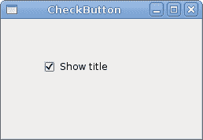
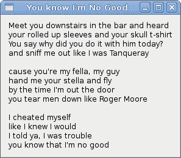
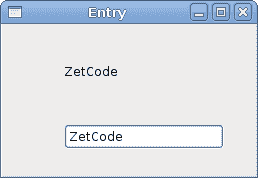
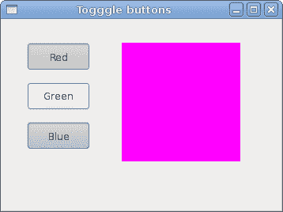
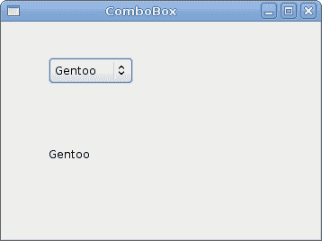

# 小部件

> 原文： [http://zetcode.com/gui/vbgtk/widgets/](http://zetcode.com/gui/vbgtk/widgets/)

在 Visual Basic GTK# 编程教程的这一部分中，我们将介绍一些小部件。

小部件是 GUI 应用的基本构建块。 多年来，几个小部件已成为所有 OS 平台上所有工具包中的标准。 例如，按钮，复选框或滚动条。 GTK# 工具箱的理念是将小部件的数量保持在最低水平。 将创建更多专门的小部件作为自定义 GTK# 小部件。

## `CheckButton`

`CheckButton`是具有两种状态的窗口小部件：打开和关闭。 接通状态通过复选标记显示。 它用来表示一些布尔属性。

```vb
' ZetCode Mono Visual Basic GTK# tutorial
'
' This program toggles the title of the
' window with the CheckButton widget
'
' author jan bodnar
' last modified May 2009
' website www.zetcode.com

Imports Gtk

Public Class GtkVBApp
    Inherits Window

    Public Sub New

        MyBase.New("CheckButton")

        Me.InitUI

        Me.SetDefaultSize(250, 150)
        Me.SetPosition(WindowPosition.Center)
        AddHandler Me.DeleteEvent, AddressOf Me.OnDelete

        Me.ShowAll

    End Sub

    Private Sub InitUI

        Dim cb As New CheckButton("Show title")
        cb.Active = True

        AddHandler cb.Toggled, AddressOf Me.OnToggle

        Dim fix As New Fixed
        fix.Put(cb, 50, 50)

        Me.Add(fix)

    End Sub

    Sub OnToggle(ByVal sender As Object, ByVal args As EventArgs)

        If sender.Active
            Me.Title = "CheckButton"
        Else
            Title = " "
        End If

    End Sub

    Sub OnDelete(ByVal sender As Object, _
            ByVal args As DeleteEventArgs)
        Application.Quit
    End Sub

    Public Shared Sub Main

        Application.Init
        Dim app As New GtkVBApp
        Application.Run

    End Sub

End Class

```

根据`CheckButton`的状态，我们将在窗口的标题栏中显示标题。

```vb
Dim cb As New CheckButton("Show title")

```

`CheckButton`小部件已创建。

```vb
cb.Active = True

```

默认情况下标题是可见的，因此我们默认情况下选中复选按钮。

```vb
If sender.Active
    Me.Title = "CheckButton" 
Else
    Title = " "
End If

```

根据`CheckButton`的`Active`属性，我们显示或隐藏窗口的标题。



Figure: CheckButton

## `Label`

`Label`小部件显示文本。

```vb
' ZetCode Mono Visual Basic GTK# tutorial

' This program shows lyrics on 
' the window in a label widget
'
' author jan bodnar
' last modified May 2009
' website www.zetcode.com

Imports Gtk

Public Class GtkVBApp
    Inherits Window

    Dim text As String = "Meet you downstairs in the bar and heard" & vbNewLine & _
"your rolled up sleeves and your skull t-shirt" & vbNewLine & _
"You say why did you do it with him today?" & vbNewLine & _
"and sniff me out like I was Tanqueray" & vbNewLine & _
"" & vbNewLine & _
"cause you're my fella, my guy" & vbNewLine & _
"hand me your stella and fly" & vbNewLine & _
"by the time I'm out the door" & vbNewLine & _
"you tear men down like Roger Moore" & vbNewLine & _
"" & vbNewLine & _
"I cheated myself" & vbNewLine & _
"like I knew I would" & vbNewLine & _
"I told ya, I was trouble" & vbNewLine & _
"you know that I'm no good"

    Public Sub New

        MyBase.New("You know I'm No Good")

        Me.InitUI

        Me.SetPosition(WindowPosition.Center)
        Me.BorderWidth = 10
        AddHandler Me.DeleteEvent, AddressOf Me.OnDelete

        Me.ShowAll

    End Sub

    Private Sub InitUI

        Dim lyrics As New Label(text)
        Me.Add(lyrics)

    End Sub

    Sub OnDelete(ByVal sender As Object, ByVal args As DeleteEventArgs)
        Application.Quit
    End Sub

    Public Shared Sub Main

        Application.Init
        Dim app As New GtkVBApp
        Application.Run

    End Sub

End Class

```

该代码示例在窗口上显示了一些歌词。

```vb
    Dim text As String = "Meet you downstairs in the bar and heard" & vbNewLine & _
"your rolled up sleeves and your skull t-shirt" & vbNewLine & _
...

```

我们定义了多行文字。 与 C# ，Python 或 Ruby 不同，没有简单的结构可以用 Visual Basic 语言创建多行文本。 若要在 Visual Basic 中创建多行文本，我们使用`vbNewLine`打印常量，`+`串联字符和`_`行终止字符。

```vb
Me.BorderWidth = 10

```

`Label`周围有一些空白。

```vb
Dim lyrics As New Label(text)
Me.Add(lyrics)

```

`Label`小部件已创建并添加到窗口。



Figure: Label Widget

## `Entry`

`Entry`是单行文本输入字段。 该小部件用于输入文本数据。

```vb
' ZetCode Mono Visual Basic GTK# tutorial
'
' This program demonstrates the 
' Entry widget. Text entered in the Entry
' widget is shown in a Label widget.
'
' author jan bodnar
' last modified May 2009
' website www.zetcode.com

Imports Gtk

Public Class GtkVBApp
    Inherits Window

    Dim label As Label

    Public Sub New

        MyBase.New("Entry")

        Me.InitUI

        Me.SetDefaultSize(250, 150)
        Me.SetPosition(WindowPosition.Center)
        AddHandler Me.DeleteEvent, AddressOf Me.OnDelete

        Me.ShowAll

    End Sub

    Private Sub InitUI

        Dim fixed As New Fixed

        label = New Label("...")
        fixed.put(label, 60, 40)

        Dim entry As New Entry
        fixed.put(entry, 60, 100)

        AddHandler entry.Changed, AddressOf Me.OnTextChanged

        Me.Add(fixed)

    End Sub

    Sub OnTextChanged(ByVal sender As Object, _
            ByVal args As EventArgs)
        label.Text = sender.Text
    End Sub

    Sub OnDelete(ByVal sender As Object, _
            ByVal args As DeleteEventArgs)
        Application.Quit
    End Sub

    Public Shared Sub Main

        Application.Init
        Dim app As New GtkVBApp
        Application.Run

    End Sub

End Class

```

此示例显示了条目小部件和标签。 我们输入的文本将立即显示在标签小部件中。

```vb
Dim entry As New Entry

```

`Entry`小部件已创建。

```vb
AddHandler entry.Changed, AddressOf Me.OnTextChanged

```

如果`Entry`小部件中的文本被更改，我们将调用`OnTextChanged`方法。

```vb
Sub OnTextChanged(ByVal sender As Object, _
        ByVal args As EventArgs)
    label.Text = sender.Text
End Sub

```

我们从`Entry`小部件获取文本并将其设置为标签。



Figure: Entry Widget

## `ToggleButton`

`ToggleButton`是具有两种状态的按钮。 已按下但未按下。 通过单击可以在这两种状态之间切换。 在某些情况下此功能非常合适。

```vb
' ZetCode Mono Visual Basic GTK# tutorial
'
' This program uses toggle buttons to
' change the background color of
' a widget.
'
' author jan bodnar
' last modified May 2009
' website www.zetcode.com

Imports Gtk

Public Class GtkVBApp
    Inherits Window

    Dim darea As DrawingArea
    Dim color As Gdk.Color

    Public Sub New

        MyBase.New("Togggle buttons")

        Me.InitUI

        Me.SetDefaultSize(350, 240)
        Me.SetPosition(WindowPosition.Center)
        AddHandler Me.DeleteEvent, AddressOf Me.OnDelete

        Me.ShowAll 

    End Sub

    Private Sub InitUI

        color = New Gdk.Color(0, 0, 0)

        Dim redb As New ToggleButton("Red")
        redb.SetSizeRequest(80, 35)
        AddHandler redb.Toggled, AddressOf Me.OnToggled

        Dim greenb As New ToggleButton("Green")
        greenb.SetSizeRequest(80, 35)
        AddHandler greenb.Toggled, AddressOf Me.OnToggled

        Dim blueb As New ToggleButton("Blue")
        blueb.SetSizeRequest(80, 35)
        AddHandler blueb.Toggled, AddressOf Me.OnToggled

        darea = New DrawingArea
        darea.SetSizeRequest(150, 150)
        darea.ModifyBg(StateType.Normal, color)

        Dim fixed As New Fixed
        fixed.Put(redb, 30, 30)
        fixed.Put(greenb, 30, 80)
        fixed.Put(blueb, 30, 130)
        fixed.Put(darea, 150, 30)

        Me.Add(fixed)

    End Sub

    Private Sub OnToggled(ByVal sender As Object, _
            ByVal args As EventArgs)

        Dim red As Integer = color.Red
        Dim green As Integer = color.Green
        Dim blue As Integer = color.Blue

        If sender.Label.Equals("Red") 
            If sender.Active 
                color.Red = 65535
            Else 
                color.Red = 0
            End If
        End If

        If sender.Label.Equals("Green")
            If sender.Active 
                color.Green = 65535
            Else 
                color.Green = 0
            End If 
        End If

        If sender.Label.Equals("Blue") 
            If sender.Active 
                color.Blue = 65535
            Else 
                color.Blue = 0
            End If
        End If     

        darea.ModifyBg(StateType.Normal, color)

    End Sub

    Sub OnDelete(ByVal sender As Object, _
            ByVal args As DeleteEventArgs)
        Application.Quit
    End Sub

    Public Shared Sub Main

        Application.Init
        Dim app As New GtkVBApp
        Application.Run

    End Sub

End Class

```

在我们的示例中，我们显示了三个切换按钮和一个`DrawingArea`。 我们将区域的背景色设置为黑色。 切换按钮将切换颜色值的红色，绿色和蓝色部分。 背景颜色取决于我们按下的切换按钮。

```vb
color = New Gdk.Color(0, 0, 0)

```

这是将使用切换按钮更新的颜色值。

```vb
Dim redb As New ToggleButton("Red")
redb.SetSizeRequest(80, 35)
AddHandler redb.Toggled, AddressOf Me.OnToggled

```

`ToggleButton`小部件已创建。 我们将其大小设置为`80x35`像素。 每个切换按钮具有相同的处理程序方法。

```vb
darea = New DrawingArea
darea.SetSizeRequest(150, 150)
darea.ModifyBg(StateType.Normal, color)

```

`DrawingArea`小部件是显示颜色的小部件，由切换按钮混合。 开始时，它显示为黑色。

```vb
If sender.Label.Equals("Red") 
    If sender.Active 
        color.Red = 65535
    Else 
        color.Red = 0
    End If
End If

```

我们根据`Active`属性的值更新颜色的红色部分。

```vb
darea.ModifyBg(StateType.Normal, color)

```

我们更新`DrawingArea`小部件的颜色。



Figure: ToggleButton widget

## `ComboBox`

`ComboBox`是一个小部件，允许用户从选项列表中进行选择。

```vb
' ZetCode Mono Visual Basic GTK# tutorial
'
' In this program, we use the ComboBox
' widget to select an option. 
' The selected option is shown in the
' Label widget
'
' author jan bodnar
' last modified May 2009
' website www.zetcode.com

Imports Gtk

Public Class GtkVBApp
    Inherits Window

    Dim lbl As Label

    Public Sub New

        MyBase.New("ComboBox")

        Me.InitUI

        Me.SetDefaultSize(350, 240)
        Me.SetPosition(WindowPosition.Center)
        AddHandler Me.DeleteEvent, AddressOf Me.OnDelete

        Me.ShowAll

    End Sub

    Private Sub InitUI

       Dim distros() As String = New String() { _
            "Ubuntu", _
            "Mandriva", _
            "Red Hat", _
            "Fedora", _
            "Gentoo" _
       } 

        Dim fixed As New Fixed

        Dim cb As New ComboBox(distros)
        AddHandler cb.Changed, AddressOf Me.OnChanged
        lbl = New Label("...")

        fixed.Put(cb, 50, 40)
        fixed.Put(lbl, 50, 140)

        Me.Add(fixed)

    End Sub

    Private Sub OnChanged(ByVal sender As Object, _
           ByVal args As EventArgs)
       lbl.Text = sender.ActiveText
    End Sub

    Sub OnDelete(ByVal sender As Object, _
            ByVal args As DeleteEventArgs)
        Application.Quit
    End Sub

    Public Shared Sub Main

        Application.Init
        Dim app As New GtkVBApp
        Application.Run

    End Sub

End Class

```

该示例显示了一个组合框和一个标签。 组合框具有六个选项的列表。 这些是 Linux Distros 的名称。 标签窗口小部件显示了从组合框中选择的选项。

```vb
Dim distros() As String = New String() { _
    "Ubuntu", _
    "Mandriva", _
    "Red Hat", _
    "Fedora", _
    "Gentoo" _
} 

```

这是一个字符串数组，将显示在`ComboBox`小部件中。

```vb
Dim cb As New ComboBox(distros)

```

`ComboBox`小部件已创建。 构造函数将字符串数组作为参数。

```vb
Private Sub OnChanged(ByVal sender As Object, _
        ByVal args As EventArgs)
    lbl.Text = sender.ActiveText
End Sub

```

在`OnChanged`方法内部，我们从组合框中获取选定的文本并将其设置为标签。



Figure: ComboBox

在本章中，我们使用 Visual Basic 语言展示了 GTK# 编程库的一些基本小部件。