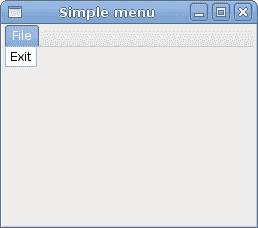
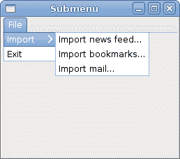
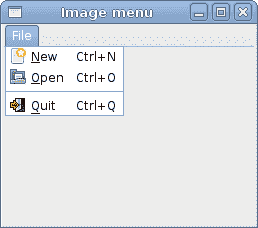
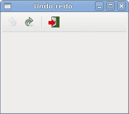

# 菜单和工具栏

> 原文： [http://zetcode.com/gui/vbgtk/menustoolbars/](http://zetcode.com/gui/vbgtk/menustoolbars/)

在 Visual Basic GTK# 编程教程的这一部分中，我们将使用菜单和工具栏。

菜单栏是 GUI 应用中最常见的部分之一。 它是位于各个菜单中的一组命令。 在控制台应用中，我们必须记住许多奥术命令，在这里，我们将大多数命令分组为逻辑部分。 这些公认的标准可进一步减少学习新应用的时间。

## 简单菜单

在第一个示例中，我们将创建一个带有一个文件菜单的菜单栏。 该菜单将只有一个菜单项。 通过选择项目，应用退出。

```
' ZetCode Mono Visual Basic GTK# tutorial
'
' This program shows a simple
' menu. It has one action, which
' will terminate the program, when
' selected. 
'
' author jan bodnar
' last modified May 2009
' website www.zetcode.com

Imports Gtk

Public Class GtkVBApp
    Inherits Window

    Public Sub New

        MyBase.New("Simple menu")

        Me.InitUI

        Me.SetDefaultSize(250, 200)
        Me.SetPosition(WindowPosition.Center)
        AddHandler Me.DeleteEvent, AddressOf Me.OnDelete

        Me.ShowAll

    End Sub

    Private Sub InitUI

        Dim mb As New MenuBar

        Dim filemenu As New Menu
        Dim fileItem As New MenuItem("File")
        fileItem.Submenu = filemenu

        Dim exitItem As New MenuItem("Exit")
        AddHandler exitItem.Activated, AddressOf Me.OnActivated
        filemenu.Append(exitItem)

        mb.Append(fileItem)

        Dim vbox As New VBox(False, 2)
        vbox.PackStart(mb, False, False, 0)

        Me.Add(vbox)

    End Sub

    Sub OnActivated(ByVal sender As Object, _ 
            ByVal args As EventArgs)
        Application.Quit
    End Sub

    Sub OnDelete(ByVal sender As Object, _
            ByVal args As DeleteEventArgs)
        Application.Quit
    End Sub

    Public Shared Sub Main

        Application.Init
        Dim app As New GtkVBApp
        Application.Run

    End Sub

End Class

```

这是一个最小的菜单栏功能示例。

```
Dim mb As New MenuBar

```

`MenuBar`小部件已创建。 这是菜单的容器。

```
Dim filemenu As New Menu
Dim fileItem As New MenuItem("File")
fileItem.Submenu = filemenu

```

创建顶层`MenuItem`。

```
Dim exitItem As New MenuItem("Exit")
AddHandler exitItem.Activated, AddressOf Me.OnActivated
filemenu.Append(exitItem)

```

将创建出口`MenuItem`，并将其附加到文件`MenuItem`中。

```
mb.Append(fileItem)

```

顶级`MenuItem`被附加到`MenuBar`小部件。

```
Dim vbox As New VBox(False, 2)
vbox.PackStart(mb, False, False, 0)

```

与其他工具包不同，我们必须自己照顾菜单栏的布局管理。 我们将菜单栏放入垂直框中。



Figure: Simple menu

## 子菜单

我们的最后一个示例演示了如何在 GTK# 中创建一个子菜单。

```
' ZetCode Mono Visual Basic GTK# tutorial
'
' This program creates a submenu
'
' author jan bodnar
' last modified May 2009
' website www.zetcode.com

Imports Gtk

Public Class GtkVBApp
    Inherits Window

    Public Sub New

        MyBase.New("Submenu")

        Me.InitUI

        Me.SetDefaultSize(250, 200)
        Me.SetPosition(WindowPosition.Center)
        AddHandler Me.DeleteEvent, AddressOf Me.OnDelete

        Me.ShowAll    

    End Sub

    Private Sub InitUI

        Dim mb As New MenuBar

        Dim filemenu As New Menu
        Dim ifile As New MenuItem("File")
        ifile.Submenu = filemenu

        // submenu creation
        Dim imenu As New Menu

        Dim iimport As New MenuItem("Import")
        iimport.Submenu = imenu

        Dim inews As New MenuItem("Import news feed...")
        Dim ibookmarks As New MenuItem("Import bookmarks...")
        Dim imail As New MenuItem("Import mail...")

        imenu.Append(inews)
        imenu.Append(ibookmarks)
        imenu.Append(imail)

        // exit menu item
        Dim iexit As New MenuItem("Exit")
        AddHandler iexit.Activated, AddressOf Me.OnActivated

        filemenu.Append(iimport)
        filemenu.Append(iexit)
        mb.Append(ifile)

        Dim vbox As New VBox(False, 2)
        vbox.PackStart(mb, False, False, 0)

        Me.Add(vbox)

    End Sub

    Sub OnActivated(ByVal sender As Object, _
            ByVal args As EventArgs)
        Application.Quit
    End Sub

    Sub OnDelete(ByVal sender As Object, _
            ByVal args As DeleteEventArgs)
        Application.Quit
    End Sub

    Public Shared Sub Main

        Application.Init
        Dim app As New GtkVBApp
        Application.Run

    End Sub

End Class

```

子菜单创建。

```
Dim imenu As New Menu

```

子菜单是`Menu`。

```
Dim iimport As New MenuItem("Import")
iimport.Submenu = imenu

```

它是菜单项的子菜单，它会登录到顶级文件菜单。

```
Dim inews As New MenuItem("Import news feed...")
Dim ibookmarks As New MenuItem("Import bookmarks...")
Dim imail As New MenuItem("Import mail...")

imenu.Append(inews)
imenu.Append(ibookmarks)
imenu.Append(imail)

```

子菜单有其自己的菜单项。



Figure: Submenu

## 图像菜单

在下一个示例中，我们将进一步探索菜单。 我们将图像和加速器添加到我们的菜单项中。 `Accelerators`是用于激活菜单项的键盘快捷键。

```
' ZetCode Mono Visual Basic GTK# tutorial
'
' This program shows image
' menu items, a shorcut and a separator
'
' author jan bodnar
' last modified May 2009
' website www.zetcode.com

Imports Gtk

Public Class GtkVBApp
    Inherits Window

    Public Sub New

        MyBase.New("Image menu")

        Me.InitUI

        Me.SetDefaultSize(250, 200)
        Me.SetPosition(WindowPosition.Center)
        AddHandler Me.DeleteEvent, AddressOf Me.OnDelete

        Me.ShowAll

    End Sub

    Private Sub InitUI

        Dim mb As New MenuBar

        Dim filemenu As New Menu
        Dim ifile As New MenuItem("File")
        ifile.Submenu = filemenu

        Dim agr As New AccelGroup
        Me.AddAccelGroup(agr)

        Dim inew As New ImageMenuItem("gtk-new", agr)
        filemenu.Append(inew)

        Dim iopen As New ImageMenuItem(Stock.Open, agr)
        filemenu.Append(iopen)

        Dim isep As New SeparatorMenuItem
        filemenu.Append(isep)

        Dim iexit As New ImageMenuItem(Stock.Quit, agr)
        AddHandler iexit.Activated, AddressOf Me.OnActivated
        filemenu.Append(iexit)

        mb.Append(ifile)

        Dim vbox As New VBox(False, 2)
        vbox.PackStart(mb, False, False, 0)

        Me.Add(vbox)

    End Sub

    Sub OnActivated(ByVal sender As Object, _
            ByVal args As EventArgs)
        Application.Quit
    End Sub

    Sub OnDelete(ByVal sender As Object, _ 
            ByVal args As DeleteEventArgs)
        Application.Quit
    End Sub

    Public Shared Sub Main

        Application.Init
        Dim app As New GtkVBApp
        Application.Run

    End Sub

End Class

```

我们的示例显示了具有三个子菜单项的顶级菜单项。 每个菜单项都有一个图像和一个加速器。 退出菜单项的加速器处于活动状态。

```
Dim agr As New AccelGroup
Me.AddAccelGroup(agr)

```

要使用加速器，我们创建一个全局`AccelGroup`对象。 稍后将使用。

```
Dim inew As New ImageMenuItem("gtk-new", agr)
filemenu.Append(inew)

```

`ImageMenuItem`已创建。 图片来自图片库。 GTK# 中有一个错误。 Stock.New 与 Visual Basic New 关键字冲突。

```
Dim isep As New SeparatorMenuItem
filemenu.Append(isep)

```

这些行创建一个分隔符。 它用于将菜单项放入逻辑组。



Figure: Image menu

菜单将我们可以在应用中使用的命令分组。 使用工具栏可以快速访问最常用的命令。

## 简单的工具栏

接下来，我们创建一个简单的工具栏。

```
' ZetCode Mono Visual Basic GTK# tutorial
'
' This program creates a 
' toolbar
'
' author jan bodnar
' last modified May 2009
' website www.zetcode.com

Imports Gtk

Public Class GtkVBApp
    Inherits Window

    Public Sub New

        MyBase.New("Toolbar")

        Me.InitUI

        Me.SetDefaultSize(250, 200)
        Me.SetPosition(WindowPosition.Center)
        AddHandler Me.DeleteEvent, AddressOf Me.OnDelete

        Me.ShowAll

    End Sub

    Private Sub InitUI

        Dim toolbar As New Toolbar
        toolbar.ToolbarStyle = ToolbarStyle.Icons

        Dim newtb As New ToolButton("gtk-new")
        Dim opentb As New ToolButton(Stock.Open)
        Dim savetb As New ToolButton(Stock.Save)
        Dim sep As New SeparatorToolItem
        Dim quittb As New ToolButton(Stock.Quit)

        toolbar.Insert(newtb, 0)
        toolbar.Insert(opentb, 1)
        toolbar.Insert(savetb, 2)
        toolbar.Insert(sep, 3)
        toolbar.Insert(quittb, 4)

        AddHandler quittb.Clicked, AddressOf Me.OnClicked

        Dim vbox As New VBox(False, 2)
        vbox.PackStart(toolbar, False, False, 0)

        Me.Add(vbox)

    End Sub

    Sub OnClicked(ByVal sender As Object, _
            ByVal args As EventArgs)
        Application.Quit
    End Sub

    Sub OnDelete(ByVal sender As Object, _
            ByVal args As DeleteEventArgs)
        Application.Quit
    End Sub

    Public Shared Sub Main

        Application.Init
        Dim app As New GtkVBApp
        Application.Run

    End Sub

End Class

```

该示例显示了一个工具栏和四个工具按钮。

```
Dim toolbar As New Toolbar

```

`Toolbar`小部件已创建。

```
toolbar.ToolbarStyle = ToolbarStyle.Icons

```

在工具栏上，我们仅显示图标。 没有文字。

```
Dim opentb As New ToolButton(Stock.Open)

```

创建带有库存图像的`ToolButton`。

```
Dim sep As New SeparatorToolItem 

```

这是一个分隔符。 它可用于将工具栏按钮放入逻辑组。

```
toolbar.Insert(newtb, 0)
toolbar.Insert(opentb, 1)
...

```

工具栏按钮插入到工具栏小部件中。


Figure: Toolbar

## 撤销重做

以下示例演示了如何停用工具栏上的工具栏按钮。 这是 GUI 编程中的常见做法。 例如，保存按钮。 如果我们将文档的所有更改都保存到磁盘上，则在大多数文本编辑器中，“保存”按钮将被停用。 这样，应用会向用户指示所有更改都已保存。

```
' ZetCode Mono Visual Basic GTK# tutorial
'
' This program disables/enables
' toolbuttons on a toolbar
'
' author jan bodnar
' last modified May 2009
' website www.zetcode.com

Imports Gtk

Public Class GtkVBApp
    Inherits Window

    Private Dim clicks As Integer = 2
    Private Dim undo As ToolButton
    Private Dim redo As ToolButton

    Public Sub New

        MyBase.New("Undo redo")

        Me.InitUI

        Me.SetDefaultSize(250, 200)
        Me.SetPosition(WindowPosition.Center)
        AddHandler Me.DeleteEvent, AddressOf Me.OnDelete

        Me.ShowAll

    End Sub

    Private Sub InitUI

        Dim toolbar As New Toolbar
        toolbar.ToolbarStyle = ToolbarStyle.Icons

        undo = New ToolButton(Stock.Undo)
        undo.Label = "Undo"
        redo = New ToolButton(Stock.Redo)
        redo.Label = "Redo"

        Dim sep As New SeparatorToolItem
        Dim quit As New ToolButton(Stock.Quit)

        toolbar.Insert(undo, 0)
        toolbar.Insert(redo, 1)
        toolbar.Insert(sep, 2)
        toolbar.Insert(quit, 3)

        AddHandler undo.Clicked, AddressOf Me.OnCount
        AddHandler redo.Clicked, AddressOf Me.OnCount
        AddHandler quit.Clicked, AddressOf Me.OnClicked

        Dim vbox As New VBox(False, 2)
        vbox.PackStart(toolbar, False, False, 0)

        Me.Add(vbox)

    End Sub

    Private Sub OnCount(ByVal sender As Object, _
            ByVal args As EventArgs)

        If "Undo".Equals(sender.Label)
            clicks += 1
        Else 
            clicks -= 1
        End If

        If clicks <= 0 
            undo.Sensitive = True
            redo.Sensitive = False
        End If

        If clicks >= 5 
            undo.Sensitive = False
            redo.Sensitive = True
        End If

    End Sub

    Sub OnClicked(ByVal sender As Object, _
            ByVal args As EventArgs)
        Application.Quit
    End Sub

    Sub OnDelete(ByVal sender As Object, _
            ByVal args As DeleteEventArgs)
        Application.Quit
    End Sub

    Public Shared Sub Main

        Application.Init
        Dim app As New GtkVBApp
        Application.Run

    End Sub

End Class

```

我们的示例从 GTK# 库存资源创建撤消和重做按钮。 单击几下后，每个按钮均被停用。 按钮显示为灰色。

```
Private Dim clicks As Integer = 2

```

`clicks`变量决定哪个按钮被激活或禁用。

```
undo = New ToolButton(Stock.Undo)
undo.Label = "Undo"
redo = New ToolButton(Stock.Redo)
redo.Label = "Redo"

```

我们有两个工具按钮。 撤消和重做工具按钮。 图片来自库存资源。

```
AddHandler undo.Clicked, AddressOf Me.OnCount
AddHandler redo.Clicked, AddressOf Me.OnCount

```

我们为两个工具按钮都插入了`Clicked`事件的方法。

```
If clicks <= 0 
    undo.Sensitive = True
    redo.Sensitive = False
End If

```

要激活小部件，我们将其`Sensitive`属性设置为 true。 要停用它，我们将其设置为 false。



Figure: Undo redo

在 Visual Basic GTK# 教程的这一章中，我们展示了如何使用菜单和工具栏。