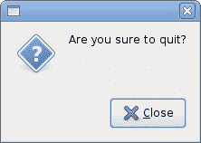
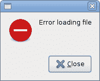
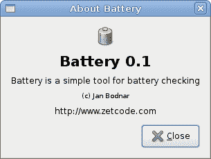
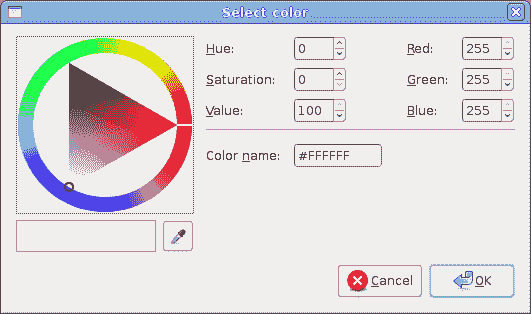

# 对话框

> 原文： [http://zetcode.com/gui/vbgtk/dialogs/](http://zetcode.com/gui/vbgtk/dialogs/)

在 Visual Basic GTK# 编程教程的这一部分中，我们将介绍对话框。

对话框窗口或对话框是大多数现代 GUI 应用必不可少的部分。 对话被定义为两个或更多人之间的对话。 在计算机应用中，对话框是一个窗口，用于与应用“对话”。 对话框用于输入数据，修改数据，更改应用设置等。对话框是用户与计算机程序之间进行通信的重要手段。

## `MessageDialog`

消息对话框是方便的对话框，可向应用的用户提供消息。 该消息包含文本和图像数据。

```vb
' ZetCode Mono Visual Basic GTK# tutorial
'
' This program shows message dialogs.
'
' author jan bodnar
' last modified May 2009
' website www.zetcode.com

Imports Gtk

Public Class GtkVBApp
    Inherits Window

    Public Sub New

        MyBase.New("Message dialogs")

        Me.InitUI

        Me.SetDefaultSize(250, 100)
        Me.SetPosition(WindowPosition.Center)
        AddHandler Me.DeleteEvent, AddressOf Me.OnDelete

        Me.ShowAll  

    End Sub

    Private Sub InitUI

        Dim table As New Table(2, 2, True)

        Dim info As New Button("Information")
        Dim warn As New Button("Warning")
        Dim ques As New Button("Question")
        Dim erro As New Button("Error")

        AddHandler info.Clicked, AddressOf Me.OnInfo
        AddHandler warn.Clicked, AddressOf Me.OnWarning
        AddHandler ques.Clicked, AddressOf Me.OnQuestion
        AddHandler erro.Clicked, AddressOf Me.OnError

        table.Attach(info, 0, 1, 0, 1)
        table.Attach(warn, 1, 2, 0, 1)
        table.Attach(ques, 0, 1, 1, 2)
        table.Attach(erro, 1, 2, 1, 2)

        Me.Add(table)

    End Sub

    Private Sub OnInfo(ByVal sender As Object, ByVal args As EventArgs)
        Dim md As MessageDialog = New MessageDialog(Me, _
            DialogFlags.DestroyWithParent, MessageType.Info, _ 
            ButtonsType.Close, "Download completed")
        md.Run
        md.Destroy
    End Sub

    Private Sub OnWarning(ByVal sender As Object, ByVal args As EventArgs)
        Dim md As MessageDialog = New MessageDialog(Me, _
            DialogFlags.DestroyWithParent, MessageType.Warning, _
            ButtonsType.Close, "Unallowed operation")
        md.Run
        md.Destroy
    End Sub

    Private Sub OnQuestion(ByVal sender As Object, ByVal args As EventArgs)
        Dim md As MessageDialog = New MessageDialog(Me, _
            DialogFlags.DestroyWithParent, MessageType.Question, _
            ButtonsType.Close, "Are you sure to quit?")
        md.Run
        md.Destroy
    End Sub

    Private Sub OnError(ByVal sender As Object, ByVal args As EventArgs)
        Dim md As MessageDialog = New MessageDialog(Me, _
            DialogFlags.DestroyWithParent, MessageType.Error, _
            ButtonsType.Close, "Error loading file")
        md.Run
        md.Destroy
    End Sub

    Private Sub OnDelete(ByVal sender As Object, _
            ByVal args As DeleteEventArgs)
        Application.Quit
    End Sub

    Public Shared Sub Main

        Application.Init
        Dim app As New GtkVBApp
        Application.Run

    End Sub

End Class

```

在我们的示例中，我们将显示四种消息对话框。 信息，警告，问题和错误消息对话框。

```vb
Dim info As New Button("Information")
Dim warn As New Button("Warning")
Dim ques As New Button("Question")
Dim erro As New Button("Error")

```

我们有四个按钮。 这些按钮中的每个按钮都会显示不同类型的消息对话框。

```vb
Private Sub OnInfo(ByVal sender As Object, ByVal args As EventArgs)
    Dim md As MessageDialog = New MessageDialog(Me, _
        DialogFlags.DestroyWithParent, MessageType.Info, _ 
        ButtonsType.Close, "Download completed")
    md.Run
    md.Destroy
End Sub

```

如果单击信息按钮，将显示“信息”对话框。 `MessageType.Info`指定对话框的类型。 `ButtonsType.Close`指定要在对话框中显示的按钮。 最后一个参数是已分发的消息。 该对话框使用`Run`方法显示。 程序员还必须调用`Destroy`或`Hide`方法。






## `AboutDialog`

`AboutDialog`显示有关应用的信息。 `AboutDialog`可以显示徽标，应用名称，版本，版权，网站或许可证信息。 也有可能对作者，文档撰写者，翻译者和艺术家予以赞扬。

```vb
' ZetCode Mono Visual Basic GTK# tutorial
'
' This program shows the about
' dialog
'
' author jan bodnar
' last modified May 2009
' website www.zetcode.com

Imports Gtk

Public Class GtkVBApp
    Inherits Window

    Public Sub New

        MyBase.New("About dialog")

        Me.InitUI

        Me.SetDefaultSize(350, 300)
        Me.SetPosition(WindowPosition.Center)
        AddHandler Me.DeleteEvent, AddressOf Me.OnDelete

        Me.ShowAll

    End Sub

    Private Sub InitUI

        Dim button As New Button("About")

        AddHandler button.Clicked, AddressOf Me.ShowDialog

        Dim fixed As New Fixed
        fixed.Put(button, 20, 20)
        Me.Add(fixed)

    End Sub

    Private Sub ShowDialog(ByVal sender As Object, _
            ByVal args As EventArgs)

        Dim about As New AboutDialog
        about.ProgramName = "Battery"
        about.Version = "0.1"
        about.Copyright = "(c) Jan Bodnar"
        about.Comments = "Battery is a simple tool for battery checking"
        about.Website = "http://www.zetcode.com"
        about.Logo = New Gdk.Pixbuf("battery.png")
        about.Run
        about.Destroy

    End Sub

    Sub OnDelete(ByVal sender As Object, _
            ByVal args As DeleteEventArgs)
        Application.Quit
    End Sub

    Public Shared Sub Main

        Application.Init
        Dim app As New GtkVBApp
        Application.Run

    End Sub

End Class

```

该代码示例使用具有某些功能的`AboutDialog`。

```vb
Dim about As New AboutDialog

```

我们创建一个`AboutDialog`。

```vb
Dim about As New AboutDialog
about.ProgramName = "Battery"
about.Version = "0.1"
about.Copyright = "(c) Jan Bodnar"

```

通过设置对话框的属性，我们指定名称，版本和版权。

```vb
about.Logo = New Gdk.Pixbuf("battery.png")

```

此行创建徽标。



图：`AboutDialog`

## `FontSelectionDialog`

`FontSelectionDialog`是用于选择字体的对话框。 它通常用于进行一些文本编辑或格式化的应用中。

```vb
' ZetCode Mono Visual Basic GTK# tutorial
'
' This program shows the FontSelectionDialog
'
' author jan bodnar
' last modified May 2009
' website www.zetcode.com

Imports Gtk

Public Class GtkVBApp
    Inherits Window

    Dim label As Label 

    Public Sub New

        MyBase.New("Font dialog")

        Me.InitUI

        Me.SetDefaultSize(350, 300)
        Me.SetPosition(WindowPosition.Center)
        AddHandler Me.DeleteEvent, AddressOf Me.OnDelete

        Me.ShowAll  

    End Sub

    Private Sub InitUI 

        label = New Label("The only victory over love is flight.")
        Dim button As New Button("Select font")

        AddHandler button.Clicked, AddressOf Me.ShowDialog

        Dim fixed As New Fixed
        fixed.Put(button, 100, 30)
        fixed.Put(label, 30, 90)
        Me.Add(fixed)

    End Sub

    Private Sub ShowDialog(ByVal sender As Object, _
            ByVal args As EventArgs)

        Dim fdia As New FontSelectionDialog("Select font name")

        AddHandler fdia.Response, AddressOf Me.SelectFont

        fdia.Run
        fdia.Destroy

    End Sub

    Private Sub SelectFont(ByVal sender As Object, _
            ByVal args As ResponseArgs)

        If args.ResponseId = ResponseType.Ok
            Dim fontdesc As Pango.FontDescription = _
                Pango.FontDescription.FromString(sender.FontName)
            label.ModifyFont(fontdesc)
        End If

    End Sub

    Sub OnDelete(ByVal sender As Object, _
            ByVal args As DeleteEventArgs)
        Application.Quit
    End Sub

    Public Shared Sub Main

        Application.Init
        Dim app As New GtkVBApp
        Application.Run

    End Sub

End Class

```

在代码示例中，我们有一个按钮和一个标签。 单击按钮显示`FontSelectionDialog`。

```vb
Dim fdia As New FontSelectionDialog("Select font name")

```

我们创建`FontSelectionDialog`。

```vb
If args.ResponseId = ResponseType.Ok
    Dim fontdesc As Pango.FontDescription = _
        Pango.FontDescription.FromString(sender.FontName)
    label.ModifyFont(fontdesc)
End If

```

如果单击“确定”按钮，则标签小部件的字体将更改为我们在对话框中选择的字体。


图：`FontSelectionDialog`

## `ColorSelectionDialog`

`ColorSelectionDialog`是用于选择颜色的对话框。

```vb
' ZetCode Mono Visual Basic GTK# tutorial
'
' This program shows the ColorSelectionDialog
'
' author jan bodnar
' last modified May 2009
' website www.zetcode.com

Imports Gtk

Public Class GtkVBApp
    Inherits Window

    Dim label As Label 

    Public Sub New

        MyBase.New("Color dialog")

        Me.InitUI

        Me.SetDefaultSize(350, 300)
        Me.SetPosition(WindowPosition.Center)
        AddHandler Me.DeleteEvent, AddressOf Me.OnDelete

        Me.ShowAll    

    End Sub

    Private Sub InitUI

        label = New Label("The only victory over love is flight.")
        Dim button As New Button("Select color")

        AddHandler button.Clicked, AddressOf Me.ShowDialog

        Dim fixed As New Fixed
        fixed.Put(button, 100, 30)
        fixed.Put(label, 30, 90)
        Me.Add(fixed)

    End Sub

    Private Sub ShowDialog(ByVal sender As Object, _
            ByVal args As EventArgs)

        Dim cdia As New ColorSelectionDialog("Select color")

        AddHandler cdia.Response, AddressOf Me.SelectColor

        cdia.Run
        cdia.Destroy

    End Sub

    Private Sub SelectColor(ByVal sender As Object, _
            ByVal args As ResponseArgs)

        If args.ResponseId = ResponseType.Ok
            label.ModifyFg(StateType.Normal, _
                sender.ColorSelection.CurrentColor)
        End If

    End Sub

    Sub OnDelete(ByVal sender As Object, _
            ByVal args As DeleteEventArgs)
        Application.Quit
    End Sub

    Public Shared Sub Main

        Application.Init
        Dim app As New GtkVBApp
        Application.Run

    End Sub

End Class

```

该示例与上一个示例非常相似。 这次我们更改标签的颜色。

```vb
Dim cdia As New ColorSelectionDialog("Select color")

```

我们创建`ColorSelectionDialog`。

```vb
If args.ResponseId = ResponseType.Ok
    label.ModifyFg(StateType.Normal, _
        sender.ColorSelection.CurrentColor)
End If

```

如果用户按下 OK，我们将获得颜色值并修改标签的颜色。



图：颜色 electionDialog

在 Visual Basic GTK# 教程的这一部分中，我们介绍了对话框。