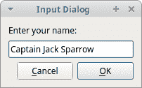

# PyQt5 中的对话框

> 原文： [http://zetcode.com/gui/pyqt5/dialogs/](http://zetcode.com/gui/pyqt5/dialogs/)

对话框窗口或对话框是大多数现代 GUI 应用程序必不可少的部分。 对话被定义为两个或更多人之间的对话。 在计算机应用程序中，对话框是一个窗口，用于与应用程序“对话”。 对话框用于输入数据，修改数据，更改应用程序设置等。

## QInputDialog

`QInputDialog`提供了一个简单的便捷对话框，可从用户那里获取单个值。 输入值可以是字符串，数字或列表中的项目。

`inputdialog.py`

```
#!/usr/bin/python3
# -*- coding: utf-8 -*-

"""
ZetCode PyQt5 tutorial 

In this example, we receive data from
a QInputDialog dialog. 

Aauthor: Jan Bodnar
Website: zetcode.com 
Last edited: August 2017
"""

from PyQt5.QtWidgets import (QWidget, QPushButton, QLineEdit, 
    QInputDialog, QApplication)
import sys

class Example(QWidget):

    def __init__(self):
        super().__init__()

        self.initUI()

    def initUI(self):      

        self.btn = QPushButton('Dialog', self)
        self.btn.move(20, 20)
        self.btn.clicked.connect(self.showDialog)

        self.le = QLineEdit(self)
        self.le.move(130, 22)

        self.setGeometry(300, 300, 290, 150)
        self.setWindowTitle('Input dialog')
        self.show()

    def showDialog(self):

        text, ok = QInputDialog.getText(self, 'Input Dialog', 
            'Enter your name:')

        if ok:
            self.le.setText(str(text))

if __name__ == '__main__':

    app = QApplication(sys.argv)
    ex = Example()
    sys.exit(app.exec_())

```

该示例具有一个按钮和一个行编辑小部件。 该按钮显示用于获取文本值的输入对话框。 输入的文本将显示在行编辑小部件中。

```
text, ok = QInputDialog.getText(self, 'Input Dialog', 
    'Enter your name:')

```

这行显示输入对话框。 第一个字符串是对话框标题，第二个字符串是对话框中的消息。 对话框返回输入的文本和布尔值。 如果单击“确定”按钮，则布尔值为 true。

```
if ok:
    self.le.setText(str(text))

```

我们从对话框中收到的文本通过`setText()`设置为行编辑小部件。



Figure: Input dialog

## QColorDialog

`QColorDialog`提供了一个对话框小部件，用于选择颜色值。

`colordialog.py`

```
#!/usr/bin/python3
# -*- coding: utf-8 -*-

"""
ZetCode PyQt5 tutorial 

In this example, we select a color value
from the QColorDialog and change the background
color of a QFrame widget. 

Author: Jan Bodnar
Website: zetcode.com 
Last edited: August 2017
"""

from PyQt5.QtWidgets import (QWidget, QPushButton, QFrame, 
    QColorDialog, QApplication)
from PyQt5.QtGui import QColor
import sys

class Example(QWidget):

    def __init__(self):
        super().__init__()

        self.initUI()

    def initUI(self):      

        col = QColor(0, 0, 0) 

        self.btn = QPushButton('Dialog', self)
        self.btn.move(20, 20)

        self.btn.clicked.connect(self.showDialog)

        self.frm = QFrame(self)
        self.frm.setStyleSheet("QWidget { background-color: %s }" 
            % col.name())
        self.frm.setGeometry(130, 22, 100, 100)            

        self.setGeometry(300, 300, 250, 180)
        self.setWindowTitle('Color dialog')
        self.show()

    def showDialog(self):

        col = QColorDialog.getColor()

        if col.isValid():
            self.frm.setStyleSheet("QWidget { background-color: %s }"
                % col.name())

if __name__ == '__main__':

    app = QApplication(sys.argv)
    ex = Example()
    sys.exit(app.exec_())

```

该应用示例显示了一个按钮和一个`QFrame`。 窗口小部件背景设置为黑色。 使用`QColorDialog`，我们可以更改其背景。

```
col = QColor(0, 0, 0) 

```

这是`QFrame`背景的初始颜色。

```
col = QColorDialog.getColor()

```

这行弹出`QColorDialog`。

```
if col.isValid():
    self.frm.setStyleSheet("QWidget { background-color: %s }"
        % col.name())

```

我们检查颜色是否有效。 如果单击“取消”按钮，则不会返回有效的颜色。 如果颜色有效，我们将使用样式表更改背景颜色。

## QFont 对话框

`QFontDialog`是用于选择字体的对话框小部件。

`fontdialog.py`

```
#!/usr/bin/python3
# -*- coding: utf-8 -*-

"""
ZetCode PyQt5 tutorial 

In this example, we select a font name
and change the font of a label. 

Author: Jan Bodnar
Website: zetcode.com 
Last edited: August 2017
"""

from PyQt5.QtWidgets import (QWidget, QVBoxLayout, QPushButton, 
    QSizePolicy, QLabel, QFontDialog, QApplication)
import sys

class Example(QWidget):

    def __init__(self):
        super().__init__()

        self.initUI()

    def initUI(self):      

        vbox = QVBoxLayout()

        btn = QPushButton('Dialog', self)
        btn.setSizePolicy(QSizePolicy.Fixed,
            QSizePolicy.Fixed)

        btn.move(20, 20)

        vbox.addWidget(btn)

        btn.clicked.connect(self.showDialog)

        self.lbl = QLabel('Knowledge only matters', self)
        self.lbl.move(130, 20)

        vbox.addWidget(self.lbl)
        self.setLayout(vbox)          

        self.setGeometry(300, 300, 250, 180)
        self.setWindowTitle('Font dialog')
        self.show()

    def showDialog(self):

        font, ok = QFontDialog.getFont()
        if ok:
            self.lbl.setFont(font)

if __name__ == '__main__':

    app = QApplication(sys.argv)
    ex = Example()
    sys.exit(app.exec_())

```

在我们的示例中，我们有一个按钮和一个标签。 使用`QFontDialog`，我们更改标签的字体。

```
font, ok = QFontDialog.getFont()

```

在这里我们弹出字体对话框。 `getFont()`方法返回字体名称和 ok 参数。 如果用户单击“确定”，则它等于“真”； 否则为 False。

```
if ok:
    self.label.setFont(font)

```

如果单击“确定”，标签的字体将更改为`setFont()`。

## QFile 对话框

`QFileDialog`是允许用户选择文件或目录的对话框。 可以选择打开和保存文件。

`filedialog.py`

```
#!/usr/bin/python3
# -*- coding: utf-8 -*-

"""
ZetCode PyQt5 tutorial 

In this example, we select a file with a
QFileDialog and display its contents
in a QTextEdit.

Author: Jan Bodnar
Website: zetcode.com 
Last edited: August 2017
"""

from PyQt5.QtWidgets import (QMainWindow, QTextEdit, 
    QAction, QFileDialog, QApplication)
from PyQt5.QtGui import QIcon
import sys

class Example(QMainWindow):

    def __init__(self):
        super().__init__()

        self.initUI()

    def initUI(self):      

        self.textEdit = QTextEdit()
        self.setCentralWidget(self.textEdit)
        self.statusBar()

        openFile = QAction(QIcon('open.png'), 'Open', self)
        openFile.setShortcut('Ctrl+O')
        openFile.setStatusTip('Open new File')
        openFile.triggered.connect(self.showDialog)

        menubar = self.menuBar()
        fileMenu = menubar.addMenu('&File')
        fileMenu.addAction(openFile)       

        self.setGeometry(300, 300, 350, 300)
        self.setWindowTitle('File dialog')
        self.show()

    def showDialog(self):

        fname = QFileDialog.getOpenFileName(self, 'Open file', '/home')

        if fname[0]:
            f = open(fname[0], 'r')

            with f:
                data = f.read()
                self.textEdit.setText(data)        

if __name__ == '__main__':

    app = QApplication(sys.argv)
    ex = Example()
    sys.exit(app.exec_())

```

该示例显示了一个菜单栏，集中设置的文本编辑小部件和一个状态栏。 菜单项显示用于选择文件的`QFileDialog`。 文件的内容被加载到文本编辑小部件中。

```
class Example(QMainWindow):

    def __init__(self):
        super().__init__()

        self.initUI()

```

该示例基于`QMainWindow`小部件，因为我们集中设置了文本编辑小部件。

```
fname = QFileDialog.getOpenFileName(self, 'Open file', '/home')

```

我们弹出`QFileDialog`。 `getOpenFileName()`方法中的第一个字符串是标题。 第二个字符串指定对话框的工作目录。 默认情况下，文件过滤器设置为“所有文件（*）”。

```
if fname[0]:
    f = open(fname[0], 'r')

    with f:
        data = f.read()
        self.textEdit.setText(data)        

```

读取所选文件名，并将文件内容设置为文本编辑小部件。

在 PyQt5 教程的这一部分中，我们使用了对话框。