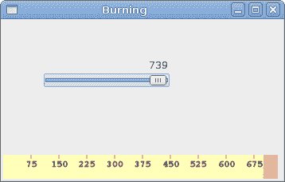

# 自定义小部件

> 原文： [http://zetcode.com/gui/vbgtk/customwidget/](http://zetcode.com/gui/vbgtk/customwidget/)

您是否曾经看过某个应用，并想知道如何创建特定的 GUI 项目？ 可能每个想成为程序员的人都有。 然后，您正在查看您最喜欢的 gui 库提供的小部件列表。 但是你找不到。 工具箱通常仅提供最常见的窗口小部件，例如按钮，文本窗口小部件，滑块等。没有工具箱可以提供所有可能的窗口小部件。

实际上有两种工具箱。 Spartan 工具包和重量级工具包。 FLTK 工具包是一种 spartan 工具包。 它仅提供了非常基本的小部件，并假定程序员将自己创建更复杂的小部件。 wxWidgets 是重量级的。 它有很多小部件。 但是，它不提供更专业的小部件。 例如，速度表小部件，即测量要刻录 CD 容量的小部件（例如，在 nero 中找到）。 工具箱通常也没有图表。

程序员必须自己创建此类小部件。 他们使用工具箱提供的绘图工具来完成此任务。 有两种可能性。 程序员可以修改或增强现有的小部件。 或者，他可以从头开始创建自定义窗口小部件。

## 刻录小部件

这是我们从头开始创建的小部件的示例。 可以在各种媒体刻录应用（例如 Nero 烧录 ROM）中找到此小部件。

`custom.vb`

```vb
Imports Gtk

NameSpace BurningWidget

Public Class Burning 
    Inherits DrawingArea 

    Const PANEL_HEIGHT As Integer = 30
    Const DIVISIONS As Integer = 10
    Const FULL_CAPACITY As Double = 700
    Const MAX_CAPACITY As Double = 750

    Dim redColor As New Gdk.Color(1, 0.7, 0.7)
    Dim yellowColor As New Gdk.Color(1, 1, 0.7)

    Dim parent As Widget 

    Dim num() As String = { _
        "75", "150", "225", "300", _
        "375", "450", "525", "600", _
        "675" _
    }

    Public Sub New(ByVal parent As Widget) 

        Me.SetSizeRequest(1, PANEL_HEIGHT)

        Me.parent = parent
        AddHandler Me.ExposeEvent, AddressOf Me.OnExpose

    End Sub

    Private Sub OnExpose(ByVal sender As Object, ByVal e As ExposeEventArgs) 

        Dim cc As Cairo.Context = Gdk.CairoHelper.Create(sender.GdkWindow)

        Me.DrawCustomWidget(cc)

        Dim disposeTarget As IDisposable = CType(cc.Target, IDisposable)
        disposeTarget.Dispose

        Dim disposeContext As IDisposable = CType(cc, IDisposable)
        disposeContext.Dispose

    End Sub

    Private Sub DrawCustomWidget(ByVal cc As Cairo.Context)

        cc.LineWidth = 0.8

        cc.SelectFontFace("Courier 10 Pitch", _
            Cairo.FontSlant.Normal, Cairo.FontWeight.Normal)
        cc.SetFontSize(11)

        Dim burn As Custom.GtkVBApp = CType(parent, Custom.GtkVBApp)

        Dim slid_width As Double = burn.GetCurrentWidth
        Dim width As Double = Allocation.Width
        Dim move As Double = width / DIVISIONS

        Dim till As Double = (width / MAX_CAPACITY) * slid_width
        Dim full As Double = (width / MAX_CAPACITY) * FULL_CAPACITY

        If slid_width >= FULL_CAPACITY

            cc.SetSourceRGB(1.0, 1.0, 0.72)
            cc.Rectangle(0, 0, full, PANEL_HEIGHT)
            cc.Clip
            cc.Paint
            cc.ResetClip

            cc.SetSourceRGB(1.0, 0.68, 0.68)
            cc.Rectangle(full, 0, till-full, PANEL_HEIGHT)  
            cc.Clip
            cc.Paint
            cc.ResetClip

        Else 

            cc.SetSourceRGB(1.0, 1.0, 0.72)
            cc.Rectangle(0, 0, till, PANEL_HEIGHT)
            cc.Clip
            cc.Paint
            cc.ResetClip
       End If

       cc.SetSourceRGB(0.35, 0.31, 0.24)

       For i As Integer = 1 To num.Length

           cc.MoveTo(i*move, 0)
           cc.LineTo(i*move, 5)    
           cc.Stroke

           Dim extents As Cairo.TextExtents = cc.TextExtents(num(i-1))
           cc.MoveTo(i*move-extents.Width/2, 15)
           cc.TextPath(num(i-1))
           cc.Stroke
       Next   

    End Sub

End Class

End Namespace

```

我们在窗口底部放置一个`DrawingArea`并手动绘制整个窗口小部件。 所有重要的代码都驻留在`DrawCustomWidget`中，这是从 Burning 类的`OnExpose`方法调用的。 此小部件以图形方式显示了介质的总容量和可供我们使用的可用空间。 该小部件由比例小部件控制。 自定义窗口小部件的最小值为 0，最大值为 750。如果值达到 700，则开始绘制红色。 这通常表示过度燃烧。

```vb
Dim num() As String = { _
    "75", "150", "225", "300", _
    "375", "450", "525", "600", _
    "675" _
}

```

这些数字显示在刻录小部件上。 它们显示了介质的容量。

```vb
Dim burn As Custom.GtkVBApp = CType(parent, Custom.GtkVBApp)

Dim slid_width As Double = burn.GetCurrentWidth

```

这两行从 scale 小部件获取当前数字。 我们获得父窗口小部件，并从父窗口小部件中获得当前值。

```vb
Dim till As Double = (width / MAX_CAPACITY) * slid_width
Dim full As Double = (width / MAX_CAPACITY) * FULL_CAPACITY

```

我们使用`width`变量进行转换。 在比例尺值和自定义小部件的度量之间。 请注意，我们使用浮点值。 我们在绘图中获得了更高的精度。 `till`参数确定要绘制的总大小。 该值来自滑块小部件。 它占整个面积的一部分。 `full`参数确定了我们开始绘制红色的点。

```vb
cc.SetSourceRGB(1.0, 1.0, 0.72)
cc.Rectangle(0, 0, till, PANEL_HEIGHT)
cc.Clip
cc.Paint
cc.ResetClip

```

此代码在此处绘制了一个黄色矩形，直到介质充满为止。

```vb
Dim extents As Cairo.TextExtents = cc.TextExtents(num(i-1))
cc.MoveTo(i*move-extents.Width/2, 15)
cc.TextPath(num(i-1))
cc.Stroke

```

这里的代码在刻录小部件上绘制数字。 我们计算`TextExtents`来正确定位文本。

`burning.vb`

```vb
' ZetCode Mono Visual Basic GTK# tutorial
'
' In this program, we create
' a custom widget
'
' author jan bodnar
' last modified May 2009
' website www.zetcode.com

Imports Gtk

NameSpace Custom

Public Class GtkVBApp
    Inherits Window

    Const MAX_CAPACITY As Integer = 750

    Dim cur_value As Integer
    Dim burning As BurningWidget.Burning

    Public Sub New

        MyBase.New("Burning")

        Me.InitUI

        Me.SetDefaultSize(350, 200)

        Me.SetPosition(WindowPosition.Center)
        AddHandler Me.DeleteEvent, AddressOf Me.OnDelete

        Me.ShowAll

    End Sub

    Private Sub InitUI

        Dim vbox As New VBox(False, 2)

        Dim scale As New HScale(0, MAX_CAPACITY, 1)
        scale.SetSizeRequest(160, 35)

        AddHandler scale.ValueChanged, AddressOf Me.OnChanged

        Dim fixed As New Fixed
        fixed.Put(scale, 50, 50)

        vbox.PackStart(fixed)

        burning = New BurningWidget.Burning(Me)
        vbox.PackStart(burning, False, False, 0)

        Me.Add(vbox)

    End Sub

    Private Sub OnChanged(ByVal sender As Object, ByVal args As EventArgs)
        cur_value = sender.Value
        burning.QueueDraw
    End Sub

    Public Function GetCurrentWidth As Integer
        Return cur_value
    End Function

    Sub OnDelete(ByVal sender As Object, ByVal args As DeleteEventArgs)
        Application.Quit
    End Sub

    Public Shared Sub Main

        Application.Init
        Dim app As New GtkVBApp
        Application.Run

    End Sub

End Class

End Namespace

```

这是主要的类。

```vb
Private Sub OnChanged(ByVal sender As Object, ByVal args As EventArgs)
    cur_value = sender.Value
    burning.QueueDraw
End Sub

```

我们从小部件中获取值，并将其存储在`cur_value`变量中以备后用。 我们重新绘制刻录的小部件。



Figure: Burning widget

在本章中，我们使用 GTK# 和 Visual Basic 创建了一个自定义窗口小部件。