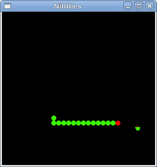

# 贪食蛇

> 原文： [http://zetcode.com/gui/vbgtk/nibbles/](http://zetcode.com/gui/vbgtk/nibbles/)

在 Visual Basic GTK# 编程教程的这一部分中，我们将创建贪食蛇游戏克隆。

贪食蛇是较旧的经典视频游戏。 它最初是在 70 年代后期创建的。 后来它被带到 PC 上。 在这个游戏中，玩家控制蛇。 目的是尽可能多地吃苹果。 蛇每次吃一个苹果，它的身体就会长大。 蛇必须避开墙壁和自己的身体。

## 开发

蛇的每个关节的大小为 10px。 蛇由光标键控制。 最初，蛇具有三个关节。 游戏立即开始。 游戏结束后，我们在窗口中心显示“`Game Over`”消息。

`board.vb`

```vb
Imports Gtk
Imports Cairo

NameSpace BoardSpace

Public Class Board 
    Inherits DrawingArea 

    Const WIDTH As Integer = 300
    Const HEIGHT As Integer = 300
    Const DOT_SIZE As Integer = 10
    Const ALL_DOTS As Integer = 900
    Const RAND_POS As Integer = 30
    Const DELAY As Integer = 140

    Dim x(ALL_DOTS) As Integer 
    Dim y(ALL_DOTS) As Integer 

    Dim dots As Integer
    Dim apple_x As Integer
    Dim apple_y As Integer

    Dim left As Boolean = False
    Dim right As Boolean = True

    Dim up As Boolean = False
    Dim down As Boolean = False
    Dim inGame As Boolean = True

    Dim dot As ImageSurface
    Dim apple As ImageSurface
    Dim head As ImageSurface

    Public Sub New

        MyBase.New

        ModifyBg(StateType.Normal, New Gdk.Color(0, 0, 0))

        Me.InitGame

    End Sub

    Private Sub InitGame

        dots = 3

        For z As Integer = 0 To dots-1 
            x(z) = 50 - z*10
            y(z) = 50
        Next

        Try 
            dot = New ImageSurface("dot.png")
            head = New ImageSurface("head.png")
            apple = New ImageSurface("apple.png")
        Catch 
            Console.WriteLine("Images not found")
            Environment.Exit(1)
        End Try

        Me.LocateApple

        Dim timer As New GLib.TimeoutHandler(AddressOf Me.OnTimer)

        GLib.Timeout.Add(100, timer)
        AddHandler Me.ExposeEvent, AddressOf Me.OnExpose

    End Sub

    Protected Sub OnExpose(ByVal sender As Object, ByVal e As ExposeEventArgs) 

        Dim cc As Cairo.Context = Gdk.CairoHelper.Create(sender.GdkWindow)

        If inGame
            Me.DrawObjects(cc)
        Else 
            Me.GameOver(cc)
        End If

        Dim disposeTarget As IDisposable = CType(cc.Target, IDisposable)
        disposeTarget.Dispose

        Dim disposeContext As IDisposable = CType(cc, IDisposable)
        disposeContext.Dispose

    End Sub

    Private Sub DrawObjects(ByVal cc As Cairo.Context) 

        cc.SetSourceSurface(apple, apple_x, apple_y)
        cc.Paint

        For z As Integer = 0 to dots - 1
            If z = 0
                cc.SetSourceSurface(head, x(z), y(z))
                cc.Paint
            Else 
                cc.SetSourceSurface(dot, x(z), y(z))
                cc.Paint
            End If 
        Next

    End Sub

    Private Sub GameOver(ByVal cc As Cairo.Context) 

        Dim message As String = "Game Over"

        Dim x As Integer = Allocation.Width / 2
        Dim y As Integer = Allocation.Height / 2

        cc.SetSourceRGB(1, 1, 1)
        cc.SetFontSize(18)

        Dim extents As TextExtents = cc.TextExtents(message)

        cc.MoveTo(x - extents.Width/2, y)
        cc.ShowText(message)
        inGame = False

    End Sub

    Private Sub CheckApple

        If x(0) = apple_x And y(0) = apple_y

            dots += 1
            Me.LocateApple

        End If

    End Sub

    Private Sub Move

        For z As Integer = dots To 1 Step -1
            x(z) = x(z - 1)
            y(z) = y(z - 1)
        Next

        If left 
            x(0) -= DOT_SIZE
        End If

        If right
            x(0) += DOT_SIZE
        End If

        If up 
            y(0) -= DOT_SIZE
        End If

        If down 
            y(0) += DOT_SIZE
        End If

    End Sub

    Private Sub CheckCollision

        For z As Integer = dots To 1 Step -1
            If z > 4 And x(0) = x(z) And y(0) = y(z) 
                inGame = False
            End If
        Next   

        If y(0) > HEIGHT 
            inGame = False
        End If

        If y(0) < 0 
            inGame = False
        End If

        If x(0) > WIDTH 
            inGame = False
        End If

        If x(0) < 0 
            inGame = False
        End If

    End Sub

    Private Sub LocateApple

        Dim rand As New Random

        Dim r As Integer = rand.Next(RAND_POS)

        apple_x = r * DOT_SIZE
        r = rand.Next(RAND_POS)
        apple_y = r * DOT_SIZE

    End Sub

    Private Function OnTimer As Boolean

        If inGame

            Me.CheckApple
            Me.CheckCollision
            Me.Move
            Me.QueueDraw

            Return True

         Else 
            Return False
        End If

    End Function

    Public Sub OnKeyDown(ByVal e As Gdk.EventKey)

        Dim key As Integer = e.KeyValue

        If key = Gdk.Key.Left AndAlso Not right
            left = True
            up = False
            down = False
        End If

        If key = Gdk.Key.Right AndAlso Not left
            right = True
            up = False
            down = False
        End If

        If key = Gdk.Key.Up AndAlso Not down
            up = True
            right = False
            left = False
        End If

        If key = Gdk.Key.Down AndAlso Not up
            down = True
            right = False
            left = False
        End If

    End Sub

End Class

End Namespace

```

首先，我们将定义一些在游戏中使用的全局变量。

`WIDTH`和`HEIGHT`常数确定电路板的大小。 `DOT_SIZE`是苹果的大小和蛇的点。 `ALL_DOTS`常数定义了板上可能的最大点数。 `RAND_POS`常数用于计算苹果的随机位置。 `DELAY`常数确定游戏的速度。

```vb
Dim x(ALL_DOTS) As Integer 
Dim y(ALL_DOTS) As Integer 

```

这两个数组存储蛇的所有可能关节的 x，y 坐标。

`InitGame`方法初始化变量，加载图像并启动超时功能。

```vb
If inGame
    Me.DrawObjects(cc)
Else 
    Me.GameOver(cc)
End If

```

在`OnExpose`方法内部，我们检查`inGame`变量。 如果为真，则绘制对象。 苹果和蛇的关节。 否则，我们显示“游戏结束”文本。

```vb
Private Sub DrawObjects(ByVal cc As Cairo.Context) 

     cc.SetSourceSurface(apple, apple_x, apple_y)
     cc.Paint

     For z As Integer = 0 to dots - 1
         If z = 0
             cc.SetSourceSurface(head, x(z), y(z))
             cc.Paint
         Else 
             cc.SetSourceSurface(dot, x(z), y(z))
             cc.Paint
         End If 
     Next

End Sub

```

`DrawObjects`方法绘制苹果和蛇的关节。 蛇的第一个关节是其头部，用红色圆圈表示。

```vb
Private Sub CheckApple

    If x(0) = apple_x And y(0) = apple_y

        dots += 1
        Me.LocateApple

    End If 

End Sub

```

`CheckApple`方法检查蛇是否击中了苹果对象。 如果是这样，我们添加另一个蛇形关节并调用`LocateApple`方法，该方法将随机放置一个新的 Apple 对象。

在`Move`方法中，我们有游戏的密钥算法。 要了解它，请看一下蛇是如何运动的。 您控制蛇的头。 您可以使用光标键更改其方向。 其余关节在链上向上移动一个位置。 第二关节移动到第一个关节的位置，第三关节移动到第二个关节的位置，依此类推。

```vb
For z As Integer = dots To 1 Step -1
    x(z) = x(z - 1)
    y(z) = y(z - 1)
Next

```

该代码将关节向上移动。

```vb
If left
    x(0) -= DOT_SIZE
End If

```

将头向左移动。

在`CheckCollision`方法中，我们确定蛇是否击中了自己或撞墙之一。

```vb
For z As Integer = dots To 1 Step -1
    If z > 4 And x(0) = x(z) And y(0) = y(z) 
        inGame = False
    End If
Next   

```

如果蛇用头撞到关节之一，我们就结束游戏。

```vb
If y(0) > HEIGHT 
    inGame = False
End If

```

如果蛇击中了棋盘的底部，我们就结束了游戏。

`LocateApple`方法在板上随机放置一个苹果。

```vb
Dim rand As New Random

Dim r As Integer = rand.Next(RAND_POS)

```

我们得到一个从 0 到`RAND_POS-1`的随机数。

```vb
apple_x = r * DOT_SIZE
...
apple_y = r * DOT_SIZE

```

这些行设置了`apple`对象的 x，y 坐标。

```vb
If inGame

    Me.CheckApple
    Me.CheckCollision
    Me.Move
    Me.QueueDraw

    Return True

Else 
    Return False
End If

```

每 140 毫秒，将调用`OnTimer`方法。 如果我们参与了游戏，我们将调用三种构建游戏逻辑的方法。 否则，我们返回`False`，它将停止计时器事件。

在`Board`类的`OnKeyDown`方法中，我们确定按下的键。

```vb
If key = Gdk.Key.Left AndAlso Not right
    left = True
    up = False
    down = False
End If

```

如果单击左光标键，则将`left`变量设置为`true`。 在`Move`方法中使用此变量来更改蛇对象的坐标。 还要注意，当蛇向右行驶时，我们不能立即向左转。

`nibbles.vb`

```vb
' ZetCode Mono Visual Basic GTK# tutorial
'
' In this program, we create
' a Nibbles game clone
'
' author jan bodnar
' last modified May 2009
' website www.zetcode.com

Imports Gtk

Public Class GtkVBApp
    Inherits Window

    Dim WIDTH As Integer = 250
    Dim HEIGHT As Integer = 150
    Dim board As BoardSpace.Board

    Public Sub New

        MyBase.New("Nibbles")

        board = New BoardSpace.Board
        Me.Add(board)

        AddHandler Me.DeleteEvent, AddressOf Me.OnDelete

        Me.Resize(310, 310)
        Me.Move(300, 300)
        Me.ShowAll

    End Sub

    Private Sub OnDelete(ByVal sender As Object, _
            ByVal args As DeleteEventArgs)
        Application.Quit
    End Sub

    Protected Overrides Function OnKeyPressEvent(ByVal e As Gdk.EventKey) As Boolean
        board.OnKeyDown(e)
        Return True
    End Function

    Public Shared Sub Main

        Application.Init
        Dim app As New GtkVBApp
        Application.Run

    End Sub

End Class

```

在本课程中，我们设置了半字节游戏。

```vb
Protected Overrides Function OnKeyPressEvent(ByVal e As Gdk.EventKey) As Boolean
    board.OnKeyDown(e)
    Return True
End Function

```

在本课程中，我们捕获按键事件。 并将处理委托给板类的`OnKeyDown`方法。



图：贪食蛇

以下命令编译游戏。

```vb
vbnc -r:/usr/lib/mono/gtk-sharp-2.0/gtk-sharp.dll 
  -r:/usr/lib/mono/gtk-sharp-2.0/gdk-sharp.dll -r:/usr/lib/mono/2.0/Mono.Cairo.dll 
  -r:/usr/lib/mono/gtk-sharp-2.0/glib-sharp.dll nibbles.vb board.vb

```

这是使用 GTK# 库和 Visual Basic 编程语言编写的贪食蛇电脑游戏。