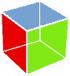

# PyGTK 简介

> 原文： [http://zetcode.com/gui/pygtk/introduction/](http://zetcode.com/gui/pygtk/introduction/)

在 PyGTK 编程教程的这一部分中，我们将大体讨论 PyGTK GUI 库和 Python 编程语言。

## 关于本教程

这是 PyGTK 编程教程。 它已在 Linux 上创建并经过测试。 PyGTK 编程教程适合新手和更高级的程序员。

## PyGTK

PyGTK 是 GTK+  GUI 库的一组 Python 包装器。 它提供了一套全面的图形元素和其他有用的编程工具，可用于创建桌面应用程序。 它是 GNOME 项目的一部分。 PyGTK 是免费软件，并根据 LGPL 许可。 原始作者或 PyGTK 是 James Henstridge 。 PyGTK 非常易于使用，是快速原型制作的理想选择。 当前，PyGTK 是 GTK+ 库最流行的绑定之一。

PyGTK 由几个模块组成。

`GObject`是一个基类，为 PyGTK 类提供通用的属性和功能。 `ATK`是辅助功能工具包。 该工具包提供的工具可帮助残障人士使用计算机。 `GTK`是用户界面模块。 `Pango`是一个用于处理文本和国际化的库。 `Cairo`是用于创建 2D 矢量图形的库。 `Glade`用于从 XML 描述构建 GUI 界面。

## Python

 Python 是一种通用的，动态的，面向对象的编程语言。 Python 语言的设计目的强调程序员的生产力和代码可读性。 Python 最初是由 Guido van Rossum 开发的。 它于 1991 年首次发布。Python 受 ABC，Haskell，Java，Lisp，Icon 和 Perl 编程语言的启发。 Python 是高级通用多平台解释型语言。 Python 是一种简约语言。 它最明显的功能之一是它不使用分号或方括号。 Python 使用缩进代替。 目前，Python 有两个主要分支。 Python 2.x 和 Python3.x。 Python 3.x 打破了与早期版本 Python 的向后兼容性。 它的创建是为了纠正该语言的某些设计缺陷并使该语言更简洁。 本教程使用 Python 2.x 编写。如今，Python 由世界各地的一大批志愿者维护。

## GTK+ 

 GTK+  是用于创建图形用户界面的库。 该库是用 C 编程语言创建的。 GTK+ 库也称为 GIMP Toolkit。 最初，该库是在开发 GIMP 图像处理程序时创建的。 从那时起，GTK+ 成为 Linux 和 BSD Unix 下最受欢迎的工具包之一。 如今，开源世界中的大多数 GUI 软件都是在 Qt 或 GTK+ 中创建的。 GTK+ 是面向对象的应用程序编程接口。 面向对象的系统是使用 Glib 对象系统创建的，该系统是 GTK+ 库的基础。 `GObject`还可以为其他各种编程语言创建语言绑定。 存在用于 C ++，Python，Perl，Java，C＃和其他编程语言的语言绑定。

Gnome 和 XFce 桌面环境已使用 GTK+ 库创建。 SWT 和 wxWidgets 是使用 GTK+ 的众所周知的编程框架。 使用 GTK+ 的著名软件应用程序包括 Firefox 或 Inkscape。

## 资料来源

*   [pygtk.org](http://www.pygtk.org)
*   [wikipedia.org](http://wwww.wikipedia.org)