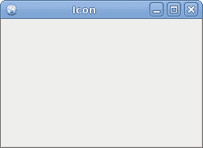
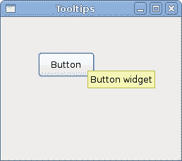

# PyGTK 的第一步

> 原文： [http://zetcode.com/gui/pygtk/firststeps/](http://zetcode.com/gui/pygtk/firststeps/)

在 PyGTK 编程教程的这一部分中，我们将进行编程的第一步。 我们将创建简单的程序。

## 简单的例子

第一个代码示例是一个非常简单的示例。

`center.py`

```
#!/usr/bin/python

# ZetCode PyGTK tutorial 
#
# This is a trivial PyGTK example
#
# author: jan bodnar
# website: zetcode.com 
# last edited: February 2009

import gtk

class PyApp(gtk.Window):
    def __init__(self):
        super(PyApp, self).__init__()

        self.connect("destroy", gtk.main_quit)
        self.set_size_request(250, 150)
        self.set_position(gtk.WIN_POS_CENTER)
        self.show()

PyApp()
gtk.main()

```

此代码显示一个居中的窗口。

```
import gtk

```

我们导入`gtk`模块。 在这里，我们有创建 GUI 应用的对象。

```
class PyApp(gtk.Window):

```

我们的应用基于`PyApp`类。 它继承自`Window`。

```
def __init__(self):
    super(PyApp, self).__init__()

```

这是构造函数。 它构建了我们的应用。 它还通过`super()`调用调用其父构造函数。

```
self.connect("destroy", gtk.main_quit)

```

我们将`destroy`信号连接到`main_quit()`功能。 当单击标题栏中的关闭按钮或按 `Alt` + `F4` 时，将调用`destroy`信号。 窗口被破坏，但应用未被破坏。 如果从命令行启动示例，则可以看到它。 通过调用`main_quit()`，我们永久退出了该应用。

```
self.set_size_request(250, 150)

```

我们将窗口的大小设置为 250x150px。

```
self.set_position(gtk.WIN_POS_CENTER)

```

这条线使窗口在屏幕上居中。

```
self.show()

```

现在我们显示窗口。 在调用`show()`方法之前，该窗口不可见。

```
PyApp()
gtk.main()

```

我们创建程序实例并启动主循环。

## 图标

在下一个示例中，我们显示应用图标。 大多数窗口管理器在标题栏的左上角以及任务栏上都显示图标。

`icon.py`

```
#!/usr/bin/python

# ZetCode PyGTK tutorial 
#
# This example shows an icon
# in the titlebar of the window 
#
# author: jan bodnar
# website: zetcode.com 
# last edited: February 2009

import gtk, sys

class PyApp(gtk.Window):
    def __init__(self):
        super(PyApp, self).__init__()

        self.set_title("Icon")
        self.set_size_request(250, 150)
        self.set_position(gtk.WIN_POS_CENTER)

        try:
            self.set_icon_from_file("web.png")
        except Exception, e:
            print e.message
            sys.exit(1)

        self.connect("destroy", gtk.main_quit)

        self.show()

PyApp()
gtk.main()

```

该代码示例显示了应用图标。

```
self.set_title("Icon")

```

我们为窗口设置标题。

```
self.set_icon_from_file("web.png")

```

`set_icon_from_file()`方法为窗口设置图标。 从当前工作目录中的磁盘加载映像。



Figure: Icon

## 按钮

在下一个示例中，我们将使用 PyGTK 库进一步增强我们的编程技能。

`buttons.py`

```
#!/usr/bin/python

# ZetCode PyGTK tutorial 
#
# This example shows four buttons
# in various modes 
#
# author: jan bodnar
# website: zetcode.com 
# last edited: February 2009

import gtk

class PyApp(gtk.Window):
    def __init__(self):
        super(PyApp, self).__init__()

        self.set_title("Buttons")
        self.set_size_request(250, 200)
        self.set_position(gtk.WIN_POS_CENTER)

        btn1 = gtk.Button("Button")
        btn1.set_sensitive(False)
        btn2 = gtk.Button("Button")
        btn3 = gtk.Button(stock=gtk.STOCK_CLOSE)
        btn4 = gtk.Button("Button")
        btn4.set_size_request(80, 40)

        fixed = gtk.Fixed()

        fixed.put(btn1, 20, 30)
        fixed.put(btn2, 100, 30)
        fixed.put(btn3, 20, 80)
        fixed.put(btn4, 100, 80)

        self.connect("destroy", gtk.main_quit)

        self.add(fixed)
        self.show_all()

PyApp()
gtk.main()

```

我们在窗口上显示四个不同的按钮。 我们将看到容器窗口小部件和子窗口小部件之间的区别，并将更改子窗口小部件的某些属性。

```
btn1 = gtk.Button("Button")

```

`Button`是子窗口小部件。 子窗口小部件放置在容器内。

```
btn1.set_sensitive(False)

```

我们使此按钮不敏感。 这意味着我们无法单击它。 也不能选择，聚焦等。图形化的小部件为灰色。

```
btn3 = gtk.Button(stock=gtk.STOCK_CLOSE)

```

第三个按钮在其区域内显示图像。 PyGTK 库具有我们可以使用的内置图像库。

```
btn4.set_size_request(80, 40)

```

在这里，我们更改按钮的大小。

```
fixed = gtk.Fixed()

```

`Fixed`小部件是不可见的容器小部件。 其目的是包含其他子窗口小部件。

```
fixed.put(btn1, 20, 30)
fixed.put(btn2, 100, 30)
...

```

在这里，我们将按钮小部件放置在固定容器小部件内。

```
self.add(fixed)

```

我们将`Fixed`容器设置为`Window`小部件的主要容器。

```
self.show_all()

```

我们可以调用`show_all()`方法，也可以在每个小部件上调用`show()`方法。 包括容器。


Figure: Buttons

## 工具提示

工具提示是应用中小部件上的提示。 可用于提供其他帮助。

`tooltips.py`

```
#!/usr/bin/python

# ZetCode PyGTK tutorial 
#
# This code shows a tooltip on 
# a window and a button
#
# author: jan bodnar
# website: zetcode.com 
# last edited: February 2009

import gtk

class PyApp(gtk.Window):

    def __init__(self):
        super(PyApp, self).__init__()

        self.set_title("Tooltips")
        self.set_size_request(250, 200)
        self.set_position(gtk.WIN_POS_CENTER)

        self.connect("destroy", gtk.main_quit)

        self.fixed = gtk.Fixed()
        self.add(self.fixed)

        button = gtk.Button("Button")
        button.set_size_request(80, 35)      

        self.fixed.put(button, 50, 50)

        self.set_tooltip_text("Window widget")
        button.set_tooltip_text("Button widget")

        self.show_all()

PyApp()
gtk.main()

```

在此示例中，我们为窗口和按钮设置工具提示。

```
self.set_tooltip_text("Window widget")
button.set_tooltip_text("Button widget")

```

`set_tooltip_text()`完成工作。



Figure: Tooltips

在本章中，我们在 PyGTK 编程库中创建了第一个程序。