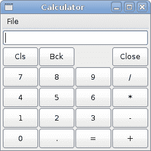

# PyGTK 中的布局管理

> 原文： [http://zetcode.com/gui/pygtk/layout/](http://zetcode.com/gui/pygtk/layout/)

在 PyGTK 教程的这一章中，我们将展示如何在窗口或对话框中布置窗口小部件。

在设计应用程序的 GUI 时，我们决定要使用哪些小部件以及如何在应用程序中组织这些小部件。 为了组织窗口小部件，我们使用专门的不可见窗口小部件，称为布局容器。 在本章中，我们将提到`Alignment`，`Fixed`，`VBox`和`Table`。

## 固定

`Fixed`容器将子窗口小部件放置在固定位置并具有固定大小。 此容器不执行自动布局管理。 在大多数应用程序中，我们不使用此容器。 我们在某些专业领域使用它。 例如游戏，使用图表的专用应用程序，可以移动的可调整大小的组件（如电子表格应用程序中的图表），小型教育示例。

`fixed.py`

```
#!/usr/bin/python

# ZetCode PyGTK tutorial 
#
# This example demonstrates a Fixed
# container widget
#
# author: jan bodnar
# website: zetcode.com 
# last edited: February 2009

import gtk
import sys

class PyApp(gtk.Window):

    def __init__(self):
        super(PyApp, self).__init__()

        self.set_title("Fixed")
        self.set_size_request(300, 280)
        self.modify_bg(gtk.STATE_NORMAL, gtk.gdk.Color(6400, 6400, 6440))
        self.set_position(gtk.WIN_POS_CENTER)

        try:
            self.bardejov = gtk.gdk.pixbuf_new_from_file("bardejov.jpg")
            self.rotunda = gtk.gdk.pixbuf_new_from_file("rotunda.jpg")
            self.mincol = gtk.gdk.pixbuf_new_from_file("mincol.jpg")
        except Exception, e:
            print e.message
            sys.exit(1)

        image1 = gtk.Image()
        image2 = gtk.Image()
        image3 = gtk.Image()

        image1.set_from_pixbuf(self.bardejov)
        image2.set_from_pixbuf(self.rotunda)
        image3.set_from_pixbuf(self.mincol)

        fix = gtk.Fixed()

        fix.put(image1, 20, 20)
        fix.put(image2, 40, 160)
        fix.put(image3, 170, 50)

        self.add(fix)

        self.connect("destroy", gtk.main_quit)
        self.show_all()

PyApp()
gtk.main()

```

在我们的示例中，我们在窗口上显示了三个小图像。 我们明确指定放置这些图像的 x，y 坐标。

```
self.modify_bg(gtk.STATE_NORMAL, gtk.gdk.Color(6400, 6400, 6440))

```

为了获得更好的视觉体验，我们将背景色更改为深灰色。

```
self.bardejov = gtk.gdk.pixbuf_new_from_file("bardejov.jpg")

```

我们从磁盘上的文件加载映像。

```
image1 = gtk.Image()
image2 = gtk.Image()
image3 = gtk.Image()

image1.set_from_pixbuf(self.bardejov)
image2.set_from_pixbuf(self.rotunda)
image3.set_from_pixbuf(self.mincol)

```

`Image`是用于显示图像的小部件。 它在构造函数中使用一个`Pixbuf`对象。

```
fix = gtk.Fixed()

```

我们创建`Fixed`容器。

```
fix.put(image1, 20, 20)

```

我们将第一个图像放置在 x = 20，y = 20 坐标处。

```
self.add(fix)

```

最后，我们将`Fixed`容器添加到窗口中。


Figure: Fixed

## 对准

`Alignment`容器控制其子窗口小部件的对齐方式和大小。

`alignment.py`

```
#!/usr/bin/python

# ZetCode PyGTK tutorial 
#
# This example shows how to use
# the Alignment widget
#
# author: jan bodnar
# website: zetcode.com 
# last edited: February 2009

import gtk

class PyApp(gtk.Window):

    def __init__(self):
        super(PyApp, self).__init__()

        self.set_title("Alignment")
        self.set_size_request(260, 150)
        self.set_position(gtk.WIN_POS_CENTER)

        vbox = gtk.VBox(False, 5)
        hbox = gtk.HBox(True, 3)

        valign = gtk.Alignment(0, 1, 0, 0)
        vbox.pack_start(valign)

        ok = gtk.Button("OK")
        ok.set_size_request(70, 30)
        close = gtk.Button("Close")

        hbox.add(ok)
        hbox.add(close)

        halign = gtk.Alignment(1, 0, 0, 0)
        halign.add(hbox)

        vbox.pack_start(halign, False, False, 3)

        self.add(vbox)

        self.connect("destroy", gtk.main_quit)
        self.show_all()

PyApp()
gtk.main()

```

在代码示例中，我们在窗口的右下角放置了两个按钮。 为此，我们使用一个水平框和一个垂直框以及两个对齐容器。

```
valign = gtk.Alignment(0, 1, 0, 0)

```

这会将子窗口小部件置于底部。

```
vbox.pack_start(valign)

```

在这里，我们将`Alignment`小部件放置到垂直框中。

```
hbox = gtk.HBox(True, 3)
...
ok = gtk.Button("OK")
ok.set_size_request(70, 30)
close = gtk.Button("Close")

hbox.add(ok)
hbox.add(close)

```

我们创建一个水平框，并在其中放置两个按钮。

```
halign = gtk.Alignment(1, 0, 0, 0)
halign.add(hbox)

vbox.pack_start(halign, False, False, 3)

```

这将创建一个对齐容器，它将其子窗口小部件放在右侧。 我们将水平框添加到对齐容器中，然后将对齐容器包装到垂直框中。 我们必须记住，对齐容器仅包含一个子窗口小部件。 这就是为什么我们必须使用盒子。


Figure: Alignment

## 表

`Table`小部件按行和列排列小部件。

`calculator.py`

```
#!/usr/bin/python

# ZetCode PyGTK tutorial 
#
# This example shows how to use
# the Table container widget
#
# author: jan bodnar
# website: zetcode.com 
# last edited: February 2009

import gtk

class PyApp(gtk.Window):

    def __init__(self):
        super(PyApp, self).__init__()

        self.set_title("Calculator")
        self.set_size_request(250, 230)
        self.set_position(gtk.WIN_POS_CENTER)

        vbox = gtk.VBox(False, 2)

        mb = gtk.MenuBar()
        filemenu = gtk.Menu()
        filem = gtk.MenuItem("File")
        filem.set_submenu(filemenu)
        mb.append(filem)

        vbox.pack_start(mb, False, False, 0)

        table = gtk.Table(5, 4, True)

        table.attach(gtk.Button("Cls"), 0, 1, 0, 1)
        table.attach(gtk.Button("Bck"), 1, 2, 0, 1)
        table.attach(gtk.Label(), 2, 3, 0, 1)
        table.attach(gtk.Button("Close"), 3, 4, 0, 1)

        table.attach(gtk.Button("7"), 0, 1, 1, 2)
        table.attach(gtk.Button("8"), 1, 2, 1, 2)
        table.attach(gtk.Button("9"), 2, 3, 1, 2)
        table.attach(gtk.Button("/"), 3, 4, 1, 2)

        table.attach(gtk.Button("4"), 0, 1, 2, 3)
        table.attach(gtk.Button("5"), 1, 2, 2, 3)
        table.attach(gtk.Button("6"), 2, 3, 2, 3)
        table.attach(gtk.Button("*"), 3, 4, 2, 3)

        table.attach(gtk.Button("1"), 0, 1, 3, 4)
        table.attach(gtk.Button("2"), 1, 2, 3, 4)
        table.attach(gtk.Button("3"), 2, 3, 3, 4)
        table.attach(gtk.Button("-"), 3, 4, 3, 4)

        table.attach(gtk.Button("0"), 0, 1, 4, 5)
        table.attach(gtk.Button("."), 1, 2, 4, 5)
        table.attach(gtk.Button("="), 2, 3, 4, 5)
        table.attach(gtk.Button("+"), 3, 4, 4, 5)

        vbox.pack_start(gtk.Entry(), False, False, 0)
        vbox.pack_end(table, True, True, 0)

        self.add(vbox)

        self.connect("destroy", gtk.main_quit)
        self.show_all()

PyApp()
gtk.main()

```

我们使用`Table`小部件创建一个计算器框架。

```
table = gtk.Table(5, 4, True)

```

我们创建一个具有 5 行 4 列的表小部件。 第三个参数是齐次参数。 如果设置为 true，则表中的所有小部件都具有相同的大小。 所有窗口小部件的大小等于表容器中最大的窗口小部件。

```
table.attach(gtk.Button("Cls"), 0, 1, 0, 1)

```

我们在表格容器上附加一个按钮。 到表格的左上方单元格。 前两个参数是单元格的左侧和右侧，后两个参数是单元格的顶部和底部。

```
vbox.pack_end(table, True, True, 0)

```

我们将表格小部件打包到垂直框中。



Figure: Calculator skeleton

## 窗口

接下来，我们将创建一个更高级的示例。 我们显示一个可以在 JDeveloper IDE 中找到的窗口。

`windows.py`

```
#!/usr/bin/python

# ZetCode PyGTK tutorial 
#
# This is a more complicated layout
# example
#
# author: jan bodnar
# website: zetcode.com 
# last edited: February 2009

import gtk
import sys

class PyApp(gtk.Window):

    def __init__(self):
        super(PyApp, self).__init__()

        self.set_title("Windows")
        self.set_size_request(300, 250)
        self.set_border_width(8)
        self.set_position(gtk.WIN_POS_CENTER)

        table = gtk.Table(8, 4, False)
        table.set_col_spacings(3)

        title = gtk.Label("Windows")

        halign = gtk.Alignment(0, 0, 0, 0)
        halign.add(title)

        table.attach(halign, 0, 1, 0, 1, gtk.FILL, 
            gtk.FILL, 0, 0);

        wins = gtk.TextView()
        wins.set_editable(False)
        wins.modify_fg(gtk.STATE_NORMAL, gtk.gdk.Color(5140, 5140, 5140))
        wins.set_cursor_visible(False)
        table.attach(wins, 0, 2, 1, 3, gtk.FILL | gtk.EXPAND,
            gtk.FILL | gtk.EXPAND, 1, 1)

        activate = gtk.Button("Activate")
        activate.set_size_request(50, 30)
        table.attach(activate, 3, 4, 1, 2, gtk.FILL, 
            gtk.SHRINK, 1, 1)

        valign = gtk.Alignment(0, 0, 0, 0)
        close = gtk.Button("Close")
        close.set_size_request(70, 30)
        valign.add(close)
        table.set_row_spacing(1, 3)
        table.attach(valign, 3, 4, 2, 3, gtk.FILL,
            gtk.FILL | gtk.EXPAND, 1, 1)

        halign2 = gtk.Alignment(0, 1, 0, 0)
        help = gtk.Button("Help")
        help.set_size_request(70, 30)
        halign2.add(help)
        table.set_row_spacing(3, 6)
        table.attach(halign2, 0, 1, 4, 5, gtk.FILL, 
            gtk.FILL, 0, 0)

        ok = gtk.Button("OK")
        ok.set_size_request(70, 30)
        table.attach(ok, 3, 4, 4, 5, gtk.FILL, 
            gtk.FILL, 0, 0);

        self.add(table)

        self.connect("destroy", gtk.main_quit)
        self.show_all()

PyApp()
gtk.main()

```

该代码示例显示了如何在 PyGTK 中创建类似的窗口。

```
table = gtk.Table(8, 4, False)
table.set_col_spacings(3)

```

该示例基于`Table`容器。 列之间将有 3 px 的间距。

```
title = gtk.Label("Windows")

halign = gtk.Alignment(0, 0, 0, 0)
halign.add(title)

table.attach(halign, 0, 1, 0, 1, gtk.FILL, 
    gtk.FILL, 0, 0);

```

这段代码创建了一个向左对齐的标签。 标签放置在 Table 容器的第一行中。

```
wins = gtk.TextView()
wins.set_editable(False)
wins.modify_fg(gtk.STATE_NORMAL, gtk.gdk.Color(5140, 5140, 5140))
wins.set_cursor_visible(False)
table.attach(wins, 0, 2, 1, 3, gtk.FILL | gtk.EXPAND,
    gtk.FILL | gtk.EXPAND, 1, 1)

```

文本视图小部件跨越两行两列。 我们使小部件不可编辑并隐藏光标。

```
valign = gtk.Alignment(0, 0, 0, 0)
close = gtk.Button("Close")
close.set_size_request(70, 30)
valign.add(close)
table.set_row_spacing(1, 3)
table.attach(valign, 3, 4, 2, 3, gtk.FILL,
    gtk.FILL | gtk.EXPAND, 1, 1)

```

我们将关闭按钮放在文本视图小部件旁边的第四列中。 （我们从零开始计数）将按钮添加到对齐小部件中，以便可以将其对齐到顶部。


Figure: Windows

PyGTK 编程教程的这一章是有关布局管理的。