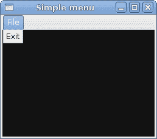
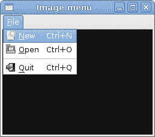
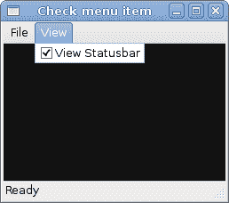
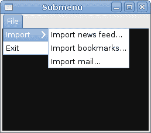

# PyGTK 中的菜单

> 原文： [http://zetcode.com/gui/pygtk/menus/](http://zetcode.com/gui/pygtk/menus/)

在 PyGTK 编程教程的这一部分中，我们将使用菜单。

菜单栏是 GUI 应用中最常见的部分之一。 它是位于各个菜单中的一组命令。 在控制台应用中，您必须记住所有这些神秘命令，在这里，我们将大多数命令分组为逻辑部分。 这些公认的标准可进一步减少学习新应用所花费的时间。

## 简单菜单

在第一个示例中，我们将创建一个带有一个文件菜单的菜单栏。 该菜单将只有一个菜单项。 通过选择项目，应用退出。

`simplemenu.py`

```py
#!/usr/bin/python

# ZetCode PyGTK tutorial 
#
# This example shows a simple menu
#
# author: jan bodnar
# website: zetcode.com 
# last edited: February 2009

import gtk

class PyApp(gtk.Window):

    def __init__(self):
        super(PyApp, self).__init__()

        self.set_title("Simple menu")
        self.set_size_request(250, 200)
        self.modify_bg(gtk.STATE_NORMAL, gtk.gdk.Color(6400, 6400, 6440))
        self.set_position(gtk.WIN_POS_CENTER)

        mb = gtk.MenuBar()

        filemenu = gtk.Menu()
        filem = gtk.MenuItem("File")
        filem.set_submenu(filemenu)

        exit = gtk.MenuItem("Exit")
        exit.connect("activate", gtk.main_quit)
        filemenu.append(exit)

        mb.append(filem)

        vbox = gtk.VBox(False, 2)
        vbox.pack_start(mb, False, False, 0)

        self.add(vbox)

        self.connect("destroy", gtk.main_quit)
        self.show_all()

PyApp()
gtk.main()

```

这是一个最小的菜单栏功能示例。

```py
mb = gtk.MenuBar()

```

`MenuBar`小部件已创建。

```py
filemenu = gtk.Menu()
filem = gtk.MenuItem("File")
filem.set_submenu(filemenu)

```

创建顶层`MenuItem`。

```py
exit = gtk.MenuItem("Exit")
exit.connect("activate", gtk.main_quit)
filemenu.append(exit)

```

将创建出口`MenuItem`，并将其附加到文件`MenuItem`中。

```py
mb.append(filem)

```

顶级`MenuItem`被附加到`MenuBar`小部件。

```py
vbox = gtk.VBox(False, 2)
vbox.pack_start(mb, False, False, 0)

```

与其他工具包不同，我们必须自己照顾菜单栏的布局管理。 我们将菜单栏放入垂直框。



图：简单菜单

## 图像菜单

在下一个示例中，我们将进一步探索菜单。 我们将图像和加速器添加到我们的菜单项中。 加速器是用于激活菜单项的键盘快捷键。

`imagemenu.py`

```py
#!/usr/bin/python

# ZetCode PyGTK tutorial 
#
# This example shows a menu with
# images, accelerators and a separator
#
# author: jan bodnar
# website: zetcode.com 
# last edited: February 2009

import gtk

class PyApp(gtk.Window):

    def __init__(self):
        super(PyApp, self).__init__()

        self.set_title("Image menu")
        self.set_size_request(250, 200)
        self.modify_bg(gtk.STATE_NORMAL, gtk.gdk.Color(6400, 6400, 6440))
        self.set_position(gtk.WIN_POS_CENTER)

        mb = gtk.MenuBar()

        filemenu = gtk.Menu()
        filem = gtk.MenuItem("_File")
        filem.set_submenu(filemenu)

        agr = gtk.AccelGroup()
        self.add_accel_group(agr)

        newi = gtk.ImageMenuItem(gtk.STOCK_NEW, agr)
        key, mod = gtk.accelerator_parse("<Control>N")
        newi.add_accelerator("activate", agr, key, 
            mod, gtk.ACCEL_VISIBLE)
        filemenu.append(newi)

        openm = gtk.ImageMenuItem(gtk.STOCK_OPEN, agr)
        key, mod = gtk.accelerator_parse("<Control>O")
        openm.add_accelerator("activate", agr, key, 
            mod, gtk.ACCEL_VISIBLE)
        filemenu.append(openm)

        sep = gtk.SeparatorMenuItem()
        filemenu.append(sep)

        exit = gtk.ImageMenuItem(gtk.STOCK_QUIT, agr)
        key, mod = gtk.accelerator_parse("<Control>Q")
        exit.add_accelerator("activate", agr, key, 
            mod, gtk.ACCEL_VISIBLE)

        exit.connect("activate", gtk.main_quit)

        filemenu.append(exit)

        mb.append(filem)

        vbox = gtk.VBox(False, 2)
        vbox.pack_start(mb, False, False, 0)

        self.add(vbox)

        self.connect("destroy", gtk.main_quit)
        self.show_all()

PyApp()
gtk.main()

```

我们的示例显示了具有三个子菜单项的顶级菜单项。 每个菜单项都有一个图像和一个加速器。 退出菜单项的加速器处于活动状态。

```py
agr = gtk.AccelGroup()
self.add_accel_group(agr)

```

要使用加速器，我们创建一个全局`AccelGroup`对象。 稍后将使用。

```py
newi = gtk.ImageMenuItem(gtk.STOCK_NEW, agr)

```

`ImageMenuItem`已创建。 图片来自图片库。

```py
key, mod = gtk.accelerator_parse("<Control>N")

```

`gtk.accelerator_parse()`函数解析指定的加速器字符串，并返回一个 2 元组，其中包含与加速器相对应的键值和修饰符掩码。

```py
newi.add_accelerator("activate", agr, key, 
    mod, gtk.ACCEL_VISIBLE)

```

这将为退出菜单项创建 `Ctrl + Q` 加速器。

```py
sep = gtk.SeparatorMenuItem()
filemenu.append(sep)

```

这些行创建一个分隔符。 它用于将菜单项分组为逻辑组。



图：图像 menu

## `CheckMenuItem`

`CheckMenuItem`是带有复选框的菜单项。 它可以用于布尔属性。

`checkmenuitem.py`

```py
#!/usr/bin/python

# ZetCode PyGTK tutorial 
#
# This example shows how to 
# use a CheckMenuItem
#
# author: jan bodnar
# website: zetcode.com 
# last edited: February 2009

import gtk

class PyApp(gtk.Window):

    def __init__(self):
        super(PyApp, self).__init__()

        self.set_title("Check menu item")
        self.set_size_request(250, 200)
        self.modify_bg(gtk.STATE_NORMAL, gtk.gdk.Color(6400, 6400, 6440))
        self.set_position(gtk.WIN_POS_CENTER)

        mb = gtk.MenuBar()

        filemenu = gtk.Menu()
        filem = gtk.MenuItem("File")
        filem.set_submenu(filemenu)

        viewmenu = gtk.Menu()
        view = gtk.MenuItem("View")
        view.set_submenu(viewmenu)

        stat = gtk.CheckMenuItem("View Statusbar")
        stat.set_active(True)
        stat.connect("activate", self.on_status_view)
        viewmenu.append(stat)

        exit = gtk.MenuItem("Exit")
        exit.connect("activate", gtk.main_quit)
        filemenu.append(exit)

        mb.append(filem)
        mb.append(view)

        self.statusbar = gtk.Statusbar()
        self.statusbar.push(1, "Ready")

        vbox = gtk.VBox(False, 2)
        vbox.pack_start(mb, False, False, 0)
        vbox.pack_start(gtk.Label(), True, False, 0)
        vbox.pack_start(self.statusbar, False, False, 0)

        self.add(vbox)

        self.connect("destroy", gtk.main_quit)
        self.show_all()

    def on_status_view(self, widget):
        if widget.active: 
            self.statusbar.show()
        else:
            self.statusbar.hide()

PyApp()
gtk.main()

```

在我们的代码示例中，我们显示一个检查菜单项。 如果该复选框已激活，则显示状态栏小部件。 如果不是，状态栏将被隐藏。

```py
stat = gtk.CheckMenuItem("View Statusbar")

```

`CheckMenuItem`小部件已创建。

```py
stat.set_active(True)

```

`set_active()`方法选中/取消选中检查菜单项。

```py
if widget.active: 
    self.statusbar.show()
else:
    self.statusbar.hide()

```

根据`CheckMenuItem`的活动属性，我们显示或隐藏状态栏小部件。



图：`CheckMenuItem`

## 子菜单

我们的最后一个示例演示了如何在 PyGTK 中创建子菜单。

`submenu.py`

```py
#!/usr/bin/python

# ZetCode PyGTK tutorial 
#
# This example shows a submenu
#
# author: jan bodnar
# website: zetcode.com 
# last edited: February 2009

import gtk

class PyApp(gtk.Window):

    def __init__(self):
        super(PyApp, self).__init__()

        self.set_title("Submenu")
        self.set_size_request(250, 200)
        self.modify_bg(gtk.STATE_NORMAL, gtk.gdk.Color(6400, 6400, 6440))
        self.set_position(gtk.WIN_POS_CENTER)

        mb = gtk.MenuBar()

        filemenu = gtk.Menu()
        filem = gtk.MenuItem("File")
        filem.set_submenu(filemenu)

        mb.append(filem)

        imenu = gtk.Menu()

        importm = gtk.MenuItem("Import")
        importm.set_submenu(imenu)

        inews = gtk.MenuItem("Import news feed...")
        ibookmarks = gtk.MenuItem("Import bookmarks...")
        imail = gtk.MenuItem("Import mail...")

        imenu.append(inews)
        imenu.append(ibookmarks)
        imenu.append(imail)

        filemenu.append(importm)

        exit = gtk.MenuItem("Exit")
        exit.connect("activate", gtk.main_quit)
        filemenu.append(exit)

        vbox = gtk.VBox(False, 2)
        vbox.pack_start(mb, False, False, 0)

        self.add(vbox)

        self.connect("destroy", gtk.main_quit)
        self.show_all()

PyApp()
gtk.main()

```

子菜单创建。

```py
imenu = gtk.Menu()

```

子菜单是`Menu`。

```py
importm = gtk.MenuItem("Import")
importm.set_submenu(imenu)

```

它是菜单项的子菜单，它会登录到顶级文件菜单。

```py
inews = gtk.MenuItem("Import news feed...")
ibookmarks = gtk.MenuItem("Import bookmarks...")
imail = gtk.MenuItem("Import mail...")

imenu.append(inews)
imenu.append(ibookmarks)
imenu.append(imail)

```

子菜单有其自己的菜单项。



图：子菜单

在 PyGTK 编程库的这一章中，我们展示了如何使用菜单。