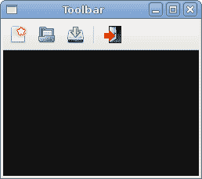
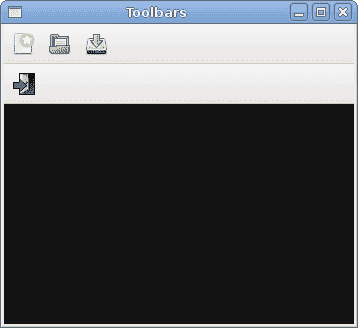
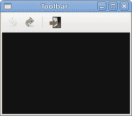

# PyGTK 中的工具栏

> 原文： [http://zetcode.com/gui/pygtk/toolbars/](http://zetcode.com/gui/pygtk/toolbars/)

在 PyGTK 编程教程的这一部分中，我们将使用工具栏。

菜单将我们可以在应用中使用的命令分组。 使用工具栏可以快速访问最常用的命令。

## 简单的工具栏

接下来，我们创建一个简单的工具栏。

`toolbar.py`

```py

#!/usr/bin/python

# ZetCode PyGTK tutorial 
#
# This example shows a toolbar
# widget
#
# author: jan bodnar
# website: zetcode.com 
# last edited: February 2009

import gtk

class PyApp(gtk.Window):

    def __init__(self):
        super(PyApp, self).__init__()

        self.set_title("Toolbar")
        self.set_size_request(250, 200)
        self.modify_bg(gtk.STATE_NORMAL, gtk.gdk.Color(6400, 6400, 6440))
        self.set_position(gtk.WIN_POS_CENTER)

        toolbar = gtk.Toolbar()
        toolbar.set_style(gtk.TOOLBAR_ICONS)

        newtb = gtk.ToolButton(gtk.STOCK_NEW)
        opentb = gtk.ToolButton(gtk.STOCK_OPEN)
        savetb = gtk.ToolButton(gtk.STOCK_SAVE)
        sep = gtk.SeparatorToolItem()
        quittb = gtk.ToolButton(gtk.STOCK_QUIT)

        toolbar.insert(newtb, 0)
        toolbar.insert(opentb, 1)
        toolbar.insert(savetb, 2)
        toolbar.insert(sep, 3)
        toolbar.insert(quittb, 4)

        quittb.connect("clicked", gtk.main_quit)

        vbox = gtk.VBox(False, 2)
        vbox.pack_start(toolbar, False, False, 0)

        self.add(vbox)

        self.connect("destroy", gtk.main_quit)
        self.show_all()

PyApp()
gtk.main()

```

该示例显示了一个工具栏和四个工具按钮。

```py
toolbar = gtk.Toolbar()

```

`Toolbar`小部件已创建。

```py
toolbar.set_style(gtk.TOOLBAR_ICONS)

```

在工具栏上，我们仅显示图标。 没有文字。

```py
newtb = gtk.ToolButton(gtk.STOCK_NEW)

```

创建带有库存图像的`ToolButton`。

```py
sep = gtk.SeparatorToolItem()

```

这是一个分隔符。 它可用于将工具栏按钮分组为逻辑组。

```py
toolbar.insert(newtb, 0)
toolbar.insert(opentb, 1)
...

```

工具栏按钮插入到工具栏小部件中。



图：工具栏

## 工具栏

在第二个示例中，我们显示了两个工具栏。 许多应用具有多个工具栏。 我们展示了如何在 PyGTK 中做到这一点。

`toolbars.py`

```py
#!/usr/bin/python

# ZetCode PyGTK tutorial 
#
# This example shows two toolbars
# in the application window
#
# author: jan bodnar
# website: zetcode.com 
# last edited: February 2009

import gtk

class PyApp(gtk.Window):

    def __init__(self):
        super(PyApp, self).__init__()

        self.set_title("Toolbars")
        self.set_size_request(350, 300)
        self.modify_bg(gtk.STATE_NORMAL, gtk.gdk.Color(6400, 6400, 6440))
        self.set_position(gtk.WIN_POS_CENTER)

        upper = gtk.Toolbar()
        upper.set_style(gtk.TOOLBAR_ICONS)

        newtb = gtk.ToolButton(gtk.STOCK_NEW)
        opentb = gtk.ToolButton(gtk.STOCK_OPEN)
        savetb = gtk.ToolButton(gtk.STOCK_SAVE)

        upper.insert(newtb, 0)
        upper.insert(opentb, 1)
        upper.insert(savetb, 2)

        lower = gtk.Toolbar()
        lower.set_style(gtk.TOOLBAR_ICONS)

        quittb = gtk.ToolButton(gtk.STOCK_QUIT)
        quittb.connect("clicked", gtk.main_quit)
        lower.insert(quittb, 0)

        vbox = gtk.VBox(False, 0)
        vbox.pack_start(upper, False, False, 0)
        vbox.pack_start(lower, False, False, 0)

        self.add(vbox)

        self.connect("destroy", gtk.main_quit)
        self.show_all()

PyApp()
gtk.main()

```

我们的应用显示了两个工具栏。

```py
upper = gtk.Toolbar()
...
lower = gtk.Toolbar()

```

我们创建两个`Toolbar`小部件。

```py
upper.insert(newtb, 0)
...
lower.insert(quittb, 0)

```

它们每个都有自己的工具按钮。

```py
vbox = gtk.VBox(False, 0)
vbox.pack_start(upper, False, False, 0)
vbox.pack_start(lower, False, False, 0)

```

工具栏一个接一个地包装在垂直盒中。



图：工具栏s

## 撤销重做

以下示例演示了如何停用工具栏上的工具栏按钮。 这是 GUI 编程中的常见做法。 例如，保存按钮。 如果我们将文档的所有更改都保存到磁盘上，则在大多数文本编辑器中，“保存”按钮将被禁用。 这样，应用会向用户指示所有更改都已保存。

`undoredo.py`

```py
#!/usr/bin/python

# ZetCode PyGTK tutorial 
#
# This example shows how to 
# activate/deactivate a ToolButton
#
# author: jan bodnar
# website: zetcode.com 
# last edited: February 2009

import gtk

class PyApp(gtk.Window):

    def __init__(self):
        super(PyApp, self).__init__()

        self.set_title("Toolbar")
        self.set_size_request(250, 200)
        self.modify_bg(gtk.STATE_NORMAL, gtk.gdk.Color(6400, 6400, 6440))
        self.set_position(gtk.WIN_POS_CENTER)

        self.count = 2

        toolbar = gtk.Toolbar()
        toolbar.set_style(gtk.TOOLBAR_ICONS)

        self.undo = gtk.ToolButton(gtk.STOCK_UNDO)
        self.redo = gtk.ToolButton(gtk.STOCK_REDO)
        sep = gtk.SeparatorToolItem()
        quit = gtk.ToolButton(gtk.STOCK_QUIT)

        toolbar.insert(self.undo, 0)
        toolbar.insert(self.redo, 1)
        toolbar.insert(sep, 2)
        toolbar.insert(quit, 3)

        self.undo.connect("clicked", self.on_undo)
        self.redo.connect("clicked", self.on_redo)
        quit.connect("clicked", gtk.main_quit)

        vbox = gtk.VBox(False, 2)
        vbox.pack_start(toolbar, False, False, 0)

        self.add(vbox)

        self.connect("destroy", gtk.main_quit)
        self.show_all()

    def on_undo(self, widget):
        self.count = self.count - 1

        if self.count <= 0:
            self.undo.set_sensitive(False)
            self.redo.set_sensitive(True)

    def on_redo(self, widget):
        self.count = self.count + 1

        if self.count >= 5: 
            self.redo.set_sensitive(False)
            self.undo.set_sensitive(True)

PyApp()
gtk.main()

```

我们的示例从 PyGTK 库存资源创建撤消和重做按钮。 单击几下后，每个按钮均被禁用。 按钮显示为灰色。

```py
self.count = 2

```

`self.count`变量决定哪个按钮被激活和禁用。

```py
self.undo = gtk.ToolButton(gtk.STOCK_UNDO)
self.redo = gtk.ToolButton(gtk.STOCK_REDO)

```

我们有两个工具按钮。 撤消和重做工具按钮。 图片来自库存资源。

```py
self.undo.connect("clicked", self.on_undo)
self.redo.connect("clicked", self.on_redo)

```

我们为两个工具按钮都插入了`clicked`信号的方法。

```py
if self.count <= 0:
    self.undo.set_sensitive(False)
    self.redo.set_sensitive(True)

```

要激活小部件，我们使用`set_sensitive()`方法。



Figure: Undo redo

在 PyGTK 编程库的这一章中，我们提到了工具栏。