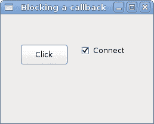

# PyGTK 中的事件和信号

> 原文： [http://zetcode.com/gui/pygtk/signals/](http://zetcode.com/gui/pygtk/signals/)

在 PyGTK 编程教程的这一部分中，我们将讨论信号&事件。

所有 GUI 应用都是事件驱动的。 PyGTK 应用也不例外。 应用通过`gtk.main()`调用启动主循环，该循环不断检查新生成的事件。 如果没有事件，则应用将等待并且不执行任何操作。

事件是从 X 服务器到应用的消息。 当我们单击按钮小部件时，单击的信号将以发出。 有所有小部件都继承的信号，例如销毁，有特定于小部件的信号，例如在切换按钮上切换。

程序员使用信号处理程序来响应各种信号。 这些处理程序在 GTK 程序员中称为回调。

```
handler_id = button.connect("clicked", self.on_clicked)

```

在这里，我们使用`GObject`类的`connect()`方法（（`GtkButton`是`GObject`））将回调`on_clicked()`连接到名为`clicked`的信号。

`connect()`方法返回一个处理程序 ID，用于唯一标识回调方法。 该 ID 可以与以下方法一起使用：

```
def disconnect(handler_id)
def handler_disconnect(handler_id)
def handler_is_connected(handler_id)
def handler_block(handler_id)
def handler_unblock(handler_id)

```

这些方法使处理程序可以与`GObject`断开连接，也可以对其进行阻止/取消阻止。

## 信号与事件

关于两者之间的差异，通常会有很多困惑。

信号和事件是两件事。 事件是窗口系统事件的几乎一对一的映射。 按键，调整窗口大小或按键是典型的窗口系统事件。 窗口系统事件将报告给应用主循环。 Gdk 解释窗口系统事件并通过信号传递它们。

信号就是回调机制。 如果一个对象希望收到有关另一对象的动作或状态更改的通知，它将注册一个回调。 当对象发出信号时，它会在已向其注册的回调列表中查找并调用特定信号的回调。 它可以选择发送一些预定义的数据。

信号是一个通用的通知框架。 它们不仅用于有关 UI 更改的通知。 它们可用于有关应用状态更改的通知。 信号是通用的，有力的，其用途非常广泛。 任何`GObject`都可以发射和接收信号。 一个类型可以具有一个或多个信号，每个信号可以具有一个参数列表和返回值。 然后可以将处理程序连接到该类型的实例。 在实例上发出信号时，将调用每个连接的处理程序。

信号和事件之间的唯一联系是信号用于从 X 服务器发送有关事件的通知。

信号是`gtk.Object`及其子类的功能，事件是 Gdk/Xlib 概念。

## 简单的例子

下一个示例显示了我们如何对两个基本信号做出反应。

`quitbutton.py`

```

#!/usr/bin/python

# ZetCode PyGTK tutorial 
#
# The example shows how to work with 
# destroy and clicked signals
#
# author: jan bodnar
# website: zetcode.com 
# last edited: February 2009

import gtk

class PyApp(gtk.Window):
    def __init__(self):
        super(PyApp, self).__init__()

        self.set_title("Quit Button")
        self.set_size_request(250, 200)
        self.set_position(gtk.WIN_POS_CENTER)
        self.connect("destroy", self.on_destroy)

        fixed = gtk.Fixed()

        quit = gtk.Button("Quit")
        quit.connect("clicked", self.on_clicked)
        quit.set_size_request(80, 35)

        fixed.put(quit, 50, 50)

        self.add(fixed)
        self.show_all()

    def on_destroy(self, widget):
        gtk.main_quit()

    def on_clicked(self, widget):
        gtk.main_quit()

PyApp()
gtk.main()

```

当我们关闭窗口时，破坏信号被触发。 默认情况下，当我们单击标题栏中的关闭按钮时，应用不会退出。

```
self.connect("destroy", self.on_destroy)

```

`connect()`方法将`on_destroy()`方法插入`destroy`信号。

```
quit.connect("clicked", self.on_clicked)

```

按下退出按钮，将触发`clicked`信号。 当单击退出按钮时，我们将调用`on_clicked()`方法。

```
def on_destroy(self, widget):
    gtk.main_quit()

```

在`on_destroy()`方法中，我们对`destroy`信号做出反应。 我们调用`gtk.main_quit()`方法，该方法将终止应用。

```
def on_clicked(self, widget):
    gtk.main_quit()

```

这是`on_clicked()`方法。 它有两个参数。 `widget`参数是触发该信号的对象。 在我们的例子中，它是退出按钮。 不同的对象发送不同的信号。 发送到方法的信号和参数可以在 PyGTK 库的参考手册中找到。 [pygtk.org/docs/pygtk/index.html](http://pygtk.org/docs/pygtk/index.html)

## 创建自定义信号

在下面的代码示例中，我们创建并发送一个自定义信号。

`customsignal.py`

```
#!/usr/bin/python

# ZetCode PyGTK tutorial 
#
# This example shows how to create
# and send a custom singal
#
# author: jan bodnar
# website: zetcode.com 
# last edited: February 2009

import gobject

class Sender(gobject.GObject):
    def __init__(self):
        self.__gobject_init__()

gobject.type_register(Sender)
gobject.signal_new("z_signal", Sender, gobject.SIGNAL_RUN_FIRST,
                   gobject.TYPE_NONE, ())

class Receiver(gobject.GObject):
    def __init__(self, sender):
        self.__gobject_init__()

        sender.connect('z_signal', self.report_signal)

    def report_signal(self, sender):
        print "Receiver reacts to z_signal"

def user_callback(object):
    print "user callback reacts to z_signal"

if __name__ == '__main__':

    sender = Sender()
    receiver = Receiver(sender)

    sender.connect("z_signal", user_callback)
    sender.emit("z_signal")

```

我们创建两个`GObjects`。 发送方和接收方对象。 发送方发出一个信号，该信号被接收方对象接收。 我们还会在信号中插入回调。

```
class Sender(gobject.GObject):
    def __init__(self):
        self.__gobject_init__()

```

这是一个发送者对象。 它是使用默认构造函数创建的。

```
gobject.type_register(Sender)
gobject.signal_new("z_signal", Sender, gobject.SIGNAL_RUN_FIRST,
                  gobject.TYPE_NONE, ())

```

我们注册一个新对象和一个新信号。 `signal_new()`功能为发件人对象注册一个名为`z_signal`的信号。 `SIGNAL_RUN_FIRST`参数意味着接收信号的对象的默认处理程序称为“第一”。 最后两个参数是返回值类型和参数类型。 在我们的示例中，我们不返回任何值，也不发送任何参数。

```
sender.connect('z_signal', self.report_signal)

```

接收器监听`z_signal`。

```
sender = Sender()
receiver = Receiver(sender)

```

实例化发送者和接收者对象。 接收方将发送方作为参数，以便可以监听其信号。

```
sender.connect("z_signal", user_callback)

```

在这里，我们将信号插入用户回调。

```
sender.emit("z_signal")

```

`z_signal`正在发射。

```
class Sender(gobject.GObject):

    __gsignals__ = {
        'z_signal': (gobject.SIGNAL_RUN_LAST, gobject.TYPE_NONE, ()),
    }

    def __init__(self):
        self.__gobject_init__() 

gobject.type_register(Sender)

```

我们还可以使用`__gsignals__`类属性来注册新信号。

## 预定义的信号处理程序

PyGTK 中的对象可能具有预定义的信号处理程序。 这些处理程序以`do_*`开头。 例如`do_expose()`，`do_show()`或`do_clicked()`。

`move.py`

```

#!/usr/bin/python

# ZetCode PyGTK tutorial 
#
# This example overrides predefined
# do_configure_event() signal handler
#
# author: jan bodnar
# website: zetcode.com 
# last edited: February 2009

import gtk
import gobject

class PyApp(gtk.Window):
    __gsignals__ = {
        "configure-event" : "override"
        }

    def __init__(self):
        super(PyApp, self).__init__()

        self.set_size_request(200, 150)
        self.set_position(gtk.WIN_POS_CENTER)

        self.connect("destroy", gtk.main_quit)

        self.show_all()

    def do_configure_event(self, event):

        title = "%s, %s" % (event.x, event.y)
        self.set_title(title)
        gtk.Window.do_configure_event(self, event)

PyApp()
gtk.main()

```

当我们移动窗口或调整窗口大小时，X 服务器将发送配置事件。 然后将它们转换为`configure-event`信号。

在我们的代码示例中，我们在标题栏中显示窗口左上角的 x，y 坐标。 我们可以简单地将信号处理程序连接到`configure-event`信号。 但是我们采取了不同的策略。 我们重写默认的类处理程序，在其中实现所需的逻辑。

```
__gsignals__ = {
    "configure-event" : "override"
    }

```

这表明我们将覆盖默认的`on_configure_event()`方法。

```
def do_configure_event(self, event):

    title = "%s, %s" % (event.x, event.y)
    self.set_title(title)
    gtk.Window.do_configure_event(self, event)

```

在这里，我们将覆盖预定义的`do_configure_event()`方法。 我们将窗口的 x，y 坐标设置为窗口的标题。 另请注意最后一行。 它显式调用超类`do_configure_event()`方法。 这是因为它做了一些重要的工作。 尝试对此行添加注释以查看发生了什么。 调整窗口大小无法正常工作。 如果重写默认处理程序，则可能会或可能不会调用超类方法。 就我们而言，我们必须这样做。


Figure: Configure singal

## 按钮的信号

以下示例显示了各种按钮信号。

`buttonsignals.py`

```
#!/usr/bin/python

# ZetCode PyGTK tutorial 
#
# This program shows various signals 
# of a button widget
# It emits a button-release-event which
# triggers a released singal
#
# author: jan bodnar
# website: zetcode.com 
# last edited: February 2009

import gtk

class PyApp(gtk.Window):
    def __init__(self):
        super(PyApp, self).__init__()

        self.set_title("Signals")
        self.set_size_request(250, 200)
        self.set_position(gtk.WIN_POS_CENTER)
        self.connect("destroy", gtk.main_quit)

        fixed = gtk.Fixed()

        self.quit = gtk.Button("Quit")

        self.quit.connect("pressed", self.on_pressed)
        self.quit.connect("released", self.on_released)
        self.quit.connect("clicked", self.on_clicked)

        self.quit.set_size_request(80, 35)

        fixed.put(self.quit, 50, 50)

        self.add(fixed)
        self.show_all()
        self.emit_signal()

    def emit_signal(self):

        event = gtk.gdk.Event(gtk.gdk.BUTTON_RELEASE)
        event.button = 1
        event.window = self.quit.window
        event.send_event = True

        self.quit.emit("button-release-event", event)

    def on_clicked(self, widget):
        print "clicked"

    def on_released(self, widget):
        print "released"

    def on_pressed(self, widget):
        print "pressed"

PyApp()
gtk.main()

```

一个按钮不仅可以发出一种信号。 我们与其中三个一起工作。 `clicked`，`pressed`和`released`信号。 我们还展示了事件信号如何触发另一个信号。

```
self.quit.connect("pressed", self.on_pressed)
self.quit.connect("released", self.on_released)
self.quit.connect("clicked", self.on_clicked)

```

我们为所有三个信号注册回调。

```
self.emit_signal()

```

在应用启动时，我们发出特定信号。

```
def emit_signal(self):

    event = gtk.gdk.Event(gtk.gdk.BUTTON_RELEASE)
    event.button = 1
    event.window = self.quit.window
    event.send_event = True

    self.quit.emit("button-release-event", event)

```

我们发出`button-release-event`信号。 它以`Event`对象为参数。 应用启动后，我们应该在控制台窗口中看到“已发布”文本。 当我们点击按钮时，所有三个信号都被触发。

## 阻止事件处理程序

我们可以阻止信号处理程序。 下一个示例显示了这一点。

`block.py`

```
#!/usr/bin/python

# ZetCode PyGTK tutorial 
#
# This example shows how to block/unblock
# a signal handler
#
# author: jan bodnar
# website: zetcode.com 
# last edited: February 2009

import gtk

class PyApp(gtk.Window):

    def __init__(self):
        super(PyApp, self).__init__()

        self.set_title("Blocking a callback")
        self.set_size_request(250, 180)
        self.set_position(gtk.WIN_POS_CENTER)

        fixed = gtk.Fixed()
        button = gtk.Button("Click")
        button.set_size_request(80, 35)
        self.id = button.connect("clicked", self.on_clicked)
        fixed.put(button, 30, 50)

        check = gtk.CheckButton("Connect")
        check.set_active(True)
        check.connect("clicked", self.toggle_blocking, button)
        fixed.put(check, 130, 50)

        self.connect("destroy", gtk.main_quit)

        self.add(fixed)
        self.show_all()

    def on_clicked(self, widget):
        print "clicked"

    def toggle_blocking(self, checkbox, button):
        if checkbox.get_active():
           button.handler_unblock(self.id)
        else:
           button.handler_block(self.id)

PyApp()
gtk.main()

```

在代码示例中，我们有一个按钮和一个复选框。 当我们单击按钮并且复选框处于活动状态时，我们在控制台中显示“已单击”文本。 复选框从按钮`clicked`信号中阻止/取消处理程序方法。

```
self.id = button.connect("clicked", self.on_clicked)

```

`connect()`方法返回处理程序 ID。 此 ID 用于阻止和取消阻止处理程序。

```
def toggle_blocking(self, checkbox, button):
    if checkbox.get_active():
       button.handler_unblock(self.id)
    else:
       button.handler_block(self.id)

```

这些行使用适当的方法阻止和取消阻止回调。



Figure: Blocking a callback

在 PyGTK 教程的这一章中，我们处理了信号。