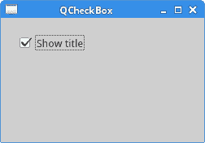
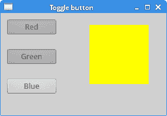
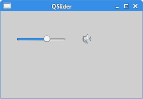
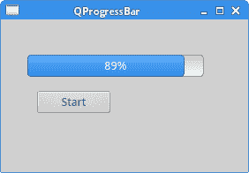

# PyQt5 小部件

> 原文： [http://zetcode.com/gui/pyqt5/widgets/](http://zetcode.com/gui/pyqt5/widgets/)

小部件是应用的基本构建块。 PyQt5 有各种各样的小部件，包括按钮，复选框，滑块或列表框。 在本教程的这一部分中，我们将描述几个有用的小部件：`QCheckBox`，处于切换模式的`QPushButton`，`QSlider`，`QProgressBar`和`QCalendarWidget`。

## `QCheckBox`

`QCheckBox`是具有两种状态的窗口小部件：开和关。 这是一个带有标签的盒子。 复选框通常用于表示可以启用或禁用的应用中的功能。

`checkbox.py`

```py
#!/usr/bin/python3
# -*- coding: utf-8 -*-

"""
ZetCode PyQt5 tutorial 

In this example, a QCheckBox widget
is used to toggle the title of a window.

Author: Jan Bodnar
Website: zetcode.com 
Last edited: August 2017
"""

from PyQt5.QtWidgets import QWidget, QCheckBox, QApplication
from PyQt5.QtCore import Qt
import sys

class Example(QWidget):

    def __init__(self):
        super().__init__()

        self.initUI()

    def initUI(self):      

        cb = QCheckBox('Show title', self)
        cb.move(20, 20)
        cb.toggle()
        cb.stateChanged.connect(self.changeTitle)

        self.setGeometry(300, 300, 250, 150)
        self.setWindowTitle('QCheckBox')
        self.show()

    def changeTitle(self, state):

        if state == Qt.Checked:
            self.setWindowTitle('QCheckBox')
        else:
            self.setWindowTitle(' ')

if __name__ == '__main__':

    app = QApplication(sys.argv)
    ex = Example()
    sys.exit(app.exec_())

```

在我们的示例中，我们将创建一个复选框，以切换窗口标题。

```py
cb = QCheckBox('Show title', self)

```

这是一个`QCheckBox`构造函数。

```py
cb.toggle()

```

我们已经设置了窗口标题，因此我们也选中了该复选框。

```py
cb.stateChanged.connect(self.changeTitle)

```

我们将用户定义的`changeTitle()`方法连接到`stateChanged`信号。 `changeTitle()`方法将切换窗口标题。

```py
def changeTitle(self, state):

    if state == Qt.Checked:
        self.setWindowTitle('QCheckBox')
    else:
        self.setWindowTitle(' ')

```

小部件的状态在`state`变量中提供给`changeTitle()`方法。 如果小部件被选中，我们设置窗口的标题。 否则，我们在标题栏设置一个空字符串。



图：`QCheckBox`

## `ToggleButton`

切换按钮是特殊模式下的`QPushButton`。 它是具有两种状态的按钮：已按下和未按下。 我们通过单击在这两种状态之间切换。 在某些情况下此功能非常合适。

`togglebutton.py`

```py
#!/usr/bin/python3
# -*- coding: utf-8 -*-

"""
ZetCode PyQt5 tutorial 

In this example, we create three toggle buttons.
They will control the background color of a 
QFrame. 

Author: Jan Bodnar
Website: zetcode.com 
Last edited: August 2017
"""

from PyQt5.QtWidgets import (QWidget, QPushButton, 
    QFrame, QApplication)
from PyQt5.QtGui import QColor
import sys

class Example(QWidget):

    def __init__(self):
        super().__init__()

        self.initUI()

    def initUI(self):      

        self.col = QColor(0, 0, 0)       

        redb = QPushButton('Red', self)
        redb.setCheckable(True)
        redb.move(10, 10)

        redb.clicked[bool].connect(self.setColor)

        greenb = QPushButton('Green', self)
        greenb.setCheckable(True)
        greenb.move(10, 60)

        greenb.clicked[bool].connect(self.setColor)

        blueb = QPushButton('Blue', self)
        blueb.setCheckable(True)
        blueb.move(10, 110)

        blueb.clicked[bool].connect(self.setColor)

        self.square = QFrame(self)
        self.square.setGeometry(150, 20, 100, 100)
        self.square.setStyleSheet("QWidget { background-color: %s }" %  
            self.col.name())

        self.setGeometry(300, 300, 280, 170)
        self.setWindowTitle('Toggle button')
        self.show()

    def setColor(self, pressed):

        source = self.sender()

        if pressed:
            val = 255
        else: val = 0

        if source.text() == "Red":
            self.col.setRed(val)                
        elif source.text() == "Green":
            self.col.setGreen(val)             
        else:
            self.col.setBlue(val) 

        self.square.setStyleSheet("QFrame { background-color: %s }" %
            self.col.name())  

if __name__ == '__main__':

    app = QApplication(sys.argv)
    ex = Example()
    sys.exit(app.exec_())

```

在我们的示例中，我们创建了三个切换按钮和一个`QWidget`。 我们将`QWidget`的背景色设置为黑色。 切换按钮将切换颜色值的红色，绿色和蓝色部分。 背景颜色取决于按下的切换按钮。

```py
self.col = QColor(0, 0, 0)    

```

这是初始的黑色值。

```py
redb = QPushButton('Red', self)
redb.setCheckable(True)
redb.move(10, 10)

```

要创建一个切换按钮，我们创建一个`QPushButton`并通过调用`setCheckable()`方法使其可检查。

```py
redb.clicked[bool].connect(self.setColor)

```

我们将`clicked`信号连接到用户定义的方法。 我们使用以布尔值操作的`clicked`信号。

```py
source = self.sender()

```

我们得到被切换的按钮。

```py
if source.text() == "Red":
    self.col.setRed(val)   

```

如果它是红色按钮，我们将相应地更新颜色的红色部分。

```py
self.square.setStyleSheet("QFrame { background-color: %s }" %
    self.col.name())   

```

我们使用样式表来更改背景颜色。 样式表使用`setStyleSheet()`方法更新。



图：开关按钮

## `QSlider`

`QSlider`是具有简单句柄的小部件。 该手柄可以前后拉动。 这样，我们可以为特定任务选择一个值。 有时使用滑块比输入数字或使用旋转框更自然。

在我们的示例中，我们将显示一个滑块和一个标签。 标签将显示图像。 滑块将控制标签。

`slider.py`

```py
#!/usr/bin/python3
# -*- coding: utf-8 -*-

"""
ZetCode PyQt5 tutorial 

This example shows a QSlider widget.

Author: Jan Bodnar
Website: zetcode.com 
Last edited: August 2017
"""

from PyQt5.QtWidgets import (QWidget, QSlider, 
    QLabel, QApplication)
from PyQt5.QtCore import Qt
from PyQt5.QtGui import QPixmap
import sys

class Example(QWidget):

    def __init__(self):
        super().__init__()

        self.initUI()

    def initUI(self):      

        sld = QSlider(Qt.Horizontal, self)
        sld.setFocusPolicy(Qt.NoFocus)
        sld.setGeometry(30, 40, 100, 30)
        sld.valueChanged[int].connect(self.changeValue)

        self.label = QLabel(self)
        self.label.setPixmap(QPixmap('mute.png'))
        self.label.setGeometry(160, 40, 80, 30)

        self.setGeometry(300, 300, 280, 170)
        self.setWindowTitle('QSlider')
        self.show()

    def changeValue(self, value):

        if value == 0:
            self.label.setPixmap(QPixmap('mute.png'))
        elif value > 0 and value <= 30:
            self.label.setPixmap(QPixmap('min.png'))
        elif value > 30 and value < 80:
            self.label.setPixmap(QPixmap('med.png'))
        else:
            self.label.setPixmap(QPixmap('max.png'))

if __name__ == '__main__':

    app = QApplication(sys.argv)
    ex = Example()
    sys.exit(app.exec_())             

```

在我们的示例中，我们模拟了音量控制。 通过拖动滑块的手柄，我们可以更改标签上的图像。

```py
sld = QSlider(Qt.Horizontal, self)

```

在这里，我们创建一个水平`QSlider`。

```py
self.label = QLabel(self)
self.label.setPixmap(QPixmap('mute.png'))

```

我们创建一个`QLabel`小部件并为其设置初始静音图像。

```py
sld.valueChanged[int].connect(self.changeValue)

```

我们将`valueChanged`信号连接到用户定义的`changeValue()`方法。

```py
if value == 0:
    self.label.setPixmap(QPixmap('mute.png'))
...

```

基于滑块的值，我们将图像设置为标签。 在上面的代码中，如果滑块等于 0，则将`mute.png`图像设置为标签。



图：`QSlider`小部件

## `QProgressBar`

进度条是在处理冗长的任务时使用的小部件。 它具有动画效果，以便用户知道任务正在进行中。 `QProgressBar`小部件在 PyQt5 工具包中提供了水平或垂直进度条。 程序员可以为进度条设置最小值和最大值。 默认值为 0 和 99。

`progressbar.py`

```py
#!/usr/bin/python3
# -*- coding: utf-8 -*-

"""
ZetCode PyQt5 tutorial 

This example shows a QProgressBar widget.

Author: Jan Bodnar
Website: zetcode.com 
Last edited: August 2017
"""

from PyQt5.QtWidgets import (QWidget, QProgressBar, 
    QPushButton, QApplication)
from PyQt5.QtCore import QBasicTimer
import sys

class Example(QWidget):

    def __init__(self):
        super().__init__()

        self.initUI()

    def initUI(self):      

        self.pbar = QProgressBar(self)
        self.pbar.setGeometry(30, 40, 200, 25)

        self.btn = QPushButton('Start', self)
        self.btn.move(40, 80)
        self.btn.clicked.connect(self.doAction)

        self.timer = QBasicTimer()
        self.step = 0

        self.setGeometry(300, 300, 280, 170)
        self.setWindowTitle('QProgressBar')
        self.show()

    def timerEvent(self, e):

        if self.step >= 100:

            self.timer.stop()
            self.btn.setText('Finished')
            return

        self.step = self.step + 1
        self.pbar.setValue(self.step)

    def doAction(self):

        if self.timer.isActive():
            self.timer.stop()
            self.btn.setText('Start')
        else:
            self.timer.start(100, self)
            self.btn.setText('Stop')

if __name__ == '__main__':

    app = QApplication(sys.argv)
    ex = Example()
    sys.exit(app.exec_())

```

在我们的示例中，我们有一个水平进度条和一个按钮。 该按钮将启动和停止进度条。

```py
self.pbar = QProgressBar(self)

```

这是一个`QProgressBar`构造函数。

```py
self.timer = QBasicTimer()

```

要激活进度条，我们使用一个计时器对象。

```py
self.timer.start(100, self)

```

要启动计时器事件，我们调用其`start()`方法。 此方法有两个参数：超时和将接收事件的对象。

```py
def timerEvent(self, e):

    if self.step >= 100:

        self.timer.stop()
        self.btn.setText('Finished')
        return

    self.step = self.step + 1
    self.pbar.setValue(self.step)

```

每个`QObject`及其子代都有一个`timerEvent()`事件处理程序。 为了对计时器事件做出反应，我们重新实现了事件处理程序。

```py
def doAction(self):

    if self.timer.isActive():
        self.timer.stop()
        self.btn.setText('Start')

    else:
        self.timer.start(100, self)
        self.btn.setText('Stop')

```

在`doAction()`方法中，我们启动和停止计时器。



图：`QProgressBar`

## `QCalendarWidget`

`QCalendarWidget`提供基于月度的日历小部件。 它允许用户以简单直观的方式选择日期。

`calendar.py`

```py
#!/usr/bin/python3
# -*- coding: utf-8 -*-

"""
ZetCode PyQt5 tutorial 

This example shows a QCalendarWidget widget.

Author: Jan Bodnar
Website: zetcode.com 
Last edited: August 2017
"""

from PyQt5.QtWidgets import (QWidget, QCalendarWidget, 
    QLabel, QApplication, QVBoxLayout)
from PyQt5.QtCore import QDate
import sys

class Example(QWidget):

    def __init__(self):
        super().__init__()

        self.initUI()

    def initUI(self):      

        vbox = QVBoxLayout(self)

        cal = QCalendarWidget(self)
        cal.setGridVisible(True)
        cal.clicked[QDate].connect(self.showDate)

        vbox.addWidget(cal)

        self.lbl = QLabel(self)
        date = cal.selectedDate()
        self.lbl.setText(date.toString())

        vbox.addWidget(self.lbl)

        self.setLayout(vbox)

        self.setGeometry(300, 300, 350, 300)
        self.setWindowTitle('Calendar')
        self.show()

    def showDate(self, date):     

        self.lbl.setText(date.toString())

if __name__ == '__main__':

    app = QApplication(sys.argv)
    ex = Example()
    sys.exit(app.exec_())

```

该示例具有日历小部件和标签小部件。 当前选择的日期显示在标签窗口小部件中。

```py
cal = QCalendarWidget(self)

```

`QCalendarWidget`已创建。

```py
cal.clicked[QDate].connect(self.showDate)

```

如果我们从小部件中选择一个日期，则会发出`clicked[QDate]`信号。 我们将此信号连接到用户定义的`showDate()`方法。

```py
def showDate(self, date):     

    self.lbl.setText(date.toString())

```

我们通过调用`selectedDate()`方法检索所选日期。 然后，我们将日期对象转换为字符串并将其设置为标签小部件。

在 PyQt5 教程的这一部分中，我们介绍了以下小部件：`QCheckBox`，`QPushButton`（处于切换模式），`QSlider`，`QProgressBar`和`QCalendarWidget`。