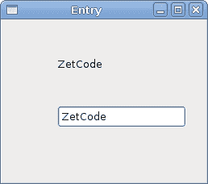

# PyGTK 中的小部件 II

> 原文： [http://zetcode.com/gui/pygtk/widgetsII/](http://zetcode.com/gui/pygtk/widgetsII/)

在 PyGTK 编程教程的这一部分中，我们将继续介绍 PyGTK 小部件。

## `Entry`

`Entry`是单行文本输入字段。 该小部件用于输入文本数据。

`entry.py`

```py
#!/usr/bin/python

# ZetCode PyGTK tutorial 
#
# This example demonstrates the Entry widget
#
# author: jan bodnar
# website: zetcode.com 
# last edited: February 2009

import gtk

class PyApp(gtk.Window):

    def __init__(self):
        super(PyApp, self).__init__()

        self.set_title("Entry")
        self.set_size_request(250, 200)
        self.set_position(gtk.WIN_POS_CENTER)

        fixed = gtk.Fixed()

        self.label = gtk.Label("...")
        fixed.put(self.label, 60, 40)

        entry = gtk.Entry()
        entry.add_events(gtk.gdk.KEY_RELEASE_MASK)
        fixed.put(entry, 60, 100)

        entry.connect("key-release-event", self.on_key_release)

        self.connect("destroy", gtk.main_quit)
        self.add(fixed)
        self.show_all()

    def on_key_release(self, widget, event):
        self.label.set_text(widget.get_text())

PyApp()
gtk.main()

```

此示例显示了条目小部件和标签。 我们输入的文本将立即显示在标签控件中。

```py
entry = gtk.Entry()

```

`Entry`小部件已创建。

```py
entry.connect("key-release-event", self.on_key_release)

```

如果`Entry`小部件中的文本被更改，我们将调用`on_key_release()`方法。

```py
def on_key_release(self, widget, event):
    self.label.set_text(widget.get_text())

```

我们从`Entry`小部件获取文本并将其设置为标签。



Figure: Entry Widget

## `HScale`

`HScale`是水平滑块，它使用户可以通过在有限间隔内滑动旋钮来以图形方式选择一个值。 我们的示例将显示音量控制。

`hscale.py`

```py
#!/usr/bin/python

# ZetCode PyGTK tutorial 
#
# This example demonstrates the HScale widget
#
# author: jan bodnar
# website: zetcode.com 
# last edited: February 2009

import gtk
import sys

class PyApp(gtk.Window):

    def __init__(self):
        super(PyApp, self).__init__()

        self.set_title("Scale")
        self.set_size_request(260, 150)
        self.set_position(gtk.WIN_POS_CENTER)

        scale = gtk.HScale()
        scale.set_range(0, 100)
        scale.set_increments(1, 10)
        scale.set_digits(0)
        scale.set_size_request(160, 35)
        scale.connect("value-changed", self.on_changed)

        self.load_pixbufs()

        self.image = gtk.Image()
        self.image.set_from_pixbuf(self.mutp)

        fix = gtk.Fixed()
        fix.put(scale, 20, 40)
        fix.put(self.image, 219, 50)

        self.add(fix)

        self.connect("destroy", lambda w: gtk.main_quit())
        self.show_all()

    def load_pixbufs(self):

        try:
            self.mutp = gtk.gdk.pixbuf_new_from_file("mute.png")
            self.minp = gtk.gdk.pixbuf_new_from_file("min.png")
            self.medp = gtk.gdk.pixbuf_new_from_file("med.png")
            self.maxp = gtk.gdk.pixbuf_new_from_file("max.png")

        except Exception, e: 
            print "Error reading Pixbufs"
            print e.message
            sys.exit(1)

    def on_changed(self, widget):
        val = widget.get_value()

        if val == 0:
            self.image.set_from_pixbuf(self.mutp)
        elif val > 0 and val <= 30:
            self.image.set_from_pixbuf(self.minp)
        elif val > 30 and val < 80:
            self.image.set_from_pixbuf(self.medp)
        else: 
            self.image.set_from_pixbuf(self.maxp)

PyApp()
gtk.main()

```

在上面的示例中，我们有`HScale`和`Image`小部件。 通过拖动比例尺，我们可以在`Image`小部件上更改图像。

```py
scale = gtk.HScale()

```

`HScale`小部件已创建。

```py
scale.set_range(0, 100)

```

我们设置刻度的上下边界。

```py
scale.set_increments(1, 10)

```

`set_increments()`方法设置范围的步长和页面大小。

```py
scale.set_digits(0)

```

我们希望刻度上具有整数值，因此我们将小数位数设置为零。

```py
if val == 0:
    self.image.set_from_pixbuf(self.mutp)
elif val > 0 and val <= 30:
    self.image.set_from_pixbuf(self.minp)
elif val > 30 and val < 80:
    self.image.set_from_pixbuf(self.medp)
else: 
    self.image.set_from_pixbuf(self.maxp)

```

根据获得的值，我们在图像小部件中更改图片。


Figure: HScale Widget

## `ToggleButton`

`ToggleButton`是具有两种状态的按钮。 已按下但未按下。 通过单击可以在这两种状态之间切换。 在某些情况下此功能非常合适。

`togglebuttons.py`

```py
#!/usr/bin/python

# ZetCode PyGTK tutorial 
#
# This example demonstrates the ToggleButton widget
#
# author: jan bodnar
# website: zetcode.com 
# last edited: February 2009

import gtk

class PyApp(gtk.Window):
    def __init__(self):
        super(PyApp, self).__init__()

        self.color = [0, 0, 0]

        self.set_title("ToggleButtons")
        self.resize(350, 240)
        self.set_position(gtk.WIN_POS_CENTER)
        self.connect("destroy", gtk.main_quit)

        red = gtk.ToggleButton("Red")
        red.set_size_request(80, 35)
        red.connect("clicked", self.onred)
        green = gtk.ToggleButton("Green")
        green.set_size_request(80, 35)
        green.connect("clicked", self.ongreen)
        blue = gtk.ToggleButton("Blue")
        blue.set_size_request(80, 35)
        blue.connect("clicked", self.onblue)

        self.darea = gtk.DrawingArea()
        self.darea.set_size_request(150, 150)
        self.darea.modify_bg(gtk.STATE_NORMAL, gtk.gdk.color_parse("black"))

        fixed = gtk.Fixed()
        fixed.put(red, 30, 30)
        fixed.put(green, 30, 80)
        fixed.put(blue, 30, 130)
        fixed.put(self.darea, 150, 30)

        self.add(fixed)

        self.show_all()

    def onred(self, widget):
        if widget.get_active():
            self.color[0] = 65535
        else: self.color[0] = 0

        self.darea.modify_bg(gtk.STATE_NORMAL, gtk.gdk.Color(self.color[0], 
            self.color[1], self.color[2]))

    def ongreen(self, widget):
        if (widget.get_active()):
            self.color[1] = 65535
        else: self.color[1] = 0

        self.darea.modify_bg(gtk.STATE_NORMAL, gtk.gdk.Color(self.color[0],
            self.color[1], self.color[2]))

    def onblue(self, widget):
        if (widget.get_active()):
            self.color[2] = 65535
        else: self.color[2] = 0

        self.darea.modify_bg(gtk.STATE_NORMAL, gtk.gdk.Color(self.color[0], 
            self.color[1], self.color[2]))

PyApp()
gtk.main()

```

在我们的示例中，我们显示了三个切换按钮和一个`DrawingArea`。 我们将区域的背景色设置为黑色。 切换按钮将切换颜色值的红色，绿色和蓝色部分。 背景颜色取决于我们按下的切换按钮。

```py
self.color = [0, 0, 0]

```

这是将使用切换按钮更新的颜色值。

```py
red = gtk.ToggleButton("Red")
red.set_size_request(80, 35)
red.connect("clicked", self.onred)

```

`ToggleButton`小部件已创建。 我们将其大小设置为`80x35`像素。 每个切换按钮都有其自己的处理程序方法。

```py
self.darea = gtk.DrawingArea()
self.darea.set_size_request(150, 150)
self.darea.modify_bg(gtk.STATE_NORMAL, gtk.gdk.color_parse("black"))

```

`DrawingArea`小部件是显示颜色的小部件，由切换按钮混合。 开始时，它显示为黑色。

```py
if widget.get_active():
    self.color[0] = 65535
else: self.color[0] = 0

```

如果按下切换按钮，我们将相应地更改颜色的 R，G 或 B 部分。

```py
self.darea.modify_bg(gtk.STATE_NORMAL, gtk.gdk.Color(self.color[0], 
           self.color[1], self.color[2]))

```

我们更新`DrawingArea`小部件的颜色。


Figure: ToggleButton widget

## `Calendar`

我们最终的窗口小部件是`Calendar`小部件。 它用于处理日期。

`calendar.py`

```py
#!/usr/bin/python

# ZetCode PyGTK tutorial 
#
# This example demonstrates the Calendar widget
#
# author: jan bodnar
# website: zetcode.com 
# last edited: February 2009

import gtk

class PyApp(gtk.Window):

    def __init__(self):
        super(PyApp, self).__init__()

        self.set_title("Calendar")
        self.set_size_request(300, 270)
        self.set_position(gtk.WIN_POS_CENTER)
        self.set_border_width(2)

        self.label = gtk.Label("...")

        calendar = gtk.Calendar() 
        calendar.connect("day_selected", self.on_day_selected)

        fix = gtk.Fixed()
        fix.put(calendar, 20, 20)
        fix.put(self.label, 40, 230)

        self.add(fix)

        self.connect("destroy", gtk.main_quit)
        self.show_all()

    def on_day_selected(self, widget):
        (year, month, day) = widget.get_date()
        self.label.set_label(str(month) + "/" + str(day) + "/" + str(year))

PyApp()
gtk.main()

```

我们有`Calendar`小部件和`Label`。 从日历中选择的日期显示在标签中。

```py
calendar = gtk.Calendar() 

```

`Calendar`小部件已创建。

```py
(year, month, day) = widget.get_date()
self.label.set_label(str(month) + "/" + str(day) + "/" + str(year))

```

在`on_day_selected()`方法中，我们检索当前选择的日期，并更新标签。


Figure: Calendar

在 PyGTK 教程的这一章中，我们完成了有关 PyGTK 小部件的讨论。