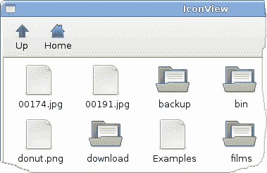

# PyGTK 中的高级小部件

> 原文： [http://zetcode.com/gui/pygtk/advancedwidgets/](http://zetcode.com/gui/pygtk/advancedwidgets/)

在 PyGTK 编程教程的这一部分中，我们将介绍 PyGTK 中的一些更高级的小部件。

## `IconView`

`IconView`是一个小部件，在网格中显示图标列表。

`iconview.py`

```
#!/usr/bin/python

# ZetCode PyGTK tutorial 
#
# This example demonstrates the IconView widget.
# It shows the contents of the currently selected
# directory on the disk.
#
# author: jan bodnar
# website: zetcode.com 
# last edited: February 2009

import gtk
import os

COL_PATH = 0
COL_PIXBUF = 1
COL_IS_DIRECTORY = 2

class PyApp(gtk.Window): 
    def __init__(self):
        super(PyApp, self).__init__()

        self.set_size_request(650, 400)
        self.set_position(gtk.WIN_POS_CENTER)

        self.connect("destroy", gtk.main_quit)
        self.set_title("IconView")

        self.current_directory = '/'

        vbox = gtk.VBox(False, 0);

        toolbar = gtk.Toolbar()
        vbox.pack_start(toolbar, False, False, 0)

        self.upButton = gtk.ToolButton(gtk.STOCK_GO_UP);
        self.upButton.set_is_important(True)
        self.upButton.set_sensitive(False)
        toolbar.insert(self.upButton, -1)

        homeButton = gtk.ToolButton(gtk.STOCK_HOME)
        homeButton.set_is_important(True)
        toolbar.insert(homeButton, -1)

        self.fileIcon = self.get_icon(gtk.STOCK_FILE)
        self.dirIcon = self.get_icon(gtk.STOCK_DIRECTORY)

        sw = gtk.ScrolledWindow()
        sw.set_shadow_type(gtk.SHADOW_ETCHED_IN)
        sw.set_policy(gtk.POLICY_AUTOMATIC, gtk.POLICY_AUTOMATIC)
        vbox.pack_start(sw, True, True, 0)

        self.store = self.create_store()
        self.fill_store()

        iconView = gtk.IconView(self.store)
        iconView.set_selection_mode(gtk.SELECTION_MULTIPLE)

        self.upButton.connect("clicked", self.on_up_clicked)
        homeButton.connect("clicked", self.on_home_clicked)

        iconView.set_text_column(COL_PATH)
        iconView.set_pixbuf_column(COL_PIXBUF)

        iconView.connect("item-activated", self.on_item_activated)
        sw.add(iconView)
        iconView.grab_focus()

        self.add(vbox)
        self.show_all()

    def get_icon(self, name):
        theme = gtk.icon_theme_get_default()
        return theme.load_icon(name, 48, 0)

    def create_store(self):
        store = gtk.ListStore(str, gtk.gdk.Pixbuf, bool)
        store.set_sort_column_id(COL_PATH, gtk.SORT_ASCENDING)
        return store

    def fill_store(self):
        self.store.clear()

        if self.current_directory == None:
            return

        for fl in os.listdir(self.current_directory):

            if not fl[0] == '.': 
                if os.path.isdir(os.path.join(self.current_directory, fl)):
                    self.store.append([fl, self.dirIcon, True])
                else:
                    self.store.append([fl, self.fileIcon, False])             

    def on_home_clicked(self, widget):
        self.current_directory = os.path.realpath(os.path.expanduser('~'))
        self.fill_store()
        self.upButton.set_sensitive(True)

    def on_item_activated(self, widget, item):

        model = widget.get_model()
        path = model[item][COL_PATH]
        isDir = model[item][COL_IS_DIRECTORY]

        if not isDir:
            return

        self.current_directory = self.current_directory + os.path.sep + path
        self.fill_store()
        self.upButton.set_sensitive(True)

    def on_up_clicked(self, widget):
        self.current_directory = os.path.dirname(self.current_directory)
        self.fill_store()
        sensitive = True
        if self.current_directory == "/": sensitive = False
        self.upButton.set_sensitive(sensitive)

PyApp()
gtk.main()

```

本示例显示当前所选目录的图标。 它有一个工具栏和两个按钮。 向上按钮和主页按钮。 我们使用它们来浏览文件系统。

```
self.current_directory = '/'

```

`current_directory`是目录，由`IconView`小部件显示。

```
def create_store(self):
    store = gtk.ListStore(str, gtk.gdk.Pixbuf, bool)
    store.set_sort_column_id(COL_PATH, gtk.SORT_ASCENDING)
    return store

```

`create_store()`方法创建一个`ListStore`。 它是`IconView`小部件中使用的数据模型。 它带有三个参数。 目录名，图标的`pixbuf`图像和`bool`变量，指示我们是目录还是文件。

```
if not fl[0] == '.': 
    if os.path.isdir(os.path.join(self.current_directory, fl)):
        self.store.append([fl, self.dirIcon, True])
    else:
        self.store.append([fl, self.fileIcon, False])     

```

在`fill_store()`方法中，我们用数据填充列表存储。 在这里，我们找出当前路径中的所有目录。 我们排除以“。”开头的不可见目录。

```
def on_home_clicked(self, widget):
    self.current_directory = os.path.realpath(os.path.expanduser('~'))
    self.fill_store()
    self.upButton.set_sensitive(True)

```

如果单击主页按钮，则主页目录将成为当前目录。 我们重新填充列表存储。 并激活向上按钮。

在`on_item_activated()`方法中，当我们从图标视图小部件中单击一个图标时，我们会对生成的事件做出反应。

```
model = widget.get_model()
path = model[item][COL_PATH]
isDir = model[item][COL_IS_DIRECTORY]

if not isDir:
    return

```

我们得到激活项目的路径。 然后我们确定它是目录还是文件。 如果是文件，我们返回。

```
self.current_directory = self.current_directory + os.path.sep + path
self.fill_store()
self.upButton.set_sensitive(True)

```

如果是目录，我们将根目录替换为当前路径，重新填充商店，然后使向上按钮敏感。

```
def on_up_clicked(self, widget):
    self.current_directory = os.path.dirname(self.current_directory)
    self.fill_store()
    sensitive = True
    if self.current_directory == "/": sensitive = False
    self.upButton.set_sensitive(sensitive)

```

如果单击向上按钮，则将当前目录替换为其父目录。 重新填充列表存储。 如果我们在文件系统的根`/`目录下，则向上按钮被激活。



Figure: IconView

## `ListView`

在下面的示例中，我们使用`TreeView`小部件显示列表视图。 同样`ListStore`用于存储数据。

`listview.py`

```
#!/usr/bin/python

# ZetCode PyGTK tutorial 
#
# This example shows a TreeView widget
# in a list view mode
#
# author: jan bodnar
# website: zetcode.com 
# last edited: February 2009

import gtk

actresses = [('jessica alba', 'pomona', '1981'), ('sigourney weaver', 'new york', '1949'),
    ('angelina jolie', 'los angeles', '1975'), ('natalie portman', 'jerusalem', '1981'),
    ('rachel weiss', 'london', '1971'), ('scarlett johansson', 'new york', '1984' )]

class PyApp(gtk.Window): 
    def __init__(self):
        super(PyApp, self).__init__()

        self.set_size_request(350, 250)
        self.set_position(gtk.WIN_POS_CENTER)

        self.connect("destroy", gtk.main_quit)
        self.set_title("ListView")

        vbox = gtk.VBox(False, 8)

        sw = gtk.ScrolledWindow()
        sw.set_shadow_type(gtk.SHADOW_ETCHED_IN)
        sw.set_policy(gtk.POLICY_AUTOMATIC, gtk.POLICY_AUTOMATIC)

        vbox.pack_start(sw, True, True, 0)

        store = self.create_model()

        treeView = gtk.TreeView(store)
        treeView.connect("row-activated", self.on_activated)
        treeView.set_rules_hint(True)
        sw.add(treeView)

        self.create_columns(treeView)
        self.statusbar = gtk.Statusbar()

        vbox.pack_start(self.statusbar, False, False, 0)

        self.add(vbox)
        self.show_all()

    def create_model(self):
        store = gtk.ListStore(str, str, str)

        for act in actresses:
            store.append([act[0], act[1], act[2]])

        return store

    def create_columns(self, treeView):

        rendererText = gtk.CellRendererText()
        column = gtk.TreeViewColumn("Name", rendererText, text=0)
        column.set_sort_column_id(0)    
        treeView.append_column(column)

        rendererText = gtk.CellRendererText()
        column = gtk.TreeViewColumn("Place", rendererText, text=1)
        column.set_sort_column_id(1)
        treeView.append_column(column)

        rendererText = gtk.CellRendererText()
        column = gtk.TreeViewColumn("Year", rendererText, text=2)
        column.set_sort_column_id(2)
        treeView.append_column(column)

    def on_activated(self, widget, row, col):

        model = widget.get_model()
        text = model[row][0] + ", " + model[row][1] + ", " + model[row][2]
        self.statusbar.push(0, text)

PyApp()
gtk.main()

```

在我们的示例中，我们在`TreeView`小部件中显示了六个女演员的列表。 每行分别显示名称，出生地和出生年份。

```
def create_model(self):
    store = gtk.ListStore(str, str, str)

    for act in actresses:
        store.append([act[0], act[1], act[2]])

    return store

```

在`create_model()`方法中，我们创建列表存储。 列表存储具有三个参数。 女演员的名字，出生地和出生年份。 这是我们的`TreeView`小部件的数据模型。

```
treeView = gtk.TreeView(store)
treeView.connect("row-activated", self.on_activated)
treeView.set_rules_hint(True)

```

在这里，我们以列表存储为参数创建`TreeView`小部件。 `set_rules_hint()`方法更改`TreeView`小部件中每第二行的背景颜色。

```
rendererText = gtk.CellRendererText()

column = gtk.TreeViewColumn("Name", rendererText, text=0)
column.set_sort_column_id(0)    
treeView.append_column(column)

```

在`create_columns()`方法中，我们向`TreeView`小部件中添加了三列。 上面的代码创建了一个显示女演员姓名的列。 `CellRendererText`从树模型的第一列检索其文本。 （文本`= 0`）

```
def on_activated(self, widget, row, col):

    model = widget.get_model()
    text = model[row][0] + ", " + model[row][1] + ", " + model[row][2]
    self.statusbar.push(0, text)

```

如果双击某个项目，则会在状态栏中显示整行。


Figure: ListView

## `TreeView`

在本章的最后一个示例中，我们使用`TreeView`小部件显示分层的数据树。

`tree.py`

```
#!/usr/bin/python

# ZetCode PyGTK tutorial 
#
# This example shows a TreeView widget
# in a tree view mode
#
# author: jan bodnar
# website: zetcode.com 
# last edited: February 2009

import gtk

class PyApp(gtk.Window): 
    def __init__(self):
        super(PyApp, self).__init__()

        self.set_size_request(400, 300)
        self.set_position(gtk.WIN_POS_CENTER)

        self.connect("destroy", gtk.main_quit)
        self.set_title("Tree")

        tree = gtk.TreeView()

        languages = gtk.TreeViewColumn()
        languages.set_title("Programming languages")

        cell = gtk.CellRendererText()
        languages.pack_start(cell, True)
        languages.add_attribute(cell, "text", 0)

        treestore = gtk.TreeStore(str)

        it = treestore.append(None, ["Scripting languages"])
        treestore.append(it, ["Python"])
        treestore.append(it, ["PHP"])
        treestore.append(it, ["Perl"])
        treestore.append(it, ["Ruby"])

        it = treestore.append(None, ["Compiling languages"])
        treestore.append(it, ["C#"])
        treestore.append(it, ["C++"])
        treestore.append(it, ["C"])
        treestore.append(it, ["Java"])

        tree.append_column(languages)
        tree.set_model(treestore)

        self.add(tree)
        self.show_all()

PyApp()
gtk.main()

```

这次我们使用`TreeView`小部件显示分层数据。

```
tree = gtk.TreeView()

```

`TreeView`小部件已创建。

```
languages = gtk.TreeViewColumn()
languages.set_title("Programming languages")

```

它有一列名为“编程语言”。

```
cell = gtk.CellRendererText()
languages.pack_start(cell, True)
languages.add_attribute(cell, "text", 0)

```

我们在`TreeView`小部件中显示文本数据。

```
treestore = gtk.TreeStore(str)

```

要存储数据，我们使用`TreeStore`对象。

```
it = treestore.append(None, ["Scripting languages"])
treestore.append(it, ["Python"])
treestore.append(it, ["PHP"])

```

我们将数据附加到树上。 `TreeIter`对象用于访问一行中的数据。

```
tree.append_column(languages)

```

一列被追加到树上。

```
tree.set_model(treestore)

```

最后，我们为树小部件设置数据模型。


Figure: Tree

在 PyGTK 编程教程的这一章中，我们讨论的是高级 PyGTK 小部件。