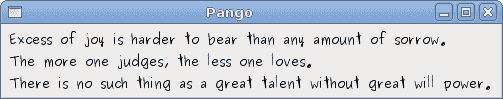
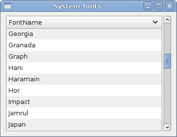

# 潘戈

> 原文： [http://zetcode.com/gui/pygtk/pango/](http://zetcode.com/gui/pygtk/pango/)

在 PyGTK 编程教程的这一部分中，我们将探索 Pango 库。

Pango 是一个免费的开源计算库，可高质量呈现国际化文本。 可以使用不同的字体后端，从而允许跨平台支持。 （维基百科）

Pango 提供了用于`Gdk`和`Gtk`的高级字体和文本处理。

## 简单的例子

在第一个示例中，我们展示了如何更改标签小部件的字体。

`quotes.py`

```
#!/usr/bin/python

# ZetCode PyGTK tutorial 
#
# This example shows how to modify
# the font of a label
#
# author: jan bodnar
# website: zetcode.com 
# last edited: February 2009

import gtk
import pango

quotes = """Excess of joy is harder to bear than any amount of sorrow.
The more one judges, the less one loves.
There is no such thing as a great talent without great will power. 
"""

class PyApp(gtk.Window): 
    def __init__(self):
        super(PyApp, self).__init__()

        self.connect("destroy", gtk.main_quit)
        self.set_title("Quotes")

        label = gtk.Label(quotes)
        gtk.gdk.beep()

        fontdesc = pango.FontDescription("Purisa 10")
        label.modify_font(fontdesc)

        fix = gtk.Fixed()

        fix.put(label, 5, 5)

        self.add(fix)
        self.set_position(gtk.WIN_POS_CENTER)
        self.show_all()

PyApp()
gtk.main()

```

在上面的代码示例中，我们有一个带有三个引号的标签小部件。 我们将其字体更改为 Purisa 10。

```
 quotes = """Excess of joy is harder to bear than any amount of sorrow.
 The more one judges, the less one loves.
 There is no such thing as a great talent without great will power. 
"""

```

这是要在标签中显示的文本。

```
fontdesc = pango.FontDescription("Purisa 10")

```

`FontDescription`用于指定字体的特征。

```
label.modify_font(fontdesc)

```

我们将标签小部件的字体更改为 Purisa 10。



Figure: Quotations

## 系统字体

下一个代码示例显示`TreeView`小部件中的所有可用字体。

`systemfonts.py`

```
#!/usr/bin/python

# ZetCode PyGTK tutorial 
#
# This example lists all available
# fonts on a system in a TreeView widget
#
# author: jan bodnar
# website: zetcode.com 
# last edited: February 2009

import gtk
import pango

class PyApp(gtk.Window): 
    def __init__(self):
        super(PyApp, self).__init__()

        self.set_size_request(350, 250)
        self.set_border_width(8)
        self.connect("destroy", gtk.main_quit)
        self.set_title("System fonts")

        sw = gtk.ScrolledWindow()
        sw.set_shadow_type(gtk.SHADOW_ETCHED_IN)
        sw.set_policy(gtk.POLICY_AUTOMATIC, gtk.POLICY_AUTOMATIC)

        context = self.create_pango_context()
        self.fam = context.list_families()

        store = self.create_model()

        treeView = gtk.TreeView(store)
        treeView.set_rules_hint(True)
        sw.add(treeView)

        self.create_column(treeView)

        self.add(sw)

        self.set_position(gtk.WIN_POS_CENTER)
        self.show_all()

    def create_column(self, treeView):
        rendererText = gtk.CellRendererText()
        column = gtk.TreeViewColumn("FontName", rendererText, text=0)
        column.set_sort_column_id(0)    
        treeView.append_column(column)

    def create_model(self):
        store = gtk.ListStore(str)

        for ff in self.fam:
            store.append([ff.get_name()])

        return store

PyApp()
gtk.main()

```

该代码示例显示了系统上所有可用的字体。

```
context = self.create_pango_context()

```

此代码行创建一个 pango 上下文对象。 它包含有关文本渲染过程的全局信息。

```
self.fam = context.list_families()

```

从上下文对象中，我们检索所有可用的字体系列。

```
for ff in self.fam:
    store.append([ff.get_name()])

```

在`TreeView`小部件的模型创建期间，我们从字体家族数组中获取所有字体名称，并将它们放入列表存储中。



Figure: System fonts

## Unicode

Pango 用于处理国际化文本。

`unicode.py`

```
#!/usr/bin/python
# -*- coding: utf-8 -*-

# ZetCode PyGTK tutorial 
#
# This example displays text
# in azbuka
#
# author: jan bodnar
# website: zetcode.com 
# last edited: February 2009

import gtk
import pango

obj = unicode(u'''Фёдор Михайлович Достоевский родился 30 октября (11 ноября)
1821 года в Москве. Был вторым из 7 детей. Отец, Михаил Андреевич, 
работал вгоспитале для бедных. Мать, Мария Фёдоровна 
(в девичестве Нечаева), происходила из купеческого рода.''')

class PyApp(gtk.Window): 
    def __init__(self):
        super(PyApp, self).__init__()

        self.connect("destroy", gtk.main_quit)
        self.set_title("Unicode")

        label = gtk.Label(obj.encode('utf-8'))

        fontdesc = pango.FontDescription("Purisa 10")
        label.modify_font(fontdesc)

        fix = gtk.Fixed()

        fix.put(label, 5, 5)

        self.add(fix)
        self.set_position(gtk.WIN_POS_CENTER)
        self.show_all()

PyApp()
gtk.main()

```

我们在 azbuka 中显示一些文本。

```
# -*- coding: utf-8 -*-

```

为了直接在源代码中使用国际化文本，我们必须提供此魔术注释。 请注意，它必须在第一行或第二行上。

```
 obj = unicode(u'''Фёдор Михайлович Достоевский родился 30 октября (11 ноября)
1821 года в Москве. Был вторым из 7 детей. Отец, Михаил Андреевич, 
работал вгоспитале для бедных. Мать, Мария Фёдоровна 
(в девичестве Нечаева), происходила из купеческого рода.''')

```

这是阿兹布卡语中的文字。

```
Label label = new Label(text);

```

我们将编码的文本放入标签中。


Figure: Unicode

## 属性

Pango 属性是适用于一段文字的属性。

`attributes.py`

```
#!/usr/bin/python

# ZetCode PyGTK tutorial 
#
# In this program we work with
# pango attributes
#
# author: jan bodnar
# website: zetcode.com 
# last edited: February 2009

import gtk
import pango

text = "Valour fate kinship darkness"

class PyApp(gtk.Window): 
    def __init__(self):
        super(PyApp, self).__init__()

        self.connect("destroy", gtk.main_quit)
        self.set_title("Attributes")

        label = gtk.Label(text)

        attr = pango.AttrList()

        fg_color = pango.AttrForeground(65535, 0, 0, 0, 6)
        underline = pango.AttrUnderline(pango.UNDERLINE_DOUBLE, 7, 11)
        bg_color = pango.AttrBackground(40000, 40000, 40000, 12, 19)
        strike = pango.AttrStrikethrough(True, 20, 29)
        size = pango.AttrSize(30000, 0, -1)

        attr.insert(fg_color)
        attr.insert(underline)
        attr.insert(bg_color)
        attr.insert(size)
        attr.insert(strike)

        label.set_attributes(attr)

        fix = gtk.Fixed()

        fix.put(label, 5, 5)

        self.add(fix)
        self.set_position(gtk.WIN_POS_CENTER)
        self.show_all()

PyApp()
gtk.main()

```

在代码示例中，我们显示了应用于文本的四个不同属性。

```
attr = pango.AttrList()

```

Pango 属性列表是用于保存属性的对象。

```
fg_color = pango.AttrForeground(65535, 0, 0, 0, 6)

```

在这里，我们创建一个属性，该属性将以红色呈现文本。 前三个参数是颜色的 R，G，B 值。 最后两个参数是文本的开始和结束索引，我们将其应用于此属性。

```
label.set_attributes(attr)

```

我们设置标签的属性列表。


Figure: Pango attributes

在 PyGTK 编程库的这一章中，我们使用了 pango 库。