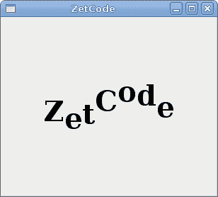
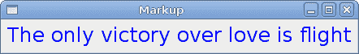
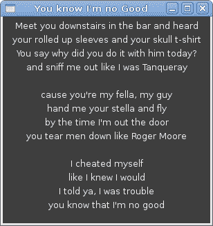

# Pango II

> 原文： [http://zetcode.com/gui/pygtk/pangoII/](http://zetcode.com/gui/pygtk/pangoII/)

在 PyGTK 编程教程的这一部分中，我们将继续探索 Pango 库。

## 动画文字

下面的示例在窗口上显示动画文本。

`animation.py`

```
#!/usr/bin/python

# ZetCode PyGTK tutorial 
#
# This example shows animated text
#
# author: jan bodnar
# website: zetcode.com 
# last edited: February 2009

import gtk
import glib
import pango
import math

class PyApp(gtk.Window): 
    def __init__(self):
        super(PyApp, self).__init__()

        self.connect("destroy", gtk.main_quit)
        glib.timeout_add(160, self.on_timer)

        self.count = 1

        self.set_border_width(10)
        self.set_title("ZetCode")

        self.label = gtk.Label("ZetCode")

        fontdesc = pango.FontDescription("Serif Bold 30")
        self.label.modify_font(fontdesc)

        vbox = gtk.VBox(False, 0)
        vbox.add(self.label)

        self.add(vbox)
        self.set_size_request(300, 250)
        self.set_position(gtk.WIN_POS_CENTER)
        self.show_all()

    def on_timer(self):
        attr = pango.AttrList()
        self.count = self.count + 1

        for i in range(7):
            r = pango.AttrRise(int(math.sin(self.count+i)*20)*pango.SCALE, i, i+1)
            attr.insert(r)

        self.label.set_attributes(attr)
        return True

PyApp()
gtk.main()

```

在上面的代码示例中，标签小部件中有一个文本。 通过不断更改其 pango 属性，可以对文本进行动画处理。

```
self.label = gtk.Label("ZetCode")

fontdesc = pango.FontDescription("Serif Bold 30")
self.label.modify_font(fontdesc)

```

我们创建标签小部件并修改其字体。 我们选择较大的文本以提高可见性。

```
vbox = gtk.VBox(False, 0)
vbox.add(self.label)

```

我们将标签放入垂直框中。 这将标签居中在窗口上。

动画在`on_timer()`方法内部执行。

```
for i in range(7):
    r = pango.AttrRise(int(math.sin(self.count+i)*20)*pango.SCALE, i, i+1)
    attr.insert(r)

```

我们的文字中有七个字符。 我们会定期更改每个角色的 pango `AttrRise`属性。 上升基于三角正弦函数。 文本移动遵循在笛卡尔图上绘制的正弦函数。

另请注意`pango.SCALE`常数。 Pango 库有自己的单元。 它们与小部件用来绘制图形或文本的方式不同。 我们必须用这个常数乘数字。



Figure: Animated text

## 使用标记语言

我们可以使用内置的标记语言来更改文本的属性。

`markup.py`

```

#!/usr/bin/python

# ZetCode PyGTK tutorial 
#
# This example uses markup language
# to change attributes of the text
#
# author: jan bodnar
# website: zetcode.com 
# last edited: February 2009

import gtk
import pango

quote = "<span foreground='blue' size='19000'>The only victory over love is flight</span>"

class PyApp(gtk.Window): 
    def __init__(self):
        super(PyApp, self).__init__()

        self.set_title("Markup")
        self.set_border_width(5)
        self.connect("destroy", gtk.main_quit)

        label = gtk.Label()
        label.set_markup(quote)

        vbox = gtk.VBox(False, 0)
        vbox.add(label)

        self.add(vbox)
        self.set_position(gtk.WIN_POS_CENTER)
        self.show_all()

PyApp()
gtk.main()

```

在代码示例中，我们有一个标签。 我们使用标记语言更改其文本属性。

```
quote = "<span foreground='blue' size='19000'>The only victory over love is flight</span>"

```

这是带有标记语言的文本。

```
label = gtk.Label()
label.set_markup(quote)

```

我们创建标签小部件并为其设置标记文本。



Figure: Using markup

## Pango 布局

Pango 布局是一个对象，代表带有属性的文本段落。

`layout.py`

```

#!/usr/bin/python

# ZetCode PyGTK tutorial 
#
# This example shows pango Layout
# in action
#
# author: jan bodnar
# website: zetcode.com 
# last edited: February 2009

import gtk
import pango

lyrics = """Meet you downstairs in the bar and heard
your rolled up sleeves and your skull t-shirt
You say why did you do it with him today?
and sniff me out like I was Tanqueray

cause you're my fella, my guy
hand me your stella and fly
by the time I'm out the door
you tear men down like Roger Moore

I cheated myself
like I knew I would
I told ya, I was trouble
you know that I'm no good"""

class Area(gtk.DrawingArea):
    def __init__(self):
        super(Area, self).__init__()
        self.modify_bg(gtk.STATE_NORMAL, gtk.gdk.Color(16400, 16400, 16440))
        self.connect("expose_event", self.expose)

    def expose(self, widget, event):

        gc = self.get_style().fg_gc[gtk.STATE_NORMAL]
        font_desc = pango.FontDescription('Sans 10')

        layout = self.create_pango_layout(lyrics)
        width, height = self.get_size_request()

        attr = pango.AttrList()

        fg_color = pango.AttrForeground(60535, 60535, 60535, 0, -1)
        attr.insert(fg_color)

        layout.set_width(pango.SCALE * self.allocation.width)
        layout.set_spacing(pango.SCALE * 3)
        layout.set_alignment(pango.ALIGN_CENTER)
        layout.set_font_description(font_desc)
        layout.set_attributes(attr)

        self.window.draw_layout(gc, 0, 5, layout)

class PyApp(gtk.Window): 
    def __init__(self):
        super(PyApp, self).__init__()

        self.connect("destroy", gtk.main_quit)
        self.set_title("You know I'm no Good")

        self.add(Area())
        self.set_size_request(300, 300)
        self.set_position(gtk.WIN_POS_CENTER)
        self.show_all()

PyApp()
gtk.main()

```

在前面的示例中，我们正在修改现有小部件中的文本。 现在，我们将使用`DrawingArea`小部件上的 pango 布局绘制文本。 我们将使用`Gdk`绘图工具进行绘图。

```
gc = self.get_style().fg_gc[gtk.STATE_NORMAL]

```

我们得到了绘图区域小部件的图形顶点。

```
layout = self.create_pango_layout(lyrics)

```

在这里创建 pango 布局对象。

```
layout.set_width(pango.SCALE * self.allocation.width)
layout.set_spacing(pango.SCALE * 3)
layout.set_alignment(pango.ALIGN_CENTER)
layout.set_font_description(font_desc)
layout.set_attributes(attr)

```

我们修改布局的宽度，间距，对齐方式，字体并设置文本属性。

```
self.window.draw_layout(gc, 0, 5, layout)

```

布局正在窗口上绘制。



Figure: Layout

在 PyGTK 编程库的这一章中，我们进一步使用了 pango 库。