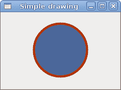
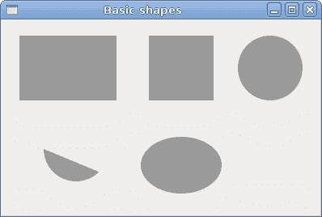
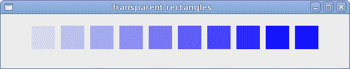

# PyGTK 中的 Cario 绘图

> 原文： [http://zetcode.com/gui/pygtk/drawing/](http://zetcode.com/gui/pygtk/drawing/)

在 PyGTK 编程教程的这一部分中，我们将使用 Cairo 库进行一些绘制。

Cairo 是用于创建 2D 矢量图形的库。 我们可以使用它来绘制自己的小部件，图表以及各种效果或动画。

## 简单绘图

笔划操作绘制形状的轮廓，填充操作填充形状的内部。 接下来，我们将演示这两个操作。

`simpledrawing.py`

```py
#!/usr/bin/python

# ZetCode PyGTK tutorial 
#
# This code example draws a circle
# using the cairo library
#
# author: jan bodnar
# website: zetcode.com 
# last edited: February 2009

import gtk
import math

class PyApp(gtk.Window):

    def __init__(self):
        super(PyApp, self).__init__()

        self.set_title("Simple drawing")
        self.resize(230, 150)
        self.set_position(gtk.WIN_POS_CENTER)

        self.connect("destroy", gtk.main_quit)

        darea = gtk.DrawingArea()
        darea.connect("expose-event", self.expose)
        self.add(darea)

        self.show_all()

    def expose(self, widget, event):

        cr = widget.window.cairo_create()

        cr.set_line_width(9)
        cr.set_source_rgb(0.7, 0.2, 0.0)

        w = self.allocation.width
        h = self.allocation.height

        cr.translate(w/2, h/2)
        cr.arc(0, 0, 50, 0, 2*math.pi)
        cr.stroke_preserve()

        cr.set_source_rgb(0.3, 0.4, 0.6)
        cr.fill()

PyApp()
gtk.main()

```

在我们的示例中，我们将绘制一个圆并将其用纯色绘制。

```py
darea = gtk.DrawingArea()

```

我们将在`DrawingArea`小部件上进行绘制操作。

```py
darea.connect("expose-event", self.expose)

```

我们都使用作为`expose-event`信号处理程序的方法进行绘制。

```py
cr = widget.window.cairo_create()

```

我们从绘图区域的`gdk.Window`创建 cairo 上下文对象。 上下文是用于在所有`Drawable`对象上绘制的对象。

```py
cr.set_line_width(9)

```

我们将线条的宽度设置为 9 像素。

```py
cr.set_source_rgb(0.7, 0.2, 0.0)

```

我们将颜色设置为深红色。

```py
w = self.allocation.width
h = self.allocation.height

cr.translate(w/2, h/2)

```

我们得到绘图区域的宽度和高度。 我们将原点移动到窗口的中间。

```py
cr.arc(0, 0, 50, 0, 2*math.pi)
cr.stroke_preserve()

```

我们绘制一个圆形的外部形状。 红色。 `stroke_preserve()`根据当前的线宽，线连接，线帽和破折号设置描边当前路径。 与`stroke()`不同，它在 cairo 上下文中保留路径。

```py
cr.set_source_rgb(0.3, 0.4, 0.6)
cr.fill()

```

这会用一些蓝色填充圆圈的内部。



Figure: Simple drawing

## 基本形状

下一个示例将一些基本形状绘制到窗口上。

`basicshapes.py`

```py
#!/usr/bin/python

# ZetCode PyGTK tutorial 
#
# This code example draws basic shapes
# with the cairo library
#
# author: jan bodnar
# website: zetcode.com 
# last edited: February 2009

import gtk
import math

class PyApp(gtk.Window):

    def __init__(self):
        super(PyApp, self).__init__()

        self.set_title("Basic shapes")
        self.set_size_request(390, 240)
        self.set_position(gtk.WIN_POS_CENTER)

        self.connect("destroy", gtk.main_quit)

        darea = gtk.DrawingArea()
        darea.connect("expose-event", self.expose)
        self.add(darea)

        self.show_all()

    def expose(self, widget, event):

        cr = widget.window.cairo_create()
        cr.set_source_rgb(0.6, 0.6, 0.6)

        cr.rectangle(20, 20, 120, 80)
        cr.rectangle(180, 20, 80, 80)
        cr.fill()

        cr.arc(330, 60, 40, 0, 2*math.pi)
        cr.fill()

        cr.arc(90, 160, 40, math.pi/4, math.pi)
        cr.fill()

        cr.translate(220, 180)
        cr.scale(1, 0.7)
        cr.arc(0, 0, 50, 0, 2*math.pi)
        cr.fill()

PyApp()
gtk.main()

```

在此示例中，我们将创建一个矩形，一个正方形，一个圆形，一个弧形和一个椭圆形。

```py
cr.rectangle(20, 20, 120, 80)
cr.rectangle(180, 20, 80, 80)
cr.fill()

```

这些线绘制一个矩形和一个正方形。

```py
cr.arc(330, 60, 40, 0, 2*math.pi)
cr.fill()

```

此处`arc()`方法绘制一个完整的圆。

```py
cr.scale(1, 0.7)
cr.arc(0, 0, 50, 0, 2*math.pi)
cr.fill()

```

如果要绘制椭圆形，请先进行一些缩放。 在这里`scale()`方法缩小 y 轴。



Figure: Basic shapes

## 色彩

颜色是代表红色，绿色和蓝色（RGB）强度值的组合的对象。 Cario 有效 RGB 值在 0 到 1 的范围内。

`colors.py`

```py
#!/usr/bin/python

# ZetCode PyGTK tutorial 
#
# This program shows how to work
# with colors in cairo
#
# author: jan bodnar
# website: zetcode.com 
# last edited: February 2009

import gtk

class PyApp(gtk.Window):

    def __init__(self):
        super(PyApp, self).__init__()

        self.set_title("Colors")
        self.resize(360, 100)
        self.set_position(gtk.WIN_POS_CENTER)

        self.connect("destroy", gtk.main_quit)

        darea = gtk.DrawingArea()
        darea.connect("expose-event", self.expose)
        self.add(darea)

        self.show_all()

    def expose(self, widget, event):

        cr = widget.window.cairo_create()

        cr.set_source_rgb(0.2, 0.23, 0.9)
        cr.rectangle(10, 15, 90, 60)
        cr.fill()

        cr.set_source_rgb(0.9, 0.1, 0.1)
        cr.rectangle(130, 15, 90, 60)
        cr.fill()

        cr.set_source_rgb(0.4, 0.9, 0.4)
        cr.rectangle(250, 15, 90, 60)
        cr.fill()

PyApp()
gtk.main()

```

我们用三种不同的颜色绘制三个矩形。

```py
cr.set_source_rgb(0.2, 0.23, 0.9)

```

`set_source_rgb()`方法为 Cario 上下文设置颜色。 该方法的三个参数是颜色强度值。

```py
cr.rectangle(10, 15, 90, 60)
cr.fill()

```

我们创建一个矩形形状，并用先前指定的颜色填充它。


Figure: Colors

## 透明矩形

透明性是指能够透视材料的质量。 了解透明度的最简单方法是想象一块玻璃或水。 从技术上讲，光线可以穿过玻璃，这样我们就可以看到玻璃后面的物体。

在计算机图形学中，我们可以使用 alpha 合成来实现透明效果。 Alpha 合成是将图像与背景组合以创建部分透明外观的过程。 合成过程使用 Alpha 通道。 （wikipedia.org，answers.com）

`transparentrectangles.py`

```py
#!/usr/bin/python

# ZetCode PyGTK tutorial 
#
# This program shows transparent
# rectangles using cairo
#
# author: jan bodnar
# website: zetcode.com 
# last edited: February 2009

import gtk

class PyApp(gtk.Window):

    def __init__(self):
        super(PyApp, self).__init__()

        self.set_title("Transparent rectangles")
        self.resize(590, 90)
        self.set_position(gtk.WIN_POS_CENTER)

        self.connect("destroy", gtk.main_quit)

        darea = gtk.DrawingArea()
        darea.connect("expose-event", self.expose)
        self.add(darea)

        self.show_all()

    def expose(self, widget, event):

        cr = widget.window.cairo_create()

        for i in range(1, 11):
            cr.set_source_rgba(0, 0, 1, i*0.1)
            cr.rectangle(50*i, 20, 40, 40)
            cr.fill()

PyApp()
gtk.main()

```

在示例中，我们将绘制十个具有不同透明度级别的矩形。

```py
cr.set_source_rgba(0, 0, 1, i*0.1)

```

`set_source_rgba()`方法的最后一个参数是 alpha 透明度。



Figure: Transparent rectangles

## 灵魂伴侣

在下一个示例中，我们在窗口上绘制一些文本。

`soulmate.py`

```py
#!/usr/bin/python

# ZetCode PyGTK tutorial 
#
# This program draws text
# using cairo
#
# author: jan bodnar
# website: zetcode.com 
# last edited: February 2009

import gtk
import cairo

class PyApp(gtk.Window):

    def __init__(self):
        super(PyApp, self).__init__()

        self.set_title("Soulmate")
        self.set_size_request(370, 240)
        self.set_position(gtk.WIN_POS_CENTER)

        self.connect("destroy", gtk.main_quit)

        darea = gtk.DrawingArea()
        darea.connect("expose-event", self.expose)
        self.add(darea)

        self.show_all()

    def expose(self, widget, event):

        cr = widget.window.cairo_create()

        cr.set_source_rgb(0.1, 0.1, 0.1)

        cr.select_font_face("Purisa", cairo.FONT_SLANT_NORMAL, 
            cairo.FONT_WEIGHT_NORMAL)
        cr.set_font_size(13)

        cr.move_to(20, 30)
        cr.show_text("Most relationships seem so transitory")
        cr.move_to(20, 60)
        cr.show_text("They're all good but not the permanent one")
        cr.move_to(20, 120)
        cr.show_text("Who doesn't long for someone to hold")
        cr.move_to(20, 150)
        cr.show_text("Who knows how to love without being told")
        cr.move_to(20, 180)
        cr.show_text("Somebody tell me why I'm on my own")
        cr.move_to(20, 210)
        cr.show_text("If there's a soulmate for everyone")

PyApp()
gtk.main()

```

我们显示 Natasha Bedingfields Soulmate 歌曲的部分歌词。

```py
cr.select_font_face("Purisa", cairo.FONT_SLANT_NORMAL, 
    cairo.FONT_WEIGHT_NORMAL)

```

在这里，我们指定使用的字体。

```py
cr.set_font_size(13)

```

我们指定字体的大小。

```py
cr.move_to(20, 30)

```

我们移动到要绘制文本的位置。

```py
cr.show_text("Most relationships seem so transitory")

```

`show_text()`方法将文本绘制到窗口上。


Figure: Soulmate

在 PyGTK 编程库的这一章中，我们使用 Cairo 图形库进行绘制。