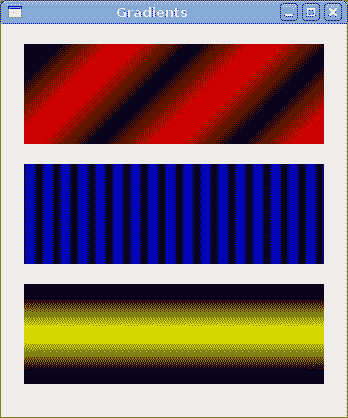

# Cario 绘图 II

> 原文： [http://zetcode.com/gui/pygtk/drawingII/](http://zetcode.com/gui/pygtk/drawingII/)

在 PyGTK 编程教程的这一部分中，我们将继续使用 Cairo 库进行绘制。

## 甜甜圈

在下面的示例中，我们通过旋转一堆椭圆来创建复杂的形状。

`donut.py`

```py
#!/usr/bin/python

# ZetCode PyGTK tutorial 
#
# This program creates a donut
# with cairo library
#
# author: jan bodnar
# website: zetcode.com 
# last edited: February 2009

import gtk
import math

class PyApp(gtk.Window):

    def __init__(self):
        super(PyApp, self).__init__()

        self.set_title("Donut")
        self.set_size_request(350, 250)
        self.set_position(gtk.WIN_POS_CENTER)

        self.connect("destroy", gtk.main_quit)

        darea = gtk.DrawingArea()
        darea.connect("expose-event", self.expose)
        self.add(darea)

        self.show_all()

    def expose(self, widget, event):

        cr = widget.window.cairo_create()

        cr.set_line_width(0.5)

        w = self.allocation.width
        h = self.allocation.height

        cr.translate(w/2, h/2)
        cr.arc(0, 0, 120, 0, 2*math.pi)
        cr.stroke()

        for i in range(36):
            cr.save()
            cr.rotate(i*math.pi/36)
            cr.scale(0.3, 1)
            cr.arc(0, 0, 120, 0, 2*math.pi)
            cr.restore()
            cr.stroke()

PyApp()
gtk.main()

```

在此示例中，我们创建一个甜甜圈。 形状类似于曲奇，因此得名“甜甜圈”。

```py
cr.translate(w/2, h/2)
cr.arc(0, 0, 120, 0, 2*math.pi)
cr.stroke()

```

刚开始时有一个椭圆。

```py
for i in range(36):
    cr.save()
    cr.rotate(i*math.pi/36)
    cr.scale(0.3, 1)
    cr.arc(0, 0, 120, 0, 2*math.pi)
    cr.restore()
    cr.stroke()

```

旋转几圈后，有一个甜甜圈。 我们使用`save()`和`restore()`方法将每个旋转和缩放操作彼此隔离。


图：多纳圈

## 渐变

在计算机图形学中，渐变是从浅到深或从一种颜色到另一种颜色的阴影的平滑混合。 在 2D 绘图程序和绘图程序中，渐变用于创建彩色背景和特殊效果以及模拟灯光和阴影。 （answers.com）

`gradients.py`

```py
#!/usr/bin/python

# ZetCode PyGTK tutorial 
#
# This program works with
# gradients in cairo
#
# author: jan bodnar
# website: zetcode.com 
# last edited: February 2009

import gtk
import cairo

class PyApp(gtk.Window):

    def __init__(self):
        super(PyApp, self).__init__()

        self.set_title("Gradients")
        self.set_size_request(340, 390)
        self.set_position(gtk.WIN_POS_CENTER)

        self.connect("destroy", gtk.main_quit)

        darea = gtk.DrawingArea()
        darea.connect("expose-event", self.expose)
        self.add(darea)

        self.show_all()

    def expose(self, widget, event):

        cr = widget.window.cairo_create()
        lg1 = cairo.LinearGradient(0.0, 0.0, 350.0, 350.0)

        count = 1

        i = 0.1    
        while i < 1.0: 
            if count % 2:
                lg1.add_color_stop_rgba(i, 0, 0, 0, 1)
            else:
                lg1.add_color_stop_rgba(i, 1, 0, 0, 1)
            i = i + 0.1
            count = count + 1      

        cr.rectangle(20, 20, 300, 100)
        cr.set_source(lg1)
        cr.fill()

        lg2 = cairo.LinearGradient(0.0, 0.0, 350.0, 0)

        count = 1

        i = 0.05    
        while i < 0.95: 
            if count % 2:
                lg2.add_color_stop_rgba(i, 0, 0, 0, 1)
            else:
                lg2.add_color_stop_rgba(i, 0, 0, 1, 1)
            i = i + 0.025
            count = count + 1        

        cr.rectangle(20, 140, 300, 100)
        cr.set_source(lg2)
        cr.fill()

        lg3 = cairo.LinearGradient(20.0, 260.0,  20.0, 360.0)
        lg3.add_color_stop_rgba(0.1, 0, 0, 0, 1) 
        lg3.add_color_stop_rgba(0.5, 1, 1, 0, 1) 
        lg3.add_color_stop_rgba(0.9, 0, 0, 0, 1) 

        cr.rectangle(20, 260, 300, 100)
        cr.set_source(lg3)
        cr.fill()

PyApp()
gtk.main()

```

在我们的示例中，我们绘制了三个具有三个不同渐变的矩形。

```py
lg1 = cairo.LinearGradient(0.0, 0.0, 350.0, 350.0)

```

在这里，我们创建一个线性渐变图案。 参数指定直线，沿着该直线绘制渐变。 在我们的情况下，这是一条垂直线。

```py
lg3 = cairo.LinearGradient(20.0, 260.0,  20.0, 360.0)
lg3.add_color_stop_rgba(0.1, 0, 0, 0, 1) 
lg3.add_color_stop_rgba(0.5, 1, 1, 0, 1) 
lg3.add_color_stop_rgba(0.9, 0, 0, 0, 1) 

```

我们定义色标以产生渐变图案。 在这种情况下，渐变是黑色和黄色的混合。 通过添加两个黑色和一个黄色色标，我们创建了一个水平渐变图案。 这些停止实际上是什么意思？ 在我们的情况下，我们从黑色开始，该颜色将以大小的 1/10 停止。 然后，我们开始逐渐涂成黄色，最终达到形状的中心。 黄色停在大小的 9/10，我们再次开始用黑色绘图，直到结束。



图：渐变

## 泡泡

在以下示例中，我们创建一个粉扑效果。 该示例将显示一个不断增长的居中文本，该文本将从某个点逐渐淡出。 这是一个非常常见的效果，您经常可以在 Flash 动画中看到它。

`puff.py`

```py
#!/usr/bin/python

# ZetCode PyGTK tutorial 
#
# This program creates a puff
# effect 
#
# author: jan bodnar
# website: zetcode.com 
# last edited: February 2009

import gtk
import glib
import cairo

class PyApp(gtk.Window):

    def __init__(self):
        super(PyApp, self).__init__()

        self.set_title("Puff")
        self.resize(350, 200)
        self.set_position(gtk.WIN_POS_CENTER)

        self.connect("destroy", gtk.main_quit)

        self.darea = gtk.DrawingArea()
        self.darea.connect("expose-event", self.expose)
        self.add(self.darea)

        self.timer = True
        self.alpha = 1.0
        self.size = 1.0

        glib.timeout_add(14, self.on_timer)

        self.show_all()

    def on_timer(self):
        if not self.timer: return False

        self.darea.queue_draw()
        return True

    def expose(self, widget, event):

        cr = widget.window.cairo_create()

        w = self.allocation.width
        h = self.allocation.height

        cr.set_source_rgb(0.5, 0, 0)
        cr.paint()

        cr.select_font_face("Courier", cairo.FONT_SLANT_NORMAL, cairo.FONT_WEIGHT_BOLD)

        self.size = self.size + 0.8

        if self.size > 20:
            self.alpha = self.alpha - 0.01

        cr.set_font_size(self.size)
        cr.set_source_rgb(1, 1, 1)

        (x, y, width, height, dx, dy) = cr.text_extents("ZetCode")

        cr.move_to(w/2 - width/2, h/2)
        cr.text_path("ZetCode")
        cr.clip()
        cr.stroke()
        cr.paint_with_alpha(self.alpha)

        if self.alpha <= 0:
            self.timer = False

PyApp()
gtk.main()

```

该示例在窗口上创建一个逐渐增长和褪色的文本。

```py
glib.timeout_add(14, self.on_timer)

```

每隔 14 毫秒调用一次`on_timer()`方法。

```py
def on_timer(self):
    if not self.timer: return False

    self.darea.queue_draw()
    return True     

```

在`on_timer()`方法中，我们在绘图区域上调用`queue_draw()`方法，该方法会触发曝光信号。

```py
cr.set_source_rgb(0.5, 0, 0)
cr.paint()

```

我们将背景色设置为深红色。

```py
self.size = self.size + 0.8

```

每个周期，字体大小将增加 0.8 个单位。

```py
if self.size > 20:
    self.alpha = self.alpha - 0.01

```

字体大小大于 20 后开始淡出。

```py
(x, y, width, height, dx, dy) = cr.text_extents("ZetCode")

```

我们得到了文本指标。

```py
cr.move_to(w/2 - width/2, h/2)

```

我们使用文本指标将文本放在窗口的中心。

```py
cr.text_path("ZetCode")
cr.clip()

```

我们获取文本的路径，并为其设置当前的片段区域。

```py
cr.stroke()
cr.paint_with_alpha(self.alpha)

```

我们绘制当前路径并考虑 alpha 值。


图：粉扑

## 反射

在下一个示例中，我们显示反射图像。 这种美丽的效果使人产生幻觉，好像图像在水中被反射一样。

`reflection.py`

```py
#!/usr/bin/python
# -*- coding: utf-8 -*-

# ZetCode PyGTK tutorial 
#
# This program creates an
# image reflection
#
# author: Jan Bodnar
# website: zetcode.com 
# last edited: April 2011

import gtk
import cairo
import sys

class PyApp(gtk.Window):

    def __init__(self):
        super(PyApp, self).__init__()

        self.set_title("Reflection")
        self.resize(300, 350)
        self.set_position(gtk.WIN_POS_CENTER)

        self.connect("destroy", gtk.main_quit)

        darea = gtk.DrawingArea()
        darea.connect("expose-event", self.expose)
        self.add(darea)

        try:
            self.surface = cairo.ImageSurface.create_from_png("slanec.png")
        except Exception, e:
            print e.message
            sys.exit(1)

        self.imageWidth = self.surface.get_width()
        self.imageHeight = self.surface.get_height()
        self.gap = 40
        self.border = 20

        self.show_all()

    def expose(self, widget, event):

        cr = widget.window.cairo_create()

        w = self.allocation.width
        h = self.allocation.height

        lg = cairo.LinearGradient(w/2, 0, w/2, h*3)
        lg.add_color_stop_rgba(0, 0, 0, 0, 1)
        lg.add_color_stop_rgba(h, 0.2, 0.2, 0.2, 1)

        cr.set_source(lg)
        cr.paint()

        cr.set_source_surface(self.surface, self.border, self.border)
        cr.paint()

        alpha = 0.7
        step = 1.0 / self.imageHeight

        cr.translate(0, 2 * self.imageHeight + self.gap)
        cr.scale(1, -1)

        i = 0

        while(i < self.imageHeight):

            cr.rectangle(self.border, self.imageHeight-i, self.imageWidth, 1)

            i = i + 1

            cr.save()
            cr.clip()
            cr.set_source_surface(self.surface, self.border, self.border)
            alpha = alpha - step
            cr.paint_with_alpha(alpha)
            cr.restore()

PyApp()
gtk.main()

```

该示例显示了一个反射的城堡。

```py
lg = cairo.LinearGradient(w/2, 0, w/2, h*3)
lg.add_color_stop_rgba(0, 0, 0, 0, 1)
lg.add_color_stop_rgba(h, 0.2, 0.2, 0.2, 1)

cr.set_source(lg)
cr.paint()

```

背景充满了渐变的油漆。 涂料是从黑色到深灰色的平滑混合。

```py
cr.translate(0, 2 * self.imageHeight + self.gap)
cr.scale(1, -1)

```

此代码翻转图像并将其转换为原始图像下方。 平移操作是必需的，因为缩放操作会使图像上下颠倒并向上平移图像。 要了解发生了什么，只需拍摄一张照片并将其放在桌子上即可。 现在翻转它。

```py
cr.rectangle(self.border, self.imageHeight-i, self.imageWidth, 1)

i = i + 1

cr.save()
cr.clip()
cr.set_source_surface(self.surface, self.border, self.border)
alpha = alpha - step
cr.paint_with_alpha(alpha)
cr.restore()

```

这是最后一部分。 我们使第二个图像透明。 但是透明度不是恒定的。 图像逐渐淡出。 反射的图像逐行绘制。 `clip()`方法将图形限制为高度为 1 的矩形。`paint_with_alpha()`在绘制图像表面的当前片段时会考虑透明度。


图：反射

## 等待

在此示例中，我们使用透明效果创建一个等待演示。 我们将绘制 8 条线，这些线将逐渐消失，从而产生一条线在移动的错觉。 这种效果通常用于通知用户，一项艰巨的任务正在幕后进行。 一个示例是通过互联网流式传输视频。

`waiting.py`

```py
#!/usr/bin/python

# ZetCode PyGTK tutorial 
#
# This program creates an
# waiting effect
#
# author: jan bodnar
# website: zetcode.com 
# last edited: February 2009

import gtk
import glib
import math
import cairo

trs = (
    ( 0.0, 0.15, 0.30, 0.5, 0.65, 0.80, 0.9, 1.0 ),
    ( 1.0, 0.0,  0.15, 0.30, 0.5, 0.65, 0.8, 0.9 ),
    ( 0.9, 1.0,  0.0,  0.15, 0.3, 0.5, 0.65, 0.8 ),
    ( 0.8, 0.9,  1.0,  0.0,  0.15, 0.3, 0.5, 0.65 ),
    ( 0.65, 0.8, 0.9,  1.0,  0.0,  0.15, 0.3, 0.5 ),
    ( 0.5, 0.65, 0.8, 0.9, 1.0,  0.0,  0.15, 0.3 ),
    ( 0.3, 0.5, 0.65, 0.8, 0.9, 1.0,  0.0,  0.15 ),
    ( 0.15, 0.3, 0.5, 0.65, 0.8, 0.9, 1.0,  0.0, )
)

class PyApp(gtk.Window):

    def __init__(self):
        super(PyApp, self).__init__()

        self.set_title("Waiting")
        self.set_size_request(250, 150)
        self.set_position(gtk.WIN_POS_CENTER)

        self.connect("destroy", gtk.main_quit)

        self.darea = gtk.DrawingArea()
        self.darea.connect("expose-event", self.expose)
        self.add(self.darea)

        self.count = 0

        glib.timeout_add(100, self.on_timer)

        self.show_all()

    def on_timer(self):
        self.count = self.count + 1
        self.darea.queue_draw()
        return True

    def expose(self, widget, event):

        cr = widget.window.cairo_create()

        cr.set_line_width(3)
        cr.set_line_cap(cairo.LINE_CAP_ROUND)

        w = self.allocation.width
        h = self.allocation.height

        cr.translate(w/2, h/2)

        for i in range(8):
            cr.set_source_rgba(0, 0, 0, trs[self.count%8][i])
            cr.move_to(0.0, -10.0)
            cr.line_to(0.0, -40.0)
            cr.rotate(math.pi/4)
            cr.stroke()

PyApp()
gtk.main()

```

我们用八个不同的 alpha 值绘制八条线。

```py
glib.timeout_add(100, self.on_timer)

```

我们使用计时器功能来创建动画。

```py
trs = (
    ( 0.0, 0.15, 0.30, 0.5, 0.65, 0.80, 0.9, 1.0 ),
    ...
)

```

这是此演示中使用的透明度值的二维元组。 有 8 行，每行一种状态。 8 行中的每行将连续使用这些值。

```py
cr.set_line_width(3)
cr.set_line_cap(cairo.LINE_CAP_ROUND)

```

我们使线条更粗一些，以便更好地显示它们。 我们用圆帽画线。 他们看起来更好。

```py
cr.set_source_rgba(0, 0, 0, trs[self.count%8][i]

```

在这里，我们定义了一条线的透明度值。

```py
cr.move_to(0.0, -10.0)
cr.line_to(0.0, -40.0)
cr.rotate(math.pi/4)
cr.stroke()

```

这些代码行将绘制八行中的每行。


图：等待

在 PyGTK 编程库的这一章中，我们使用 Cairo 库进行了一些更高级的绘制。