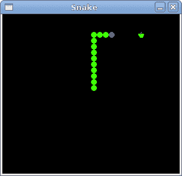

# PyGTK 中的蛇游戏

> 原文： [http://zetcode.com/gui/pygtk/snake/](http://zetcode.com/gui/pygtk/snake/)

在 PyGTK 编程教程的这一部分中，我们将创建一个 Snake 游戏克隆。

## 蛇游戏

Snake 是较旧的经典视频游戏。 它最初是在 70 年代后期创建的。 后来它被带到 PC 上。 在这个游戏中，玩家控制蛇。 目的是尽可能多地吃苹果。 蛇每次吃一个苹果，它的身体就会长大。 蛇必须避开墙壁和自己的身体。 该游戏有时称为 Nibbles 。

## 开发

蛇的每个关节的大小为 10px。 蛇由光标键控制。 最初，蛇具有三个关节。 游戏立即开始。 如果游戏结束，我们将在棋盘中间显示“ Game Over”消息。

`snake.py`

```
#!/usr/bin/python

# ZetCode PyGTK tutorial 
#
# This is a simple snake game
# clone
#
# author: jan bodnar
# website: zetcode.com 
# last edited: February 2009

import sys
import gtk
import cairo
import random
import glib

WIDTH = 300
HEIGHT = 270
DOT_SIZE = 10
ALL_DOTS = WIDTH * HEIGHT / (DOT_SIZE * DOT_SIZE)
RAND_POS = 26

x = [0] * ALL_DOTS
y = [0] * ALL_DOTS

class Board(gtk.DrawingArea):

    def __init__(self):
        super(Board, self).__init__()

        self.modify_bg(gtk.STATE_NORMAL, gtk.gdk.Color(0, 0, 0))
        self.set_size_request(WIDTH, HEIGHT)

        self.connect("expose-event", self.expose)

        self.init_game()

    def on_timer(self):

        if self.inGame:
            self.check_apple()
            self.check_collision()
            self.move()
            self.queue_draw()
            return True
        else:
            return False

    def init_game(self):

        self.left = False
        self.right = True
        self.up = False
        self.down = False
        self.inGame = True
        self.dots = 3

        for i in range(self.dots):
            x[i] = 50 - i * 10
            y[i] = 50

        try:
            self.dot = cairo.ImageSurface.create_from_png("dot.png")
            self.head = cairo.ImageSurface.create_from_png("head.png")
            self.apple = cairo.ImageSurface.create_from_png("apple.png")
        except Exception, e:
            print e.message
            sys.exit(1)

        self.locate_apple()
        glib.timeout_add(100, self.on_timer)

    def expose(self, widget, event):

        cr = widget.window.cairo_create()

        if self.inGame:
            cr.set_source_rgb(0, 0, 0)
            cr.paint()

            cr.set_source_surface(self.apple, self.apple_x, self.apple_y)
            cr.paint()

            for z in range(self.dots):
                if (z == 0): 
                    cr.set_source_surface(self.head, x[z], y[z])
                    cr.paint()
                else:
                    cr.set_source_surface(self.dot, x[z], y[z])                 
                    cr.paint()
        else:
            self.game_over(cr)

    def game_over(self, cr):

        w = self.allocation.width / 2
        h = self.allocation.height / 2

        (x, y, width, height, dx, dy) = cr.text_extents("Game Over")

        cr.set_source_rgb(65535, 65535, 65535)
        cr.move_to(w - width/2, h)
        cr.show_text("Game Over")
        self.inGame = False

    def check_apple(self):

        if x[0] == self.apple_x and y[0] == self.apple_y: 
            self.dots = self.dots + 1
            self.locate_apple()

    def move(self):

        z = self.dots

        while z > 0:
            x[z] = x[(z - 1)]
            y[z] = y[(z - 1)]
            z = z - 1

        if self.left:
            x[0] -= DOT_SIZE

        if self.right: 
            x[0] += DOT_SIZE

        if self.up:
            y[0] -= DOT_SIZE

        if self.down:
            y[0] += DOT_SIZE

    def check_collision(self):

        z = self.dots

        while z > 0:
            if z > 4 and x[0] == x[z] and y[0] == y[z]:
                self.inGame = False
            z = z - 1

        if y[0] > HEIGHT - DOT_SIZE: 
            self.inGame = False

        if y[0] < 0:
            self.inGame = False

        if x[0] > WIDTH - DOT_SIZE:
            self.inGame = False

        if x[0] < 0:
            self.inGame = False

    def locate_apple(self):

        r = random.randint(0, RAND_POS)
        self.apple_x = r * DOT_SIZE
        r = random.randint(0, RAND_POS)
        self.apple_y = r * DOT_SIZE

    def on_key_down(self, event): 

        key = event.keyval

        if key == gtk.keysyms.Left and not self.right: 
            self.left = True
            self.up = False
            self.down = False

        if key == gtk.keysyms.Right and not self.left:
            self.right = True
            self.up = False
            self.down = False

        if key == gtk.keysyms.Up and not self.down:
            self.up = True
            self.right = False
            self.left = False

        if key == gtk.keysyms.Down and not self.up: 
            self.down = True
            self.right = False
            self.left = False

class Snake(gtk.Window):

    def __init__(self):
        super(Snake, self).__init__()

        self.set_title('Snake')
        self.set_size_request(WIDTH, HEIGHT)
        self.set_resizable(False)
        self.set_position(gtk.WIN_POS_CENTER)

        self.board = Board()
        self.connect("key-press-event", self.on_key_down)
        self.add(self.board)

        self.connect("destroy", gtk.main_quit)
        self.show_all()

    def on_key_down(self, widget, event): 

        key = event.keyval
        self.board.on_key_down(event)

Snake()
gtk.main()

```

首先，我们将定义一些在游戏中使用的全局变量。

`WIDTH`和`HEIGHT`常数确定电路板的大小。 `DOT_SIZE`是苹果的大小和蛇的点。 `ALL_DOTS`常数定义了板上可能的最大点数。 `RAND_POS`常数用于计算苹果的随机位置。 `DELAY`常数确定游戏的速度。

```
x = [0] * ALL_DOTS
y = [0] * ALL_DOTS

```

这两个列表存储蛇的所有可能关节的 x，y 坐标。

`init_game()`方法初始化变量，加载图像并启动超时功能。

```
self.left = False
self.right = True
self.up = False
self.down = False
self.inGame = True
self.dots = 3

```

游戏开始时，蛇有三个关节。 而且它正在向右行驶。

在`move()`方法中，我们有游戏的密钥算法。 要了解它，请查看蛇的运动方式。 您控制蛇的头。 您可以使用光标键更改其方向。 其余关节在链上向上移动一个位置。 第二关节移动到第一个关节的位置，第三关节移动到第二个关节的位置，依此类推。

```
while z > 0:
    x[z] = x[(z - 1)]
    y[z] = y[(z - 1)]
    z = z - 1

```

该代码将关节向上移动。

```
if self.left:
    x[0] -= DOT_SIZE

```

将头向左移动。

在`checkCollision()`方法中，我们确定蛇是否击中了自己或撞墙之一。

```
while z > 0:
    if z > 4 and x[0] == x[z] and y[0] == y[z]:
        self.inGame = False
    z = z - 1

```

如果蛇用头撞到关节之一，我们就结束游戏。

```
if y[0] > HEIGHT - DOT_SIZE: 
    self.inGame = False

```

如果蛇击中了棋盘的底部，我们就结束了游戏。

`locate_apple()`方法在表格上随机定位一个苹果。

```
r = random.randint(0, RAND_POS)

```

我们得到一个从 0 到 RAND_POS-1 的随机数。

```
self.apple_x = r * DOT_SIZE
...
self.apple_y = r * DOT_SIZE

```

这些行设置了 apple 对象的 x，y 坐标。

```
    self.connect("key-press-event", self.on_key_down)
    ...

def on_key_down(self, widget, event): 

    key = event.keyval
    self.board.on_key_down(event)

```

我们在 Snake 类中捕获按键事件，并将处理委托给 board 对象。

在 Board 类的`on_key_dow()`方法中，我们确定玩家按下了哪些键。

```
if key == gtk.keysyms.Left and not self.right: 
    self.left = True
    self.up = False
    self.down = False

```

如果我们按左光标键，则将`self.left`变量设置为 True。 在`move()`方法中使用此变量来更改蛇对象的坐标。 还要注意，当蛇向右行驶时，我们不能立即向左转。



Figure: Snake

这是使用 PyGTK 编程库编程的 Snake 电脑游戏。