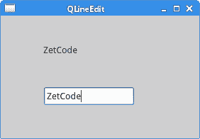
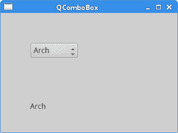

# PyQt5 小部件 II

> 原文： [http://zetcode.com/gui/pyqt5/widgets2/](http://zetcode.com/gui/pyqt5/widgets2/)

在这里，我们将继续介绍 PyQt5 小部件。 我们将介绍`QPixmap`，`QLineEdit`，`QSplitter`和`QComboBox`。

## `QPixmap`

`QPixmap`是用于处理图像的小部件之一。 它经过优化，可在屏幕上显示图像。 在我们的代码示例中，我们将使用`QPixmap`在窗口上显示图像。

`pixmap.py`

```py
#!/usr/bin/python3
# -*- coding: utf-8 -*-

"""
ZetCode PyQt5 tutorial 

In this example, we dispay an image
on the window. 

Author: Jan Bodnar
Website: zetcode.com 
Last edited: August 2017
"""

from PyQt5.QtWidgets import (QWidget, QHBoxLayout, 
    QLabel, QApplication)
from PyQt5.QtGui import QPixmap
import sys

class Example(QWidget):

    def __init__(self):
        super().__init__()

        self.initUI()

    def initUI(self):      

        hbox = QHBoxLayout(self)
        pixmap = QPixmap("redrock.png")

        lbl = QLabel(self)
        lbl.setPixmap(pixmap)

        hbox.addWidget(lbl)
        self.setLayout(hbox)

        self.move(300, 200)
        self.setWindowTitle('Red Rock')
        self.show()        

if __name__ == '__main__':

    app = QApplication(sys.argv)
    ex = Example()
    sys.exit(app.exec_())

```

在我们的示例中，我们在窗口上显示图像。

```py
pixmap = QPixmap("redrock.png")

```

我们创建一个`QPixmap`对象。 它以文件名作为参数。

```py
lbl = QLabel(self)
lbl.setPixmap(pixmap)

```

我们将像素图放入`QLabel`小部件。

## `QLineEdit`

`QLineEdit`是一个小部件，允许输入和编辑单行纯文本。 该小部件具有撤消和重做，剪切和粘贴以及拖放功能。

`lineedit.py`

```py
#!/usr/bin/python3
# -*- coding: utf-8 -*-

"""
ZetCode PyQt5 tutorial 

This example shows text which 
is entered in a QLineEdit
in a QLabel widget.

Author: Jan Bodnar
Website: zetcode.com 
Last edited: August 2017
"""

import sys
from PyQt5.QtWidgets import (QWidget, QLabel, 
    QLineEdit, QApplication)

class Example(QWidget):

    def __init__(self):
        super().__init__()

        self.initUI()

    def initUI(self):      

        self.lbl = QLabel(self)
        qle = QLineEdit(self)

        qle.move(60, 100)
        self.lbl.move(60, 40)

        qle.textChanged[str].connect(self.onChanged)

        self.setGeometry(300, 300, 280, 170)
        self.setWindowTitle('QLineEdit')
        self.show()

    def onChanged(self, text):

        self.lbl.setText(text)
        self.lbl.adjustSize()        

if __name__ == '__main__':

    app = QApplication(sys.argv)
    ex = Example()
    sys.exit(app.exec_())

```

此示例显示了行编辑小部件和标签。 我们在行编辑中键入的文本会立即显示在标签窗口小部件中。

```py
qle = QLineEdit(self)

```

`QLineEdit`小部件已创建。

```py
qle.textChanged[str].connect(self.onChanged)

```

如果行编辑窗口小部件中的文本更改，我们将调用`onChanged()`方法。

```py
def onChanged(self, text):

    self.lbl.setText(text)
    self.lbl.adjustSize() 

```

在`onChanged()`方法内部，我们将键入的文本设置为标签小部件。 我们调用`adjustSize()`方法将标签的大小调整为文本的长度。



图：`QLineEdit`

## `QSplitter`

`QSplitter`允许用户通过拖动子控件之间的边界来控制子控件的大小。 在我们的示例中，我们显示了由两个拆分器组成的三个`QFrame`小部件。

`splitter.py`

```py
#!/usr/bin/python3
# -*- coding: utf-8 -*-

"""
ZetCode PyQt5 tutorial 

This example shows
how to use QSplitter widget.

Author: Jan Bodnar
Website: zetcode.com 
Last edited: August 2017
"""

from PyQt5.QtWidgets import (QWidget, QHBoxLayout, QFrame, 
    QSplitter, QStyleFactory, QApplication)
from PyQt5.QtCore import Qt
import sys

class Example(QWidget):

    def __init__(self):
        super().__init__()

        self.initUI()

    def initUI(self):      

        hbox = QHBoxLayout(self)

        topleft = QFrame(self)
        topleft.setFrameShape(QFrame.StyledPanel)

        topright = QFrame(self)
        topright.setFrameShape(QFrame.StyledPanel)

        bottom = QFrame(self)
        bottom.setFrameShape(QFrame.StyledPanel)

        splitter1 = QSplitter(Qt.Horizontal)
        splitter1.addWidget(topleft)
        splitter1.addWidget(topright)

        splitter2 = QSplitter(Qt.Vertical)
        splitter2.addWidget(splitter1)
        splitter2.addWidget(bottom)

        hbox.addWidget(splitter2)
        self.setLayout(hbox)

        self.setGeometry(300, 300, 300, 200)
        self.setWindowTitle('QSplitter')
        self.show()

if __name__ == '__main__':

    app = QApplication(sys.argv)
    ex = Example()
    sys.exit(app.exec_())

```

在我们的示例中，我们有三个框架小部件和两个拆分器。 请注意，在某些主题下，拆分器可能无法很好地显示。

```py
topleft = QFrame(self)
topleft.setFrameShape(QFrame.StyledPanel)

```

我们使用样式化的框架以查看`QFrame`小部件之间的边界。

```py
splitter1 = QSplitter(Qt.Horizontal)
splitter1.addWidget(topleft)
splitter1.addWidget(topright)

```

我们创建一个`QSplitter`小部件，并在其中添加两个框架。

```py
splitter2 = QSplitter(Qt.Vertical)
splitter2.addWidget(splitter1)

```

我们还可以将拆分器添加到另一个拆分器小部件。


图：`QSplitter`小部件

## `QComboBox`

`QComboBox`是一个小部件，允许用户从选项列表中进行选择。

`combobox.py`

```py
#!/usr/bin/python3
# -*- coding: utf-8 -*-

"""
ZetCode PyQt5 tutorial 

This example shows how to use 
a QComboBox widget.

Author: Jan Bodnar
Website: zetcode.com 
Last edited: August 2017
"""

from PyQt5.QtWidgets import (QWidget, QLabel, 
    QComboBox, QApplication)
import sys

class Example(QWidget):

    def __init__(self):
        super().__init__()

        self.initUI()

    def initUI(self):      

        self.lbl = QLabel("Ubuntu", self)

        combo = QComboBox(self)
        combo.addItem("Ubuntu")
        combo.addItem("Mandriva")
        combo.addItem("Fedora")
        combo.addItem("Arch")
        combo.addItem("Gentoo")

        combo.move(50, 50)
        self.lbl.move(50, 150)

        combo.activated[str].connect(self.onActivated)        

        self.setGeometry(300, 300, 300, 200)
        self.setWindowTitle('QComboBox')
        self.show()

    def onActivated(self, text):

        self.lbl.setText(text)
        self.lbl.adjustSize()  

if __name__ == '__main__':

    app = QApplication(sys.argv)
    ex = Example()
    sys.exit(app.exec_())

```

该示例显示了`QComboBox`和`QLabel`。 组合框具有五个选项的列表。 这些是 Linux 发行版的名称。 标签窗口小部件显示从组合框中选择的选项。

```py
combo = QComboBox(self)
combo.addItem("Ubuntu")
combo.addItem("Mandriva")
combo.addItem("Fedora")
combo.addItem("Arch")
combo.addItem("Gentoo")

```

我们创建具有五个选项的`QComboBox`小部件。

```py
combo.activated[str].connect(self.onActivated) 

```

选择项目后，我们调用`onActivated()`方法。

```py
def onActivated(self, text):

    self.lbl.setText(text)
    self.lbl.adjustSize() 

```

在方法内部，我们将所选项目的文本设置为标签小部件。 我们调整标签的大小。



图：`QComboBox`

在 PyQt5 教程的这一部分中，我们介绍了`QPixmap`，`QLineEdit`，`QSplitter`和`QComboBox`。