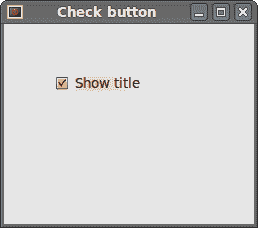
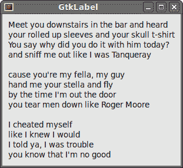
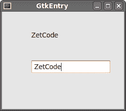
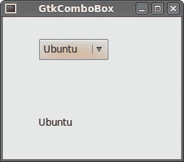

# PHP GTK 中的小部件

> 原文： [http://zetcode.com/gui/phpgtktutorial/widgets/](http://zetcode.com/gui/phpgtktutorial/widgets/)

在 PHP GTK 编程教程的这一部分中，我们将介绍一些小部件。

小部件是 GUI 应用程序的基本构建块。 多年来，几个小部件已成为所有 OS 平台上所有工具包中的标准。 例如，按钮，复选框或滚动条。 GTK 工具箱的理念是将小部件的数量保持在最低水平。 将创建更多专门的窗口小部件作为定制 GTK 窗口小部件。

## GtkCheckButton

`GtkCheckButton`是具有两种状态的窗口小部件：开和关。 接通状态通过复选标记显示。 它用来表示一些布尔属性。

```
<?php

/* 
ZetCode PHP GTK tutorial

This program toggles the title of the
window with the GtkCheckButton widget.

author: Jan Bodnar
website: www.zetcode.com
last modified: August 2011
*/

class Example extends GtkWindow { 

    public function __construct() { 

        parent::__construct(); 

        $this->init_ui();

    } 

    private function init_ui() {

        $this->set_title('Check button');         
        $this->connect_simple('destroy', array('gtk', 'main_quit')); 

        $fixed = new GtkFixed();
        $this->add($fixed);

        $cb = new GtkCheckButton("Show title");
        $cb->set_active(true);
        $cb->connect('clicked', array($this, 'on_clicked'));
        $fixed->put($cb, 50, 50);     

        $this->set_default_size(250, 200); 
        $this->set_position(GTK::WIN_POS_CENTER);
        $this->show_all();         
    }

    public function on_clicked($sender) {

        if ($sender->get_active()) {
            $this->set_title("Check button");
        } else {
            $this->set_title("");
        }         
    }
} 

new Example(); 
Gtk::main();

?>

```

根据`GtkCheckButton`的状态，我们将在窗口的标题栏中显示标题。

```
$cb = new GtkCheckButton("Show title");

```

`GtkCheckButton`小部件已创建。 小部件的构造函数采用一个参数，即标签。 标签显示在复选框旁边。

```
$cb->set_active(true);

```

默认情况下标题是可见的，因此我们默认情况下选中复选按钮。

```
$cb->connect('clicked', array($this, 'on_clicked'));

```

如果我们单击复选框小部件，则会发出单击的信号。 我们将`on_clicked()`方法挂接到信号上。

```
if ($sender->get_active()) {
    $this->set_title("Check button");
} else {
    $this->set_title("");
}     

```

如果选中该按钮，我们将显示标题。 `get_active()`方法用于确定检查按钮的状态。 `set_title()`方法用于设置窗口的标题。 为了清除窗口的标题，我们使用一个空字符串。



Figure: GtkCheckButton

## GtkLabel

`GtkLabel`小部件显示文本。 此小部件不支持用户交互。

```
<?php

/* 
ZetCode PHP GTK tutorial

In this example, we show a text on the
window. For this, we use the GtkLabel widget.

author: Jan Bodnar
website: www.zetcode.com
last modified: August 2011
*/

class Example extends GtkWindow { 

    public function __construct() { 

        parent::__construct(); 

        $this->init_ui();
    } 

    private function init_ui() {

        // no trailing white space!
        $lyrics = <<<LYRICS
Meet you downstairs in the bar and heard
your rolled up sleeves and your skull t-shirt
You say why did you do it with him today?
and sniff me out like I was Tanqueray

cause you're my fella, my guy
hand me your stella and fly
by the time I'm out the door
you tear men down like Roger Moore

I cheated myself
like I knew I would
I told ya, I was trouble
you know that I'm no good
LYRICS;

        $this->set_title('GtkLabel');         
        $this->connect_simple('destroy', array('gtk', 'main_quit')); 

        $this->set_border_width(10);
        $label = new GtkLabel($lyrics);
        $this->add($label);

        $this->set_default_size(250, 200); 
        $this->set_position(GTK::WIN_POS_CENTER);
        $this->show_all();         
    }
} 

new Example(); 
Gtk::main();

?>

```

该代码示例在窗口上显示了一些歌词。

```
    // no trailing white space!
    $lyrics = <<<LYRICS
Meet you downstairs in the bar and heard
your rolled up sleeves and your skull t-shirt

```

我们创建多行文本。 在 PHP 中，可以使用 Heredoc 语法创建多行文本。

```
$this->set_border_width(10);

```

`GtkLabel`周围有一些空白。

```
$label = new GtkLabel($lyrics);
$this->add($label);

```

`GtkLabel`小部件已创建并添加到窗口。



Figure: GtkLabel Widget

## GtkEntry

`GtkEntry`是单行文本输入字段。 该小部件用于输入文本数据。

```
<?php

/* 
ZetCode PHP GTK tutorial

This example demonstrates the GtkEntry widget.

author: Jan Bodnar
website: www.zetcode.com
last modified: August 2011
*/

class Example extends GtkWindow { 

    private $label;

    public function __construct() { 

        parent::__construct(); 

        $this->init_ui();

    } 

    private function init_ui() {

        $this->set_title('GtkEntry');         
        $this->connect_simple('destroy', array('gtk', 'main_quit')); 

        $fixed = new GtkFixed();              

        $this->label = new GtkLabel("...");
        $fixed->put($this->label, 60, 40);

        $entry = new GtkEntry();
        $fixed->put($entry, 60, 100);
        $entry->connect('key_release_event', array($this, 'on_key_release'));

        $this->add($fixed); 

        $this->set_default_size(250, 200); 
        $this->set_position(GTK::WIN_POS_CENTER);
        $this->show_all();         
    }

    public function on_key_release($sender, $event) {

        $this->label->set_text($sender->get_text());
    }
} 

new Example(); 
Gtk::main();

?>

```

此示例显示了条目小部件和标签。 我们输入的文本将立即显示在标签小部件中。

```
$entry = new GtkEntry();

```

`GtkEntry`小部件已创建。

```
$entry->connect('key_release_event', array($this, 'on_key_release'));

```

我们将 on_key_release（）方法插入`GtkEntry`小部件的`key_release_event`。

```
public function on_key_release($sender, $event) {

    $this->label->set_text($sender->get_text());
}

```

在该方法内部，我们通过`get_text()`方法从`GtkEntry`小部件中获取文本，并使用标签的`set_text()`方法将其设置为标签。



Figure: GtkEntry Widget

## Gtk 图片

`GtkImage`小部件显示图像。

```
<?php

/* 
ZetCode PHP GTK tutorial

This example demonstrates the GtkImage widget.

author: Jan Bodnar
website: www.zetcode.com
last modified: August 2011
*/

class Example extends GtkWindow { 

    public function __construct() { 

        parent::__construct(); 

        $this->init_ui();

    } 

    private function init_ui() {

        $this->set_title('Red Rock');         
        $this->connect_simple('destroy', array('gtk', 'main_quit')); 

        $this->set_border_width(2);
        $image = GtkImage::new_from_file("redrock.png");                        
        $this->add($image);

        $this->set_default_size(250, 200); 
        $this->set_position(GTK::WIN_POS_CENTER);
        $this->show_all();         
    }
} 

new Example(); 
Gtk::main();

?>

```

在我们的示例中，我们在窗口上显示图像。

```
$this->set_border_width(2);

```

我们在图像周围放置了一些空边框。

```
$image = GtkImage::new_from_file("redrock.png");

```

`GtkImage`小部件已创建。 我们使用静态`new_from_file()`方法从文件加载图像。 如果找不到或无法加载文件，则生成的`GtkImage`将显示损坏的图像图标。

```
$this->add($image);

```

窗口小部件已添加到容器中。

## Gtk 组合框

`ComboBox`是一个小部件，允许用户从选项列表中进行选择。

```

<?php

/* 
ZetCode PHP GTK tutorial

This example demonstrates the GtkComboBox widget

author: Jan Bodnar
website: www.zetcode.com
last modified: August 2011
*/

class Example extends GtkWindow { 

    private $label;

    public function __construct() { 

        parent::__construct(); 

        $this->init_ui();

    } 

    private function init_ui() {

        $this->set_title('GtkComboBox');         
        $this->connect_simple('destroy', array('gtk', 'main_quit')); 

        $fixed = new GtkFixed();
        $this->label = new GtkLabel('-');
        $fixed->put($this->label, 50, 140);

        $cb = GtkComboBox::new_text();
        $cb->connect('changed', array($this, 'on_changed'));

        $cb->append_text('Ubuntu');
        $cb->append_text('Mandriva');
        $cb->append_text('Redhat');
        $cb->append_text('Gentoo');
        $cb->append_text('Mint');

        $fixed->put($cb, 50, 30);

        $this->add($fixed);

        $this->set_default_size(250, 200); 
        $this->set_position(GTK::WIN_POS_CENTER);
        $this->show_all();         
    }

    public function on_changed($sender) {
        $this->label->set_label($sender->get_active_text());
    }
} 

new Example(); 
Gtk::main();

?>

```

该示例显示了一个组合框和一个标签。 组合框具有五个选项的列表。 这些是 Linux 发行版的名称。 标签窗口小部件显示了从组合框中选择的选项。

```
$cb = GtkComboBox::new_text();

```

`GtkComboBox`小部件已创建。 `new_text()`是创建仅显示字符串的`GtkComboBox`的方法。

```
$cb->append_text('Ubuntu');
$cb->append_text('Mandriva');
$cb->append_text('Redhat');
$cb->append_text('Gentoo');
$cb->append_text('Mint');

```

它充满了数据。

```
public function on_changed($sender) {
    $this->label->set_label($sender->get_active_text());
}

```

在`on_changed()`方法内部，我们从组合框中获取选定的文本并将其设置为标签。



Figure: GtkComboBox

在 PHP GTK 教程的这一章中，我们展示了一些基本的小部件。