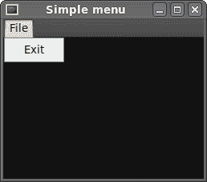
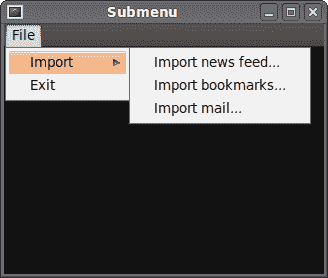
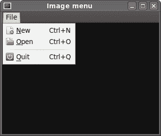
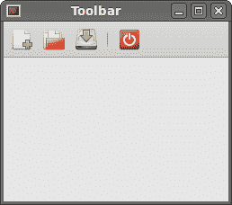

# PHP GTK 中的菜单&工具栏

> 原文： [http://zetcode.com/gui/phpgtktutorial/menustoolbars/](http://zetcode.com/gui/phpgtktutorial/menustoolbars/)

在 PHP GTK 编程教程的这一部分中，我们将使用菜单&工具栏。

GUI 应用程序中的常见部分是菜单栏。 菜单栏由称为菜单的对象组成。 顶层菜单在菜单栏上带有其标签。 菜单具有菜单项。 菜单项是在应用程序内部执行特定操作的命令。 菜单也可以具有子菜单，这些子菜单具有自己的菜单项。

## 简单菜单

在第一个示例中，我们将创建一个带有一个文件菜单的菜单栏。 该菜单将只有一个菜单项。 通过选择项目，应用程序退出。

```
<?php

/* 
ZetCode PHP GTK tutorial

This example shows a simple menu.

author: Jan Bodnar
website: www.zetcode.com
last modified: August 2011
*/

class Example extends GtkWindow { 

    public function __construct() { 

        parent::__construct(); 

        $this->init_ui();

    } 

    public function init_ui() {

        $this->set_title('Simple menu');         
        $this->connect_simple('destroy', array('gtk', 'main_quit')); 

        $this->modify_bg(Gtk::STATE_NORMAL, new GdkColor(6400, 6400, 6440));

        $mb = new GtkMenuBar();

        $filemenu = new GtkMenu();
        $filemi = new GtkMenuItem("File");
        $filemi->set_submenu($filemenu);

        $exitmi = new GtkMenuItem("Exit");
        $exitmi->connect_simple('activate', array('gtk', 'main_quit'));              
        $filemenu->append($exitmi);

        $mb->append($filemi);

        $vbox = new GtkVBox(false, 2);
        $vbox->pack_start($mb, false, false, 0);

        $this->add($vbox);

        $this->set_default_size(250, 200); 
        $this->set_position(GTK::WIN_POS_CENTER);
        $this->show_all();         
    }
} 

new Example(); 
Gtk::main();

?>

```

这是一个最小的菜单栏功能示例。

```
$mb = new GtkMenuBar();

```

`GtkMenuBar`小部件已创建。 这是各个菜单的容器。

```
$filemenu = new GtkMenu();
$filemi = new GtkMenuItem("File");
$filemi->set_submenu($filemenu);

```

创建顶层`GtkMenuItem`。 菜单项代表 GUI 应用程序中的操作。

```
$exitmi = new GtkMenuItem("Exit");
$exitmi->connect_simple('activate', array('gtk', 'main_quit'));              
$filemenu->append($exitmi);

```

将创建出口`GtkMenuItem`，并将其附加到文件`GtkMenuItem`中。

```
$mb->append($filemi);

```

顶级`GtkMenuItem`被附加到`GtkMenuBar`小部件。

```
$vbox = new GtkVBox(false, 2);
$vbox->pack_start($mb, false, false, 0);

```

与其他工具包不同，我们必须自己照顾菜单栏的布局管理。 我们将菜单栏放入垂直框中。



Figure: Simple menu

## 子菜单

我们的最后一个示例演示了如何创建子菜单。 子菜单是另一个菜单中的菜单。

```
<?php

/* 
ZetCode PHP GTK tutorial

This example shows a submenu.

author: Jan Bodnar
website: www.zetcode.com
last modified: August 2011
*/

class Example extends GtkWindow { 

    public function __construct() { 

        parent::__construct(); 

        $this->init_ui();

    } 

    public function init_ui() {

        $this->set_title('Submenu');         
        $this->connect_simple('destroy', array('gtk', 'main_quit')); 

        $this->modify_bg(Gtk::STATE_NORMAL, new GdkColor(6400, 6400, 6440));

        $mb = new GtkMenuBar();

        $filemenu = new GtkMenu();
        $filemi = new GtkMenuItem("File");
        $filemi->set_submenu($filemenu);

        $mb->append($filemi);

        $imenu = new GtkMenu();

        $importm = new GtkMenuItem("Import");
        $importm->set_submenu($imenu);

        $inews = new GtkMenuItem("Import news feed...");
        $ibookmarks = new GtkMenuItem("Import bookmarks...");
        $imail = new GtkMenuItem("Import mail...");

        $imenu->append($inews);
        $imenu->append($ibookmarks);
        $imenu->append($imail);

        $filemenu->append($importm);

        $exitmi = new GtkMenuItem("Exit");
        $exitmi->connect_simple('activate', array('gtk', 'main_quit'));

        $filemenu->append($exitmi);

        $vbox = new GtkVBox(false, 2);
        $vbox->pack_start($mb, false, false, 0);

        $this->add($vbox);

        $this->set_default_size(320, 250); 
        $this->set_position(GTK::WIN_POS_CENTER);
        $this->show_all();         
    }
} 

new Example(); 
Gtk::main();

?>

```

子菜单创建。

```
$imenu = new GtkMenu();

```

子菜单是常规`GtkMenu`。

```
$importm = new GtkMenuItem("Import");
$importm->set_submenu($imenu);

```

它是菜单项的子菜单，它会登录到顶级文件菜单。

```
$inews = new GtkMenuItem("Import news feed...");
$ibookmarks = new GtkMenuItem("Import bookmarks...");
$imail = new GtkMenuItem("Import mail...");

$imenu->append($inews);
$imenu->append($ibookmarks);
$imenu->append($imail);

```

子菜单有其自己的菜单项。



Figure: Submenu

## 图像菜单

在下一个示例中，我们将进一步探索菜单。 我们将图像和加速器添加到我们的菜单项中。 加速器是用于激活菜单项的键盘快捷键。

```
<?php

/* 
ZetCode PHP GTK tutorial

This example shows a menu with
images, accelerators and a separator.

author: Jan Bodnar
website: www.zetcode.com
last modified: August 2011
*/

class Example extends GtkWindow { 

    public function __construct() { 

        parent::__construct(); 

        $this->init_ui();

    } 

    public function init_ui() {

        $this->set_title('Image menu');         
        $this->connect_simple('destroy', array('gtk', 'main_quit')); 

        $this->modify_bg(Gtk::STATE_NORMAL, new GdkColor(6400, 6400, 6440));

        $mb = new GtkMenuBar();

        $filemenu = new GtkMenu();
        $filemi = new GtkMenuItem("File");
        $filemi->set_submenu($filemenu);

        $mb->append($filemi);

        $agr = new GtkAccelGroup();
        $this->add_accel_group($agr);

        $newi = new GtkImageMenuItem(Gtk::STOCK_NEW, $agr);
        $newi->add_accelerator('activate', $agr, Gdk::KEY_N, 
             Gdk::CONTROL_MASK, Gtk::ACCEL_VISIBLE);
        $newi->connect_simple('activate', array($this, 'on_new_selected')); 
        $filemenu->append($newi);

        $openmi = new GtkImageMenuItem(Gtk::STOCK_OPEN, $agr);
        $openmi->add_accelerator('activate', $agr, Gdk::KEY_O, 
             Gdk::CONTROL_MASK, Gtk::ACCEL_VISIBLE);
        $filemenu->append($openmi);

        $sep = new GtkSeparatorMenuItem();
        $filemenu->append($sep);

        $exitmi = new GtkImageMenuItem(Gtk::STOCK_QUIT, $agr);
        $exitmi->add_accelerator('activate', $agr, Gdk::KEY_Q, 
             Gdk::CONTROL_MASK, Gtk::ACCEL_VISIBLE);
        $exitmi->connect_simple('activate', array('gtk', 'main_quit'));     
        $filemenu->append($exitmi);       

        $vbox = new GtkVBox(false, 2);
        $vbox->pack_start($mb, false, false, 0);

        $this->add($vbox);

        $this->set_default_size(320, 250); 
        $this->set_position(GTK::WIN_POS_CENTER);
        $this->show_all();         
    }

    public function on_new_selected() {
        print "new";
    }

} 

new Example(); 
Gtk::main();

?>

```

我们的示例显示了具有三个子菜单项的顶级菜单项。 每个菜单项都有一个图像和一个加速器。 退出菜单项的加速器退出应用程序。 新菜单项的加速器将“ new”打印到控制台。

```
$agr = new GtkAccelGroup();
$this->add_accel_group($agr);

```

要使用加速器，我们创建一个全局`GtkAccelGroup`对象。 稍后将使用。

```
$newi = new GtkImageMenuItem(Gtk::STOCK_NEW, $agr);
$newi->add_accelerator('activate', $agr, Gdk::KEY_N, 
      Gdk::CONTROL_MASK, Gtk::ACCEL_VISIBLE);
$newi->connect_simple('activate', array($this, 'on_new_selected')); 
$filemenu->append($newi);

```

创建了`GtkImageMenuItem`。 图片来自图片库。 我们还创建了 `Ctrl` + `N` 加速器。 当我们用鼠标选择菜单项或按下加速器时，一条消息会打印到控制台上。

```
$sep = new GtkSeparatorMenuItem();
$filemenu->append($sep);

```

这些行创建一个分隔符。 它用于将菜单项放入逻辑组。



Figure: Image menu

菜单将我们可以在应用程序中使用的命令分组。 使用工具栏可以快速访问最常用的命令。

## 简单的工具栏

接下来，我们创建一个简单的工具栏。 工具栏提供对应用程序最常用功能的快速访问。

```
<?php

/* 
ZetCode PHP GTK tutorial

This example shows a toolbar widget.

author: Jan Bodnar
website: www.zetcode.com
last modified: August 2011
*/

class Example extends GtkWindow { 

    public function __construct() { 

        parent::__construct(); 

        $this->init_ui();

    } 

    public function init_ui() {

        $this->set_title('Toolbar');         
        $this->connect_simple('destroy', array('gtk', 'main_quit')); 

        $toolbar = new GtkToolbar();
        $toolbar->set_toolbar_style(Gtk::TOOLBAR_ICONS);

        $newtb = GtkToolButton::new_from_stock(Gtk::STOCK_NEW);
        $opentb = GtkToolButton::new_from_stock(Gtk::STOCK_OPEN);
        $savetb = GtkToolButton::new_from_stock(Gtk::STOCK_SAVE);
        $sep = new GtkSeparatorToolItem();
        $quittb = GtkToolButton::new_from_stock(Gtk::STOCK_QUIT);

        $toolbar->insert($newtb, 0);
        $toolbar->insert($opentb, 1);
        $toolbar->insert($savetb, 2);
        $toolbar->insert($sep, 3);
        $toolbar->insert($quittb, 4);

        $quittb->connect_simple("clicked", array('Gtk', 'main_quit'));

        $vbox = new GtkVBox(false, 2);
        $vbox->pack_start($toolbar, false, false, 0);

        $this->add($vbox);

        $this->set_default_size(250, 200); 
        $this->set_position(GTK::WIN_POS_CENTER);
        $this->show_all();         
    }
} 

new Example(); 
Gtk::main();

?>

```

该示例显示了一个工具栏和四个工具按钮。

```
$toolbar = new GtkToolbar();

```

`GtkToolbar`小部件已创建。

```
$toolbar->set_toolbar_style(Gtk::TOOLBAR_ICONS);

```

在工具栏上，我们仅显示图标。 没有文字。

```
$newtb = GtkToolButton::new_from_stock(Gtk::STOCK_NEW);

```

创建带有库存图像的`GtkToolButton`。 该图像来自图像的内置库存。

```
$sep = new GtkSeparatorToolItem();

```

这是一个分隔符。 它可用于将工具栏按钮放入逻辑组。

```
$toolbar->insert($newtb, 0);
$toolbar->insert($opentb, 1);
...

```

工具栏按钮插入到工具栏小部件中。 `insert()`方法的第一个参数是工具按钮。 第二个是工具栏上的位置。



Figure: Toolbar

在 PHP GTK 教程的这一章中，我们展示了如何使用菜单&工具栏。