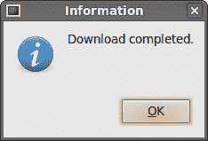
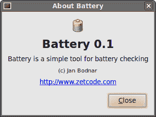
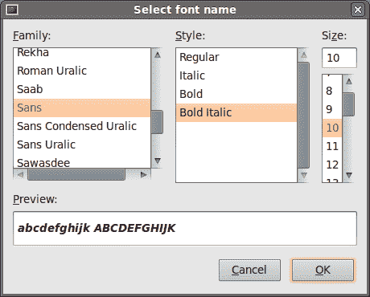

# 对话方块

> 原文： [http://zetcode.com/gui/phpgtktutorial/dialogs/](http://zetcode.com/gui/phpgtktutorial/dialogs/)

在 PHP GTK 编程教程的这一部分中，我们将介绍对话框。

对话框窗口或对话框是大多数现代 GUI 应用程序必不可少的部分。 对话被定义为两个或更多人之间的对话。 在计算机应用程序中，对话框是一个窗口，用于与应用程序“对话”。 对话框用于输入数据，修改数据，更改应用程序设置等。对话框是用户与计算机程序之间进行通信的重要手段。

## GtkMessageDialog

消息对话框是方便的对话框，可向应用程序的用户提供消息。 该消息包含文本和图像数据。 `GtkMessageDialog`用于创建消息对话框。

```
<?php

/* 
ZetCode PHP GTK tutorial

This example demonstrates a
GtkMessageDialog.

author: Jan Bodnar
website: www.zetcode.com
last modified: September 2011
*/

class Example extends GtkWindow { 

    public function __construct() { 

        parent::__construct(); 

        $this->init_ui();

    } 

    public function init_ui() {

        $this->set_title('GtkMessageDialog');         
        $this->connect_simple('destroy', array('gtk', 'main_quit')); 

        $fixed = new GtkFixed();              

        $button = new GtkButton("Information");
        $button->set_size_request($button->size_request());
        $button->connect('clicked', array($this, 'on_clicked'));

        $fixed->put($button, 50, 50);
        $this->add($fixed); 

        $this->set_default_size(250, 200); 
        $this->set_position(GTK::WIN_POS_CENTER);
        $this->show_all();         
    }

    public function on_clicked($sender) {

            $md = new GtkMessageDialog($this, Gtk::DIALOG_MODAL,
                Gtk::MESSAGE_INFO, Gtk::BUTTONS_OK, "Download completed.");
            $md->set_title("Information");    
            $md->run();
            $md->destroy();
    }
} 

new Example(); 
Gtk::main();

?>

```

我们在窗口上显示一个按钮。 当我们单击按钮时，会显示一条信息消息。

```
$button = new GtkButton("Information");

```

这是一个按钮，当我们单击它时将显示一个对话框。

```
public function on_clicked($sender) {

        $md = new GtkMessageDialog($this, Gtk::DIALOG_MODAL,
            Gtk::MESSAGE_INFO, Gtk::BUTTONS_OK, "Download completed.");
        $md->set_title("Information");    
        $md->run();
        $md->destroy();
}

```

如果单击信息按钮，将显示“信息”对话框。 `Gtk::DIALOG_MODAL`标志使对话框变为模态。 `Gtk::MESSAGE_INFO`指定对话框的类型。 在我们的情况下，这是一个信息对话框。 为各种对话框类型选择了不同的图标。 `Gtk::BUTTONS_OK`在对话框上显示确定按钮。 最后一个参数是显示的消息。 我们使用`set_title()`方法设置对话框的标题。 该对话框使用`run()`方法显示。 程序员还必须最后调用`destroy()`或`hide()`方法。



Figure: Information message dialog

## GtkAboutDialog

`GtkAboutDialog`显示有关应用程序的信息。 它可以显示徽标，应用程序名称，版本，版权，网站或许可证信息。 也有可能对作者，文档撰写者，翻译者和艺术家予以赞扬。

```
<?php

/* 
ZetCode PHP GTK tutorial

This example demonstrates the
AboutDialog dialog.

author: Jan Bodnar
website: www.zetcode.com
last modified: September 2011
*/

class Example extends GtkWindow { 

    public function __construct() { 

        parent::__construct(); 

        $this->init_ui();

    } 

    public function init_ui() {

        $this->set_title('About Battery');         
        $this->connect_simple('destroy', array('gtk', 'main_quit')); 

        $fixed = new GtkFixed();              

        $button = new GtkButton("About");
        $button->set_size_request(80, 30);
        $button->connect('clicked', array($this, 'on_clicked'));

        $fixed->put($button, 50, 50);
        $this->add($fixed); 

        $this->set_default_size(250, 200); 
        $this->set_position(GTK::WIN_POS_CENTER);
        $this->show_all();         
    }

    public function on_clicked($sender) {

        $about = new GtkAboutDialog();
        $about->set_program_name("Battery");
        $about->set_version("0.1");
        $about->set_copyright("(c) Jan Bodnar");
        $about->set_comments("Battery is a simple tool for battery checking");
        $about->set_website("http://www.zetcode.com");
        $about->set_logo(GdkPixbuf::new_from_file("battery.png"));
        $about->run();
        $about->destroy();
    }

} 

new Example(); 
Gtk::main();

?>

```

该代码示例使用具有某些功能的`GtkAboutDialog`。

```
$about = new GtkAboutDialog();

```

我们创建`GtkAboutDialog`的实例。

```
$about->set_program_name("Battery");
$about->set_version("0.1");
$about->set_copyright("(c) Jan Bodnar");

```

在这里，我们指定程序的名称，版本和版权。

```
$about->set_logo(GdkPixbuf::new_from_file("battery.png"));

```

此行创建徽标。



Figure: GtkAboutDialog

## GtkFontSelectionDialog

`GtkFontSelectionDialog`是用于选择字体的对话框。 它通常用于进行一些文本编辑或格式化的应用程序中。

```
<?php

/* 
ZetCode PHP GTK tutorial

In this example, we change the font
of a label with the GtkFontSelectionDialog.

author: Jan Bodnar
website: www.zetcode.com
last modified: September 2011
*/

class Example extends GtkWindow { 

    private $label;

    public function __construct() { 

        parent::__construct(); 

        $this->init_ui();

    } 

    private function init_ui() {

        $this->set_title('FontSelectionDialog');         
        $this->connect_simple('destroy', array('gtk', 'main_quit')); 

        $this->set_border_width(10);
        $this->label = new GtkLabel("The only victory over love is flight.");
        $button = new GtkButton("Select font");
        $button->connect('clicked', array($this, 'on_clicked'));

        $fixed = new GtkFixed();
        $fixed->put($button, 100, 30);
        $fixed->put($this->label, 30, 90);
        $this->add($fixed);

        $this->set_default_size(350, 200); 
        $this->set_position(GTK::WIN_POS_CENTER);
        $this->show_all();         
    }

    public function on_clicked($sender) {

        $fdia = new GtkFontSelectionDialog("Select font name");
        $response = $fdia->run();

        if ($response == Gtk::RESPONSE_OK) {

            $font_desc = new PangoFontDescription($fdia->get_font_name());
            print($fdia->get_font_name());
            if ($font_desc) {
                $this->label->modify_font($font_desc);
            }

        }

        $fdia->destroy();
    }
} 

new Example(); 
Gtk::main();

?>

```

在代码示例中，我们有一个按钮和一个标签。 单击按钮显示`GtkFontSelectionDialog`。

```
$fdia = new GtkFontSelectionDialog("Select font name");

```

我们创建`GtkFontSelectionDialog`。

```
if ($response == Gtk::RESPONSE_OK) {

    $font_desc = new PangoFontDescription($fdia->get_font_name());
    print($fdia->get_font_name());
    if ($font_desc) {
        $this->label->modify_font($font_desc);
    }

}

```

如果单击“确定”按钮，则标签小部件的字体将更改为我们在对话框中选择的字体。



Figure: GtkFontSelectionDialog

## GtkColorSelectionDialog

`GtkColorSelectionDialog`是用于选择颜色的对话框。

```
<?php

/* 
ZetCode PHP GTK tutorial

This example works with the
GtkColorSelectionDialog.

author: Jan Bodnar
website: www.zetcode.com
last modified: August 2011
*/

class Example extends GtkWindow { 

    private $label;

    public function __construct() { 

        parent::__construct(); 

        $this->init_ui();

    } 

    private function init_ui() {

        $this->set_title('GtkColorSelectionDialog');         
        $this->connect_simple('destroy', array('gtk', 'main_quit')); 

        $this->set_border_width(10);
        $this->label = new GtkLabel("The only victory over love is flight.");
        $button = new GtkButton("Select color");
        $button->connect('clicked', array($this, 'on_clicked'));

        $fixed = new GtkFixed();
        $fixed->put($button, 100, 30);
        $fixed->put($this->label, 30, 90);
        $this->add($fixed);

        $this->set_default_size(350, 200); 
        $this->set_position(GTK::WIN_POS_CENTER);
        $this->show_all();         
    }

    public function on_clicked($sender) {

        $cdia = new GtkColorSelectionDialog("Select color");
        $response = $cdia->run();

        if ($response == Gtk::RESPONSE_OK) {
            $colorsel = $cdia->colorsel;
            $color = $colorsel->get_current_color();
            $this->label->modify_fg(Gtk::STATE_NORMAL, $color);
        }

        $cdia->destroy();
    }
} 

new Example(); 
Gtk::main();

?>

```

该示例与上一个示例非常相似。 这次我们更改标签的颜色。

```
$cdia = new GtkColorSelectionDialog("Select color");
$response = $cdia->run();

```

我们创建并运行`GtkFontSelectionDialog`。

```
if ($response == Gtk::RESPONSE_OK) {
    $colorsel = $cdia->colorsel;
    $color = $colorsel->get_current_color();
    $this->label->modify_fg(Gtk::STATE_NORMAL, $color);
}

```

如果用户按下 OK，我们将获得颜色值并修改标签的颜色。

在 PHP GTK 教程的这一部分中，我们介绍了对话框。