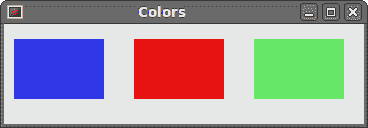
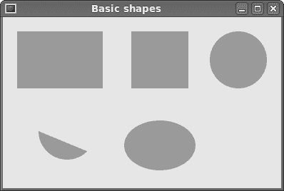
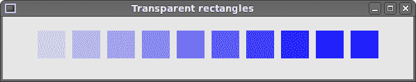
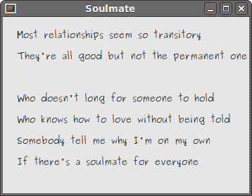

# Cario 绘图

> 原文： [http://zetcode.com/gui/phpgtktutorial/cairo/](http://zetcode.com/gui/phpgtktutorial/cairo/)

在 PHP GTK 教程的这一部分中，我们将使用 Cairo 库进行一些绘图。 目前，Seed 仅支持 Cario 库的一小部分。

Cairo 是用于创建 2D 矢量图形的库。 我们可以使用它来绘制自己的小部件，图表或各种效果或动画。

Cairo for PHP 是与 PHP GTK 分开的项目。 除了 PHP GTK，我们还需要安装 Cairo。 在构建库之前，我们必须在系统上安装`libcairo2-dev`软件包。

```php
svn co http://svn.php.net/repository/pecl/cairo/trunk cairo
cd cairo/
$ phpize5
$ ./configure 
$ make
$ make install

```

在创建本教程时，以上命令用于为 PHP 安装 Cairo。

最后，在安装 Cairo 之后，我们需要为我们的 PHP 脚本启用 Cairo 库。

```php
$ sudo vi /etc/php5/cli/php.ini 

;;;;;;;;;;;;;;;;;;;;;;
; Dynamic Extensions ;
;;;;;;;;;;;;;;;;;;;;;;

;
extension=php_gtk2.so
extension=cairo.so

```

我们编辑`php.ini`文件并添加 Cairo 动态扩展。

## 色彩

在第一个示例中，我们将处理颜色。 颜色是代表红色，绿色和蓝色（RGB）强度值的组合的对象。 Cario 有效 RGB 值在 0 到 1 的范围内。

```php
<?php

/* 
ZetCode PHP GTK tutorial

In this program, we will draw three
colored rectangles on the drawing area
using Cairo.

author: Jan Bodnar
website: www.zetcode.com
last modified: August 2011
*/

class Example extends GtkWindow { 

    public function __construct() { 

        parent::__construct(); 

        $this->init_ui();

    } 

    public function init_ui() {

        $this->set_title('Colors');         
        $this->connect_simple('destroy', array('gtk', 'main_quit')); 

        $darea = new GtkDrawingArea();
        $darea->connect('expose_event', array($this, 'on_expose')); 

        $this->add($darea);    

        $this->set_default_size(360, 100); 
        $this->set_position(GTK::WIN_POS_CENTER);
        $this->show_all();         
    }

    public function on_expose($darea, $event) {

            $cr = $darea->window->cairo_create();
            $this->draw_colors($cr);        

    }

    public function draw_colors($cr) {

        $cr->setSourceRgb(0.2, 0.23, 0.9);
        $cr->rectangle(10, 15, 90, 60);
        $cr->fill();

        $cr->setSourceRgb(0.9, 0.1, 0.1);
        $cr->rectangle(130, 15, 90, 60);
        $cr->fill();

        $cr->setSourceRgb(0.4, 0.9, 0.4);
        $cr->rectangle(250, 15, 90, 60);
        $cr->fill();            
    }   
} 

new Example(); 
Gtk::main();

?>

```

在我们的示例中，我们将绘制三个矩形，并用三种不同的颜色填充它们。

```php
$darea = new GtkDrawingArea();

```

我们将在`GtkDrawingArea`小部件上进行绘制操作。

```php
$darea->connect('expose_event', array($this, 'on_expose')); 

```

当需要重绘窗口时，将触发`expose_event`。 为响应此事件，我们调用`on_expose()`方法。

```php
$cr = $darea->window->cairo_create();

```

我们从绘图区域的`GdkWindow`创建 cairo 上下文对象。 上下文是我们绘制所有图纸的对象。

```php
$this->draw_colors($cr);   

```

实际图形委托给`draw_colors()`方法。

```php
$cr->setSourceRgb(0.2, 0.23, 0.9);

```

`setSourceRgb()`方法为 Cario 上下文设置颜色。 该方法的三个参数是颜色强度值。

```php
$cr->rectangle(10, 15, 90, 60);

```

我们画一个矩形。 前两个参数是矩形左上角的 x，y 坐标。 最后两个参数是矩形的宽度和高度。

```php
$cr->fill();

```

我们用当前颜色填充矩形的内部。



Figure: Colors

## 基本形状

下一个示例将一些基本形状绘制到窗口上。

```php
<?php

/* 
ZetCode PHP GTK tutorial

This code example draws basic shapes
with the Cairo library.

author: Jan Bodnar
website: www.zetcode.com
last modified: August 2011
*/

class Example extends GtkWindow { 

    public function __construct() { 

        parent::__construct(); 

        $this->init_ui();

    } 

    public function init_ui() {

        $this->set_title('Basic shapes');         
        $this->connect_simple('destroy', array('gtk', 'main_quit')); 

        $darea = new GtkDrawingArea();
        $darea->connect('expose_event', array($this, 'on_expose')); 

        $this->add($darea);    

        $this->set_default_size(390, 240); 
        $this->set_position(GTK::WIN_POS_CENTER);
        $this->show_all();         
    }

    public function on_expose($darea, $event) {

        $cr = $darea->window->cairo_create();
        $this->draw_shapes($cr);        

    }

    public function draw_shapes($cr) {

        $cr->SetSourceRgb(0.6, 0.6, 0.6);

        $cr->rectangle(20, 20, 120, 80);
        $cr->rectangle(180, 20, 80, 80);
        $cr->fill();

        $cr->arc(330, 60, 40, 0, 2*M_PI);
        $cr->fill();

        $cr->arc(90, 160, 40, M_PI/4, M_PI);
        $cr->fill();

        $cr->translate(220, 180);
        $cr->scale(1, 0.7);
        $cr->arc(0, 0, 50, 0, 2*M_PI);
        $cr->fill();          
    }   
} 

new Example(); 
Gtk::main();

?>

```

在此示例中，我们将创建一个矩形，一个正方形，一个圆形，一个弧形和一个椭圆形。 我们用蓝色绘制轮廓，内部用白色绘制。

```php
$cr->rectangle(20, 20, 120, 80);
$cr->rectangle(180, 20, 80, 80);
$cr->fill();

```

这些线绘制一个矩形和一个正方形。

```php
$cr->arc(330, 60, 40, 0, 2*M_PI);
$cr->fill();

```

此处`arc()`方法绘制一个完整的圆。

```php
$cr->translate(220, 180);
$cr->scale(1, 0.7);
$cr->arc(0, 0, 50, 0, 2*M_PI);
$cr->fill();  

```

`translate()`方法将对象移动到特定点。 如果要绘制椭圆形，请先进行一些缩放。 在这里`scale()`方法缩小 y 轴。



Figure: Basic shapes

## 透明矩形

透明性是指能够透视材料的质量。 了解透明度的最简单方法是想象一块玻璃或水。 从技术上讲，光线可以穿过玻璃，这样我们就可以看到玻璃后面的物体。

在计算机图形学中，我们可以使用 alpha 合成来实现透明效果。 Alpha 合成是将图像与背景组合以创建部分透明外观的过程。 合成过程使用 Alpha 通道。 （wikipedia.org，answers.com）

```php
<?php

/* 
ZetCode PHP GTK tutorial

This code example draws nine rectangles
with different levels of transparency.

author: Jan Bodnar
website: www.zetcode.com
last modified: August 2011
*/

class Example extends GtkWindow { 

    public function __construct() { 

        parent::__construct(); 

        $this->init_ui();

    } 

    public function init_ui() {

        $this->set_title('Transparent rectangles');         
        $this->connect_simple('destroy', array('gtk', 'main_quit')); 

        $darea = new GtkDrawingArea();
        $darea->connect('expose_event', array($this, 'on_expose')); 

        $this->add($darea);    

        $this->set_default_size(590, 90); 
        $this->set_position(GTK::WIN_POS_CENTER);
        $this->show_all();         
    }

    public function on_expose($darea, $event) {

        $cr = $darea->window->cairo_create();
        $this->draw_recs($cr);        

    }

    public function draw_recs($cr) {

        for ($i=1; $i<=10; $i++) {
            $cr->SetSourceRgba(0, 0, 1, $i*0.1);
            $cr->rectangle(50*$i, 20, 40, 40);
            $cr->fill();
        }     
    }   
} 

new Example(); 
Gtk::main();

?>

```

在示例中，我们将绘制十个具有不同透明度级别的矩形。

```php
$cr->SetSourceRgba(0, 0, 1, $i*0.1);

```

`set_source_rgba()`方法的最后一个参数是 alpha 透明度。



Figure: Transparent rectangles

## 甜甜圈

在下面的示例中，我们通过旋转一堆椭圆来创建复杂的形状。

```php

<?php

/* 
ZetCode PHP GTK tutorial

In this program, we draw a donut shape
by rotating a bunch of ellipses. 

author: Jan Bodnar
website: www.zetcode.com
last modified: August 2011
*/

class Example extends GtkWindow { 

    public function __construct() { 

        parent::__construct(); 

        $this->init_ui();

    } 

    public function init_ui() {

        $this->set_title('Donut');         
        $this->connect_simple('destroy', array('gtk', 'main_quit')); 

        $darea = new GtkDrawingArea();
        $darea->connect('expose_event', array($this, 'on_expose')); 

        $this->add($darea);    

        $this->set_default_size(350, 250); 
        $this->set_position(GTK::WIN_POS_CENTER);
        $this->show_all();         
    }

    public function on_expose($darea, $event) {

            $cr = $darea->window->cairo_create();
            $this->draw_donut($cr);        

    }

    public function draw_donut($cr) {

        $cr->SetLineWidth(0.5);

        $w = $this->get_allocation()->width;
        $h = $this->get_allocation()->height;

        $cr->translate($w/2, $h/2);
        $cr->arc(0, 0, 120, 0, 2*M_PI);
        $cr->stroke();

        for ($i=1; $i<=36; $i++) {
            $cr->save();
            $cr->rotate($i*M_PI/36);
            $cr->scale(0.3, 1);
            $cr->arc(0, 0, 120, 0, 2*M_PI);
            $cr->restore();
            $cr->stroke();
        }
    }   
} 

new Example(); 
Gtk::main();

?>

```

在此示例中，我们创建一个甜甜圈。 形状类似于曲奇，因此得名“甜甜圈”。

```php
$cr->translate($w/2, $h/2);
$cr->arc(0, 0, 120, 0, 2*M_PI);
$cr->stroke();

```

刚开始时有一个椭圆。

```php
for ($i=1; $i<=36; $i++) {
    $cr->save();
    $cr->rotate($i*M_PI/36);
    $cr->scale(0.3, 1);
    $cr->arc(0, 0, 120, 0, 2*M_PI);
    $cr->restore();
    $cr->stroke();
}

```

旋转几圈后，有一个甜甜圈。

## 绘制文字

在下一个示例中，我们在窗口上绘制一些文本。

```php
<?php

/* 
ZetCode PHP GTK tutorial

In this program, we draw text on the
window. 

author: Jan Bodnar
website: www.zetcode.com
last modified: August 2011
*/

class Example extends GtkWindow { 

    public function __construct() { 

        parent::__construct(); 

        $this->init_ui();

    } 

    public function init_ui() {

        $this->set_title('Soulmate');         
        $this->connect_simple('destroy', array('gtk', 'main_quit')); 

        $darea = new GtkDrawingArea();
        $darea->connect('expose_event', array($this, 'on_expose')); 

        $this->add($darea);    

        $this->set_default_size(350, 250); 
        $this->set_position(GTK::WIN_POS_CENTER);
        $this->show_all();         
    }

    public function on_expose($darea, $event) {

            $cr = $darea->window->cairo_create();
            $this->draw_text($cr);        

    }

    public function draw_text($cr) {

        $cr->SetSourceRgb(0.1, 0.1, 0.1);

        $cr->SelectFontFace("Purisa", CairoFontSlant::NORMAL, 
            CairoFontWeight::NORMAL);
        $cr->SetFontSize(13);

        $cr->MoveTo(20, 30);
        $cr->ShowText("Most relationships seem so transitory");
        $cr->MoveTo(20, 60);
        $cr->ShowText("They're all good but not the permanent one");
        $cr->MoveTo(20, 120);
        $cr->ShowText("Who doesn't long for someone to hold");
        $cr->MoveTo(20, 150);
        $cr->ShowText("Who knows how to love without being told");
        $cr->MoveTo(20, 180);
        $cr->ShowText("Somebody tell me why I'm on my own");
        $cr->MoveTo(20, 210);
        $cr->ShowText("If there's a soulmate for everyone");
    }   
} 

new Example(); 
Gtk::main();

?>

```

我们显示 Natasha Bedingfields Soulmate 歌曲的部分歌词。

```php
$cr->SelectFontFace("Purisa", CairoFontSlant::NORMAL, 
    CairoFontWeight::NORMAL);

```

在这里，我们指定使用的字体。 Purisa 正常字体。

```php
$cr->SetFontSize(13);

```

我们指定字体的大小。

```php
$cr->MoveTo(20, 30);

```

我们移动到要绘制文本的位置。

```php
$cr->ShowText("Most relationships seem so transitory");

```

`ShowText()`方法将文本绘制到窗口上。



Figure: Soulmate

在 PHP GTK 教程的这一章中，我们使用 Cairo 库进行绘图。