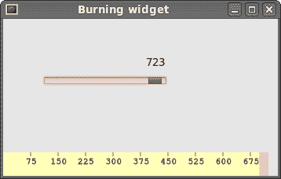

# 自定义小部件

> 原文： [http://zetcode.com/gui/phpgtktutorial/customwidget/](http://zetcode.com/gui/phpgtktutorial/customwidget/)

工具箱通常仅提供最常见的窗口小部件，例如按钮，文本窗口小部件，滑块等。没有工具箱可以提供所有可能的窗口小部件。 如果需要更专业的小部件，我们必须自己创建它。

使用工具箱提供的绘图工具创建自定义窗口小部件。 有两种可能性。 程序员可以修改或增强现有的小部件。 或者，他可以从头开始创建自定义窗口小部件。

## 刻录小部件

这是我们从头开始创建的小部件的示例。 它基于最小的`GtkWidget`小部件。 可以在各种媒体刻录应用（例如 Nero Burning ROM）中找到此自定义窗口小部件。

```php
<?php

/* 
ZetCode PHP GTK tutorial

This example creates a burning
custom widget.

author: Jan Bodnar
website: www.zetcode.com
last modified: August 2011
*/

class Burning extends GtkDrawingArea { 

    public function __construct($par) { 

        parent::__construct(); 

        $this->par = $par;          

        $this->init_ui();

    } 

    public function init_ui() {

        $this->num = array("75", "150", "225", "300", 
            "375", "450", "525", "600", "675");

        $this->set_size_request(1, 30);
        $this->connect('expose_event', array($this, 'on_expose')); 

    }

    public function on_expose() {
        $cr = $this->window->cairo_create();
        $this->draw_widget($cr);
    }

    public function draw_widget($cr) {

        $cr->SetLineWidth(0.8);
        $cr->SelectFontFace("Courier", CairoFontSlant::NORMAL, 
            CairoFontWeight::NORMAL);
        $cr->SetFontSize(11);

        $width = $this->get_allocation()->width;

        $this->cur_width = $this->par->get_cur_value();

        $step = round($width / 10.0);

        $till = ($width / 750.0) * $this->cur_width;
        $full = ($width / 750.0) * 700;

        if ($this->cur_width >= 700) {

            $cr->SetSourceRgb(1.0, 1.0, 0.72);
            $cr->Rectangle(0, 0, $full, 30);
            $cr->Clip();
            $cr->Paint();
            $cr->ResetClip();

            $cr->SetSourceRgb(1.0, 0.68, 0.68).
            $cr->Rectangle($full, 0, $till-$full, 30);
            $cr->Clip();
            $cr->Paint();
            $cr->ResetClip();

        } else {
            $cr->SetSourceRgb(1.0, 1.0, 0.72);
            $cr->Rectangle(0, 0, $till, 30);
            $cr->Clip();
            $cr->Paint();
            $cr->ResetClip();
        }

        $cr->SetSourceRgb(0.35, 0.31, 0.24);
        $len = count($this->num);

        for ($i=1; $i <= $len; $i++) {
            $cr->MoveTo($i*$step, 0);
            $cr->LineTo($i*$step, 5);
            $cr->Stroke();

            $te = $cr->TextExtents($this->num[$i-1]);
            $cr->MoveTo($i*$step-$te['width']/2, 15);
            $cr->TextPath($this->num[$i-1]);
            $cr->Stroke();
        }        
    }
}

class Example extends GtkWindow { 

    public function __construct() { 

        parent::__construct(); 

        $this->init_ui();

    } 

    private function init_ui() {

        $this->set_title('Burning widget');         
        $this->connect_simple('destroy', array('gtk', 'main_quit')); 

        $this->cur_value = 0;

        $vbox = new GtkVBox(false, 2);

        $scale = new GtkHScale();
        $scale->set_range(0, 750);
        $scale->set_digits(0);
        $scale->set_size_request(160, 35);
        $scale->set_value($this->cur_value);

        $scale->connect('value-changed', array($this, 'on_changed'));

        $fixed = new GtkFixed();
        $fixed->put($scale, 50, 50);

        $vbox->pack_start($fixed);

        $this->burning = new Burning($this);
        $vbox->pack_start($this->burning, false, false, 0);

        $this->add($vbox);

        $this->set_default_size(350, 200); 
        $this->set_position(GTK::WIN_POS_CENTER);
        $this->show_all();         
    }

    public function on_changed($sender) {

        $this->cur_value = $sender->get_value();
        $this->burning->queue_draw();
    }

    public function get_cur_value() {
        return $this->cur_value;
    }
} 

new Example(); 
Gtk::main();

?>

```

我们在窗口底部放置一个`GtkDrawingArea`并手动绘制整个窗口小部件。 所有重要的代码都驻留在`draw_widget()`中，这是从 Burning 类的`on_expose()`方法调用的。 此小部件以图形方式显示了介质的总容量和可供我们使用的可用空间。 该小部件由比例小部件控制。 自定义窗口小部件的最小值为 0，最大值为 750。如果值达到 700，则开始绘制红色。 这通常表示过度燃烧。

```php
$this->num = array("75", "150", "225", "300", 
    "375", "450", "525", "600", "675");

```

这些数字显示在刻录小部件上。 它们显示了介质的容量。

```php
$this->cur_width = $this->par->get_cur_value();

```

从父小部件中，我们获得了比例小部件的当前值。

```php
$till = ($width / 750.0) * $this->cur_width;
$full = ($width / 750.0) * 700;

```

我们使用`$width`变量进行转换。 在比例尺值和自定义小部件的度量之间。 请注意，我们使用浮点值。 我们在绘图中获得了更高的精度。 `$till`参数确定要绘制的总大小。 该值来自滑块小部件。 它占整个面积的一部分。 `$full`参数确定了我们开始绘制红色的点。

```php
$cr->SetSourceRgb(1.0, 1.0, 0.72);
$cr->Rectangle(0, 0, $full, 30);
$cr->Clip();
$cr->Paint();
$cr->ResetClip();

```

我们绘制一个黄色矩形，直到介质充满为止。

```php
$te = $cr->TextExtents($this->num[$i-1]);
$cr->MoveTo($i*$step-$te['width']/2, 15);
$cr->TextPath($this->num[$i-1]);
$cr->Stroke();

```

这里的代码在刻录小部件上绘制数字。 我们计算文本范围以正确定位文本。

```php
public function on_changed($sender) {

    $this->cur_value = $sender->get_value();
    $this->burning->queue_draw();
}

```

我们从小部件中获取值，并将其存储在`$this->cur_value`变量中以备后用。 我们重新绘制刻录的小部件。



图：刻录小部件

在本章中，我们使用 GTK 和 PHP 编程语言创建了一个自定义窗口小部件。