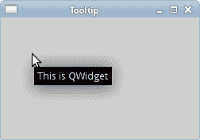
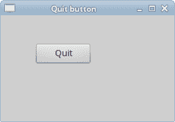

# Qyoto 介绍

> 原文： [http://zetcode.com/gui/csharpqyoto/introduction/](http://zetcode.com/gui/csharpqyoto/introduction/)

在 Qyoto C# 编程教程的这一部分中，我们将介绍并构建 Qyoto 库。 我们使用 C# 编程语言创建第一个 Qyoto 程序。

本教程的目的是帮助您开始使用 Qyoto 和 C# 。 可以在此处下载本教程中使用的图像。 我使用了 Gnome 项目的探戈图标包中的一些图标。 该教程是在 Qyoto 项目的维护者 Dimitar Dobrev 的帮助下创建的。

## 关于

Qyoto 是一个库，它提供 Qt 库与.NET 语言（如 C# 或 Visual Basic）的绑定。 Qt 是功能强大的跨平台应用程序开发框架。 它的母语是 C++ 。 Qyoto 是 KDE 桌面环境的一部分。 Qyoto 是使用`SMOKE`库创建的。 这是一个 KDE 项目，用于创建多种语言的绑定。 SMOKE 代表脚本元对象 Kompiler 引擎。

## 在 Linux 上构建 Qyoto

我们从最新资源构建 Qyoto 库。

```
$ git clone git://anongit.kde.org/smokegen
$ git clone git://anongit.kde.org/smokeqt
$ git clone git://anongit.kde.org/assemblygen

```

我们从 git 仓库下载源代码。

```
$ sudo apt-get install cmake-qt-gui

```

如果不存在，请安装 cmake-qt-gui。

我们按以下顺序构建三个软件包：1）smokegen，2）smokeqt 和 3）assemblygen。 我们在三个目录中的每个目录中运行 cmake-qt-gui。 我们指定源，构建目录，并将 CMAKE_BUILD_TYPE 设置为 Release。 我们单击配置和生成按钮。 将目录更改为构建目录。 运行`make`和`sudo make install`。

```
$ export LD_LIBRARY_PATH=/usr/local/qt4/lib

```

在构建 smokeqt 软件包之前，我们设置一个环境变量。 每次构建后，我们运行`sudo ldconfig`命令。

```
$ ls /usr/local/lib/mono/qyoto 
qyoto-qtcore.dll  qyoto-qtsvg.dll
qtscript.dll      qyoto-qtgui.dll      qyoto-qtuitools.dll
qttest.dll        qyoto-qtnetwork.dll  qyoto-qtwebkit.dll
qtuitools.dll     qyoto-qtopengl.dll   qyoto-qtxml.dll
qtwebkit.dll      qyoto-qtscript.dll   qyoto-qtxmlpatterns.dll
qyoto-phonon.dll  qyoto-qtsql.dll

```

我们在/ usr / local / lib / mono / qyoto 目录中有 Qyoto dll。

```
$ dmcs -r:/usr/local/lib/mono/qyoto/qyoto-qtcore.dll \
> -r:/usr/local/lib/mono/qyoto/qyoto-qtgui.dll donut.cs

```

上面的命令显示了如何编译甜甜圈示例。 mono C# 编译器的`-r`参数加载 Qt 程序集。 这是一个动态库。 该命令显示 Linux 系统上 dll 库的路径。

## 创建工具提示

第一个示例将显示一个工具提示。 工具提示是一个小的矩形窗口，它提供有关对象的简短信息。 它通常是一个 GUI 组件。 它是应用程序帮助系统的一部分。

```
using System;
using QtCore;
using QtGui;

/**
 * ZetCode Qyoto C# tutorial
 *
 * This program displays a
 * tooltip.
 *
 * @author Jan Bodnar
 * website zetcode.com
 * last modified October 2012
 */

public class QyotoApp : QWidget 
{
    public QyotoApp() 
    {
        WindowTitle = "Tooltip";

        ToolTip = "This is QWidget";    
        Resize(250, 150);
        Move(300, 300);
        Show();
    }

    [STAThread]
    public static int Main(String[] args) 
    {
        new QApplication(args);
        new QyotoApp();
        return QApplication.Exec();
    }
}

```

该示例创建一个窗口。 如果将鼠标指针悬停在窗口区域上方，则会弹出一个工具提示。

```
using System;
using QtCore;
using QtGui;

```

`using`关键字导入我们将在应用程序中使用的必需品类型。

```
public class QyotoApp : QWidget {

```

该示例继承自`QWidget`。 QWidget 类是所有用户界面对象的基类。 小部件是用户界面的原子。 它从窗口系统接收鼠标，键盘和其他事件。

```
WindowTitle = "Tooltip";

```

设置`WindowType`属性将显示窗口的标题。

```
ToolTip = "This is QWidget";

```

我们通过`ToolTip`属性设置工具提示。

```
Resize(250, 150);

```

在这里，我们设置窗口的宽度和高度。

```
Move(300, 300);

```

`Move()`方法在屏幕上移动窗口。

```
Show();

```

一切准备就绪后，我们在屏幕上显示窗口。

```
[STAThread]
public static int Main(String[] args) 

```

Windows 平台上需要[STAThread]属性。 确保与 COM 组件的通信是安全的。 在某些情况下，例如剪贴板和文件对话框，我们正在调用 COM 组件。 没有此属性，应用程序将崩溃。

```
new QApplication(args);
new QyotoApp();
return QApplication.Exec();

```

这三行设置了应用程序。



Figure: Tooltip

## 使窗口居中

在第二个示例中，我们将窗口置于屏幕中央。

```
using System;
using QtCore;
using QtGui;

/**
 * ZetCode Qyoto C# tutorial
 *
 * This program centers a window
 * on the screen.
 *
 * @author Jan Bodnar
 * website zetcode.com
 * last modified October 2012
 */

public class QyotoApp : QWidget 
{
    const int WIDTH = 250;
    const int HEIGHT = 150;

    public QyotoApp() 
    {
        WindowTitle = "Center";

        Resize(WIDTH, HEIGHT);
        Center();
        Show();
    }

    private void Center()
    {
        QDesktopWidget qdw = new QDesktopWidget();

        int screenWidth = qdw.Width;
        int screenHeight = qdw.Height;

        int cx = (screenWidth - WIDTH) / 2;
        int cy = (screenHeight - HEIGHT) / 2;        

        Move(cx, cy);
    }

    [STAThread]
    public static int Main(String[] args) 
    {
        new QApplication(args);
        new QyotoApp();
        return QApplication.Exec();
    }
}

```

Qyoto 没有使窗口居中的单一方法。

```
const int WIDTH = 250;
const int HEIGHT = 150;

```

这两个常数定义了应用程序窗口的宽度和高度。

```
Center();

```

使窗口居中的代码位于`Center()`方法中。

```
QDesktopWidget qdw = new QDesktopWidget();

```

`QDesktopWidget`类提供有关屏幕的信息。

```
int screenWidth = qdw.Width();
int screenHeight = qdw.Height();

```

在这里，我们确定屏幕的宽度和高度。

```
int cx = (screenWidth - WIDTH) / 2;
int cy = (screenHeight - HEIGHT) / 2;  

```

在这里，我们计算居中窗口的 x，y 坐标。 为了使窗口在屏幕上居中，我们需要知道屏幕的大小和窗口的大小。

```
Move(cx, cy);

```

我们将窗口移至计算出的 cx，cy 坐标。

## 退出按钮

在本节的最后一个示例中，我们将创建一个退出按钮。 当我们按下此按钮时，应用程序终止。

```
using System;
using QtCore;
using QtGui;

/**
 * ZetCode Qyoto C# tutorial
 *
 * This program creates a quit
 * button. When we press the button,
 * the application terminates. 
 *
 * @author Jan Bodnar
 * website zetcode.com
 * last modified October 2012
 */

public class QyotoApp : QWidget 
{
    public QyotoApp() 
    {
        WindowTitle = "Quit button";

        InitUI();

        Resize(250, 150);
        Move(300, 300);
        Show();
    }

    public void InitUI() 
    {    
        QPushButton quit = new QPushButton("Quit", this);

        Connect(quit, SIGNAL("clicked()"), qApp, SLOT("quit()"));
        quit.SetGeometry(50, 40, 80, 30);
    }

    [STAThread]
    public static int Main(String[] args) 
    {
        new QApplication(args);
        new QyotoApp();
        return QApplication.Exec();
    }
}

```

我们使用`QPushButton`。 它是矩形的，通常显示一个文本标签。

```
InitUI();

```

我们将用户界面的创建委托给`InitUI()`方法。

```
QPushButton quit = new QPushButton("Quit", this);

```

我们创建按钮小部件。 构造函数的第一个参数是标签，按钮将显示该标签。 第二个参数是按钮的父窗口小部件。

```
Connect(quit, SIGNAL("clicked()"), qApp, SLOT("quit()"));

```

当我们点击按钮时，会发出`clicked()`信号。 `Connect()`方法将信号连接到对象的特定槽。 该方法的第一个参数是接收信号的对象。 在我们的例子中，它是应用程序对象。 第二个参数是方法，称为。 在我们的情况下，它是应用程序对象的`quit()`方法。 `qApp`是对应用程序对象的全局引用。

```
quit.SetGeometry(50, 40, 80, 30);

```

我们定位和调整按钮小部件的大小。 前两个参数是按钮的 x，y 坐标。 最后两个参数是按钮的宽度和高度。



Figure: Quit button

本节介绍了使用 C# 语言编写的 Qyoto 库。