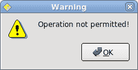
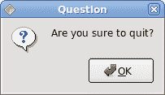
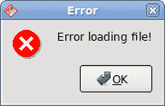
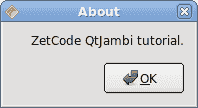
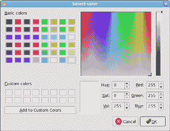

# Qyoto 对话框

> 原文： [http://zetcode.com/gui/csharpqyoto/dialogs/](http://zetcode.com/gui/csharpqyoto/dialogs/)

在 Qyoto C# 编程教程的这一部分中，我们将使用对话框。

对话框窗口或对话框是大多数现代 GUI 应用必不可少的部分。 对话被定义为两个或更多人之间的对话。 在计算机应用中，对话框是一个窗口，用于与应用“对话”。 对话框用于输入数据，修改数据，更改应用设置等。对话框是用户与计算机程序之间进行通信的重要手段。

## `MessageDialog`

消息框是方便的对话框，可向应用的用户提供消息。 该消息由文本和图像数据组成。

```
using System;
using QtCore;
using QtGui;

/**
 * ZetCode Qyoto C# tutorial
 *
 * This program shows
 * QMessageBox dialogs
 *
 * @author Jan Bodnar
 * website zetcode.com
 * last modified October 2012
 */

public class QyotoApp : QWidget 
{
    public QyotoApp() 
    {
        WindowTitle = "Message boxes";

        InitUI();

        Resize(220, 90);
        Move(300, 300);
        Show();
    }

    void InitUI() 
    {        
        QGridLayout grid = new QGridLayout(this);
        grid.Spacing = 2;

        QPushButton error = new QPushButton("Error", this);
        QPushButton warni = new QPushButton("Warning", this);
        QPushButton quest = new QPushButton("Question", this);
        QPushButton infor = new QPushButton("Information", this);
        QPushButton about = new QPushButton("About", this);

        grid.AddWidget(error, 0, 0);
        grid.AddWidget(warni, 0, 1);
        grid.AddWidget(quest, 1, 0);
        grid.AddWidget(infor, 1, 1);
        grid.AddWidget(about, 2, 0);

        error.Clicked += ShowDialog;
        warni.Clicked += ShowDialog;
        quest.Clicked += ShowDialog;
        infor.Clicked += ShowDialog;
        about.Clicked += ShowDialog;                
    }

    [Q_SLOT]
    void ShowDialog() 
    {
        QPushButton btn = (QPushButton) Sender();

        if ("Error".Equals(btn.Text)) 
        {
            QMessageBox.Critical(this, "Error", "Error loading file!");
        } else if ("Warning".Equals(btn.Text)) 
        {
            QMessageBox.Warning(this, "Warning", "Operation not permitted!");
        } else if ("Question".Equals(btn.Text)) 
        {
            QMessageBox.Question(this, "Question", "Are you sure to quit?");
        } else if ("Information".Equals(btn.Text)) 
        {
            QMessageBox.Information(this, "Information", "Download completed.");
        } else if ("About".Equals(btn.Text)) 
        {
            QMessageBox.About(this, "About", "ZetCode Qyoto C# tutorial.");
        } 
    }

    [STAThread]
    public static int Main(String[] args) 
    {
        new QApplication(args);
        new QyotoApp();
        return QApplication.Exec();
    }
}

```

我们使用`GridLayout`管理器来设置五个按钮的网格。 每个按钮显示一个不同的消息框。

```
QPushButton button = (QPushButton) Sender();

```

在这里，我们确定哪个按钮称为`ShowDialog()`方法。

```
if ("Error".Equals(btn.Text)) 
{
    QMessageBox.Critical(this, "Error", "Error loading file!");
} 

```

如果按下错误按钮，则会显示错误对话框。 我们使用`QMessageBox`类的静态方法来显示消息框。










## `QInputDialog`

`QInputDialog`类提供了一个简单的便捷对话框，可从用户那里获取单个值。 输入值可以是字符串，数字或列表中的。 必须设置标签以告知用户他们应该输入什么。

```
using System;
using QtCore;
using QtGui;

/**
 * ZetCode Qyoto C# tutorial
 *
 * This program shows an input
 * dialog.
 *
 * @author Jan Bodnar
 * website zetcode.com
 * last modified October 2012
 */

public class QyotoApp : QWidget 
{
    QLineEdit edit;

    public QyotoApp() 
    {
        WindowTitle = "QInputDialog";

        InitUI();

        Resize(300, 150);
        Move(300, 300);
        Show();
    }

    void InitUI() 
    {        
        QPushButton show = new QPushButton("Dialog", this);
        show.Clicked += ShowDialog;

        show.FocusPolicy = Qt.FocusPolicy.NoFocus;
        show.Move(20, 20);

        edit = new QLineEdit(this);
        edit.Move(130, 22);
    }

    [Q_SLOT]
    void ShowDialog() 
    {        
        String text = QInputDialog.GetText(
                this, "Input Dialog", "Enter your name");

        if (text!=null && text.Trim() != String.Empty) 
        {
            edit.Text = text;
        }
    }

    [STAThread]
    public static int Main(String[] args) 
    {
        new QApplication(args);
        new QyotoApp();
        return QApplication.Exec();
    }
}

```

在代码示例中，我们有一个按钮和一行编辑。 该按钮显示一个输入对话框。 我们得到一些文本，文本显示在行编辑小部件中。

```
String text = QInputDialog.GetText(
        this, "Input Dialog", "Enter your name");

```

`GetText()`静态方法创建输入对话框。 对话框中的文本存储在 text 变量中。

```
if (text!=null && text.Trim() != String.Empty) 
{
    edit.Text = text;
}

```

在更新行编辑之前，请确保 text 变量不为 null 且不为空，并且不仅由空格组成。


Figure: Input dialog

## `QColorDialog`

`QColorDialog`类提供用于指定颜色的对话框小部件。 颜色对话框的功能是允许用户选择颜色。

```
using System;
using QtCore;
using QtGui;

/**
 * ZetCode Qyoto C# tutorial
 *
 * In this program, we use the
 * QColorDialog to change the colour
 * of a label text.
 *
 * @author Jan Bodnar
 * website zetcode.com
 * last modified October 2012
 */

public class QyotoApp : QWidget 
{
    QLabel label;

    public QyotoApp() : base() 
    {
        WindowTitle = "QColorDialog";

        InitUI();

        Resize(250, 200);
        Move(300, 300);
        Show();
    }

    void InitUI() 
    {
        label = new QLabel("ZetCode Qyoto C# tutorial", this);

        QVBoxLayout vbox = new QVBoxLayout(this);
        label.Alignment = AlignmentFlag.AlignCenter;
        vbox.AddWidget(label);
    }    

    protected override void OnMousePressEvent(QMouseEvent arg1) 
    {
        QColor col = QColorDialog.GetColor();

        if (!col.IsValid()) return;

        String style = String.Format("QWidget {{ color: {0} }}", col.Name());
        label.StyleSheet = style;
    }

    [STAThread]
    public static int Main(String[] args) 
    {
        new QApplication(args);
        new QyotoApp();
        return QApplication.Exec();
    }
}

```

我们在窗口中心显示一些文本。 通过单击窗口区域，我们显示一个颜色对话框。 我们将文本前景色更改为从对话框中选择的颜色。

```
protected override void OnMousePressEvent(QMouseEvent arg1) 
{
    ...
}

```

为了接收我们窗口的鼠标按下事件，我们必须重写`MousePressEvent()`方法。

```
QColor col = QColorDialog.GetColor();

```

正在创建`QColorDialog`。 所选颜色存储在`col`变量中。

```
if (!color.IsValid()) return;

```

当按下取消按钮时，我们什么也不做。

```
String style = String.Format("QWidget {{ color: {0} }}", color.Name());
label.SetStyleSheet(style);

```

在这里，我们更新标签文本的前景色。



Figure: QColorDialog

## `QFontDialog`

`QFontDialog`类提供用于选择字体的对话框小部件。

```
using System;
using QtCore;
using QtGui;

/**
 * ZetCode Qyoto C# tutorial
 *
 * In this program, we use the
 * QFontDialog to change the font
 * of a label text.
 *
 * @author Jan Bodnar
 * website zetcode.com
 * last modified October 2012
 */

public class QyotoApp : QWidget 
{    
    QLabel label;

    public QyotoApp() : base() 
    {
        WindowTitle = "QFontDialog";

        InitUI();

        Resize(250, 200);
        Move(300, 300);
        Show();
    }

    void InitUI() 
    {
        label = new QLabel("ZetCode Qyoto C# tutorial", this);

        QVBoxLayout vbox = new QVBoxLayout(this);
        label.Alignment = AlignmentFlag.AlignCenter;
        vbox.AddWidget(label);
    }

    protected override void OnMousePressEvent(QMouseEvent arg1) 
    {
        bool ok = true;
        QFont font = QFontDialog.GetFont(ref ok);
        if (!ok) return;
        label.Font = font;
    }

    [STAThread]
    public static int Main(String[] args) 
    {
        new QApplication(args);
        new QyotoApp();
        return QApplication.Exec();
    }
}

```

此示例与上一个示例相似。 这次，我们更改文本的字体。

```
QFont font = QFontDialog.GetFont(ref ok);

```

正在创建`QFontDialog`。 当我们按下对话框的 OK 按钮时，将设置 boolean ok 变量。

```
if (!ok) return;

```

如果不按“确定”按钮，我们什么也不做。

```
label.Font = font;

```

`font`字段存储所选字体。 我们将标签的字体更新为新选择的字体。


Figure: QFontDialog

在 Qyoto C# 教程的这一部分中，我们使用了对话框窗口。