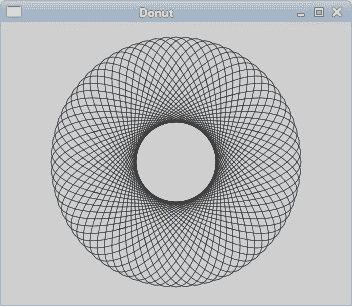
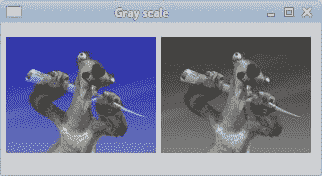
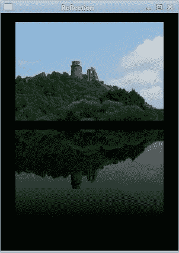
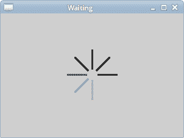

# Qyoto 中的绘图 II

> 原文： [http://zetcode.com/gui/csharpqyoto/paintingII/](http://zetcode.com/gui/csharpqyoto/paintingII/)

在 Qyoto C# 编程教程的这一部分中，我们将继续绘图。 我们将提供一些更复杂的示例。

## 甜甜圈形状

第一个示例通过旋转一堆椭圆来创建复杂的形状。

```
using System;
using QtCore;
using QtGui;

/**
 * ZetCode Qyoto C# tutorial
 *
 * This program draws a donut
 * shape.
 *
 * @author Jan Bodnar
 * website zetcode.com
 * last modified November 2012
 */

public class QyotoApp : QMainWindow 
{    
    public QyotoApp() 
    {
        WindowTitle = "Donut";

        PaintEvent += OnPaintEvent;

        Resize(350, 280);
        Move(300, 300);
        Show();
    }

    private void OnPaintEvent(object sender, QEventArgs<QPaintEvent> e)
    {
        QPainter ptr = new QPainter(this);
        DrawDonut(ptr);

        ptr.End();
     }

    void DrawDonut(QPainter ptr) 
    {
        QColor col = new QColor();
        col.SetNamedColor("#333333");

        ptr.Pen = new QPen(col, 0.5);

        ptr.SetRenderHint(QPainter.RenderHint.Antialiasing);

        int h = Height;
        int w = Width;

        ptr.Translate(new QPoint(w/2, h/2));

         for (double rot=0; rot < 360.0; rot+=5.0 ) 
         {
             ptr.DrawEllipse(-125, -40, 250, 80);
             ptr.Rotate(5.0);
         }
    }

    [STAThread]
    public static int Main(String[] args) 
    {
        new QApplication(args);
        new QyotoApp();
        return QApplication.Exec();
    }
}

```

在此示例中，我们创建一个甜甜圈。 形状类似于曲奇，因此得名“甜甜圈”。

```
QColor color = new QColor();
color.SetNamedColor("#333333");

```

我们可以使用十六进制表示法来创建颜色对象。

```
int h = Height;
int w = Width;

```

在这里，我们确定窗口的宽度和高度。

```
ptr.Translate(new QPoint(w/2, h/2));

```

我们将坐标系移到窗口的中间。 这样，我们使绘图在数学上更容易。

```
for (double rot=0; rot < 360.0; rot+=5.0 ) 
{
    ptr.DrawEllipse(-125, -40, 250, 80);
    ptr.Rotate(5.0);
}

```

我们绘制一个椭圆对象 72 次。 每次，我们将椭圆旋转 5 度。 这将创建我们的甜甜圈形状。



Figure: Donut

## 灰度图像

在下面的示例中，我们将创建一个灰度图像。

```
using System;
using QtGui;
using QtCore;

/**
 * ZetCode Qyoto C# tutorial
 *
 * In this example, we create a 
 * grayscale image.
 *
 * @author Jan Bodnar
 * website zetcode.com
 * last modified November 2012
 */

public class QyotoApp : QMainWindow 
{    
    QImage sid;
    int w, h = 0;

    public QyotoApp() 
    {
        WindowTitle = "Gray scale";

        PaintEvent += OnPaintEvent;        

        LoadImage();
        Resize(320, 150);
        Move(300, 300);
        Show();
    }

    private void OnPaintEvent(object sender, QEventArgs<QPaintEvent> e)
    { 
        QPainter ptr = new QPainter(this);
        DrawImages(ptr);

        ptr.End();
    }

    void DrawImages(QPainter ptr) 
    {
        ptr.DrawImage(5, 15, sid);
        ptr.DrawImage(w + 10, 15, GrayScale(sid.Copy()));
    }

    void LoadImage()
    {
        sid = new QImage("smallsid.jpg");

        w = sid.Width();
        h = sid.Height();
    }

    QImage GrayScale(QImage img)
    {        
        for (int i=0; i < w; i++)
        {
            for (int j=0; j < h; j++)
            {
                uint c = img.Pixel(i, j);
                int gray = Global.qGray(c);
                int alpha = Global.qAlpha(c);
                img.SetPixel(i, j, Global.qRgba(gray, gray, 
                   gray, alpha));                
            }
        }  

        return img;
    }          

    public static int Main(String[] args) 
    {
        new QApplication(args);
        new QyotoApp();
        return QApplication.Exec();
    }
}

```

我们有一个彩色 JPG 图像。 我们把它画在窗口上。 我们创建图像的副本，将其转换为灰度并在原始图像旁边的窗口上绘制。

```
void LoadImage()
{
    sid = new QImage("smallsid.jpg");

    w = sid.Width();
    h = sid.Height();
}

```

在`LoadImage()`方法中，我们加载图像并获取其宽度和高度。

```
QImage GrayScale(QImage img)
{        
    for (int i=0; i < w; i++)
    {
        for (int j=0; j < h; j++)
        {
            uint c = img.Pixel(i, j);
            int gray = Global.qGray(c);
            int alpha = Global.qAlpha(c);
            img.SetPixel(i, j, Global.qRgba(gray, gray, 
                gray, alpha));                
        }
    }  

    return img;
}    

```

`GrayScale()`方法将图像转换为灰度并返回。 我们遍历图像的所有像素。 `Pixel()`方法返回有问题的像素。 我们使用`Global.qGray()`方法来获取特定像素的灰度值。 同样，我们获得 alpha 值。 最后，我们使用`SetPixel()`方法修改像素。 我们将灰色值用于颜色的红色，绿色和蓝色部分。



Figure: Grayscale image

## 反射

在下一个示例中，我们显示反射图像。 该效果使人产生幻觉，好像图像在水中被反射一样。

```
using System;
using QtGui;
using QtCore;

/**
 * ZetCode Qyoto C# tutorial
 *
 * In this example we create a reflected image.
 *
 * @author Jan Bodnar
 * website zetcode.com
 * last modified November 2012
 */

public class QyotoApp : QMainWindow 
{
    QImage img;
    QImage reflected_img;

    int iw, ih = 0;
    double initial_opacity = 0.7;
    double opacity = 0.7;
    double step = 0;
    const int GAP = 30;

    public QyotoApp() 
    {
        WindowTitle = "Reflection";

        PaintEvent += OnPaintEvent;

        InitExample();  

        Resize(300, 400);
        Move(150, 150);
        Show();
    }

    private void OnPaintEvent(object sender, QEventArgs<QPaintEvent> e)
    { 
        QPainter ptr = new QPainter(this);
        DrawImages(ptr);

        ptr.End();
    }

    void InitExample()
    {
        img = new QImage("slanec.png");

        if (img.IsNull()) 
        {
            Console.WriteLine("Error loading image");
        }

        iw = img.Width();
        ih = img.Height();

        step = opacity / ih;    

        reflected_img = new QImage(iw, ih, QImage.Format.Format_RGB32);
        CreateReflectedImage();
    }       

    void CreateReflectedImage()
    {
        QPainter fptr = new QPainter(reflected_img);

        int i = 0;
        double opacity = 0.7;    

        while (i < ih)
        {        
            i++;
            opacity = opacity - step;

            fptr.Opacity = initial_opacity-opacity;
            fptr.DrawImage(0, i, img, 0, i, -1, 1);
        }          

        fptr.End();
    }

    void DrawImages(QPainter ptr) 
    {
        int w = Width;
        int h = Height;

        ptr.FillRect(0, 0, w, h, Qt.GlobalColor.black);
        ptr.SetRenderHint(QPainter.RenderHint.Antialiasing);

        QRect r = new QRect(25, 15, iw, ih);
        ptr.DrawImage(r, img);

        ptr.Translate(0, 2 * ih + GAP);
        ptr.Scale(1, -1);     

        ptr.DrawImage(25, 0, reflected_img);      
    }

    public static int Main(String[] args) 
    {
        new QApplication(args);
        new QyotoApp();
        return QApplication.Exec();
    }
}

```

我们从当前工作目录加载图像。 我们创建另一个相同大小的空图像。 我们将原始图像逐行复制到新的空白图像，并逐渐增加透明度。

```
img = new QImage("slanec.png");

if (img.IsNull()) 
{
    Console.WriteLine("Error loading image");
}

```

我们加载一个 PNG 图片，并进行一些错误检查。

```
iw = img.Width();
ih = img.Height();

step = opacity / ih;     

```

我们得到图像的宽度和高度。 步进变量控制第二张图像淡出的强度。

```
reflected_img = new QImage(iw, ih, QImage.Format.Format_RGB32);

```

创建一个新的空图像。 它具有原始图像的大小。

```
void CreateReflectedImage()
{
    QPainter fptr = new QPainter(reflected_img);
    ...

```

在`CreateReflectedImage()`方法中，我们绘制空白图像。

```
while (i < ih)
{        
    i++;
    opacity = opacity - step;

    fptr.Opacity = initial_opacity-opacity;
    fptr.DrawImage(0, i, img, 0, i, -1, 1);
}     

```

我们将原始图像复制到新图像。 逐行。 不透明度在每个循环中逐步降低。

```
QRect r = new QRect(25, 15, iw, ih);
ptr.DrawImage(r, img);

```

第一个图像绘制在窗口上。

```
ptr.Translate(0, 2 * ih + GAP);
ptr.Scale(1, -1);     

ptr.DrawImage(25, 0, reflected_img);   

```

在这里，我们将第二个图像向下移动，比原始图像低一些。 `Scale()`方法将图像上下翻转。 请注意，平移是图像高度的两倍。 这是必要的，因为缩放操作不仅会翻转图像，还会使图像向上移动。 要了解这一点，只需拍摄一张照片，将其放在桌子上并翻转即可。



Figure: A reflected image

## 等待效果

在此示例中，我们使用透明效果创建一个等待演示。 我们将绘制 8 条线，这些线将逐渐消失，从而产生一条线在移动的错觉。 此类效果通常用于通知用户幕后正在进行繁重的任务。 一个示例是通过互联网流式传输视频。

```
using System;
using QtGui;
using QtCore;

/**
 * ZetCode Qyoto C# tutorial
 *
 * This program draws basic shapes
 * available in Qyoto.
 *
 * @author Jan Bodnar
 * website zetcode.com
 * last modified November 2012
 */

public class QyotoApp : QMainWindow 
{
    int count = 0;

    double[,] trs = 
    {
        { 0.0, 0.15, 0.30, 0.5, 0.65, 0.80, 0.9, 1.0 },
        { 1.0, 0.0,  0.15, 0.30, 0.5, 0.65, 0.8, 0.9 },
        { 0.9, 1.0,  0.0,  0.15, 0.3, 0.5, 0.65, 0.8 },
        { 0.8, 0.9,  1.0,  0.0,  0.15, 0.3, 0.5, 0.65 },
        { 0.65, 0.8, 0.9,  1.0,  0.0,  0.15, 0.3, 0.5 },
        { 0.5, 0.65, 0.8, 0.9, 1.0,  0.0,  0.15, 0.3 },
        { 0.3, 0.5, 0.65, 0.8, 0.9, 1.0,  0.0,  0.15 },
        { 0.15, 0.3, 0.5, 0.65, 0.8, 0.9, 1.0,  0.0 }
    };

    public QyotoApp() 
    {
        WindowTitle = "Waiting";

        PaintEvent += OnPaintEvent;

        InitExample();

        Resize(300, 200);
        Move(300, 300);
        Show();
    }

    private void OnPaintEvent(object sender, QEventArgs<QPaintEvent> e)
    {
        QPainter ptr = new QPainter(this);
        DrawLines(ptr);

        ptr.End();
    }

    void InitExample()
    {    
        count = 0;
        StartTimer(105);
    }

    void DrawLines(QPainter ptr)
    {
        QPen pen = new QPen();
        pen.Width = 3;
        pen.CapStyle = PenCapStyle.RoundCap;

        int w = Width;
        int h = Height;

        ptr.Translate(w/2, h/2);
        ptr.Pen = pen;

        int len = trs.GetLength(0);

        for (int i=0; i < len; i++)
        {
            ptr.Opacity = trs[count%8, i];
            ptr.DrawLine(0, -10, 0, -40);
            ptr.Rotate(45);
        }
    }

    protected override void OnTimerEvent(QTimerEvent e)
    {
        count++;
        Repaint();
    }

    public static int Main(String[] args) 
    {
        new QApplication(args);
        new QyotoApp();
        return QApplication.Exec();
    }
}

```

我们用八个不同的 alpha 值绘制八条线。

```
double[,] trs = 
{
    { 0.0, 0.15, 0.30, 0.5, 0.65, 0.80, 0.9, 1.0 },
    { 1.0, 0.0,  0.15, 0.30, 0.5, 0.65, 0.8, 0.9 },
...

```

这是透明度值的数组。 有 8 行，每行一个位置。 8 行中的每行将连续使用这些值。

```
count = 0;
StartTimer(105);

```

在这里，我们启动计数值并启动一个计时器。

```
QPen pen = new QPen();
pen.Width = 3;
pen.CapStyle = PenCapStyle.RoundCap;

```

我们使线条更粗一些，以使它们更加可见。 我们用圆帽画线。 带圆帽的线条看起来更好。

```
for (int i=0; i < len; i++)
{
    ptr.Opacity = trs[count%8, i];
    ptr.DrawLine(0, -10, 0, -40);
    ptr.Rotate(45);
}

```

在此循环中，我们设置不透明度值。 我们画线并旋转它。 这产生了移动和渐隐线的错觉。

```
protected override void OnTimerEvent(QTimerEvent e)
{
    count++;
    Repaint();
}

```

每次调用计时器事件时，我们都会增加计数值并重新绘制窗口区域。



Figure: Waiting effect

在 Qyoto C# 编程教程的这一部分中，我们结束了有关在 Qyoto 中绘图的讨论。