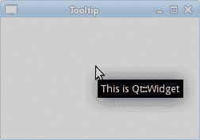
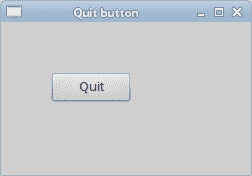

# Ruby Qt 简介

> 原文： [http://zetcode.com/gui/rubyqt/introduction/](http://zetcode.com/gui/rubyqt/introduction/)

在 Ruby Qt 教程的这一部分中，我们将介绍 Qt 工具包并使用 Ruby 编程语言创建第一个程序。

本教程的目的是帮助您开始使用 Ruby 语言的 Qt 工具包。 可以在此处下载本教程中使用的图像。 我们使用了 Gnome 项目的 Tango 图标包中的一些图标。

## 关于

Qt 是用于创建图形用户界面的领先工具包之一。 Ruby 是一种流行的脚本语言。

## 创建工具提示

第一个示例将显示一个工具提示。 工具提示是一个小的矩形窗口，它提供有关对象的简短信息。 它通常是一个 GUI 组件。 它是应用程序帮助系统的一部分。

```
#!/usr/bin/ruby

# ZetCode Ruby Qt tutorial
#
# This code shows a tooltip on 
# a window.
#
# author: Jan Bodnar
# website: www.zetcode.com
# last modified: September 2012

require 'Qt'

class QtApp < Qt::Widget

    def initialize
        super

        setWindowTitle "Tooltip"

        setToolTip "This is Qt::Widget"

        resize 250, 150
        move 300, 300

        show
    end
end

app = Qt::Application.new ARGV
QtApp.new
app.exec

```

该示例创建一个窗口。 如果将鼠标指针悬停在窗口区域上方，则会弹出一个工具提示。

```
require 'Qt'

```

`require`关键字导入我们将在应用程序中使用的必要类型。

```
class QtApp < Qt::Widget

```

该示例继承自`Qt::Widget`。 Widget 类是所有用户界面对象的基类。 小部件是用户界面的原子。 它从窗口系统接收鼠标，键盘和其他事件。

```
setWindowTitle "Tooltip"

```

此方法调用为窗口创建标题。

```
setToolTip "This is Qt::Widget"

```

`setToolTip`方法为 Widget 对象创建工具提示。

```
resize 250, 150

```

在这里，我们设置窗口的宽度和高度。

```
move 300, 300

```

`move`方法在屏幕上移动窗口。

```
show

```

一切准备就绪后，我们在屏幕上显示窗口。

```
app = Qt::Application.new ARGV
QtApp.new
app.exec

```

这三行设置了应用程序。



Figure: Tooltip

## 使窗口居中

在第二个示例中，我们将窗口置于屏幕中央。

```
#!/usr/bin/ruby

# ZetCode Ruby Qt tutorial
#
# This program centers a window
# on the screen.
#
# author: Jan Bodnar
# website: www.zetcode.com
# last modified: September 2012

require 'Qt'

WIDTH = 250
HEIGHT = 150

class QtApp < Qt::Widget

    def initialize
        super

        setWindowTitle "Center"
        resize WIDTH, HEIGHT

        center
        show
    end

    def center
        qdw = Qt::DesktopWidget.new

        screenWidth = qdw.width
        screenHeight = qdw.height

        x = (screenWidth - WIDTH) / 2
        y = (screenHeight - HEIGHT) / 2

        move x, y
    end
end

app = Qt::Application.new ARGV
QtApp.new
app.exec

```

Qt 工具包没有一种将窗口居中的方法。

```
WIDTH = 250
HEIGHT = 150

```

这两个常数定义了应用程序窗口的宽度和高度。

```
qdw = Qt::DesktopWidget.new

```

`Qt::DesktopWidget`类提供有关屏幕的信息。

```
screenWidth = qdw.width
screenHeight = qdw.height

```

在这里，我们确定屏幕的宽度和高度。

```
x = (screenWidth - WIDTH) / 2
y = (screenHeight - HEIGHT) / 2

```

在这里，我们计算居中窗口的`x`和`y`坐标。 为了使窗口在屏幕上居中，我们需要知道屏幕的大小和窗口的大小。

```
move x, y

```

我们将窗口移至计算出的 x 和 y 坐标。

## 退出按钮

在本节的最后一个示例中，我们将创建一个退出按钮。 当我们按下此按钮时，应用程序终止。

```
#!/usr/bin/ruby

# ZetCode Ruby Qt tutorial
#
# This program creates a quit
# button. When we press the button,
# the application terminates. 
#
# author: Jan Bodnar
# website: www.zetcode.com
# last modified: September 2012

require 'Qt'

class QtApp < Qt::Widget

    def initialize
        super

        setWindowTitle "Quit button"

        init_ui

        resize 250, 150
        move 300, 300

        show
    end

    def init_ui    
        quit = Qt::PushButton.new 'Quit', self
        quit.resize 80, 30
        quit.move 50, 50
        connect quit, SIGNAL('clicked()'), $qApp, SLOT('quit()')
    end

end

app = Qt::Application.new ARGV
QtApp.new
app.exec

```

`Qt::PushButton`类在 Ruby Qt 中显示一个按钮。 它是一个矩形小部件，通常显示一个文本标签。

```
init_ui

```

我们将用户界面的创建委托给`init_ui`方法。

```
quit = Qt::PushButton.new 'Quit', self

```

我们创建按钮小部件。 构造函数的第一个参数是按钮显示的标签。 第二个参数是按钮的父窗口小部件。

```
quit.resize 80, 30
quit.move 50, 50

```

我们调整和放置按钮小部件的大小。

```
connect quit, SIGNAL('clicked()'), $qApp, SLOT('quit()')

```

单击退出按钮时，将发出`clicked`信号。 `connect`方法将信号连接到对象的特定槽。 在我们的情况下，它是应用程序对象的`quit`方法。 `$qApp`是指向应用程序实例的全局指针。



Figure: Quit button

本节介绍了使用 Ruby 语言的 Qt 工具包。