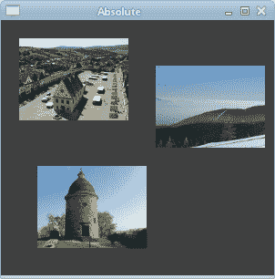
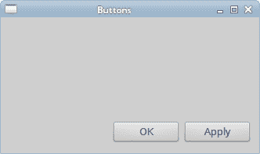
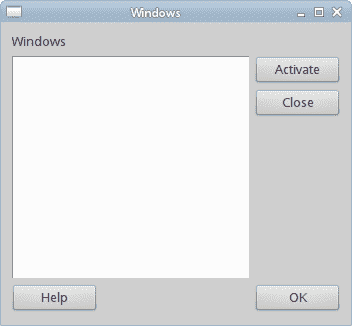
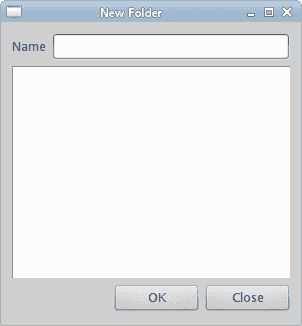

# Ruby Qt 中的布局管理

> 原文： [http://zetcode.com/gui/rubyqt/layoutmanagement/](http://zetcode.com/gui/rubyqt/layoutmanagement/)

在 Ruby Qt 编程教程的这一部分中，我们将介绍布局管理器。

在设计应用的 GUI 时，我们决定要使用哪些组件以及如何在应用中组织这些组件。 为了组织我们的组件，我们使用专门的不可见对象，称为布局管理器。 Qt 中有几个选项。 我们可以使用绝对定位，内置布局管理器或创建自定义布局管理器。 我们还可以使用 Qt Designer 直观地构建布局。

Qt 有一些重要的内置布局管理器。 `Qt::VBoxLayout`类垂直排列小部件。 `Qt::HBoxLayout`水平排列小部件。 `Qt::GridLayout`类将小部件布置在网格中。 网格布局是最灵活的布局管理器。 框布局可以相互嵌套以创建复杂的布局。

## 绝对定位

在大多数情况下，程序员应使用布局管理器。 在某些情况下，我们可以使用绝对定位。 在绝对定位中，程序员以像素为单位指定每个小部件的位置和大小。 如果我们调整窗口大小，则小部件的大小和位置不会改变。 在各种平台上，应用看起来都不同，在 Linux 上看起来不错，在 Mac OS 上看起来不太正常。 在我们的应用中更改字体可能会破坏布局。 如果我们将应用翻译成另一种语言，则必须重做布局。 对于所有这些问题，仅在有理由时才使用绝对定位。

```
#!/usr/bin/ruby

# ZetCode Ruby Qt tutorial
#
# In this program, we lay out widgets
# using absolute positioning.
#
# author: Jan Bodnar
# website: www.zetcode.com
# last modified: September 2012

require 'Qt'

class QtApp < Qt::Widget

    def initialize
        super

        setWindowTitle "Absolute"

        init_ui

        resize 300, 280
        move 300, 300

        show
    end

    def init_ui

        setStyleSheet "QWidget { background-color: #414141 }"

        bardejov = Qt::Pixmap.new "bardejov.jpg"
        rotunda = Qt::Pixmap.new "rotunda.jpg"
        mincol = Qt::Pixmap.new "mincol.jpg"

        barLabel = Qt::Label.new self
        barLabel.setPixmap bardejov
        barLabel.move 20, 20

        rotLabel = Qt::Label.new self
        rotLabel.setPixmap rotunda
        rotLabel.move 40, 160

        minLabel = Qt::Label.new self
        minLabel.setPixmap mincol
        minLabel.move 170, 50

    end
end

app = Qt::Application.new ARGV
QtApp.new
app.exec

```

在此示例中，我们使用绝对定位显示了三幅图像。

```
barLabel = Qt::Label.new self
barLabel.setPixmap bardejov

```

`Qt::Label`小部件用于保存图像。

```
barLabel.move 20, 20

```

我们使用`move`方法将标签放置在窗口上的`x = 20`，`y = 20`处。

调整窗口大小时，标签将保留其初始大小。



Figure: Absolute positioning

## 按钮示例

在下面的示例中，我们将在窗口的右下角放置两个按钮。

```
#!/usr/bin/ruby

# ZetCode Ruby Qt tutorial
#
# In this program, we use box layouts
# to position two buttons in the
# bottom right corner of the window.
#
# author: Jan Bodnar
# website: www.zetcode.com
# last modified: September 2012

require 'Qt'

class QtApp < Qt::Widget

    def initialize
        super

        setWindowTitle "Buttons"

        init_ui

        resize 330, 170
        move 300, 300

        show
    end

    def init_ui
        vbox = Qt::VBoxLayout.new self
        hbox = Qt::HBoxLayout.new

        ok = Qt::PushButton.new "OK", self
        apply = Qt::PushButton.new "Apply", self

        hbox.addWidget ok, 1, Qt::AlignRight
        hbox.addWidget apply

        vbox.addStretch 1
        vbox.addLayout hbox
    end

end

app = Qt::Application.new ARGV
QtApp.new
app.exec

```

我们使用嵌套框布局来获得我们想要的布局。

```
vbox = Qt::VBoxLayout.new self
hbox = Qt::HBoxLayout.new

```

我们使用一个垂直框和一个水平框。

```
ok = Qt::PushButton.new "OK", self
apply = Qt::PushButton.new "Apply", self

```

这是两个将进入窗口右下角的按钮。

```
hbox.addWidget ok, 1, Qt::AlignRight

```

我们将确定按钮放入水平框中。 第二个参数是`stretch`因子。 它将扩大分配给“确定”按钮的区域。 它会占用所有可用空间。 该区域内小风口的对齐方式由第三个参数控制。 `Qt::AlignRight`将按钮向右对齐。

```
vbox.addStretch 1

```

这条线创建了一个垂直扩展的白色空间，它将带有按钮的水平框推到底部。

```
vbox.addLayout hbox

```

水平框嵌套在垂直框中。



Figure: Buttons example

## Windows 示例

以下是嵌套框布局更复杂的示例。

```
#!/usr/bin/ruby

# ZetCode Ruby Qt tutorial
#
# In this program, use box layouts
# to create a Windows example
#
# author: Jan Bodnar
# website: www.zetcode.com
# last modified: September 2012

require 'Qt'

class QtApp < Qt::Widget

    def initialize
        super

        setWindowTitle "Windows"

        init_ui

        resize 350, 300
        move 300, 300

        show
    end

    def init_ui
        vbox = Qt::VBoxLayout.new self

        vbox1 = Qt::VBoxLayout.new
        hbox1 = Qt::HBoxLayout.new
        hbox2 = Qt::HBoxLayout.new

        windLabel = Qt::Label.new "Windows", self
        edit = Qt::TextEdit.new self
        edit.setEnabled false

        activate = Qt::PushButton.new "Activate", self
        close = Qt::PushButton.new "Close", self
        help = Qt::PushButton.new "Help", self
        ok = Qt::PushButton.new "OK", self

        vbox.addWidget windLabel

        vbox1.addWidget activate
        vbox1.addWidget close, 0, Qt::AlignTop
        hbox1.addWidget edit
        hbox1.addLayout vbox1

        vbox.addLayout hbox1

        hbox2.addWidget help
        hbox2.addStretch 1
        hbox2.addWidget ok

        vbox.addLayout hbox2, 1
        setLayout vbox

    end    
end

app = Qt::Application.new ARGV
QtApp.new
app.exec

```

在此布局中，我们使用两个垂直和水平框。

```
box = Qt::VBoxLayout.new self

```

这是示例的基本布局。

```
windLabel = Qt::Label.new "Windows", self

```

首先是标签小部件。 它只是转到垂直框的顶部。

```
vbox1.addWidget activate
vbox1.addWidget close, 0, Qt::AlignTop
hbox1.addWidget edit
hbox1.addLayout vbox1

vbox.addLayout hbox1

```

在窗口的中心部分，我们有一个文本编辑小部件和两个垂直排列的按钮。 这些按钮进入垂直框。 在此垂直框中，按钮与顶部对齐。 垂直框和文本编辑进入水平框。 该水平框转到标签窗口小部件正下方的基本垂直框。

```
hbox2.addWidget help
hbox2.addStretch 1
hbox2.addWidget ok

vbox.addLayout hbox2, 1

```

帮助和确定按钮进入另一个水平框。 这两个按钮之间有一个扩大的空白区域。 同样，水平框转到基本垂直框。

```
setLayout vbox

```

基本的垂直框设置为窗口的主要布局。



Figure: Windows example

## 新文件夹示例

在最后一个示例中，我们使用`Qt::GridLayout`管理器创建“新文件夹”布局示例。

```
#!/usr/bin/ruby

# ZetCode Ruby Qt tutorial
#
# In this program, use the GridLayout
# to create a New Folder example.
#
# author: Jan Bodnar
# website: www.zetcode.com
# last modified: September 2012

require 'Qt'

class QtApp < Qt::Widget

    def initialize
        super

        setWindowTitle "New Folder"

        init_ui

        resize 300, 300
        move 300, 300

        show
    end

    def init_ui

        grid = Qt::GridLayout.new self

        nameLabel = Qt::Label.new "Name", self
        nameEdit = Qt::LineEdit.new self
        text = Qt::TextEdit.new self
        okButton = Qt::PushButton.new "OK", self
        closeButton = Qt::PushButton.new "Close", self

        grid.addWidget nameLabel, 0, 0
        grid.addWidget nameEdit, 0, 1, 1, 3
        grid.addWidget text, 1, 0, 2, 4
        grid.setColumnStretch 1, 1
        grid.addWidget okButton, 4, 2
        grid.addWidget closeButton, 4, 3

    end    
end

app = Qt::Application.new(ARGV)
QtApp.new
app.exec

```

在我们的示例中，我们有一个标签，一行编辑，一个文本编辑和两个按钮。

```
grid = Qt::GridLayout.new self

```

我们创建`Qt::GridLayout`管理器的实例。

```
grid.addWidget nameLabel, 0, 0

```

我们将标签小部件放置在网格的第一个单元格中。 单元格从 0 开始计数。最后两个参数是行号和列号。

```
grid.addWidget nameEdit, 0, 1, 1, 3

```

线编辑窗口小部件位于第一行第二列。 最后两个参数是行跨度和列跨度。 在水平方向上，小部件将跨越三列。

```
grid.setColumnStretch 1, 1

```

该方法的参数是列号和拉伸因子。 在这里，我们将拉伸因子 1 设置到第二列。 这意味着此列将占用所有剩余空间。 之所以这样设置，是因为我们希望按钮保持其初始大小。



Figure: New Folder example

在 Ruby Qt 教程的这一部分中，我们提到了小部件的布局管理。