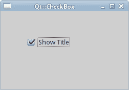
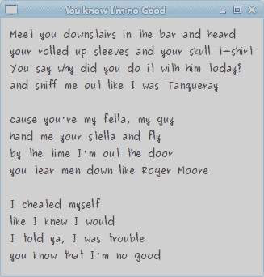
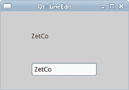
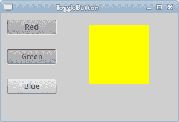
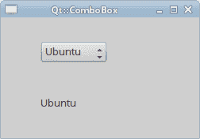

# Ruby Qt 中的小部件

> 原文： [http://zetcode.com/gui/rubyqt/widgets/](http://zetcode.com/gui/rubyqt/widgets/)

在 Ruby Qt 编程教程的这一部分中，我们将介绍基本的小部件。

小部件是 GUI 应用的基本构建块。 多年来，几个小部件已成为所有 OS 平台上所有工具包中的标准。 例如，按钮，复选框或滚动条。 Qt 有一组丰富的小部件，可以满足大多数编程需求。 可以将更多专门的窗口小部件创建为自定义窗口小部件。

## `Qt::CheckBox`

`Qt::CheckBox`是具有两种状态的窗口小部件：开和关。 接通状态通过复选标记显示。 它用来表示一些布尔属性。 `Qt::CheckBox`小部件提供一个带有文本标签的复选框。

```rb
#!/usr/bin/ruby

# ZetCode Ruby Qt tutorial
#
# This program uses Qt::CheckBox
# widget to show/hide the title
# of the window.
#
# author: Jan Bodnar
# website: www.zetcode.com
# last modified: September 2012

require 'Qt'

class QtApp < Qt::Widget

    slots 'on_toggled(bool)'

    def initialize
        super

        setWindowTitle "Qt::CheckBox"

        init_ui

        resize 250, 150
        move 300, 300

        show
    end

    def init_ui
        cb = Qt::CheckBox.new "Show Title", self
        cb.setChecked true
        connect cb, SIGNAL("toggled(bool)"), 
            self, SLOT("on_toggled(bool)")

        cb.move 50, 50

    end

    def on_toggled state
        if state
            setWindowTitle "Qt::CheckBox"
        else
            setWindowTitle ""
        end
    end

end

app = Qt::Application.new ARGV
QtApp.new
app.exec

```

在我们的示例中，我们在窗口上放置了一个复选框。 复选框显示或隐藏窗口的标题。

```rb
setWindowTitle "Qt::CheckBox"

```

在构建窗口期间，我们为窗口设置标题。

```rb
cb = Qt::CheckBox.new "Show Title", self

```

`Qt::CheckBox`小部件已创建。 构造函数的第一个参数是其文本标签。 第二个参数是父窗口小部件。

```rb
cb.setChecked true

```

标题在应用的开始处可见。 因此，也必须选中该复选框。

```rb
connect cb, SIGNAL("toggled(bool)"), 
    self, SLOT("on_toggled(bool)")

```

复选框的状态更改时，会发出`toggled`信号。 发出信号时，我们触发`on_toggled`方法。

```rb
if state
    setWindowTitle "Qt::CheckBox"
else
    setWindowTitle ""
end

```

根据复选框的状态，我们显示或隐藏窗口的标题。



Figure: Qt::CheckBox

## `Qt::Label`

`Qt::Label`小部件用于显示文本或图像。 没有用户交互。

```rb
#!/usr/bin/ruby

# ZetCode Ruby Qt tutorial
#
# This program uses Qt::Label widget to 
# show lyrics of a song.
#
# author: Jan Bodnar
# website: www.zetcode.com
# last modified: September 2012

require 'Qt'

class QtApp < Qt::Widget

    def initialize
        super

        setWindowTitle "You know I'm no Good"

        init_ui

        resize 250, 150
        move 300, 300

        show
    end

    def init_ui
       text = "Meet you downstairs in the bar and heard
your rolled up sleeves and your skull t-shirt
You say why did you do it with him today?
and sniff me out like I was Tanqueray\n
cause you're my fella, my guy
hand me your stella and fly
by the time I'm out the door
you tear men down like Roger Moore\n
I cheated myself
like I knew I would
I told ya, I was trouble
you know that I'm no good"

        label = Qt::Label.new text, self
        label.setFont Qt::Font.new "Purisa", 9

        vbox = Qt::VBoxLayout.new
        vbox.addWidget label
        setLayout vbox
    end   
end

app = Qt::Application.new ARGV
QtApp.new
app.exec

```

我们的示例在窗口中显示了歌曲的歌词。

```rb
       text = "Meet you downstairs in the bar and heard
your rolled up sleeves and your skull t-shirt
...

```

我们定义了多行文字。

```rb
label = Qt::Label.new text, self
label.setFont Qt::Font.new "Purisa", 9

```

我们创建标签小部件并更改其字体。

```rb
vbox = Qt::VBoxLayout.new
vbox.addWidget label
setLayout vbox

```

代替手动编码标签的位置和大小，我们将标签放入盒子布局中。



Figure: Qt::Label

## `Qt::LineEdit`

`Qt::LineEdit`是一个小部件，允许输入和编辑单行纯文本。 `Qt::LineEdit`小部件具有撤消/重做，剪切/粘贴和拖放功能。

```rb
#!/usr/bin/ruby

# ZetCode Ruby Qt tutorial
#
# This program shows text
# which is entered in a Qt::LineEdit
# widget in a Qt::Label widget.
#
# author: Jan Bodnar
# website: www.zetcode.com
# last modified: September 2012

require 'Qt'

class QtApp < Qt::Widget

    slots 'on_changed(QString)'

    def initialize
        super

        setWindowTitle "LineEdit"

        init_ui

        resize 250, 150
        move 300, 300

        show
    end

    def init_ui

        @label = Qt::Label.new self

        edit = Qt::LineEdit.new self
        connect edit, SIGNAL("textChanged(QString)"),
            self, SLOT("on_changed(QString)")

        edit.move 60, 100
        @label.move 60, 40

    end

    def on_changed text
        @label.setText text
        @label.adjustSize
    end

end

app = Qt::Application.new ARGV
QtApp.new
app.exec

```

在我们的示例中，我们显示了两个小部件。 行编辑和标签小部件。 输入到行编辑中的文本显示在标签窗口小部件中。

```rb
edit = Qt::LineEdit.new self

```

`Qt::LineEdit`小部件已创建。

```rb
connect edit, SIGNAL("textChanged(QString)"),
    self, SLOT("on_changed(QString)")

```

当我们在行编辑中键入或删除某些文本时，将触发`on_changed`方法。

```rb
def on_changed text
    @label.setText text
    @label.adjustSize
end

```

在`on_changed`方法中，我们将行编辑的内容设置为标签窗口小部件。 `adjustSize`方法确保所有文本都是可见的。



Figure: Qt::LineEdit widget

## `ToggleButton`

切换按钮是设置了可检查标志的按钮。 切换按钮是具有两种状态的按钮。 已按下但未按下。 通过单击可以在这两种状态之间切换。 在某些情况下此功能非常合适。

```rb
#!/usr/bin/ruby

# ZetCode Ruby Qt tutorial
#
# This program uses toggle buttons to
# change the background colour of
# a widget.
#
# author: Jan Bodnar
# website: www.zetcode.com
# last modified: September 2012

require 'Qt'

class QtApp < Qt::Widget

    slots 'on_clicked()'

    def initialize
        super

        setWindowTitle "Toggle button"

        init_ui

        resize 300, 180
        move 300, 300

        show
    end

    def init_ui

        @color = Qt::Color.new 0, 0, 0

        setGeometry 300, 300, 280, 170
        setWindowTitle "ToggleButton"

        @redb = Qt::PushButton.new 'Red', self
        @redb.setCheckable true
        @redb.move 10, 10

        connect @redb, SIGNAL("clicked()"), SLOT("on_clicked()")

        @greenb = Qt::PushButton.new 'Green', self
        @greenb.setCheckable true
        @greenb.move 10, 60

        connect @greenb, SIGNAL('clicked()'), SLOT("on_clicked()")

        @blueb = Qt::PushButton.new "Blue", self
        @blueb.setCheckable true
        @blueb.move 10, 110

        connect @blueb, SIGNAL("clicked()"), SLOT("on_clicked()")
        @square = Qt::Widget.new self
        @square.setGeometry 150, 20, 100, 100
        @square.setStyleSheet "QWidget { background-color: %s }" % @color.name
    end

    def on_clicked
        red = @color.red
        green = @color.green
        blue = @color.blue

        if @redb.isChecked
            red = 255
        else 
            red = 0
        end

        if @greenb.isChecked
            green = 255
        else 
            green = 0
        end

        if @blueb.isChecked
            blue = 255
        else 
            blue = 0
        end

        @color = Qt::Color.new red, green, blue

        @square.setStyleSheet("QWidget { background-color: %s }" % @color.name) 
    end
end

app = Qt::Application.new ARGV
QtApp.new
app.exec

```

在代码示例中，我们使用三个切换按钮来更改矩形小部件的颜色。

```rb
@redb = Qt::PushButton.new 'Red', self
@redb.setCheckable true

```

我们创建一个`Qt::PushButton`小部件。 `setCheckable`方法将按钮更改为切换按钮。

```rb
connect @redb, SIGNAL("clicked()"), SLOT("on_clicked()")

```

我们将按钮插入`on_clicked`方法调用中。

```rb
@square = Qt::Widget.new self
@square.setGeometry 150, 20, 100, 100
@square.setStyleSheet "QWidget { background-color: %s }" % @color.name

```

我们创建一个方形小部件。 我们设置它的大小。 一开始是黑色的。 在 Qt 中，我们使用样式表来自定义小部件的外观。

在`on_clicked`方法内部，我们确定颜色值并将正方形小部件更新为新颜色。

```rb
red = @color.red
green = @color.green
blue = @color.blue

```

在这里，我们确定方形小部件的当前颜色。

```rb
if @redb.isChecked
    red = 255
else 
    red = 0
end

```

颜色的红色部分根据红色切换按钮的状态而改变。

```rb
@color = Qt::Color.new red, green, blue

```

我们创建一个新的颜色值。

```rb
@square.setStyleSheet("QWidget { background-color: %s }" % @color.name) 

```

正方形的颜色已更新。



Figure: Toggle buttons

## `Qt::ComboBox`

`Qt::ComboBox`是一个小部件，允许用户从选项列表中进行选择。 这是一个显示当前项目的选择小部件，可以弹出可选择项目的列表。 组合框可能是可编辑的。 它以占用最少屏幕空间的方式向用户显示选项列表。

```rb
#!/usr/bin/ruby

# ZetCode Ruby Qt tutorial
#
# This program uses the Qt::ComboBox widget.
# The option selected from the combo box is
# displayed in the label widget.
#
# author: Jan Bodnar
# website: www.zetcode.com
# last modified: Sepetmber 2012

require 'Qt'

class QtApp < Qt::Widget

    slots 'on_activated(QString)'

    def initialize
        super

        setWindowTitle "Qt::ComboBox"

        init_ui

        resize 250, 150
        move 300, 300

        show
    end

    def init_ui

        @label = Qt::Label.new "Ubuntu", self

        combo = Qt::ComboBox.new self

        combo.addItem "Ubuntu"
        combo.addItem "Fedora"
        combo.addItem "Mandriva"
        combo.addItem "Red Hat"
        combo.addItem "Mint"

        connect combo, SIGNAL("activated(QString)"),
            self, SLOT("on_activated(QString)")

        combo.move 50, 30
        @label.move 50, 100

    end

    def on_activated text
        @label.setText text
        @label.adjustSize
    end

end

app = Qt::Application.new ARGV
QtApp.new
app.exec

```

在我们的代码示例中，我们有两个小部件：组合框和标签小部件。 从组合框中选择的选项显示在标签中。

```rb
@label = Qt::Label.new "Ubuntu", self

```

这是一个标签，它将显示组合框中当前选择的选项。

```rb
combo = Qt::ComboBox.new self

```

我们创建`Qt::ComboBox`小部件的实例。

```rb
combo.addItem "Ubuntu"
combo.addItem "Fedora"
combo.addItem "Mandriva"
combo.addItem "Red Hat"
combo.addItem "Mint"

```

组合框将填充值。

```rb
connect combo, SIGNAL("activated(QString)"),
    self, SLOT("on_activated(QString)")

```

当我们从组合框中选择一个选项时，将触发`on_activated`方法。

```rb
def on_activated text
    @label.setText text
    @label.adjustSize
end

```

在`on_activated`方法中，我们将标签小部件更新为从组合框中选择的当前字符串。



Figure: Qt::ComboBox widget

在 Ruby Qt 教程的这一部分中，我们介绍了几个 Qt 小部件。