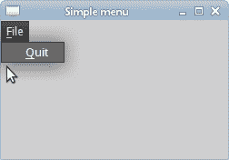
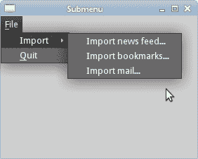
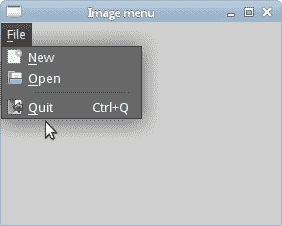

# 菜单和工具栏

> 原文： [http://zetcode.com/gui/rubyqt/menustoolbars/](http://zetcode.com/gui/rubyqt/menustoolbars/)

在 Ruby Qt 编程教程的这一部分中，我们将使用菜单和工具栏。

菜单栏是 GUI 应用中最可见的部分之一。 它是位于各个菜单中的一组命令。 在控制台应用中，您必须记住所有这些神秘命令，在这里，我们将大多数命令分组为逻辑部分。 有公认的标准可以进一步减少学习新应用的时间。 菜单将我们可以在应用中使用的命令分组。 使用工具栏可以快速访问最常用的命令。

## 简单菜单

第一个示例将显示一个简单的菜单。

```rb
#!/usr/bin/ruby

# ZetCode Ruby Qt tutorial
#
# This program shows a simple
# menu. It has one action, which
# will terminate the program, when
# selected. 
#
# author: Jan Bodnar
# website: www.zetcode.com
# last modified: November 2012

require 'Qt'

class QtApp < Qt::MainWindow

    def initialize
        super

        setWindowTitle "Simple menu"

        init_ui

        resize 250, 150
        move 300, 300

        show
    end

    def init_ui
        quit = Qt::Action.new "&Quit", self

        file = menuBar().addMenu "&File"
        file.addAction quit

        connect(quit, SIGNAL("triggered()"), 
            Qt::Application.instance, SLOT("quit()"))
    end

end

app = Qt::Application.new ARGV
QtApp.new
app.exec

```

我们有一个菜单栏，一个菜单和一个动作。 为了使用菜单，我们必须继承`MainWindow`小部件。

```rb
quit = Qt::Action.new "&Quit", self

```

此代码行创建一个`Action`。 每个`Menu`具有一个或多个动作对象。 注意 AND 字符（`&`）。 它为以下项目创建快捷方式： `Alt + Q` 。 它还强调了`Q`字符。 下拉菜单中的文件时，该快捷方式处于活动状态。

```rb
file = menuBar().addMenu "&File"
file.addAction quit

```

我们创建一个`Menu`对象。 ＆字符创建快捷方式： `Alt + F` 。 连续的快捷键 `Alt + F` ， `Alt + Q` 退出了应用。

```rb
connect(quit, SIGNAL("triggered()"), 
    Qt::Application.instance, SLOT("quit()"))

```

当我们从菜单中选择此选项时，应用退出。



图：简单菜单

## 子菜单

子菜单是插入另一个菜单对象的菜单。 下一个示例对此进行了演示。

```rb
#!/usr/bin/ruby

# ZetCode Ruby Qt tutorial
#
# This program creates a
# submenu
#
# author: Jan Bodnar
# website: www.zetcode.com
# last modified: November 2012

require 'Qt'

class QtApp < Qt::MainWindow

    def initialize
        super

        setWindowTitle "Submenu"

        init_ui

        resize 280, 200
        move 300, 300

        show
    end

    def init_ui
        quit = Qt::Action.new "&Quit", self

        file = menuBar().addMenu "&File"
        impm = Qt::Menu.new "Import"

        seeds = Qt::Action.new "Import news feed...", self
        marks = Qt::Action.new "Import bookmarks...", self
        mail = Qt::Action.new "Import mail...", self

        impm.addAction seeds
        impm.addAction marks
        impm.addAction mail

        file.addMenu impm
        file.addAction quit

        connect(quit, SIGNAL("triggered()"), 
            Qt::Application.instance, SLOT("quit()"))
    end    

end

app = Qt::Application.new ARGV
QtApp.new
app.exec

```

在示例中，文件菜单的子菜单中有三个选项。

```rb
file = menuBar().addMenu "&File"
impm = Qt::Menu.new "Import"

```

我们有两个`Menu`对象。 文件菜单和导入菜单。

```rb
seeds = Qt::Action.new "Import news feed...", self
marks = Qt::Action.new "Import bookmarks...", self
mail = Qt::Action.new "Import mail...", self

```

我们创建三个动作对象。

```rb
impm.addAction seeds
impm.addAction marks
impm.addAction mail

```

我们将动作对象添加到导入菜单中。

```rb
file.addMenu impm

```

最后，我们将导入菜单添加到文件菜单中。



图：子菜单

## 图像，菜单，分隔符

在以下示例中，我们将进一步增强以前的应用。 我们将在菜单中添加图标，使用快捷方式和分隔符。 请注意，默认情况下，可能会将 Gnome 桌面配置为不显示菜单图标。 在这种情况下，我们需要在 Gnome 接口配置中启用`menu_have_icons`选项。

```rb
gconftool-2 --type Boolean --set /desktop/gnome/interface/menus_have_icons True

```

我们可以使用上面的命令或`gconf-editor`工具。

```rb
#!/usr/bin/ruby

# ZetCode Ruby Qt tutorial
#
# This program shows image
# menus, shortcuts and a separator
#
# author: Jan Bodnar
# website: www.zetcode.com
# last modified: November 2012

require 'Qt'

class QtApp < Qt::MainWindow

    def initialize
        super

        setWindowTitle "Image menu"

        init_ui

        resize 280, 200
        move 300, 300

        show
    end

    def init_ui
        newpix = Qt::Icon.new "new.png"
        openpix = Qt::Icon.new "open.png"
        quitpix = Qt::Icon.new "exit.png"

        newa = Qt::Action.new newpix, "&New", self
        open = Qt::Action.new openpix, "&Open", self
        quit = Qt::Action.new quitpix, "&Quit", self
        quit.setShortcut "Ctrl+Q"

        file = menuBar().addMenu "&File"
        file.addAction newa
        file.addAction open
        file.addSeparator
        file.addAction quit

        connect(quit, SIGNAL("triggered()"), 
            Qt::Application.instance, SLOT("quit()"))
    end    

end

app = Qt::Application.new ARGV
QtApp.new
app.exec

```

在我们的示例中，我们有一个包含三个动作的菜单。 如果我们选择退出操作，则实际上只有退出操作才可以执行某些操作。 我们还创建了分隔符和 `Ctrl + Q` 快捷方式，它们将终止应用。

```rb
newpix = Qt::Icon.new "new.png"
openpix = Qt::Icon.new "open.png"
quitpix = Qt::Icon.new "exit.png"

```

这些是我们将在应用中使用的 PNG 图像。

```rb
newa = Qt::Action.new newpix, "&New", self
open = Qt::Action.new openpix, "&Open", self
quit = Qt::Action.new quitpix, "&Quit", self

```

在这里，我们创建三个动作对象。 第一个参数是`Icon`。

```rb
quit.setShortcut "Ctrl+Q"

```

这行创建一个快捷方式。 通过按下此快捷方式，我们将运行退出操作，这将退出应用。

```rb
file.addSeparator

```

我们创建一个分隔符。 分隔符是一条水平线，它使我们能够将菜单操作分组为一些逻辑部分。



图：图像s, shortcut and a separator

## 工具栏

`ToolBar`类提供了一个可移动面板，其中包含一组控件，这些控件提供对应用操作的快速访问。

```rb
#!/usr/bin/ruby

# ZetCode Ruby Qt tutorial
#
# This program creates a 
# toolbar
#
# author: Jan Bodnar
# website: www.zetcode.com
# last modified: November 2012

require 'Qt'

class QtApp < Qt::MainWindow

    def initialize
        super

        setWindowTitle "Toolbar"

        init_ui

        resize 250, 150
        move 300, 300

        show
    end

    def init_ui
        newpi = Qt::Icon.new "new2.png"
        openpi = Qt::Icon.new "open2.png"
        quitpi = Qt::Icon.new "exit2.png"

        toolbar = addToolBar "main toolbar"
        toolbar.addAction newpi, "New File" 
        toolbar.addAction openpi, "Open File"
        toolbar.addSeparator
        quit = toolbar.addAction quitpi, "Quit Application"

        connect(quit, SIGNAL("triggered()"), 
            Qt::Application.instance, SLOT("quit()"))
    end

end

app = Qt::Application.new ARGV
QtApp.new
app.exec

```

我们创建一个带有三个动作对象和一个分隔符的工具栏。

```rb
newpi = Qt::Icon.new "new2.png"
openpi = Qt::Icon.new "open2.png"
quitpi = Qt::Icon.new "exit2.png"

```

工具栏动作对象将显示这些图标。

```rb
toolbar = addToolBar "main toolbar"

```

`MainWindow`的`addToolBar`方法为应用创建一个工具栏。 文本字符串为工具栏命名。 此名称用于引用此工具栏，因为一个应用中可以有多个工具栏。 如果右键单击窗口区域，我们将看到一个可检查的选项，该选项显示或隐藏工具栏。

```rb
toolbar.addSeparator

```

我们创建一个垂直分隔符。

```rb
connect(quit, SIGNAL("triggered()"), 
    Qt::Application.instance, SLOT("quit()"))

```

当我们单击退出操作对象时，应用终止。


图：工具栏

## 撤销重做

以下示例演示了如何停用工具栏上的工具栏按钮。 这是 GUI 编程中的常见做法。 例如，保存按钮。 如果我们将文档的所有更改都保存到磁盘上，则在大多数文本编辑器中，“保存”按钮将被停用。 这样，应用会向用户指示所有更改都已保存。

```rb
#!/usr/bin/ruby

# ZetCode Ruby Qt tutorial
#
# This program disables/enables
#  actions on a toolbar
#
# author: Jan Bodnar
# website: www.zetcode.com
# last modified: November 2012

require 'Qt'

class QtApp < Qt::MainWindow

    slots 'count()'

    def initialize
        super

        setWindowTitle "Toolbar"

        init_ui

        resize 250, 150
        move 300, 300

        show
    end

    def init_ui

        @count = 2

        undoi = Qt::Icon.new "undo.png"
        redoi = Qt::Icon.new "redo.png"
        quitpi = Qt::Icon.new "quit.png"

        toolbar = addToolBar "first toolbar"

        @und = toolbar.addAction undoi, "Undo"
        @red = toolbar.addAction redoi, "Redo"

        connect @und, SIGNAL("triggered()"), self, SLOT("count()")
        connect @red, SIGNAL("triggered()"), self, SLOT("count()")

        toolbar.addSeparator

        quit = toolbar.addAction quitpi, "Quit Application"

        connect quit, SIGNAL("triggered()"), 
            Qt::Application.instance, SLOT("quit()")
    end

    def count

        action = sender

        if "Undo" == action.text
            @count = @count - 1
        else 
            @count = @count + 1
        end

        if @count <= 0
            @und.setDisabled true
            @red.setDisabled false
        end

        if @count >= 5
            @und.setDisabled false
            @red.setDisabled true
        end

    end   
end

app = Qt::Application.new ARGV
QtApp.new
app.exec

```

在我们的示例中，我们有三个`Action`对象和一个分隔符。 在撤消或重做按钮上单击几下后，它们将被停用。 外观上，按钮显示为灰色。

```rb
@count = 2

```

`@count`变量确定哪个按钮被激活和禁用。

```rb
connect @und, SIGNAL("triggered()"), self, SLOT("count()")
connect @red, SIGNAL("triggered()"), self, SLOT("count()")

```

单击工具栏按钮，将发射`triggered`信号。 我们将此信号连接到`count`方法。

```rb
action = sender

```

工具栏上的两个按钮都调用`count`方法。 我们需要在它们之间说出来。 这条线确定哪个动作对象实际发出信号。

```rb
if "Undo" == action.text
    @count = @count - 1
else 
    @count = @count + 1
end

```

撤消工具栏按钮从计数变量中减去 1。 重做添加 1.根据计数变量的值，我们启用或禁用工具栏按钮。

```rb
if @count <= 0
    @und.setDisabled true
    @red.setDisabled false
end

```

`setDisabled`方法激活或停用工具栏按钮。


图：撤销和重做

在 Ruby Qt 教程的这一部分中，我们提到了菜单和工具栏。