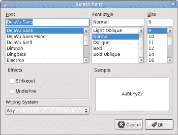

# Ruby Qt 中的对话框

> 原文： [http://zetcode.com/gui/rubyqt/dialogs/](http://zetcode.com/gui/rubyqt/dialogs/)

在 Ruby Qt 编程教程的这一部分中，我们将使用对话框。

对话框窗口或对话框是大多数现代 GUI 应用必不可少的部分。 对话被定义为两个或更多人之间的对话。 在计算机应用中，对话框是一个窗口，用于与应用“对话”。 对话框用于输入数据，修改数据，更改应用设置等。对话框是用户与计算机程序之间进行通信的重要手段。

## `MessageDialog`

消息框是方便的对话框，可向应用的用户提供消息。 该消息由文本和图像数据组成。

```rb
#!/usr/bin/ruby

# ZetCode Ruby Qt tutorial
#
# This program demonstrates
# MessageBox dialogs
#
# author: jan bodnar
# website: www.zetcode.com
# last modified: July 2009

require 'Qt'

class QtApp < Qt::Widget

    slots 'showDialog()'

    def initialize
        super

        setWindowTitle "Message dialogs"

        init_ui

        resize 250, 150
        move 300, 300

        show
    end

    def init_ui

        grid = Qt::GridLayout.new self
        grid.setSpacing 2

        error = Qt::PushButton.new "Error", self
        warning = Qt::PushButton.new "Warning", self
        question = Qt::PushButton.new "Question", self
        information = Qt::PushButton.new "Information", self
        about = Qt::PushButton.new "About", self

        grid.addWidget error, 0, 0
        grid.addWidget warning, 0, 1
        grid.addWidget question, 1, 0
        grid.addWidget information, 1, 1
        grid.addWidget about, 2, 0

        connect(error, SIGNAL("clicked()"),
            self, SLOT("showDialog()"))

        connect(warning, SIGNAL("clicked()"),
            self, SLOT("showDialog()"))

        connect(question, SIGNAL("clicked()"),
            self, SLOT("showDialog()"))

        connect(information, SIGNAL("clicked()"),
            self, SLOT("showDialog()"))

        connect(about, SIGNAL("clicked()"),
            self, SLOT("showDialog()"))

    end   

    def showDialog

        button = sender

        if "Error" == button.text
            Qt::MessageBox.critical self, "Error", "Error loading file!"
        elsif "Warning" == button.text
            Qt::MessageBox.warning self, "Warning", "Operation not permitted!"
        elsif "Question" == button.text
            Qt::MessageBox.question self, "Question", "Are you sure to quit?"
        elsif "Information" == button.text
            Qt::MessageBox.information self, "Information", "Download completed."
        elsif "About" == button.text
            Qt::MessageBox.about self, "About", "ZetCode Ruby Qt tutorial."
        end
    end

end

app = Qt::Application.new ARGV
QtApp.new
app.exec

```

我们使用`GridLayout`管理器来设置五个按钮的网格。 每个按钮显示一个不同的消息框。

```rb
if "Error" == button.text
    Qt::MessageBox.critical self, "Error", "Error loading file!"

```

如果按下错误按钮，则会显示错误对话框。 我们使用`MessageBox`类的静态方法来显示消息框。


图：信息对话框

## `Qt::InputDialog`

`Qt::InputDialog`类提供了一个简单的便捷对话框，可从用户那里获取单个值。 输入值可以是字符串，数字或列表中的项目。 必须设置标签以告知用户他们应该输入什么。

```rb
#!/usr/bin/ruby

# ZetCode Ruby Qt tutorial
#
# This program shows an input
# dialog
#
# author: jan bodnar
# website: www.zetcode.com
# last modified: July 2009

require 'Qt'

class QtApp < Qt::Widget

    slots 'showDialog()'

    def initialize
        super

        setWindowTitle "Input dialog"

        init_ui

        resize 400, 80
        move 300, 300

        show
    end

    def init_ui

        show = Qt::PushButton.new "Dialog", self

        connect(show, SIGNAL("clicked()"),
            self, SLOT("showDialog()"))

        show.move 20, 20

        @edit = Qt::LineEdit.new self
        @edit.move 130, 22

    end   

    def showDialog

        text = Qt::InputDialog.getText self, "Input Dialog",
            "Enter your name"

        if text != nil 
            name = text.strip
            if not name.empty?
                @edit.setText name
            end
        end
    end

end

app = Qt::Application.new ARGV
QtApp.new
app.exec

```

在代码示例中，我们有一个按钮和一行编辑。 该按钮显示一个输入对话框。 我们得到一些文本，文本显示在行编辑小部件中。

```rb
text = Qt::InputDialog.getText self, "Input Dialog",
    "Enter your name"

```

`getText`静态方法创建输入对话框。 对话框中的文本存储在`text`变量中。

```rb
if text != nil 
    name = text.strip
    if not name.empty?
        @edit.setText name
    end
end

```

在更新行编辑之前，请确保`text`变量不为`null`且不为空，并且不仅由空格组成。


图：输入对话框

## `Qt::ColorDialog`

`Qt::ColorDialog`类提供一个用于指定颜色的对话框小部件。 颜色对话框的功能是允许用户选择颜色。

```rb
#!/usr/bin/ruby

# ZetCode Ruby Qt tutorial
#
# In this program, we use the
# ColorDialog to change the color
# of a label text
#
# author: jan bodnar
# website: www.zetcode.com
# last modified: July 2009

require 'Qt'

class QtApp < Qt::Widget

    slots 'showDialog()'

    def initialize
        super

        setWindowTitle "Color dialog"

        init_ui

        resize 400, 300
        move 300, 300

        show
    end

    def init_ui

        @label = Qt::Label.new "ZetCode Ruby Qt tutorial", self

        vbox = Qt::VBoxLayout.new self
        @label.setAlignment Qt::AlignCenter
        vbox.addWidget @label

    end   

    def mousePressEvent event

        color = Qt::ColorDialog.getColor

        if not color.isValid
            return
        end

        @label.setStyleSheet "QWidget { color: %s }" % color.name
    end

end

app = Qt::Application.new ARGV
QtApp.new
app.exec

```

我们在窗口中心显示一些文本。 通过单击窗口区域，我们显示一个颜色对话框。 我们将文本前景色更改为从对话框中选择的颜色。

```rb
def mousePressEvent event
    ...
end

```

为了接收我们窗口的鼠标按下事件，我们必须重新实现`mousePressEvent`方法。

```rb
color = Qt::ColorDialog.getColor

```

正在创建`ColorDialog`。 所选颜色存储在`color`变量中。

```rb
@label.setStyleSheet "QWidget { color: %s }" % color.name

```

在这里，我们更新标签文本的前景色。


图：`Qt::ColorDialog`

## `Qt::FontDialog`

`Qt::FontDialog`类提供用于选择字体的对话框小部件。

```rb
#!/usr/bin/ruby

# ZetCode Ruby Qt tutorial
#
# In this program, we use the
# FontDialog to change the font
# of a label text
#
# author: jan bodnar
# website: www.zetcode.com
# last modified: July 2009

require 'Qt'

class QtApp < Qt::Widget

    slots 'showDialog()'

    def initialize
        super

        setWindowTitle "Font dialog"

        init_ui

        resize 400, 300
        move 300, 300

        show
    end

    def init_ui

        @label = Qt::Label.new "ZetCode Ruby Qt tutorial", self

        vbox = Qt::VBoxLayout.new self
        @label.setAlignment Qt::AlignCenter
        vbox.addWidget @label

    end   

    def mousePressEvent event

        ok = Qt::Boolean.new
        font = Qt::FontDialog.getFont ok

        if not ok 
            return
        end

        @label.setFont font
    end
end

app = Qt::Application.new ARGV
QtApp.new
app.exec

```

此示例与上一个示例相似。 这次，我们更改文本的字体。

```rb
font = Qt::FontDialog.getFont ok

```

正在创建`Qt::FontDialog`。

```rb
if not ok 
    return
end

```

如果单击对话框的“确定”按钮，则布尔值`ok`变量为`true`。 如果按下了取消按钮，我们将从方法中返回。

```rb
@label.setFont font

```

我们将标签更新为新选择的字体。



图：`Qt::FontDialog`

在 Ruby Qt 教程的这一部分中，我们使用了对话框窗口。