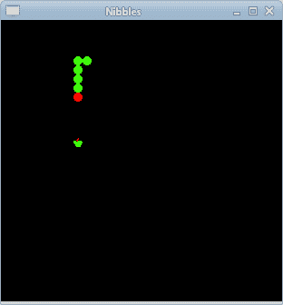

# Ruby Qt 中的贪食蛇

> 原文： [http://zetcode.com/gui/rubyqt/nibbles/](http://zetcode.com/gui/rubyqt/nibbles/)

在 Ruby Qt 编程教程的这一部分中，我们将创建一个贪食蛇游戏克隆。

贪食蛇是较旧的经典视频游戏。 它最初是在 70 年代后期创建的。 后来它被带到 PC 上。 在这个游戏中，玩家控制蛇。 目的是尽可能多地吃苹果。 蛇每次吃一个苹果，它的身体就会长大。 蛇必须避开墙壁和自己的身体。

## 开发

蛇的每个关节的大小为 10px。 蛇由光标键控制。 最初，蛇具有三个关节。 游戏立即开始。 游戏结束后，我们在窗口中心显示“`Game Over`”消息。

`Board.rb`

```
WIDTH = 300
HEIGHT = 300
DOT_SIZE = 10
ALL_DOTS = WIDTH * HEIGHT / (DOT_SIZE * DOT_SIZE)
RAND_POS = 29
DELAY = 140

$x = [0] * ALL_DOTS
$y = [0] * ALL_DOTS

class Board < Qt::Widget

    def initialize(parent)
        super(parent)

        setFocusPolicy Qt::StrongFocus

        initGame
    end

    def initGame

        @left = false
        @right = true
        @up = false
        @down = false
        @inGame = true
        @dots = 3

        begin
            @ball = Qt::Image.new "dot.png"
            @apple = Qt::Image.new "apple.png"
            @head = Qt::Image.new "head.png"
        rescue
            puts "cannot load images"
        end

        for i in (0..@dots)
            $x[i] = 50 - i * 10
            $y[i] = 50
        end

        locateApple
        setStyleSheet "QWidget { background-color: #000000 }"

        @timer = Qt::BasicTimer.new 
        @timer.start(140, self)

    end

    def paintEvent event

        painter = Qt::Painter.new
        painter.begin self

        if @inGame
            drawObjects painter
        else 
            gameOver painter
        end

        painter.end
    end

    def drawObjects painter

        painter.drawImage @apple_x, @apple_y, @apple

        for z in (0..@dots)
            if z == 0
                painter.drawImage $x[z], $y[z], @head
            else 
                painter.drawImage $x[z], $y[z], @ball
            end
        end
    end

    def gameOver painter
        msg = "Game Over"
        small = Qt::Font.new "Helvetica", 12,
            Qt::Font::Bold.value

        metr = Qt::FontMetrics.new small

        textWidth = metr.width msg
        h = height
        w = width

        painter.setPen Qt::Color.new Qt::white
        painter.setFont small
        painter.translate Qt::Point.new w/2, h/2
        painter.drawText -textWidth/2, 0, msg
    end

    def checkApple

        if $x[0] == @apple_x and $y[0] == @apple_y 
            @dots = @dots + 1
            locateApple
        end
    end

    def move

        z = @dots

        while z > 0
            $x[z] = $x[(z - 1)]
            $y[z] = $y[(z - 1)]
            z = z - 1
        end

        if @left
            $x[0] -= DOT_SIZE
        end

        if @right 
            $x[0] += DOT_SIZE
        end

        if @up
            $y[0] -= DOT_SIZE
        end

        if @down
            $y[0] += DOT_SIZE
        end

     end

    def checkCollision

        z = @dots

        while z > 0
            if z > 4 and $x[0] == $x[z] and $y[0] == $y[z]
                @inGame = false
            end
            z = z - 1
        end

        if $y[0] > HEIGHT
            @inGame = false
        end

        if $y[0] < 0
            @inGame = false
        end

        if $x[0] > WIDTH
            @inGame = false
        end

        if $x[0] < 0
            @inGame = false
        end    

    end

    def locateApple

        r = rand RAND_POS
        @apple_x = r * DOT_SIZE
        r = rand RAND_POS
        @apple_y = r * DOT_SIZE
    end

    def timerEvent event

        if @inGame 
            checkApple
            checkCollision
            move
        else 
            @timer.stop
        end

        repaint
    end

    def keyPressEvent event

        key = event.key

        if key == Qt::Key_Left.value and not @right
            @left = true
            @up = false
            @down = false
        end

        if key == Qt::Key_Right.value and not @left
            @right = true
            @up = false
            @down = false
        end

        if key == Qt::Key_Up.value and not @down
            @up = true
            @right = false
            @left = false            
        end

        if key == Qt::Key_Down.value and not @up
            @down = true
            @right = false
            @left = false
        end
    end
end

```

首先，我们将定义一些在游戏中使用的常量。

`WIDTH`和`HEIGHT`常数确定电路板的大小。 `DOT_SIZE`是苹果的大小和蛇的点。 `ALL_DOTS`常数定义了板上可能的最大点数。 `RAND_POS`常数用于计算苹果的随机位置。 `DELAY`常数确定游戏的速度。

```
$x = [0] * ALL_DOTS
$y = [0] * ALL_DOTS

```

这两个数组存储蛇的所有可能关节的 x，y 坐标。

`initGame`方法初始化变量，加载图像并启动超时功能。

```
if @inGame
    drawObjects painter
else 
    gameOver painter
end

```

在`paintEvent`方法内部，我们检查`@inGame`变量。 如果为真，则绘制对象。 苹果和蛇的关节。 否则，我们显示“游戏结束”文本。

```
def drawObjects painter

    painter.drawImage @apple_x, @apple_y, @apple

    for z in (0..@dots)
        if z == 0
            painter.drawImage $x[z], $y[z], @head
        else 
            painter.drawImage $x[z], $y[z], @ball
        end
    end
end

```

`drawObjects`方法绘制苹果和蛇的关节。 蛇的第一个关节是其头部，用红色圆圈表示。

```
def checkApple

    if $x[0] == @apple_x and $y[0] == @apple_y 
        @dots = @dots + 1
        locateApple
    end
end

```

`checkApple`方法检查蛇是否击中了苹果对象。 如果是这样，我们添加另一个蛇形关节并调用`locateApple`方法，该方法将随机放置一个新的`Apple`对象。

在`move`方法中，我们有游戏的密钥算法。 要了解它，请看一下蛇是如何运动的。 您控制蛇的头。 您可以使用光标键更改其方向。 其余关节在链上向上移动一个位置。 第二关节移动到第一个关节的位置，第三关节移动到第二个关节的位置，依此类推。

```
while z > 0
    $x[z] = $x[(z - 1)]
    $y[z] = $y[(z - 1)]
    z = z - 1
end

```

该代码将关节向上移动。

```
if @left
    $x[0] -= DOT_SIZE
end

```

将头向左移动。

在`checkCollision`方法中，我们确定蛇是否击中了自己或撞墙之一。

```
while z > 0
    if z > 4 and $x[0] == $x[z] and $y[0] == $y[z]
        @inGame = false
    end
    z = z - 1
end

```

如果蛇用头撞到关节之一，我们就结束游戏。

```
if $y[0] > HEIGHT
    @inGame = false
end

```

如果蛇击中了棋盘的底部，我们就结束了游戏。

`locateApple`方法在板上随机放置一个苹果。

```
r = rand RAND_POS

```

我们得到一个从 0 到`RAND_POS-1`的随机数。

```
@apple_x = r * DOT_SIZE
...
@apple_y = r * DOT_SIZE

```

这些行设置了`apple`对象的 x 和 y 坐标。

```
if @inGame 
    checkApple
    checkCollision
    move
else 
    @timer.stop
end

```

每 140 毫秒，将调用`timerEvent`方法。 如果我们参与了游戏，我们将调用三种构建游戏逻辑的方法。 否则，我们将停止计时器。

在`Board`类的`keyPressEvent`方法中，我们确定按下的键。

```
if key == Qt::Key_Left.value and not @right
    @left = true
    @up = false
    @down = false
end

```

如果单击左光标键，则将`@left`变量设置为`true`。 在`move`方法中使用此变量来更改蛇对象的坐标。 还要注意，当蛇向右行驶时，我们不能立即向左转。

`Nibbles.rb`

```
#!/usr/bin/ruby

# ZetCode Ruby Qt tutorial
#
# In this program, we create
# a Nibbles game clone.
#
# author: Jan Bodnar
# website: www.zetcode.com
# last modified: September 2012

require 'Qt'
require 'Board'

class QtApp < Qt::MainWindow

    def initialize
        super

        setWindowTitle "Nibbles"

        setCentralWidget Board.new(self)

        resize 310, 310
        move 300, 300

        show
    end
end

app = Qt::Application.new ARGV
QtApp.new
app.exec

```

在`Nibbles.rb`文件中，我们设置了贪食蛇游戏。



Figure: Nibbles

这是使用 Qt 库和 Ruby 编程语言编程的贪食蛇电脑游戏。