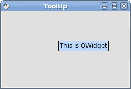
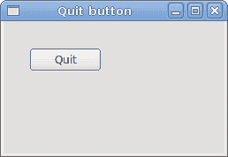

# Qyoto 介绍

> 原文： [http://zetcode.com/gui/vbqyoto/introduction/](http://zetcode.com/gui/vbqyoto/introduction/)

在 Visual Basic Qyoto 编程教程的这一部分中，我们将介绍 Qyoto 库并使用 Visual Basic 编程语言创建第一个 Qyoto 程序。

本教程的目的是帮助您开始使用 Qyoto 和 Visual Basic。 可以在此处下载本教程中使用的图像。 我使用了 Gnome 项目的探戈图标包中的一些图标。

## 关于

`Qyoto`是一个库，提供 Qt 库与.NET 语言（如 C# 或 Visual Basic）的绑定。 Qt 是功能强大的跨平台应用程序开发框架。 它的母语是 C++ 。 Qyoto 是 KDE 桌面环境的一部分。

```
vbnc -r:/usr/lib/cli/qyoto-4.3/qt-dotnet.dll quitbutton.vb

```

上面的命令显示了如何编译 quitbutton 示例。 mono VB 编译器的-r 参数加载 Qt 程序集。 这是一个动态库。 该命令显示了 Ubuntu 系统上 dll 库的路径。

## 创建工具提示

第一个示例将显示一个工具提示。 工具提示是一个小的矩形窗口，它提供有关对象的简短信息。 它通常是一个 GUI 组件。 它是应用程序帮助系统的一部分。

```
' ZetCode Mono Visual Basic Qt tutorial
'
' This program displays
' a tooltip
'
' author jan bodnar
' last modified May 2009
' website www.zetcode.com

Imports Qyoto

Public Class VBQApp 
    Inherits QWidget

    Public Sub New()

        Me.InitUI()

    End Sub

    Private Sub InitUI()

        Me.Tooltip = "This is QWidget"

        Me.SetWindowTitle("Tooltip")
        Me.Resize(250, 150)
        Me.Move(300, 300)
        Me.Show()

    End Sub

    Public Shared Sub Main(ByVal args() As String)
        Dim qapp As New QApplication(args)
        Dim app As New VBQApp
        QApplication.Exec()
    End Sub

End Class

```

该示例创建一个窗口。 如果将鼠标指针悬停在窗口区域上方，则会弹出一个工具提示。

```
Imports Qyoto

```

`Imports`关键字导入我们将在应用程序中使用的必要类型。

```
Public Class VBQApp 
    Inherits QWidget

```

该示例继承自`QWidget`。 QWidget 类是所有用户界面对象的基类。 小部件是用户界面的原子。 它从窗口系统接收鼠标，键盘和其他事件。

```
Me.SetWindowTitle("Tooltip")

```

此方法调用为窗口创建标题。

```
Me.Tooltip = "This is QWidget"

```

我们通过`ToolTip`属性设置工具提示。

```
Me.Resize(250, 150)

```

在这里，我们设置窗口的宽度和高度。

```
Me.Move(300, 300)

```

`Move()`方法在屏幕上移动窗口。

```
Me.Show()

```

一切准备就绪后，我们在屏幕上显示窗口。

```
Dim qapp As New QApplication(args)
Dim app As New VBQApp
QApplication.Exec()

```

这三行设置了应用程序。



Figure: Tooltip

## 使窗口居中

在第二个示例中，我们将窗口置于屏幕中央。

```
' ZetCode Mono Visual Basic Qt tutorial
'
' This program centers a window
' on the screen
'
' author jan bodnar
' last modified May 2009
' website www.zetcode.com

Imports Qyoto

Public Class VBQApp 
    Inherits QWidget

    Dim WIDTH As Integer = 250
    Dim HEIGHT As Integer = 150

    Public Sub New()

        Me.InitUI()

    End Sub

    Private Sub InitUI()

        Dim qdw As New QDesktopWidget

        Dim screenWidth As Integer = qdw.Width()
        Dim screenHeight As Integer = qdw.Height()

        Dim x As Integer = (screenWidth - WIDTH) / 2
        Dim y As Integer = (screenHeight - HEIGHT) / 2

        Me.SetWindowTitle("Center")
        Me.Resize(WIDTH, HEIGHT)
        Me.Move(x, y)
        Me.Show()

    End Sub

    Public Shared Sub Main(ByVal args() As String)
        Dim qapp As New QApplication(args)
        Dim app As New VBQApp
        QApplication.Exec()
    End Sub

End Class

```

Qyoto 没有使窗口居中的单一方法。

```
Dim WIDTH As Integer = 250
Dim HEIGHT As Integer = 150

```

这两个常数定义了应用程序窗口的宽度和高度。

```
Dim qdw As New QDesktopWidget

```

`QDesktopWidget`类提供有关屏幕的信息。

```
Dim screenWidth As Integer = qdw.Width()
Dim screenHeight As Integer = qdw.Height()

```

在这里，我们确定屏幕的宽度和高度。

```
Dim x As Integer = (screenWidth - WIDTH) / 2
Dim y As Integer = (screenHeight - HEIGHT) / 2

```

在这里，我们计算居中窗口的 x，y 坐标。 为了使窗口在屏幕上居中，我们需要知道屏幕的大小和窗口的大小。

```
Me.Move(x, y)

```

我们将窗口移至计算出的 x，y 坐标。

## 退出按钮

在本节的最后一个示例中，我们将创建一个退出按钮。 当我们按下此按钮时，应用程序终止。

```
' ZetCode Mono Visual Basic Qt tutorial
'
' This program creates a quit
' button. When we press the button,
' the application terminates. 
'
' author jan bodnar
' last modified May 2009
' website www.zetcode.com

Imports Qyoto

Public Class VBQApp 
    Inherits QWidget

    Public Sub New()

        Me.SetWindowTitle("Quit button")

        Me.InitUI()

        Me.Resize(250, 150)
        Me.Move(300, 300)
        Me.Show()

    End Sub

    Private Sub InitUI()

        Dim quit As New QPushButton("Quit", Me)

        Connect(quit, SIGNAL("clicked()"), qApp, SLOT("quit()"))
        quit.Move(30, 30)

    End Sub

    Public Shared Sub Main(ByVal args() As String)
        Dim qapp As New QApplication(args)
        Dim app As New VBQApp
        QApplication.Exec()
    End Sub

End Class

```

我们使用`QPushButton`。 这是一个非常常见的小部件。 它是矩形的，通常显示一个文本标签。

```
Me.InitUI()

```

我们将用户界面的创建委托给`InitUI()`方法。

```
Dim quit As New QPushButton("Quit", Me)

```

我们创建按钮小部件。 构造函数的第一个参数是标签，按钮将显示该标签。 第二个参数是按钮的父窗口小部件。

```
Connect(quit, SIGNAL("clicked()"), qApp, SLOT("quit()"))

```

当我们点击按钮时，会发出`clicked()`信号。 `Connect()`方法将信号连接到对象的特定槽。 该方法的第一个参数是接收信号的对象。 在我们的例子中，它是应用程序对象。 第二个参数是方法，称为。 在我们的情况下，它是应用程序对象的`quit()`方法。 `qApp`是对应用程序对象的全局引用。



Figure: Quit button

本节介绍了使用 Visual Basic 语言的 Qyoto 库。