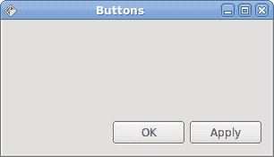
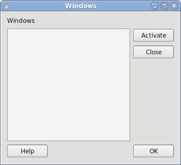

# 布局管理

> 原文： [http://zetcode.com/gui/vbqyoto/layoutmanagement/](http://zetcode.com/gui/vbqyoto/layoutmanagement/)

在 Visual Basic Qyoto 编程教程的这一部分中，我们将介绍布局管理器。

在设计应用的 GUI 时，我们决定要使用哪些组件以及如何在应用中组织这些组件。 为了组织我们的组件，我们使用专门的不可见对象，称为布局管理器。 Qyoto 中有多个选项。 我们可以使用绝对定位，内置布局管理器或创建自定义布局管理器。 我们还可以使用 Qt Designer 直观地构建布局。

Qyoto 有一些重要的内置布局管理器。 `QVBoxLayout`类垂直排列小部件。 `QHBoxLayout`水平排列小部件。 `QGridLayout`类将小部件布置在网格中。 网格布局是最灵活的布局管理器。 盒子布局相互嵌套以创建复杂的布局。

## 绝对定位

在大多数情况下，程序员应使用布局管理器。 在某些情况下，我们可以使用绝对定位。 在绝对定位中，程序员以像素为单位指定每个小部件的位置和大小。 如果我们调整窗口大小，则小部件的大小和位置不会改变。 在各种平台上，应用看起来都不同，在 Linux 上看起来不错，在 Mac OS 上看起来不太正常。 在我们的应用中更改字体可能会破坏布局。 如果我们将您的应用翻译成另一种语言，则必须重做布局。 对于所有这些问题，仅在有理由时才使用绝对定位。

```vb
' ZetCode Mono Visual Basic Qt tutorial
'
' In this program, we lay out widgets
' using absolute positioning
'
' author jan bodnar
' last modified May 2009
' website www.zetcode.com

Imports Qyoto

Public Class VBQApp 
    Inherits QMainWindow

    Dim bardejov As QPixmap
    Dim rotunda As QPixmap 
    Dim mincol As QPixmap

    Public Sub New()

        Me.SetWindowTitle("Absolute")

        Me.InitUI()

        Me.Resize(300, 280)
        Me.Move(300, 300)
        Me.Show()

    End Sub

    Private Sub InitUI()

        SetStyleSheet("QWidget { background-color: #414141 }")

        Try 
            bardejov = New QPixmap("bardejov.jpg")
            rotunda = New QPixmap("rotunda.jpg")
            mincol = New QPixmap("mincol.jpg")
        Catch e As Exception
            Console.WriteLine(e.Message)
            Environment.Exit(1)
        End Try

        Dim barLabel As New QLabel(Me)
        barLabel.SetPixmap(bardejov)
        barLabel.SetGeometry(20, 20, 120, 90)

        Dim rotLabel As New QLabel(Me)
        rotLabel.SetPixmap(rotunda)
        rotLabel.SetGeometry(40, 160, 120, 90)

        Dim minLabel As New QLabel(Me)
        minLabel.SetPixmap(mincol)
        minLabel.SetGeometry(170, 50, 120, 90)

    End Sub

    Public Shared Sub Main(ByVal args() As String)
        Dim qapp As New QApplication(args)
        Dim app As New VBQApp
        QApplication.Exec()
    End Sub

End Class

```

在此示例中，我们使用绝对定位显示了三幅图像。

```vb
Dim barLabel As New QLabel(Me)
barLabel.SetPixmap(bardejov)

```

`QLabel`小部件用于保存图像。

```vb
barLabel.SetGeometry(20, 20, 120, 90)

```

我们使用`SetGeometry()`方法将标签放置在窗口上的`x = 20`，`y = 20`处。 图片大小为`120x90`。

调整窗口大小时，标签将保留其初始大小。


图：绝对定位

## 按钮示例

在下面的示例中，我们将在窗口的右下角放置两个按钮。

```vb
' ZetCode Mono Visual Basic Qt tutorial
'
' In this program, use box layouts
' to position two buttons in the
' bottom right corner of the window
'
' author jan bodnar
' last modified May 2009
' website www.zetcode.com

Imports Qyoto

Public Class VBQApp 
    Inherits QWidget

    Public Sub New()

        Me.SetWindowTitle("Buttons")

        Me.InitUI()

        Me.Resize(300, 150)
        Me.Move(300, 300)
        Me.Show()

    End Sub

    Private Sub InitUI()

        Dim vbox As New QVBoxLayout(Me)
        Dim hbox As New QHBoxLayout

        Dim ok As New QPushButton("OK", Me)
        Dim apply As New QPushButton("Apply", Me)

        hbox.AddWidget(ok, 1, Qt.AlignmentFlag.AlignRight)
        hbox.AddWidget(apply)

        vbox.AddStretch(1)
        vbox.AddLayout(hbox)

    End Sub

    Public Shared Sub Main(ByVal args() As String)
        Dim qapp As New QApplication(args)
        Dim app As New VBQApp
        QApplication.Exec()
    End Sub

End Class

```

我们使用嵌套框布局来获得我们想要的布局。

```vb
Dim vbox As New QVBoxLayout(Me)
Dim hbox As New QHBoxLayout

```

我们使用一个垂直框和一个水平框。

```vb
Dim ok As New QPushButton("OK", Me)
Dim apply As New QPushButton("Apply", Me)

```

这是两个将进入窗口右下角的按钮。

```vb
hbox.AddWidget(ok, 1, Qt.AlignmentFlag.AlignRight)

```

我们将确定按钮放入水平框中。 第二个参数是`stretch`因子。 它将扩大分配给“确定”按钮的区域。 它会占用所有可用空间。 在此区域内，按钮向右对齐。

```vb
vbox.AddStretch(1)

```

这条线创建了一个垂直扩展的白色空间，它将带有按钮的水平框推到底部。

```vb
vbox.AddLayout(hbox)

```

水平框嵌套在垂直框中。



图：按钮示例

## Windows 示例

以下是嵌套框布局更复杂的示例。

```vb
' ZetCode Mono Visual Basic Qt tutorial
'
' In this program, use box layouts
' to create a windows example
'
' author jan bodnar
' last modified May 2009
' website www.zetcode.com

Imports Qyoto

Public Class VBQApp 
    Inherits QWidget

    Public Sub New()

        Me.SetWindowTitle("Windows")

        Me.InitUI()

        Me.Resize(350, 300)
        Me.Move(300, 300)
        Me.Show()

    End Sub

    Private Sub InitUI()

        Dim vbox As New QVBoxLayout(Me)

        Dim vbox1 As New QVBoxLayout
        Dim hbox1 As New QHBoxLayout
        Dim hbox2 As New QHBoxLayout

        Dim windLabel As New QLabel("Windows", Me)
        Dim edit As New QTextEdit(Me)
        edit.SetEnabled(False)

        Dim activate As New QPushButton("Activate", Me)
        Dim close As New QPushButton("Close", Me)
        Dim help As New QPushButton("Help", Me)
        Dim ok As New QPushButton("OK", Me)

        vbox.AddWidget(windLabel)

        vbox1.AddWidget(activate)
        vbox1.AddWidget(close, 0, AlignmentFlag.AlignTop)
        hbox1.AddWidget(edit)
        hbox1.AddLayout(vbox1)

        vbox.AddLayout(hbox1)

        hbox2.AddWidget(help)
        hbox2.AddStretch(1)
        hbox2.AddWidget(ok)

        vbox.AddLayout(hbox2, 1)

    End Sub

    Public Shared Sub Main(ByVal args() As String)
        Dim qapp As New QApplication(args)
        Dim app As New VBQApp
        QApplication.Exec()
    End Sub

End Class

```

在此布局中，我们使用两个垂直和水平框。

```vb
Dim vbox As New QVBoxLayout(Me)

```

这是示例的基本布局。

```vb
vbox.AddWidget(windLabel)

```

首先是标签小部件。 它只是转到垂直框的顶部。

```vb
vbox1.AddWidget(activate)
vbox1.AddWidget(close, 0, AlignmentFlag.AlignTop)
hbox1.AddWidget(edit)
hbox1.AddLayout(vbox1)

vbox.AddLayout(hbox1)

```

在窗口的中心部分，我们有一个文本编辑小部件和两个垂直排列的按钮。 这些按钮进入垂直框。 在此垂直框中，按钮与顶部对齐。 垂直框和文本编辑进入水平框。 该水平框转到标签窗口小部件正下方的基本垂直框。

```vb
hbox2.AddWidget(help)
hbox2.AddStretch(1)
hbox2.AddWidget(ok)

vbox.AddLayout(hbox2, 1)

```

帮助和确定按钮进入另一个水平框。 这两个按钮之间有一个扩大的空白区域。 同样，水平框转到基本垂直框。



图：窗口示例

## 新文件夹示例

在最后一个示例中，我们使用`QGridLayout`管理器创建“新文件夹”布局示例。

```vb
' ZetCode Mono Visual Basic Qt tutorial
'
' In this program, use the QGridLayout
' to create a New Folder example
'
' author jan bodnar
' last modified May 2009
' website www.zetcode.com

Imports Qyoto

Public Class VBQApp 
    Inherits QWidget

    Public Sub New()

        Me.SetWindowTitle("New Folder")

        Me.InitUI()

        Me.Resize(350, 300)
        Me.Move(300, 300)
        Me.Show()

    End Sub

    Private Sub InitUI()

        Dim grid As New QGridLayout(Me)

        Dim nameLabel As New QLabel("Name", Me)
        Dim nameEdit As New QLineEdit(Me)
        Dim text As New QTextEdit(Me)
        Dim okButton As New QPushButton("OK", Me)
        Dim closeButton As New QPushButton("Close", Me)

        grid.AddWidget(nameLabel, 0, 0)
        grid.AddWidget(nameEdit, 0, 1, 1, 3)
        grid.AddWidget(text, 1, 0, 2, 4)
        grid.SetColumnStretch(1, 1)
        grid.AddWidget(okButton, 4, 2)
        grid.AddWidget(closeButton, 4, 3)

    End Sub

    Public Shared Sub Main(ByVal args() As String)
        Dim qapp As New QApplication(args)
        Dim app As New VBQApp
        QApplication.Exec()
    End Sub

End Class

```

在我们的示例中，我们有一个标签，一行编辑，一个文本编辑和两个按钮。

```vb
Dim grid As New QGridLayout(Me)

```

我们创建`QGridLayout`管理器的实例。

```vb
grid.AddWidget(nameLabel, 0, 0)

```

我们将标签小部件放置在网格的第一个单元格中。 单元格从 0 开始计数。最后两个参数是行号和列号。

```vb
grid.AddWidget(nameEdit, 0, 1, 1, 3)

```

线编辑窗口小部件位于第一行第二列。 最后两个参数是行跨度和列跨度。 在水平方向上，小部件将跨越三列。

```vb
grid.SetColumnStretch(1, 1)

```

该方法的参数是列号和拉伸因子。 在这里，我们将拉伸因子 1 设置到第二列。 这意味着此列将占用所有剩余空间。 之所以这样设置，是因为我们希望按钮保持其初始大小。


图：新文件夹 example

在 Visual Basic Qyoto 教程的这一部分中，我们提到了小部件的布局管理。