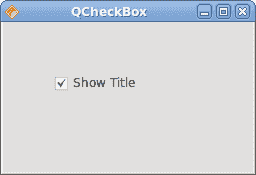
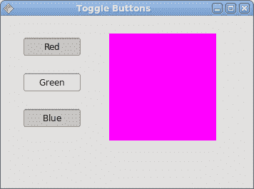
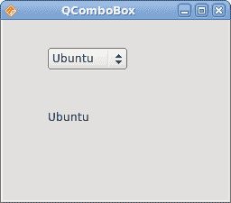

# Qyoto 中的小部件

> 原文： [http://zetcode.com/gui/vbqyoto/widgets/](http://zetcode.com/gui/vbqyoto/widgets/)

在 Visual Basic Qyoto 编程教程的这一部分中，我们将介绍 Qyoto 小部件。

小部件是 GUI 应用的基本构建块。 多年来，几个小部件已成为所有 OS 平台上所有工具包中的标准。 例如，按钮，复选框或滚动条。 Qyoto 有一组丰富的小部件，可以满足大多数编程需求。 可以将更多专门的窗口小部件创建为自定义窗口小部件。

## `QCheckBox`

`QCheckBox`是具有两种状态的窗口小部件：开和关。 开状态通过复选标记显示。 它用来表示一些布尔属性。 `QCheckBox`小部件提供一个带有文本标签的复选框。

```vb
' ZetCode Mono Visual Basic Qt tutorial

' This program toggles the title of the
' window with the QCheckBox widget
'
' author jan bodnar
' last modified April 2009
' website www.zetcode.com

Imports Qyoto

Public Class VBQApp 
    Inherits QWidget

    Public Sub New()

        Me.SetWindowTitle("QCheckBox")

        Me.InitUI()

        Me.Resize(250, 200)
        Me.Move(300, 300)
        Me.Show()

    End Sub

    Private Sub InitUI()

        Dim cb As New QCheckBox("Show title", Me)
        cb.Move(50, 50)
        cb.SetCheckState(True)
        Connect(cb, SIGNAL("clicked(bool)"), Me, SLOT("OnToggle(bool)"))

    End Sub

    <Q_SLOT()> _
    Private Sub OnToggle(ByVal state As Boolean)

        If state
             Me.SetWindowTitle("QCheckBox")
        Else
             Me.SetWindowTitle("")
        End If

    End Sub

    Public Shared Sub Main(ByVal args() As String)
        Dim qapp As New QApplication(args)
        Dim app As New VBQApp
        QApplication.Exec()
    End Sub

End Class

```

在我们的示例中，我们在窗口上放置了一个复选框。 复选框显示/隐藏窗口的标题。

```vb
Me.SetWindowTitle("QCheckBox")

```

在构建窗口期间，我们为窗口设置标题。

```vb
Dim cb As New QCheckBox("Show title", Me)

```

`QCheckBox`小部件已创建。 构造函数的第一个参数是其文本标签。 第二个参数是父窗口小部件。

```vb
cb.SetCheckState(True)

```

标题在应用的开始处可见。 因此，也必须选中该复选框。 我们使用`SetCheckState()`方法来选中该复选框。

```vb
Connect(cb, SIGNAL("clicked(bool)"), Me, SLOT("OnToggle(bool)"))

```

当我们单击复选框时，将发出`clicked(bool)`信号。 发出信号时，我们触发`OnToggle()`方法。

```vb
<Q_SLOT()> _
Private Sub OnToggle(ByVal state As Boolean)
...
End Sub

```

方法定义之前带有`Q_SLOT()`属性。 此属性通知编译器有关自定义槽的信息。

```vb
If state
    Me.SetWindowTitle("QCheckBox")
Else
    Me.SetWindowTitle("")
End If

```

根据复选框的状态，我们显示或隐藏窗口的标题。



图：`QCheckBox`

## `QLabel`

`QLabel`小部件用于显示文本或图像。 没有用户交互。

```vb
' ZetCode Mono Visual Basic Qt tutorial
'
' This program shows lyrics on the
' window
'
' author jan bodnar
' last modified April 2009
' website www.zetcode.com

Imports Qyoto

Public Class VBQApp 
    Inherits QWidget

    Public Sub New()

        Me.SetWindowTitle("You know I'm no Good")

        Me.InitUI()

        Me.Resize(250, 200)
        Me.Move(300, 300)
        Me.Show()

    End Sub

    Private Sub InitUI()

        Dim text As String
        text = "Meet you downstairs in the bar and heard" + vbNewLine + _
"your rolled up sleeves and your skull t-shirt" + vbNewLine + _
"You say why did you do it with him today?" + vbNewLine + _
"and sniff me out like I was Tanqueray" + vbNewLine + _
"" + vbNewLine + _
"cause you're my fella, my guy" + vbNewLine + _
"hand me your stella and fly" + vbNewLine + _
"by the time I'm out the door" + vbNewLine + _
"you tear men down like Roger Moore" + vbNewLine + _
"" + vbNewLine + _
"I cheated myself" + vbNewLine + _
"like I knew I would" + vbNewLine + _
"I told ya, I was trouble" + vbNewLine + _
"you know that I'm no good" 

        Dim label As New QLabel(text, Me)
        label.Font = New QFont("Purisa", 9)

        Dim vbox As New QVBoxLayout()
        vbox.AddWidget(label)
        SetLayout(vbox)

    End Sub

    Public Shared Sub Main(ByVal args() As String)
        Dim qapp As New QApplication(args)
        Dim app As New VBQApp
        QApplication.Exec()
    End Sub

End Class

```

我们的示例在窗口中显示了歌曲的歌词。

```vb
Dim text As String
text = "Meet you downstairs in the bar and heard" + vbNewLine + _
"your rolled up sleeves and your skull t-shirt" + vbNewLine + _
...

```

我们定义了多行文字。 与 C# ，Python 或 Ruby 不同，没有简单的结构可以用 Visual Basic 语言创建多行文本。 若要在 Visual Basic 中创建多行文本，我们使用`vbNewLine`打印常量，`+`连接字符和`_`行终止字符。

```vb
Dim label As New QLabel(text, Me)
label.Font = New QFont("Purisa", 9)

```

我们创建标签小部件并更改其字体。

```vb
Dim vbox As New QVBoxLayout()
vbox.AddWidget(label)
SetLayout(vbox)

```

代替手动编码标签的位置和大小，我们将标签放入盒子布局中。


图：`QLabel`

## `QLineEdit`

`QLineEdit`是一个小部件，允许输入和编辑单行纯文本。 `QLineEdit`小部件具有撤消/重做，剪切/粘贴和拖放功能。

```vb
' ZetCode Mono Visual Basic Qt tutorial
'
' This program demonstrates the 
' QLineEdit widget. Text entered in the QLineEdit
' widget is shown in a QLabel widget.
'
' author jan bodnar
' last modified April 2009
' website www.zetcode.com

Imports Qyoto

Public Class VBQApp 
    Inherits QWidget

    Dim label As QLabel

    Public Sub New()

        Me.InitUI()

        Me.SetWindowTitle("QLineEdit")
        Me.Resize(250, 200)
        Me.Move(300, 300)
        Me.Show()

    End Sub

    Private Sub InitUI()

        label = New QLabel(Me)

        Dim edit As New QLineEdit(Me)
        Connect(edit, SIGNAL("textChanged(QString)"), Me, _
            SLOT("OnChanged(QString)"))

        edit.Move(60, 100)
        label.Move(60, 40)

    End Sub

    <Q_SLOT()> _
    Private Sub OnChanged(ByVal text As String)

        label.SetText(text)
        label.AdjustSize()

    End Sub

    Public Shared Sub Main(ByVal args() As String)
        Dim qapp As New QApplication(args)
        Dim app As New VBQApp
        QApplication.Exec()
    End Sub

End Class

```

在我们的示例中，我们显示了两个小部件。 行编辑和标签小部件。 输入到行编辑中的文本显示在标签窗口小部件中。

```vb
Dim edit As New QLineEdit(Me)

```

`QLineEdit`小部件已创建。

```vb
Connect(edit, SIGNAL("textChanged(QString)"), Me, _
    SLOT("OnChanged(QString)"))

```

当我们在行编辑中键入或删除某些文本时，将触发`OnChanged()`方法。 该方法采用字符串参数。

```vb
<Q_SLOT()> _
Private Sub OnChanged(ByVal text As String)

    label.SetText(text)
    label.AdjustSize()

End Sub

```

在`OnChanged()`方法中，我们将行编辑的内容设置为标签窗口小部件。 `AdjustSize()`方法确保所有文本都是可见的。


Figure: QLineEdit widget

## `ToggleButton`

切换按钮是设置了可检查标志的按钮。 切换按钮是具有两种状态的按钮。 已按下但未按下。 通过单击可以在这两种状态之间切换。 在某些情况下此功能非常合适。

```vb
' ZetCode Mono Visual Basic Qt tutorial
'
' This program uses toggle buttons to 
' change the background color of
' a widget
'
' author jan bodnar
' last modified April 2009
' website www.zetcode.com

Imports Qyoto

Public Class VBQApp 
    Inherits QWidget

    Dim square As QWidget
    Dim color As QColor

    Dim redb As QPushButton
    Dim greenb As QPushButton
    Dim blueb As QPushButton

    Public Sub New()

        Me.InitUI()

        Me.SetWindowTitle("Toggle buttons")
        Me.Resize(350, 240)
        Me.Move(300, 300)
        Me.Show()

    End Sub

    Private Sub InitUI()

        color = New QColor()

        redb = New QPushButton("Red", Me)
        redb.Checkable = True
        greenb = New QPushButton("Green", Me)
        greenb.Checkable = True
        blueb = New QPushButton("Blue", Me)
        blueb.Checkable = True

        Connect(redb, SIGNAL("toggled(bool)"), Me, SLOT("OnToggled()"))
        Connect(greenb, SIGNAL("toggled(bool)"), Me, SLOT("OnToggled()"))
        Connect(blueb, SIGNAL("toggled(bool)"), Me, SLOT("OnToggled()"))

        square = New QWidget(Me)
        square.SetStyleSheet("QWidget { background-color: black }")

        redb.Move(30, 30)
        greenb.Move(30, 80)
        blueb.Move(30, 130)
        square.SetGeometry(150, 25, 150, 150)

    End Sub

    <Q_SLOT()> _
    Private Sub OnToggled()

        Dim red As Integer = color.Red()
        Dim green As Integer = color.Green()
        Dim blue As Integer = color.Blue()

        If redb.Checked 
            red = 255
        Else 
            red = 0
        End If

        If greenb.Checked
            green = 255
        Else 
            green = 0
        End If

        If blueb.Checked
            blue = 255
        Else 
            blue = 0
        End If

        color = New QColor(red, green, blue)

        Dim sheet As String = String.Format("QWidget {{ background-color: {0} }}", _
            color.Name())
        square.SetStyleSheet(sheet)

    End Sub

    Public Shared Sub Main(ByVal args() As String)
        Dim qapp As New QApplication(args)
        Dim app As New VBQApp
        QApplication.Exec()
    End Sub

End Class

```

在代码示例中，我们使用三个切换按钮来更改矩形小部件的颜色。

```vb
Dim square As QWidget
Dim color As QColor

Dim redb As QPushButton
Dim greenb As QPushButton
Dim blueb As QPushButton

```

我们定义了五个对象。 正方形小部件是`QWidget`，它显示颜色。 `color`变量用于保存颜色值。 这三个按钮是切换按钮，用于混合颜色值。

```vb
redb = New QPushButton("Red", Me)
redb.Checkable = True

```

我们创建一个`QPushButton`小部件。 `Checkable`属性将按钮更改为切换按钮。

```vb
Connect(redb, SIGNAL("toggled(bool)"), Me, SLOT("OnToggled()"))
Connect(greenb, SIGNAL("toggled(bool)"), Me, SLOT("OnToggled()"))
Connect(blueb, SIGNAL("toggled(bool)"), Me, SLOT("OnToggled()"))

```

所有三个按钮都插入到一个方法调用中，即`OnToggled()`方法。

```vb
square = New QWidget(Me)
square.SetStyleSheet("QWidget { background-color: black }")

```

我们创建方形小部件。 一开始是黑色的。 在 Qyoto 中，我们使用样式表来自定义小部件的外观。

在`OnToggled()`方法内部，我们确定颜色值并将正方形小部件更新为新颜色。

```vb
Dim red As Integer = color.Red()
Dim green As Integer = color.Green()
Dim blue As Integer = color.Blue()

```

在这里，我们确定方形小部件的当前颜色。

```vb
If redb.Checked 
    red = 255
Else 
    red = 0
End If

```

根据红色切换按钮的状态，更改颜色的红色部分。

```vb
color = New QColor(red, green, blue)

```

我们创建一个新的颜色值。

```vb
Dim sheet As String = String.Format("QWidget {{ background-color: {0} }}", _
    color.Name())

```

我们使用 Visual Basic 格式对象创建适当的样式表。

```vb
square.SetStyleSheet(sheet)

```

正方形的颜色已更新。



图：开关按钮

## `QComboBox`

`QComboBox`是一个小部件，允许用户从选项列表中进行选择。 这是一个显示当前项目的选择小部件，可以弹出可选择项目的列表。 组合框可能是可编辑的。 它以占用最少屏幕空间的方式向用户显示选项列表。

```vb
' ZetCode Mono Visual Basic Qt tutorial
'
' In this program, we use the QComboBox
' widget to select an option. 
' The selected option is shown in the
' QLabel widget
'
' author jan bodnar
' last modified April 2009
' website www.zetcode.com

Imports Qyoto

Public Class VBQApp 
    Inherits QWidget

    Dim label As QLabel

    Public Sub New()

        Me.SetWindowTitle("QComboBox")

        Me.InitUI()

        Me.Resize(250, 200)
        Me.Move(300, 300)
        Me.Show()

    End Sub

    Private Sub InitUI()

        label = New QLabel("Ubuntu", Me)

        Dim combo As New QComboBox(Me)
        combo.AddItem("Ubuntu")
        combo.AddItem("Mandriva")
        combo.AddItem("Fedora")
        combo.AddItem("Red Hat")
        combo.AddItem("Gentoo")

        combo.Move(50, 30)
        label.Move(50, 100)

        Connect(combo, SIGNAL("activated(QString)"), _
                 Me, SLOT("OnActivated(QString)"))

    End Sub

    <Q_SLOT()> _
    Private Sub OnActivated(ByVal text As String)

        label.SetText(text)
        label.AdjustSize()

    End Sub

    Public Shared Sub Main(ByVal args() As String)
        Dim qapp As New QApplication(args)
        Dim app As New VBQApp
        QApplication.Exec()
    End Sub

End Class

```

在我们的代码示例中，我们有两个小部件。 组合框和标签小部件。 从组合框中选择的选项显示在标签中。

```vb
label = New QLabel("Ubuntu", Me)

```

这是一个标签，它将显示组合框中当前选择的选项。

```vb
Dim combo As New QComboBox(Me)

```

我们创建`QComboBox`小部件的实例。

```vb
combo.AddItem("Ubuntu")
combo.AddItem("Mandriva")
combo.AddItem("Fedora")
combo.AddItem("Red Hat")
combo.AddItem("Gentoo")

```

组合框将填充值。

```vb
Connect(combo, SIGNAL("activated(QString)"), _
          Me, SLOT("OnActivated(QString)"))

```

当我们从组合框中选择一个选项时，将触发`OnActivated()`方法。

```vb
<Q_SLOT()> _
Private Sub OnActivated(ByVal text As String)

    label.SetText(text)
    label.AdjustSize()

End Sub

```

在`OnActivated()`方法中，我们将标签小部件更新为从组合框中选择的当前字符串。



Figure: QComboBox widget

在 Visual Basic Qyoto 教程的这一部分中，我们介绍了几个 Qyoto 小部件。