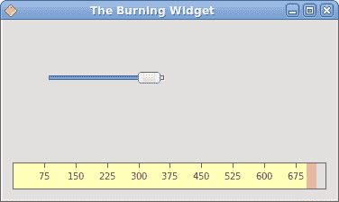

# Qyoto 中的自定义小部件

> 原文： [http://zetcode.com/gui/vbqyoto/customwidget/](http://zetcode.com/gui/vbqyoto/customwidget/)

在 Visual Basic Qyoto 编程教程的这一部分中，我们将创建一个自定义窗口小部件。

工具箱通常仅提供最常见的窗口小部件，例如按钮，文本窗口小部件，滑块等。没有工具箱可以提供所有可能的窗口小部件。 程序员必须自己创建此类小部件。 他们使用工具箱提供的绘图工具来完成此任务。 有两种可能性。 程序员可以修改或增强现有的小部件。 或者，他可以从头开始创建自定义窗口小部件。

## 刻录小部件

在下一个示例中，我们将创建一个自定义刻录小部件。 可以在 Nero 或 K3B 之类的应用中看到此小部件。 该小部件将从头开始创建。

`burning.vb`

```vb
Imports Qyoto

NameSpace Burning

Public Class Burning 
    Inherits QWidget

    Const PANEL_HEIGHT As Integer = 30
    Const DISTANCE As Integer = 19
    Const LINE_WIDTH As Integer = 5
    Const DIVISIONS As Integer = 10

    Const FULL_CAPACITY As Double = 700.0
    Const MAX_CAPACITY As Double = 750.0

    Dim redColor As New QColor(255, 175, 175)
    Dim yellowColor As New QColor(255, 255, 184)

    Dim parent As QWidget 

    Dim num() As String = { _
        "75", "150", "225", "300", _
        "375", "450", "525", "600", _
        "675" _
    }

    Public Sub New(ByVal parent As QWidget) 
        Me.parent = parent
        MinimumHeight = PANEL_HEIGHT
    End Sub

    Protected Overrides Sub PaintEvent(ByVal e As QPaintEvent) 

        Dim painter As New QPainter(Me)

        Me.DrawWidget(painter)
        painter.End()

    End Sub

    Private Sub DrawWidget(ByVal painter As QPainter) 

        Dim burn As CustomWidget.VBQApp = CType(parent, CustomWidget.VBQApp)

        Dim slid_width As Double = burn.GetCurrentWidth()
        Dim width As Double = Size.Width()
        Dim move As Double = width / DIVISIONS

        Dim till As Double = (width / MAX_CAPACITY) * slid_width
        Dim full As Double = (width / MAX_CAPACITY) * FULL_CAPACITY

        If slid_width > FULL_CAPACITY

            painter.SetPen(New QPen(New QBrush(yellowColor), 1))
            painter.SetBrush(New QBrush(yellowColor))
            painter.DrawRect(New QRectF(0, 0, full, PANEL_HEIGHT))
            painter.SetPen(New QPen(New QBrush(redColor), 1))
            painter.SetBrush(New QBrush(redColor))
            painter.DrawRect(New QRectF(full+1, 0, till-full, PANEL_HEIGHT))

        Else

            If (slid_width > 0) 
               painter.SetPen(New QPen(New QBrush(yellowColor), 1))
               painter.SetBrush(New QBrush(yellowColor))
               painter.DrawRect(New QRectF(0, 0, till, PANEL_HEIGHT))
            End If

        End If

        painter.SetPen(New QColor(90, 90, 90))
        painter.SetBrush(BrushStyle.NoBrush)
        painter.DrawRect(0, 0, Size.Width()-1, PANEL_HEIGHT-1)

        Dim newFont As QFont = painter.Font()
        newFont.SetPointSize(7)
        painter.SetFont(newFont)

        Dim metrics As New QFontMetrics(newFont)

        For i As Integer = 1 to num.Length
            painter.DrawLine(New QLineF(i*move, 1, i*move, LINE_WIDTH))

            Dim w As Integer = metrics.Width(num(i-1))

            painter.DrawText(New QPointF(i*move-w/2, DISTANCE), num(i-1))
        Next

    End Sub

End Class

End Namespace

```

在这个文件中，我们创建了刻录小部件。

```vb
Public Class Burning 
    Inherits QWidget

```

自定义窗口小部件基于`QWidget`小部件。

```vb
Const PANEL_HEIGHT As Integer = 30
Const DISTANCE As Integer = 19
Const LINE_WIDTH As Integer = 5
Const DIVISIONS As Integer = 10

Const FULL_CAPACITY As Double = 700.0
Const MAX_CAPACITY As Double = 750.0

```

这些是重要的常数。 `PANEL_HEIGHT`定义自定义窗口小部件的高度。 `DISTANCE`是比例尺上的数字与其父边框顶部之间的距离。 `LINE_WIDTH`是垂直线的宽度。 `DIVISIONS`是秤的数量。 `FULL_CAPACITY`是媒体的容量。 达到目标后，就会发生过度刻录。 用红色显示。 `MAX_CAPACITY`是介质的最大容量。

```vb
Dim num() As String = { _
    "75", "150", "225", "300", _
    "375", "450", "525", "600", _
    "675" _
}

```

我们使用这些数字来构建刻录小部件的比例。

```vb
Protected Overrides Sub PaintEvent(ByVal e As QPaintEvent) 

    Dim painter As New QPainter(Me)

    Me.DrawWidget(painter)
    painter.End()

End Sub

```

自定义窗口小部件的图形委托给`DrawWidget()`方法。

```vb
Dim burn As CustomWidget.VBQApp = CType(parent, CustomWidget.VBQApp)

```

我们检索对父窗口小部件的引用。

```vb
Dim slid_width As Double = burn.GetCurrentWidth()

```

我们使用它来获取当前选定的滑块值。

```vb
Dim width As Double = Size.Width()

```

我们得到小部件的宽度。 自定义窗口小部件的宽度是动态的。 用户可以调整大小。

```vb
Dim till As Double = (width / MAX_CAPACITY) * slid_width
Dim full As Double = (width / MAX_CAPACITY) * FULL_CAPACITY

```

我们使用`width`变量进行转换。 在比例尺值和自定义小部件的度量之间。 请注意，我们使用浮点值。 我们在绘图中获得了更高的精度。

```vb
painter.SetPen(New QPen(New QBrush(redColor), 1))
painter.SetBrush(New QBrush(redColor))
painter.DrawRect(New QRectF(full+1, 0, till-full, PANEL_HEIGHT))

```

这三行画出红色矩形，表示过度燃烧。

```vb
painter.DrawRect(0, 0, Size.Width()-1, PANEL_HEIGHT-1)

```

这是小部件的周长。 外部矩形。

```vb
painter.DrawLine(New QLineF(i*move, 1, i*move, LINE_WIDTH))

```

在这里，我们画出小的垂直线。

```vb
Dim w As Integer = metrics.Width(num(i-1))

painter.DrawText(New QPointF(i*move-w/2, DISTANCE), num(i-1))

```

在这里，我们绘制刻度的数字。 为了精确定位数字，我们必须获得字符串的宽度。

`main.vb`

```vb
Imports Qyoto

' ZetCode Mono Visual Basic Qt tutorial
'
' In this program, we create
' a custom widget
'
' @author jan bodnar
' website zetcode.com
' last modified May 2009

NameSpace CustomWidget

Public Class VBQApp 
    Inherits QWidget

    Const MAX_CAPACITY As Integer = 750

    Dim slider As QSlider
    Dim widget As QWidget
    Dim cur_width As Integer

    Public Sub New()
        Me.SetWindowTitle("The Burning Widget")

        Me.InitUI()

        Me.Resize(370, 200)
        Me.Move(300, 300)
        Me.Show()
    End Sub

    Private Sub InitUI() 

       slider = New QSlider(Qt.Orientation.Horizontal , Me)
       slider.Maximum = MAX_CAPACITY
       slider.SetGeometry(50, 50, 130, 30)

       Connect(slider, SIGNAL("valueChanged(int)"), Me, _
                SLOT("ValueChanged(int)"))

       Dim vbox As New QVBoxLayout(Me)
       Dim hbox As New QHBoxLayout

       vbox.AddStretch(1)

       widget = New Burning.Burning(Me)
       hbox.AddWidget(widget, 0)

       vbox.AddLayout(hbox)

       SetLayout(vbox)

    End Sub

    <Q_SLOT()> _
    Public Sub ValueChanged(ByVal val As Integer) 
        cur_width = val
        widget.Repaint()
    End Sub

    Public Function GetCurrentWidth() As Integer
      Return cur_width
    End Function

    Public Shared Sub Main(ByVal args() As String)
        Dim qapp As New QApplication(args)
        Dim app As New VBQApp
        QApplication.Exec()
    End Sub

End Class

NameSpace CustomWidget

```

这是主文件。 在这里，我们创建滑块小部件并使用我们的自定义小部件。

```vb
widget = New Burning.Burning(Me)
hbox.AddWidget(widget, 0)

```

我们创建了刻录小部件的实例，并将其添加到水平框中。

```vb
<Q_SLOT()> _
Public Sub ValueChanged(ByVal val As Integer) 
    cur_width = val
    widget.Repaint()
End Sub

```

当滑块的值更改时，我们将其存储在`cur_width`变量中，然后重新绘制自定义窗口小部件。

```vb
Public Function GetCurrentWidth() As Integer
  Return cur_width
End Function

```

定制小部件调用此方法以获取实际的滑块值。



图：刻录小部件

在 Visual Basic Qyoto 教程的这一部分中，我们演示了如何创建自定义窗口小部件。