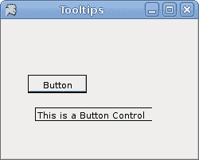

# IronPython Mono Winforms 中的第一步

> 原文： [http://zetcode.com/tutorials/ironpythontutorial/firststeps/](http://zetcode.com/tutorials/ironpythontutorial/firststeps/)

在 IronPython Mono Winforms 教程的这一部分中，我们介绍 Winforms 编程库中的一些基本程序。

## 简单

这是一个简单的 Winforms 应用。

`simple.py`

```
#!/usr/bin/ipy

import clr

clr.AddReference("System.Windows.Forms")

from System.Windows.Forms import Application, Form

class IForm(Form):

    def __init__(self):
        self.Text = 'Simple'
        self.Width = 250
        self.Height = 200
        self.CenterToScreen()

Application.Run(IForm())

```

此代码示例在屏幕上显示一个小窗口。

```
clr.AddReference("System.Windows.Forms")

```

我们添加了 Winforms 库的参考。

```
class IForm(Form):

```

在 Winforms 中，任何窗口或对话框都是`Form`。 该控件是一个基本容器，其目的是显示其他子控件。 我们的类`IForm`继承自表单。 这样，它本身就成为一种形式。

```
self.Text = 'Simple'
self.Width = 250
self.Height = 200

```

`Text`，`Width`和`Height`是表单的属性。 更改这些属性，我们将修改表单控件。 第一行在表单控件的标题栏中显示文本“`Simple`”。 其他两行将表单的大小设置为`250x200`像素。

```
self.CenterToScreen()

```

这种方法将我们的应用集中在屏幕上。

```
Application.Run(IForm())

```

此行运行示例。


Figure: Simple

## 图标

Mono 在西班牙语中意为猴子。 如果我们不为应用提供图标，则默认情况下，我们的头是猴子。 下一个示例显示如何更改此设置。

`icon.py`

```
#!/usr/bin/ipy

import clr
import sys

clr.AddReference("System.Windows.Forms")
clr.AddReference("System.Drawing")

from System.Windows.Forms import Application, Form
from System.Drawing import Icon

class IForm(Form):

    def __init__(self):
        self.Text = 'Icon'
        self.Width = 250
        self.Height = 200

        try:
            self.Icon = Icon("web.ico")
        except Exception, e:
            print e.msg
            sys.exit(1)       

        self.CenterToScreen()

Application.Run(IForm())

```

该代码示例在窗体的左上角显示一个图标。 表单的图标是代表任务栏中表单的图片以及为表单的控制框显示的图标。

```
clr.AddReference("System.Drawing")

```

`Icon`对象来自`System.Drawing`模块。 因此，我们必须添加参考。

```
try:
    self.Icon = Icon("web.ico")
except Exception, e:
    print e.msg
    sys.exit(1)  

```

最好将所有输入输出工作放在`try`和`except`关键字之间。 `web.ico`文件必须在当前工作目录中可用。 这是我们执行应用的目录（`ipy icon.py`）。


Figure: Icon

## 工具提示

工具提示是一个小的矩形弹出窗口，当用户将指针放在控件上时，它会显示控件目的的简短说明。

`tooltips.py`

```
#!/usr/bin/ipy

import clr

clr.AddReference("System.Windows.Forms")
clr.AddReference("System.Drawing")

from System.Windows.Forms import Application, Form
from System.Windows.Forms import Button, ToolTip
from System.Drawing import Point, Size

class IForm(Form):

    def __init__(self):
        self.Text = 'Tooltips'
        self.CenterToScreen()
        self.Size = Size(200, 150)

        tooltip = ToolTip()
        tooltip.SetToolTip(self, "This is a Form")

        button = Button()
        button.Parent = self
        button.Text = "Button"
        button.Location = Point(50, 70)

        tooltip.SetToolTip(button, "This is a Button")

Application.Run(IForm())

```

我们的代码示例为两个控件创建一个工具提示。 `Button`控件和`Form`控件。

```
tooltip = ToolTip()

```

在这里，我们创建`ToolTip`控件。 此实例用于为两个控件提供工具提示。

```
tooltip.SetToolTip(self, "This is a Form")

```

在这里，我们为表单设置工具提示。

```
tooltip.SetToolTip(button, "This is a Button")

```

这里是按钮。

```
button = Button()
button.Parent = self
button.Text = "Button"
button.Location = Point(50, 70)

```

注意`Button`控件的创建。 `Parent`属性确定按钮所在的容器。 `Text`属性是按钮的标签。 `Location`属性将按钮放在表单上的`x = 30`，`y = 70px`坐标处。



Figure: Tooltips

## 按钮

我们的最后一个代码示例显示了一个有效的按钮控件。

`button.py`

```
#!/usr/bin/ipy

import clr

clr.AddReference("System.Windows.Forms")
clr.AddReference("System.Drawing")

from System.Windows.Forms import Application, Form, Button
from System.Drawing import Size, Point

class IForm(Form):

    def __init__(self):
        self.Text = 'Button'
        self.CenterToScreen()
        self.Size = Size(200, 150)

        btn = Button()
        btn.Parent = self
        btn.Text = "Quit"
        btn.Location = Point(50, 50)
        btn.Click += self.OnClick
        btn.MouseEnter += self.OnEnter

    def OnClick(self, sender, args):
        self.Close()

    def OnEnter(self, sender, args):
        print "button entered"

Application.Run(IForm())

```

所有 GUI 编程都是事件驱动的编程。 在我们的示例中，我们在表单容器上显示了一个按钮控件。 该按钮将收听两个事件：`Click`和`MouseEnter`事件。

```
btn.Click += self.OnClick

```

此代码行将事件处理程序插入`Click`事件。 当我们单击按钮时，将调用`OnClick()`方法。

```
btn.MouseEnter += self.OnEnter

```

当我们使用鼠标指针进入按钮区域时，将触发`MouseEnter`事件。 在这种情况下，我们的代码将调用`OnEnter()`方法。

```
def OnClick(self, sender, args):
    self.Close()

```

该方法关闭应用。

```
def OnEnter(self, sender, args):
    print "button entered"

```

当我们使用鼠标指针进入按钮控制区域时，“已输入按钮”文本将显示在终端中。

IronPython Mono Winforms 教程的这一部分显示了一些入门代码示例。