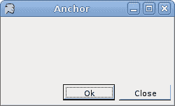
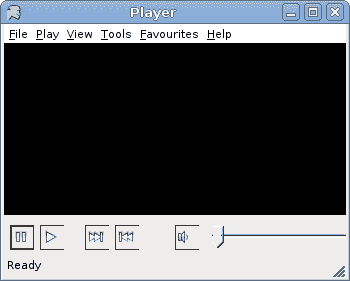

# 布局管理

> 原文： [http://zetcode.com/tutorials/ironpythontutorial/layout/](http://zetcode.com/tutorials/ironpythontutorial/layout/)

IronPython Mono Winforms 教程继续进行控件的布局管理。 在将控件放置在其父容器上之后，我们必须确保其布局正确。

## `Anchor`

控件的`Anchor`属性确定如何使用其父控件调整其大小。 锚是海洋世界中的一个术语。 当船锚掉入水中时，船就固定在某个地方。 Winforms 控件也是如此。

Winforms 中的每个控件都可以具有以下`AnchorStyles`值之一：

*   最佳
*   剩下
*   对
*   底部

注意，控件不限于一个值。 他们可以使用`|`运算符将这些值进行任意组合。

## 基本`Anchor`示例

下面的示例显示一个非常基本的示例，演示`Anchor`属性。

`anchor.py`

```
#!/usr/bin/ipy

import clr
clr.AddReference("System.Windows.Forms")
clr.AddReference("System.Drawing")

from System.Windows.Forms import Application, Form
from System.Windows.Forms import Button, AnchorStyles
from System.Drawing import Size, Point

class IForm(Form):

    def __init__(self):
        self.Text = 'Anchor'        
        self.Size = Size(210, 210)

        btn1 = Button()
        btn1.Text = "Button"
        btn1.Parent = self
        btn1.Location = Point(30, 30)

        btn2 = Button()
        btn2.Text = "Button"
        btn2.Parent = self
        btn2.Location = Point(30, 80)
        btn2.Anchor = AnchorStyles.Right

        self.CenterToScreen()

Application.Run(IForm())

```

这是一个非常基本的代码示例，清楚地显示了`Anchor`属性的含义。 我们在表单上有两个按钮。 第一个按钮具有默认的`AnchorStyles`值，即`AnchorStyles.Top | AnchorStyles.Left`。 第二个按钮已显式设置`AnchorStyles.Right`。

```
btn2.Anchor = AnchorStyles.Right

```

我们将第二个按钮的`Anchor`属性明确设置为 AnchorStyles。 正确的价值。

现在看看以下两个图像。 左边的是开始时显示的应用。 调整大小后，右侧显示相同的应用。 第一个按钮与表单的左边界和上边界保持距离。 第二个按钮与表单的右边框保持距离。 但是它在垂直方向上没有保持任何距离。


Figure: Before and after resizing

## `Dock`

`Dock`属性允许我们将控件粘贴到父窗体或控件的特定边缘。

以下是可能的`DockStyle`值。

*   最佳
*   剩下
*   对
*   底部
*   填
*   没有

## 编辑器骨架

以下代码示例演示了正在使用的`Dock`属性。

`editor.py`

```
#!/usr/bin/ipy

import clr
clr.AddReference("System.Windows.Forms")
clr.AddReference("System.Drawing")

from System.Windows.Forms import Application, Form, MainMenu, StatusBar
from System.Windows.Forms import Shortcut, MenuItem, TextBox, DockStyle
from System.Drawing import Size, Point

class IForm(Form):

    def __init__(self):

        self.Text = 'Editor'
        self.Size = Size(210, 180)

        mainMenu = MainMenu()
        filem = mainMenu.MenuItems.Add('&File')
        filem.MenuItems.Add(MenuItem('E&xit',
                 self.OnExit, Shortcut.CtrlX))

        self.Menu = mainMenu

        tb = TextBox()
        tb.Parent = self
        tb.Dock = DockStyle.Fill
        tb.Multiline = True

        sb = StatusBar()
        sb.Parent = self
        sb.Text = 'Ready'

        self.CenterToScreen()

    def OnExit(self, sender, event): 
        self.Close()

Application.Run(IForm())

```

我们显示一个菜单栏和一个状态栏。 其余区域由`TextBox`控件占用。

```
tb = TextBox()
tb.Parent = self

```

在这里，我们创建`TextBox`控件。 `Form`容器被设置为文本框的父级。

```
tb.Dock = DockStyle.Fill

```

此代码行使`TextBox`控件占用了表单容器内的剩余空间。


Figure: Editor skeleton

## 固定按钮

下一个示例显示了位于窗体右下角的两个按钮。

`anchoredbuttons.py`

```
#!/usr/bin/ipy

import clr
clr.AddReference("System.Windows.Forms")
clr.AddReference("System.Drawing")
clr.AddReference("System")

from System.Windows.Forms import Application, Form, Button, Panel
from System.Windows.Forms import DockStyle, AnchorStyles
from System.Drawing import Size, Point

WIDTH = 250
HEIGHT = 150
BUTTONS_SPACE = 15
PANEL_SPACE = 8
CLOSE_SPACE = 10

class IForm(Form):

    def __init__(self):
        self.Text = 'Buttons'

        self.Size = Size(WIDTH, HEIGHT)

        ok = Button()

        PANEL_HEIGHT = ok.Height + PANEL_SPACE

        panel = Panel()
        panel.Height = PANEL_HEIGHT
        panel.Dock = DockStyle.Bottom
        panel.Parent = self

        x = ok.Width * 2 + BUTTONS_SPACE
        y = (PANEL_HEIGHT - ok.Height) / 2

        ok.Text = "Ok"
        ok.Parent = panel
        ok.Location = Point(WIDTH-x, y)
        ok.Anchor = AnchorStyles.Right

        close = Button()

        x = close.Width

        close.Text = "Close"
        close.Parent = panel
        close.Location = Point(WIDTH-x-CLOSE_SPACE, y)
        close.Anchor = AnchorStyles.Right

        self.CenterToScreen()    

Application.Run(IForm())

```

该示例在对话框的右下角显示“确定”，“关闭”按钮，这在对话框窗口中很常见。

```
WIDTH = 250
HEIGHT = 150

```

`WIDTH`和`HEIGHT`变量确定应用窗口的宽度和高度。

```
BUTTONS_SPACE = 15
PANEL_SPACE = 8
CLOSE_SPACE = 10

```

`BUTTONS_SPACE`是“确定”和“关闭”按钮之间的空间。 `PANEL_SPACE`是面板和表单底部之间的空间。 最后，`CLOSE_SPACE`变量设置“关闭”按钮和表单右边框之间的间隔。

```
PANEL_HEIGHT = ok.Height + PANEL_SPACE

```

在这里，我们计算面板的高度。 面板的高度基于“确定”按钮的高度。 并且我们添加了一些额外的空间，以使按钮不会太靠近边框。

```
panel = Panel()
panel.Height = PANEL_HEIGHT
panel.Dock = DockStyle.Bottom
panel.Parent = self

```

在这里，我们创建和管理`Panel`控件。 在此示例中，它用作按钮的容器。 它被粘贴到表单的底部边框。 然后将按钮放置在面板内。

```
ok.Text = "Ok"
ok.Parent = panel
ok.Location = Point(WIDTH-x, y)
ok.Anchor = AnchorStyles.Right

```

“确定”按钮的父级设置为面板小部件。 计算位置。 并且`Anchor`属性设置为右侧。 另一个按钮的创建类似。



Figure: Anchored buttons

## 播放器骨架

IronPython Mono Winforms 教程这一部分的最后一个示例显示了一个更复杂的示例。 它是音乐播放器的骨架。

`player.py`

```
#!/usr/bin/ipy

import clr
clr.AddReference("System.Windows.Forms")
clr.AddReference("System.Drawing")

from System.Windows.Forms import Application, Form, Button, Panel
from System.Windows.Forms import DockStyle, AnchorStyles, StatusBar
from System.Windows.Forms import TrackBar, MainMenu, MenuItem
from System.Windows.Forms import FlatStyle, TickStyle, Shortcut
from System.Drawing import Size, Point, Bitmap, Color

class IForm(Form):

    def __init__(self):

        self.Text = 'Player'        
        self.Size = Size(350, 280)

        mainMenu = MainMenu()
        filem = mainMenu.MenuItems.Add("&File")
        playm = mainMenu.MenuItems.Add("&Play")
        view = mainMenu.MenuItems.Add("&View")

        tools = mainMenu.MenuItems.Add("&Tools")
        favourites = mainMenu.MenuItems.Add("&Favourites")
        help = mainMenu.MenuItems.Add("&Help")
        filem.MenuItems.Add(MenuItem("E&xit",
                 self.OnExit, Shortcut.CtrlX))

        self.Menu = mainMenu

        panel = Panel()
        panel.Parent = self
        panel.BackColor = Color.Black
        panel.Dock = DockStyle.Fill

        buttonPanel = Panel()
        buttonPanel.Parent = self
        buttonPanel.Height = 40
        buttonPanel.Dock = DockStyle.Bottom

        pause = Button()
        pause.FlatStyle = FlatStyle.Popup
        pause.Parent = buttonPanel
        pause.Location = Point(5, 10)
        pause.Size = Size(25, 25)
        pause.Image = Bitmap("pause.png")

        play = Button()
        play.FlatStyle = FlatStyle.Popup
        play.Parent = buttonPanel
        play.Location = Point(35, 10)
        play.Size = Size(25, 25)
        play.Image = Bitmap("play.png")

        forward = Button()
        forward.FlatStyle = FlatStyle.Popup
        forward.Parent = buttonPanel
        forward.Location = Point(80, 10)
        forward.Size = Size(25, 25)
        forward.Image = Bitmap("forward.png")

        backward = Button()
        backward.FlatStyle = FlatStyle.Popup
        backward.Parent = buttonPanel
        backward.Location = Point(110, 10)
        backward.Size = Size(25, 25)
        backward.Image = Bitmap("backward.png")

        tb = TrackBar()
        tb.Parent = buttonPanel
        tb.TickStyle = TickStyle.None
        tb.Size = Size(150, 25)
        tb.Location = Point(200, 10)
        tb.Anchor = AnchorStyles.Right

        audio = Button()
        audio.FlatStyle = FlatStyle.Popup
        audio.Parent = buttonPanel
        audio.Size = Size(25, 25)
        audio.Image = Bitmap("audio.png")
        audio.Location = Point(170, 10)
        audio.Anchor = AnchorStyles.Right

        sb = StatusBar()
        sb.Parent = self
        sb.Text = "Ready"

        self.CenterToScreen()

    def OnExit(self, sender, event):
        self.Close()

Application.Run(IForm())

```

这是一个更复杂的示例，它同时显示了`Dock`和`Anchor`属性。

```
mainMenu = MainMenu()
filem = mainMenu.MenuItems.Add("&File")
...
self.Menu = mainMenu

```

在这里，我们创建菜单栏。

```
panel = Panel()
panel.Parent = self
panel.BackColor = Color.Black
panel.Dock = DockStyle.Fill

```

这是黑色的面板，占据了菜单栏，状态栏和控制面板剩余的所有剩余空间。

```
buttonPanel = Panel()
buttonPanel.Parent = self
buttonPanel.Height = 40
buttonPanel.Dock = DockStyle.Bottom

```

这是控制面板。 它的父级是表单容器。 它被粘贴到表格的底部。 高度为 40 像素。 在此控制面板内部，我们放置了所有按钮和轨迹仪。

```
pause = Button()
pause.FlatStyle = FlatStyle.Popup
pause.Parent = buttonPanel
pause.Location = Point(5, 10)
pause.Size = Size(25, 25)
pause.Image = Bitmap("pause.png")

```

暂停按钮是具有默认`Anchor`属性值的四个按钮之一。 该按钮的样式设置为平面，因为它看起来更好。 我们在按钮上放置一个位图。

```
tb.Anchor = AnchorStyles.Right
... 
audio.Anchor = AnchorStyles.Right

```

最后两个控件固定在右侧。



Figure: Player skeleton

IronPython Mono Winforms 教程的这一部分是关于控件的布局管理的。 我们实践了 Winforms 库提供的各种可能性。