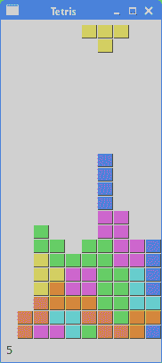

# PyQt5 中的俄罗斯方块

> 原文： [http://zetcode.com/gui/pyqt5/tetris/](http://zetcode.com/gui/pyqt5/tetris/)

在本章中，我们将创建一个俄罗斯方块游戏克隆。

## 俄罗斯方块

俄罗斯方块游戏是有史以来最受欢迎的计算机游戏之一。 原始游戏是由俄罗斯程序员 Alexey Pajitnov 于 1985 年设计和编程的。此后，几乎所有版本的几乎所有计算机平台上都可以使用 Tetris。

俄罗斯方块被称为下降块益智游戏。 在这个游戏中，我们有七个不同的形状，称为 tetrominoes：S 形，Z 形，T 形，L 形，线形，MirroredL 形和 正方形。 这些形状中的每一个都形成有四个正方形。 形状从板上掉下来。 俄罗斯方块游戏的目的是移动和旋转形状，以使其尽可能地适合。 如果我们设法形成一行，则该行将被破坏并得分。 我们玩俄罗斯方块游戏，直到达到顶峰。


Figure: Tetrominoes

PyQt5 是旨在创建应用的工具包。 还有其他一些旨在创建计算机游戏的库。 尽管如此，PyQt5 和其他应用工具包仍可用于创建简单的游戏。

创建计算机游戏是增强编程技能的好方法。

## 开发

我们的俄罗斯方块游戏没有图像，我们使用 PyQt5 编程工具包中提供的绘图 API 绘制四面体。 每个计算机游戏的背后都有一个数学模型。 俄罗斯方块也是如此。

游戏背后的一些想法：

*   我们使用`QtCore.QBasicTimer()`创建游戏周期。
*   绘制四聚体。
*   形状以正方形为单位移动（而不是逐个像素移动）。
*   从数学上讲，木板是一个简单的数字列表。

该代码包括四个类别：`Tetris`，`Board`，`Tetrominoe`和`Shape`。 `Tetris`类设置游戏。 `Board`是编写游戏逻辑的地方。 `Tetrominoe`类包含所有俄罗斯方块的名称，`Shape`类包含俄罗斯方块的代码。

`tetris.py`

```py
#!/usr/bin/python3
# -*- coding: utf-8 -*-

"""
ZetCode PyQt5 tutorial 

This is a Tetris game clone.

Author: Jan Bodnar
Website: zetcode.com 
Last edited: August 2017
"""

from PyQt5.QtWidgets import QMainWindow, QFrame, QDesktopWidget, QApplication
from PyQt5.QtCore import Qt, QBasicTimer, pyqtSignal
from PyQt5.QtGui import QPainter, QColor 
import sys, random

class Tetris(QMainWindow):

    def __init__(self):
        super().__init__()

        self.initUI()

    def initUI(self):    
        '''initiates application UI'''

        self.tboard = Board(self)
        self.setCentralWidget(self.tboard)

        self.statusbar = self.statusBar()        
        self.tboard.msg2Statusbar[str].connect(self.statusbar.showMessage)

        self.tboard.start()

        self.resize(180, 380)
        self.center()
        self.setWindowTitle('Tetris')        
        self.show()

    def center(self):
        '''centers the window on the screen'''

        screen = QDesktopWidget().screenGeometry()
        size = self.geometry()
        self.move((screen.width()-size.width())/2, 
            (screen.height()-size.height())/2)

class Board(QFrame):

    msg2Statusbar = pyqtSignal(str)

    BoardWidth = 10
    BoardHeight = 22
    Speed = 300

    def __init__(self, parent):
        super().__init__(parent)

        self.initBoard()

    def initBoard(self):     
        '''initiates board'''

        self.timer = QBasicTimer()
        self.isWaitingAfterLine = False

        self.curX = 0
        self.curY = 0
        self.numLinesRemoved = 0
        self.board = []

        self.setFocusPolicy(Qt.StrongFocus)
        self.isStarted = False
        self.isPaused = False
        self.clearBoard()

    def shapeAt(self, x, y):
        '''determines shape at the board position'''

        return self.board[(y * Board.BoardWidth) + x]

    def setShapeAt(self, x, y, shape):
        '''sets a shape at the board'''

        self.board[(y * Board.BoardWidth) + x] = shape

    def squareWidth(self):
        '''returns the width of one square'''

        return self.contentsRect().width() // Board.BoardWidth

    def squareHeight(self):
        '''returns the height of one square'''

        return self.contentsRect().height() // Board.BoardHeight

    def start(self):
        '''starts game'''

        if self.isPaused:
            return

        self.isStarted = True
        self.isWaitingAfterLine = False
        self.numLinesRemoved = 0
        self.clearBoard()

        self.msg2Statusbar.emit(str(self.numLinesRemoved))

        self.newPiece()
        self.timer.start(Board.Speed, self)

    def pause(self):
        '''pauses game'''

        if not self.isStarted:
            return

        self.isPaused = not self.isPaused

        if self.isPaused:
            self.timer.stop()
            self.msg2Statusbar.emit("paused")

        else:
            self.timer.start(Board.Speed, self)
            self.msg2Statusbar.emit(str(self.numLinesRemoved))

        self.update()

    def paintEvent(self, event):
        '''paints all shapes of the game'''

        painter = QPainter(self)
        rect = self.contentsRect()

        boardTop = rect.bottom() - Board.BoardHeight * self.squareHeight()

        for i in range(Board.BoardHeight):
            for j in range(Board.BoardWidth):
                shape = self.shapeAt(j, Board.BoardHeight - i - 1)

                if shape != Tetrominoe.NoShape:
                    self.drawSquare(painter,
                        rect.left() + j * self.squareWidth(),
                        boardTop + i * self.squareHeight(), shape)

        if self.curPiece.shape() != Tetrominoe.NoShape:

            for i in range(4):

                x = self.curX + self.curPiece.x(i)
                y = self.curY - self.curPiece.y(i)
                self.drawSquare(painter, rect.left() + x * self.squareWidth(),
                    boardTop + (Board.BoardHeight - y - 1) * self.squareHeight(),
                    self.curPiece.shape())

    def keyPressEvent(self, event):
        '''processes key press events'''

        if not self.isStarted or self.curPiece.shape() == Tetrominoe.NoShape:
            super(Board, self).keyPressEvent(event)
            return

        key = event.key()

        if key == Qt.Key_P:
            self.pause()
            return

        if self.isPaused:
            return

        elif key == Qt.Key_Left:
            self.tryMove(self.curPiece, self.curX - 1, self.curY)

        elif key == Qt.Key_Right:
            self.tryMove(self.curPiece, self.curX + 1, self.curY)

        elif key == Qt.Key_Down:
            self.tryMove(self.curPiece.rotateRight(), self.curX, self.curY)

        elif key == Qt.Key_Up:
            self.tryMove(self.curPiece.rotateLeft(), self.curX, self.curY)

        elif key == Qt.Key_Space:
            self.dropDown()

        elif key == Qt.Key_D:
            self.oneLineDown()

        else:
            super(Board, self).keyPressEvent(event)

    def timerEvent(self, event):
        '''handles timer event'''

        if event.timerId() == self.timer.timerId():

            if self.isWaitingAfterLine:
                self.isWaitingAfterLine = False
                self.newPiece()
            else:
                self.oneLineDown()

        else:
            super(Board, self).timerEvent(event)

    def clearBoard(self):
        '''clears shapes from the board'''

        for i in range(Board.BoardHeight * Board.BoardWidth):
            self.board.append(Tetrominoe.NoShape)

    def dropDown(self):
        '''drops down a shape'''

        newY = self.curY

        while newY > 0:

            if not self.tryMove(self.curPiece, self.curX, newY - 1):
                break

            newY -= 1

        self.pieceDropped()

    def oneLineDown(self):
        '''goes one line down with a shape'''

        if not self.tryMove(self.curPiece, self.curX, self.curY - 1):
            self.pieceDropped()

    def pieceDropped(self):
        '''after dropping shape, remove full lines and create new shape'''

        for i in range(4):

            x = self.curX + self.curPiece.x(i)
            y = self.curY - self.curPiece.y(i)
            self.setShapeAt(x, y, self.curPiece.shape())

        self.removeFullLines()

        if not self.isWaitingAfterLine:
            self.newPiece()

    def removeFullLines(self):
        '''removes all full lines from the board'''

        numFullLines = 0
        rowsToRemove = []

        for i in range(Board.BoardHeight):

            n = 0
            for j in range(Board.BoardWidth):
                if not self.shapeAt(j, i) == Tetrominoe.NoShape:
                    n = n + 1

            if n == 10:
                rowsToRemove.append(i)

        rowsToRemove.reverse()

        for m in rowsToRemove:

            for k in range(m, Board.BoardHeight):
                for l in range(Board.BoardWidth):
                        self.setShapeAt(l, k, self.shapeAt(l, k + 1))

        numFullLines = numFullLines + len(rowsToRemove)

        if numFullLines > 0:

            self.numLinesRemoved = self.numLinesRemoved + numFullLines
            self.msg2Statusbar.emit(str(self.numLinesRemoved))

            self.isWaitingAfterLine = True
            self.curPiece.setShape(Tetrominoe.NoShape)
            self.update()

    def newPiece(self):
        '''creates a new shape'''

        self.curPiece = Shape()
        self.curPiece.setRandomShape()
        self.curX = Board.BoardWidth // 2 + 1
        self.curY = Board.BoardHeight - 1 + self.curPiece.minY()

        if not self.tryMove(self.curPiece, self.curX, self.curY):

            self.curPiece.setShape(Tetrominoe.NoShape)
            self.timer.stop()
            self.isStarted = False
            self.msg2Statusbar.emit("Game over")

    def tryMove(self, newPiece, newX, newY):
        '''tries to move a shape'''

        for i in range(4):

            x = newX + newPiece.x(i)
            y = newY - newPiece.y(i)

            if x < 0 or x >= Board.BoardWidth or y < 0 or y >= Board.BoardHeight:
                return False

            if self.shapeAt(x, y) != Tetrominoe.NoShape:
                return False

        self.curPiece = newPiece
        self.curX = newX
        self.curY = newY
        self.update()

        return True

    def drawSquare(self, painter, x, y, shape):
        '''draws a square of a shape'''        

        colorTable = [0x000000, 0xCC6666, 0x66CC66, 0x6666CC,
                      0xCCCC66, 0xCC66CC, 0x66CCCC, 0xDAAA00]

        color = QColor(colorTable[shape])
        painter.fillRect(x + 1, y + 1, self.squareWidth() - 2, 
            self.squareHeight() - 2, color)

        painter.setPen(color.lighter())
        painter.drawLine(x, y + self.squareHeight() - 1, x, y)
        painter.drawLine(x, y, x + self.squareWidth() - 1, y)

        painter.setPen(color.darker())
        painter.drawLine(x + 1, y + self.squareHeight() - 1,
            x + self.squareWidth() - 1, y + self.squareHeight() - 1)
        painter.drawLine(x + self.squareWidth() - 1, 
            y + self.squareHeight() - 1, x + self.squareWidth() - 1, y + 1)

class Tetrominoe(object):

    NoShape = 0
    ZShape = 1
    SShape = 2
    LineShape = 3
    TShape = 4
    SquareShape = 5
    LShape = 6
    MirroredLShape = 7

class Shape(object):

    coordsTable = (
        ((0, 0),     (0, 0),     (0, 0),     (0, 0)),
        ((0, -1),    (0, 0),     (-1, 0),    (-1, 1)),
        ((0, -1),    (0, 0),     (1, 0),     (1, 1)),
        ((0, -1),    (0, 0),     (0, 1),     (0, 2)),
        ((-1, 0),    (0, 0),     (1, 0),     (0, 1)),
        ((0, 0),     (1, 0),     (0, 1),     (1, 1)),
        ((-1, -1),   (0, -1),    (0, 0),     (0, 1)),
        ((1, -1),    (0, -1),    (0, 0),     (0, 1))
    )

    def __init__(self):

        self.coords = [[0,0] for i in range(4)]
        self.pieceShape = Tetrominoe.NoShape

        self.setShape(Tetrominoe.NoShape)

    def shape(self):
        '''returns shape'''

        return self.pieceShape

    def setShape(self, shape):
        '''sets a shape'''

        table = Shape.coordsTable[shape]

        for i in range(4):
            for j in range(2):
                self.coords[i][j] = table[i][j]

        self.pieceShape = shape

    def setRandomShape(self):
        '''chooses a random shape'''

        self.setShape(random.randint(1, 7))

    def x(self, index):
        '''returns x coordinate'''

        return self.coords[index][0]

    def y(self, index):
        '''returns y coordinate'''

        return self.coords[index][1]

    def setX(self, index, x):
        '''sets x coordinate'''

        self.coords[index][0] = x

    def setY(self, index, y):
        '''sets y coordinate'''

        self.coords[index][1] = y

    def minX(self):
        '''returns min x value'''

        m = self.coords[0][0]
        for i in range(4):
            m = min(m, self.coords[i][0])

        return m

    def maxX(self):
        '''returns max x value'''

        m = self.coords[0][0]
        for i in range(4):
            m = max(m, self.coords[i][0])

        return m

    def minY(self):
        '''returns min y value'''

        m = self.coords[0][1]
        for i in range(4):
            m = min(m, self.coords[i][1])

        return m

    def maxY(self):
        '''returns max y value'''

        m = self.coords[0][1]
        for i in range(4):
            m = max(m, self.coords[i][1])

        return m

    def rotateLeft(self):
        '''rotates shape to the left'''

        if self.pieceShape == Tetrominoe.SquareShape:
            return self

        result = Shape()
        result.pieceShape = self.pieceShape

        for i in range(4):

            result.setX(i, self.y(i))
            result.setY(i, -self.x(i))

        return result

    def rotateRight(self):
        '''rotates shape to the right'''

        if self.pieceShape == Tetrominoe.SquareShape:
            return self

        result = Shape()
        result.pieceShape = self.pieceShape

        for i in range(4):

            result.setX(i, -self.y(i))
            result.setY(i, self.x(i))

        return result

if __name__ == '__main__':

    app = QApplication([])
    tetris = Tetris()    
    sys.exit(app.exec_())

```

游戏进行了简化，以便于理解。 游戏启动后立即开始。 我们可以通过按 `p` 键暂停游戏。 `Space` 键将使俄罗斯方块立即下降到底部。 游戏以恒定速度进行，没有实现加速。 分数是我们已删除的行数。

```py
self.tboard = Board(self)
self.setCentralWidget(self.tboard)

```

创建`Board`类的实例，并将其设置为应用的中央窗口小部件。

```py
self.statusbar = self.statusBar()        
self.tboard.msg2Statusbar[str].connect(self.statusbar.showMessage)

```

我们创建一个状态栏，在其中显示消息。 我们将显示三种可能的消息：已删除的行数，暂停的消息或游戏结束消息。 `msg2Statusbar`是在 Board 类中实现的自定义信号。 `showMessage()`是一种内置方法，可在状态栏上显示一条消息。

```py
self.tboard.start()

```

这条线启动了游戏。

```py
class Board(QFrame):

    msg2Statusbar = pyqtSignal(str)
...    

```

使用`pyqtSignal`创建自定义信号。 `msg2Statusbar`是当我们要向状态栏写消息或乐谱时发出的信号。

```py
BoardWidth = 10
BoardHeight = 22
Speed = 300

```

这些是`Board's`类变量。 `BoardWidth`和`BoardHeight`以块为单位定义电路板的尺寸。 `Speed`定义游戏的速度。 每 300 毫秒将开始一个新的游戏周期。

```py
...
self.curX = 0
self.curY = 0
self.numLinesRemoved = 0
self.board = []
...

```

在`initBoard()`方法中，我们初始化了一些重要的变量。 变量`self.board`是从 0 到 7 的数字的列表。它表示各种形状的位置以及板上形状的其余部分。

```py
def shapeAt(self, x, y):
    '''determines shape at the board position'''

    return self.board[(y * Board.BoardWidth) + x]

```

`shapeAt()`方法确定给定块上的形状类型。

```py
def squareWidth(self):
    '''returns the width of one square'''

    return self.contentsRect().width() // Board.BoardWidth

```

电路板可以动态调整大小。 结果，块的大小可能改变。 `squareWidth()`计算单个正方形的宽度（以像素为单位）并将其返回。 `Board.BoardWidth`是板的大小，以块为单位。

```py
def pause(self):
    '''pauses game'''

    if not self.isStarted:
        return

    self.isPaused = not self.isPaused

    if self.isPaused:
        self.timer.stop()
        self.msg2Statusbar.emit("paused")

    else:
        self.timer.start(Board.Speed, self)
        self.msg2Statusbar.emit(str(self.numLinesRemoved))

    self.update()

```

`pause()`方法暂停游戏。 它停止计时器并在状态栏上显示一条消息。

```py
def paintEvent(self, event):
    '''paints all shapes of the game'''

    painter = QPainter(self)
    rect = self.contentsRect()
...        

```

绘图以`paintEvent()`方法进行。 `QPainter`负责 PyQt5 中的所有低级绘图。

```py
for i in range(Board.BoardHeight):
    for j in range(Board.BoardWidth):
        shape = self.shapeAt(j, Board.BoardHeight - i - 1)

        if shape != Tetrominoe.NoShape:
            self.drawSquare(painter,
                rect.left() + j * self.squareWidth(),
                boardTop + i * self.squareHeight(), shape)

```

游戏的绘图分为两个步骤。 在第一步中，我们绘制所有形状或已放置到板底部的形状的其余部分。 所有正方形都记在`self.board`列表变量中。 使用`shapeAt()`方法访问该变量。

```py
if self.curPiece.shape() != Tetrominoe.NoShape:

    for i in range(4):

        x = self.curX + self.curPiece.x(i)
        y = self.curY - self.curPiece.y(i)
        self.drawSquare(painter, rect.left() + x * self.squareWidth(),
            boardTop + (Board.BoardHeight - y - 1) * self.squareHeight(),
            self.curPiece.shape())

```

下一步是下落的实际零件的图纸。

```py
elif key == Qt.Key_Right:
    self.tryMove(self.curPiece, self.curX + 1, self.curY)

```

在`keyPressEvent()`方法中，我们检查按键是否按下。 如果按向右箭头键，我们将尝试将棋子向右移动。 我们说尝试，因为那条可能无法移动。

```py
elif key == Qt.Key_Up:
    self.tryMove(self.curPiece.rotateLeft(), self.curX, self.curY)

```

`向上`方向键将使下降片向左旋转。

```py
elif key == Qt.Key_Space:
    self.dropDown()

```

`空格键`将立即将下降的片段降到底部。

```py
elif key == Qt.Key_D:
    self.oneLineDown()

```

按下 `d` 键，乐曲将向下移动一个格。 它可以用来加速一块的下落。

```py
def timerEvent(self, event):
    '''handles timer event'''

    if event.timerId() == self.timer.timerId():

        if self.isWaitingAfterLine:
            self.isWaitingAfterLine = False
            self.newPiece()
        else:
            self.oneLineDown()

    else:
        super(Board, self).timerEvent(event)

```

在计时器事件中，我们要么在上一个下降到底部之后创建一个新作品，要么将下降的一块向下移动一行。

```py
def clearBoard(self):
    '''clears shapes from the board'''

    for i in range(Board.BoardHeight * Board.BoardWidth):
        self.board.append(Tetrominoe.NoShape)

```

`clearBoard()`方法通过在板的每个块上设置`Tetrominoe.NoShape`来清除板。

```py
def removeFullLines(self):
    '''removes all full lines from the board'''

    numFullLines = 0
    rowsToRemove = []

    for i in range(Board.BoardHeight):

        n = 0
        for j in range(Board.BoardWidth):
            if not self.shapeAt(j, i) == Tetrominoe.NoShape:
                n = n + 1

        if n == 10:
            rowsToRemove.append(i)

    rowsToRemove.reverse()

    for m in rowsToRemove:

        for k in range(m, Board.BoardHeight):
            for l in range(Board.BoardWidth):
                    self.setShapeAt(l, k, self.shapeAt(l, k + 1))

    numFullLines = numFullLines + len(rowsToRemove)
 ...

```

如果片段触底，我们将调用`removeFullLines()`方法。 我们找出所有实线并将其删除。 通过将所有行移动到当前全行上方来将其向下移动一行来实现。 请注意，我们颠倒了要删除的行的顺序。 否则，它将无法正常工作。 在我们的情况下，我们使用朴素重力。 这意味着碎片可能会漂浮在空的间隙上方。

```py
def newPiece(self):
    '''creates a new shape'''

    self.curPiece = Shape()
    self.curPiece.setRandomShape()
    self.curX = Board.BoardWidth // 2 + 1
    self.curY = Board.BoardHeight - 1 + self.curPiece.minY()

    if not self.tryMove(self.curPiece, self.curX, self.curY):

        self.curPiece.setShape(Tetrominoe.NoShape)
        self.timer.stop()
        self.isStarted = False
        self.msg2Statusbar.emit("Game over")

```

`newPiece()`方法随机创建一个新的俄罗斯方块。 如果棋子无法进入其初始位置，则游戏结束。

```py
def tryMove(self, newPiece, newX, newY):
    '''tries to move a shape'''

    for i in range(4):

        x = newX + newPiece.x(i)
        y = newY - newPiece.y(i)

        if x < 0 or x >= Board.BoardWidth or y < 0 or y >= Board.BoardHeight:
            return False

        if self.shapeAt(x, y) != Tetrominoe.NoShape:
            return False

    self.curPiece = newPiece
    self.curX = newX
    self.curY = newY
    self.update()

    return True

```

在`tryMove()`方法中，我们尝试移动形状。 如果形状在板的边缘或与其他零件相邻，则返回`False`。 否则，我们将当前的下降片放到新位置。

```py
class Tetrominoe(object):

    NoShape = 0
    ZShape = 1
    SShape = 2
    LineShape = 3
    TShape = 4
    SquareShape = 5
    LShape = 6
    MirroredLShape = 7

```

`Tetrominoe`类包含所有可能形状的名称。 我们还有一个`NoShape`用于空白。

`Shape`类保存有关俄罗斯方块的信息。

```py
class Shape(object):

    coordsTable = (
        ((0, 0),     (0, 0),     (0, 0),     (0, 0)),
        ((0, -1),    (0, 0),     (-1, 0),    (-1, 1)),
        ...
    )
...    

```

`coordsTable`元组保存了俄罗斯方块的所有可能的坐标值。 这是一个模板，所有零件均从该模板获取其坐标值。

```py
self.coords = [[0,0] for i in range(4)]

```

创建后，我们将创建一个空坐标列表。 该列表将保存俄罗斯方块的坐标。


Figure: Coordinates

上面的图片将帮助您更多地了解坐标值。 例如，元组（0，-1），（0、0），（-1、0），（-1，-1）表示 Z 形。 该图说明了形状。

```py
def rotateLeft(self):
    '''rotates shape to the left'''

    if self.pieceShape == Tetrominoe.SquareShape:
        return self

    result = Shape()
    result.pieceShape = self.pieceShape

    for i in range(4):

        result.setX(i, self.y(i))
        result.setY(i, -self.x(i))

    return result

```

`rotateLeft()`方法将一块向左旋转。 正方形不必旋转。 这就是为什么我们只是将引用返回到当前对象。 将创建一个新零件，并将其坐标设置为旋转零件的坐标。



Figure: Tetris

这是 PyQt5 中的俄罗斯方块游戏。