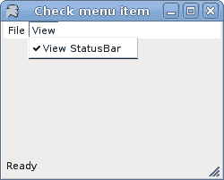

# 菜单和工具栏

> [http://zetcode.com/tutorials/ironpythontutorial/menustoolbars/](http://zetcode.com/tutorials/ironpythontutorial/menustoolbars/)

在 IronPython Mono Winforms 教程的这一部分中，我们将讨论菜单和工具栏。

菜单栏是 GUI 应用中最可见的部分之一。 它是位于各个菜单中的一组命令。 在控制台应用中，您必须记住所有这些神秘命令，在这里，我们将大多数命令分组为逻辑部分。 有公认的标准可以进一步减少学习新应用的时间。

## 简单菜单

在第一个示例中，我们创建一个简单的菜单。

`simplemenu.py`

```py
#!/usr/bin/ipy

import clr
clr.AddReference("System.Windows.Forms")
clr.AddReference("System.Drawing")

from System.Windows.Forms import Application, Form
from System.Windows.Forms import Keys, MenuStrip, ToolStripMenuItem
from System.Drawing import Size

class IForm(Form):

    def __init__(self):
        self.Text = 'Simple Menu'
        self.Size = Size(250, 200)

        ms = MenuStrip()
        ms.Parent = self

        filem = ToolStripMenuItem("&File")         
        exit = ToolStripMenuItem("&Exit", None,
            self.OnExit)  
        exit.ShortcutKeys = Keys.Control | Keys.X
        filem.DropDownItems.Add(exit)

        ms.Items.Add(filem)
        self.MainMenuStrip = ms

        self.CenterToScreen()

    def OnExit(self, sender, event):
        self.Close()

Application.Run(IForm())

```

在我们的示例中，我们有一个菜单栏和一个菜单。 菜单内有一个菜单项。 如果选择菜单项，则应用关闭。

注意如何关闭应用。 我们可以使用 `Ctrl + X` 快捷方式或按 `Alt + F + E` 键关闭它 。

```py
ms = MenuStrip()

```

`MenuStrip`为我们的表单创建一个菜单系统。 我们将`ToolStripMenuItem`对象添加到`MenuStrip`，它们表示菜单结构中的各个菜单命令。 每个`ToolStripMenuItem`可以是您的应用的命令，也可以是其他子菜单项的父菜单。

```py
filem = ToolStripMenuItem("&File")           

```

在这里，我们创建一个菜单。

```py
exit = ToolStripMenuItem("&Exit", None,
    self.OnExit)     

```

此行创建退出菜单项。

```py
exit.ShortcutKeys = Keys.Control | Keys.X

```

我们提供了退出菜单项的快捷方式。

```py
filem.DropDownItems.Add(exit)

```

退出菜单项将添加到菜单对象的下拉项中。

```py
ms.Items.Add(filem)   

```

在这里，我们将菜单对象添加到菜单栏中。

```py
self.MainMenuStrip = ms

```

`MenuStrip`已插入表格。


图：简单菜单

## 子菜单

每个菜单项也可以有一个子菜单。 这样，我们可以将类似的命令分组。 例如，我们可以将隐藏或显示各种工具栏（例如个人栏，地址栏，状态栏或导航栏）的命令放入称为工具栏的子菜单中。

`submenu.py`

```py
#!/usr/bin/ipy

import clr
clr.AddReference("System.Windows.Forms")
clr.AddReference("System.Drawing")

from System.Windows.Forms import Application, Form
from System.Windows.Forms import MenuStrip, ToolStripMenuItem
from System.Drawing import Size

class IForm(Form):

    def __init__(self):
        self.Text = 'Simple Menu'
        self.Size = Size(380, 200)

        ms = MenuStrip()
        ms.Parent = self

        filem = ToolStripMenuItem("&File")
        exit = ToolStripMenuItem("&Exit", None,
            self.OnExit)

        importm = ToolStripMenuItem()
        importm.Text = "Import"

        filem.DropDownItems.Add(importm)

        temp = ToolStripMenuItem()
        temp.Text = "Import newsfeed list..."
        importm.DropDownItems.Add(temp)

        temp = ToolStripMenuItem()
        temp.Text = "Import bookmarks..."
        importm.DropDownItems.Add(temp)

        temp = ToolStripMenuItem()
        temp.Text = "Import mail..."
        importm.DropDownItems.Add(temp)

        filem.DropDownItems.Add(exit)

        ms.Items.Add(filem)
        self.MainMenuStrip = ms

        self.CenterToScreen()

    def OnExit(self, sender, event):
        self.Close()

Application.Run(IForm())

```

在此示例中，我们创建一个子菜单。 子菜单导入具有三个菜单项。

```py
importm = ToolStripMenuItem()
importm.Text = "Import"

```

`ToolStripMenuItem`可以是菜单或菜单项。 在这里它将作为子菜单。

```py
temp = ToolStripMenuItem()
temp.Text = "Import newsfeed list..."
importm.DropDownItems.Add(temp)

```

在这里，我们创建一个菜单项并将其添加到“导入”子菜单。


图：子菜单

## 检查菜单项

下一个代码示例演示如何创建选中的菜单项。

`checkmenuitem.py`

```py
#!/usr/bin/ipy

import clr
clr.AddReference("System.Windows.Forms")
clr.AddReference("System.Drawing")

from System.Windows.Forms import Application, Form, StatusBar
from System.Windows.Forms import Shortcut, MainMenu, MenuItem
from System.Drawing import Size

class IForm(Form):

    def __init__(self):
        self.Text = 'Simple Menu'

        self.sb = StatusBar()
        self.sb.Parent = self
        self.sb.Text = "Ready"

        mainMenu = MainMenu()

        filem = mainMenu.MenuItems.Add("&File")    
        filem.MenuItems.Add(MenuItem("E&xit", 
                 self.OnExit, Shortcut.CtrlX))

        view = mainMenu.MenuItems.Add("&View")
        self.viewStatusBar = MenuItem("View StatusBar")
        self.viewStatusBar.Checked = True
        self.viewStatusBar.Click += self.ToggleStatusBar
        view.MenuItems.Add(self.viewStatusBar)

        self.Menu = mainMenu
        self.Size = Size(250, 200)

        self.CenterToScreen()

    def OnExit(self, sender, event):
        self.Close()

    def ToggleStatusBar(self, sender, event):
        check = self.viewStatusBar.Checked

        if (check):
            self.sb.Visible = False
            self.viewStatusBar.Checked = False
        else:
            self.sb.Visible = True
            self.viewStatusBar.Checked = True

Application.Run(IForm())

```

我们有两个菜单：“文件”和“查看”。 “查看”菜单具有一个菜单项，用于切换状态栏的可见性。

```py
mainMenu = MainMenu()

```

在此示例中，我们使用`MainMenu`控件。 要创建菜单栏，我们可以使用`MainMenu`或`MenuStrip`控件。 后者具有一些附加功能。

```py
self.viewStatusBar.Checked = True

```

默认情况下会选中此菜单项，因为状态栏从应用的开始就可见。

```py
check = self.viewStatusBar.Checked

if (check):
    self.sb.Visible = False
    self.viewStatusBar.Checked = False
else:
    self.sb.Visible = True
    self.viewStatusBar.Checked = True

```

我们确定菜单项是否被选中。 我们根据`check`值显示和隐藏状态栏和复选标记。



图：选中菜单项

## 图像，分隔符

我们将进一步增强对`MenuStrip`控件的了解。 我们将创建一个带有图像的菜单项，并显示如何使用分隔符将其分开。

`menustrip.py`

```py
#!/usr/bin/ipy

import clr
clr.AddReference("System.Windows.Forms")
clr.AddReference("System.Drawing")

from System.Windows.Forms import Application, Form, MenuStrip
from System.Windows.Forms import ToolStripMenuItem, ToolStripSeparator
from System.Drawing import Size, Image

class IForm(Form):

    def __init__(self):
        self.Text = 'MenuStrip'
        self.Size = Size(250, 200)

        menuStrip = MenuStrip()

        titem1 = ToolStripMenuItem("File")
        menuStrip.Items.Add(titem1)

        titem2 = ToolStripMenuItem("Tools")
        menuStrip.Items.Add(titem2)

        subm1 = ToolStripMenuItem("New")
        subm1.Image = Image.FromFile("new.png")
        titem1.DropDownItems.Add(subm1)

        subm2 = ToolStripMenuItem("Open") 
        subm2.Image = Image.FromFile("open.png")
        titem1.DropDownItems.Add(subm2)

        titem1.DropDownItems.Add(ToolStripSeparator())

        subm3 = ToolStripMenuItem("Exit")
        subm3.Image = Image.FromFile("exit.png")
        titem1.DropDownItems.Add(subm3)  

        subm3.Click += self.OnExit
        self.Controls.Add(menuStrip)
        self.MainMenuStrip = menuStrip 

        self.CenterToScreen()

    def OnExit(self, sender, event):
        self.Close()

Application.Run(IForm())

```

在代码示例中，我们有两个菜单：“文件”和“工具”。 在文件中，我们有三个带有图像的菜单项。 我们还有一个分隔符。 在此示例中，png 图像必须位于当前工作目录中。

```py
subm1 = ToolStripMenuItem("New")
subm1.Image = Image.FromFile("new.png")
titem1.DropDownItems.Add(subm1)

```

在这里，我们创建第一个菜单项。 要将图像添加到项目，我们将`Image`属性设置为图像。 我们使用`FromFile()`方法从指定的文件创建一个`Image`。

```py
titem1.DropDownItems.Add(ToolStripSeparator())

```

在这里，我们向“文件”菜单添加分隔符。


Figure: Images and separator

## 工具栏

菜单将我们可以在应用中使用的所有命令分组。 使用工具栏可以快速访问最常用的命令。 `ToolBar`控件用于显示`ToolBarButton`控件。 我们可以通过创建`ImageList`将图像分配给按钮。 然后，我们将图像列表分配给工具栏的`ImageList`属性，并为每个`ToolBarButton`将图像索引值分配给`ImageIndex`属性。

`toolbar.py`

```py
#!/usr/bin/ipy

import clr
clr.AddReference("System.Windows.Forms")
clr.AddReference("System.Drawing")
clr.AddReference("System")

from System.Windows.Forms import Application, Form
from System.Windows.Forms import ToolBar, ToolBarButton, ImageList
from System.Drawing import Size, Icon

class IForm(Form):

    def __init__(self):
        self.Text = 'Simple ToolBar'
        self.Size = Size(250, 200)

        toolBar = ToolBar()
        toolBarIcons = ImageList()
        save = ToolBarButton()
        exit = ToolBarButton()

        save.ImageIndex = 0
        save.Tag = "Save"
        exit.ImageIndex = 1
        exit.Tag = "Exit"

        toolBar.ImageList = toolBarIcons
        toolBar.ShowToolTips = True
        toolBar.Buttons.AddRange((save, exit))
        toolBar.ButtonClick += self.OnClicked

        toolBarIcons.ImageSize = Size(16, 16)
        toolBarIcons.Images.Add(Icon("new.ico"))
        toolBarIcons.Images.Add(Icon("exit.ico"))

        self.Controls.Add(toolBar)
        self.CenterToScreen()

    def OnClicked(self, sender, event):
        if event.Button.Tag == "Exit":
            self.Close()

Application.Run(IForm())

```

在我们的示例中，我们在工具栏上显示了两个按钮。

```py
toolBar = ToolBar()

```

在这里，我们创建`ToolBar`控件。

```py
toolBarIcons = ImageList()

```

创建图像列表。

```py
save = ToolBarButton()
exit = ToolBarButton()

```

这是两个工具栏按钮。

```py
save.ImageIndex = 0

```

我们确定图像列表中的哪个图标将用于保存工具栏按钮。

```py
toolBar.Buttons.AddRange((save, exit))

```

`ToolBarButton`控件已添加到工具栏。

```py
toolBarIcons.Images.Add(Icon("new.ico"))
toolBarIcons.Images.Add(Icon("exit.ico"))

```

图标将添加到图像列表。

```py
if event.Button.Tag == "Exit":
    self.Close()

```

如果按钮的标签等于“退出”，我们将关闭该应用。


图：工具栏

IronPython Winforms 教程的这一部分是关于菜单和工具栏的。