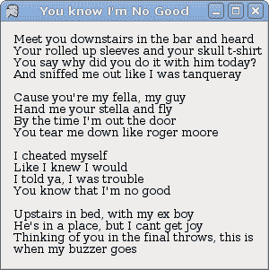
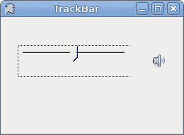
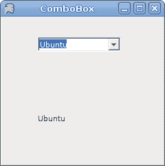

# Mono Winforms 中的基本控件

> 原文： [http://zetcode.com/tutorials/ironpythontutorial/controls/](http://zetcode.com/tutorials/ironpythontutorial/controls/)

IronPython Mono Winforms 编程教程的这一部分将介绍基本控件。

Winforms 控件是应用的基本构建块。 Winforms 具有广泛的各种控件。 按钮，复选框，轨迹栏，标签等。程序员完成工作所需的一切。 在本教程的这一部分中，我们将描述几个有用的控件。

## `Label`

`Label`是用于显示文本或图像的简单控件。 它没有得到关注。

`label.py`

```py
#!/usr/bin/ipy

import sys
import clr
clr.AddReference("System.Windows.Forms")
clr.AddReference("System.Drawing")

from System.Windows.Forms import Application, Form, Label
from System.Drawing import Size, Point, Font

text = """Meet you downstairs in the bar and heard
Your rolled up sleeves and your skull t-shirt
You say why did you do it with him today?
And sniffed me out like I was tanqueray

Cause you're my fella, my guy
Hand me your stella and fly
By the time I'm out the door
You tear me down like roger moore

I cheated myself
Like I knew I would
I told ya, I was trouble
You know that I'm no good

Upstairs in bed, with my ex boy
He's in a place, but I cant get joy
Thinking of you in the final throws, this is when my buzzer goes"""

class IForm(Form):

    def __init__(self):

        self.Text = "You know I'm No Good"

        font = Font("Serif", 10)

        lyrics = Label()
        lyrics.Parent = self
        lyrics.Text = text
        lyrics.Font = font
        lyrics.Location = Point(10, 10)
        lyrics.Size = Size(290, 290)

        self.CenterToScreen()

Application.Run(IForm())

```

在我们的示例中，我们在表单上显示了一些歌词。

```py
lyrics = Label()

```

`Label`控件已创建。

```py
text = """Meet you downstairs in the bar and heard 
        ... """

```

这是我们的文字。

```py
font = Font("Serif", 10)
...
lyrics.Font = font

```

标签文本的字体设置为 10px Serif。



图：`Label`

## `CheckBox`

`CheckBox`是具有两个状态的控件：开和关。 它是带有标签或图像的盒子。 如果选中`CheckBox`，则在方框中用勾号表示。 `CheckBox`可用于在启动时显示或隐藏启动画面，切换工具栏的可见性等。

`checkbox.py`

```py
#!/usr/bin/ipy

import clr
clr.AddReference("System.Windows.Forms")
clr.AddReference("System.Drawing")

from System.Windows.Forms import Application, Form, CheckBox
from System.Drawing import Size, Point

class IForm(Form):

    def __init__(self):

        self.Text = "CheckBox"
        self.Size = Size(220, 170)

        cb = CheckBox()
        cb.Parent = self
        cb.Location = Point(30, 30)
        cb.Text = "Show Title"
        cb.Checked = True

        cb.CheckedChanged += self.OnChanged

        self.CenterToScreen()

    def OnChanged(self, sender, event):
        if sender.Checked:
            self.Text = "CheckBox"
        else:
            self.Text = ""

Application.Run(IForm())

```

我们的代码示例根据窗口的状态显示或隐藏窗口的标题。

```py
cb = CheckBox()

```

`CheckBox`控件已创建。

```py
cb.Text = "Show Title"
cb.Checked = True

```

当应用启动时，我们显示标题。 然后将`CheckBox`控件设置为选中状态。

```py
cb.CheckedChanged += self.OnChanged

```

当我们单击`CheckBox`控件时，将触发`CheckedChanged`事件。

```py
if sender.Checked:
    self.Text = "CheckBox"
else:
    self.Text = ""

```

在这里，我们切换窗口的标题。


图：`CheckBox`

## `TrackBar`

`TrackBar`是一个组件，使用户可以通过在有限的间隔内滑动旋钮来以图形方式选择一个值。 我们的示例将显示音量控制。

`trackbar.py`

```py
#!/usr/bin/ipy

import sys
import clr
clr.AddReference("System.Windows.Forms")
clr.AddReference("System.Drawing")

from System.Windows.Forms import Application, Form, PictureBox
from System.Windows.Forms import TrackBar, TickStyle
from System.Drawing import Size, Point, Bitmap

class IForm(Form):

    def __init__(self):
        self.Text = 'TrackBar'
        self.Size = Size(260, 190)

        tb = TrackBar()
        tb.Parent = self
        tb.Size = Size(150, 30)
        tb.Location = Point(30, 50)
        tb.TickStyle = TickStyle.None
        tb.SetRange(0, 100)

        tb.ValueChanged += self.OnChanged

        self.LoadImages()

        self.pb = PictureBox()
        self.pb.Parent = self
        self.pb.Location = Point(210, 50)
        self.pb.Image = self.mutep

        self.CenterToScreen()

    def LoadImages(self):
        try:
            self.mutep = Bitmap("mute.png")
            self.minp = Bitmap("min.png")
            self.medp = Bitmap("med.png")
            self.maxp = Bitmap("max.png")
        except Exception, e:
            print "Error reading images"
            print e.msg
            sys.exit(1)

    def OnChanged(self, sender, event): 
        val = sender.Value

        if val == 0: 
            self.pb.Image = self.mutep
        elif val > 0 and val <= 30:
            self.pb.Image = self.minp
        elif val > 30 and val < 80:
            self.pb.Image = self.medp
        else: self.pb.Image = self.maxp

Application.Run(IForm())

```

在代码示例中，我们显示了`TrackBar`和`PictureBox`。 通过拖动轨迹栏，我们可以在`PictureBox`控件上更改图像。

```py
tb = TrackBar()

```

`TrackBar`控件已创建。

```py
tb.TickStyle = TickStyle.None

```

我们对此`TrackBar`没有显示任何报价。

```py
self.pb = PictureBox()
...
self.pb.Image = self.mutep

```

`PictureBox`控件已创建。 它用于显示图像。 开始时，它会显示静音图像。

```py
self.mutep = Bitmap("mute.png")
self.minp = Bitmap("min.png")
self.medp = Bitmap("med.png")
self.maxp = Bitmap("max.png")

```

在这里，我们将创建四个将要使用的图像。

```py
val = sender.Value

if val == 0: 
    self.pb.Image = self.mutep
elif val > 0 and val <= 30:
    self.pb.Image = self.minp
elif val > 30 and val < 80:
    self.pb.Image = self.medp
else: self.pb.Image = self.maxp

```

我们确定`TrackBar`的值。 根据其值，我们更新`PictureBox`控件。



图：`TrackBar`

## `ComboBox`

`ComboBox`是一个组合了按钮或可编辑字段和下拉列表的控件。 用户可以从下拉列表中选择一个值，该列表应用户的要求出现。 如果使组合框可编辑，则组合框将包含一个可编辑字段，用户可以在其中输入值。

`combobox.py`

```py
#!/usr/bin/ipy

import clr
clr.AddReference("System.Windows.Forms")
clr.AddReference("System.Drawing")

from System.Windows.Forms import Application, Form
from System.Windows.Forms import ComboBox, Label
from System.Drawing import Size, Point

class IForm(Form):

    def __init__(self):

        self.Text = "ComboBox"
        self.Size = Size(240, 240)

        cb = ComboBox()
        cb.Parent = self
        cb.Location = Point(50, 30)

        cb.Items.AddRange(("Ubuntu",
            "Mandriva",
            "Red Hat",
            "Fedora",
            "Gentoo"))

        cb.SelectionChangeCommitted += self.OnChanged

        self.label = Label()
        self.label.Location = Point(50, 140)
        self.label.Parent = self
        self.label.Text = "..."

        self.CenterToScreen()

    def OnChanged(self, sender, event):
         self.label.Text = sender.Text

Application.Run(IForm())

```

我们的代码编程示例显示了一个包含五个项目的组合框。 所选项目显示在标签控件中。

```py
cb = ComboBox()

```

`ComboBox`控件已创建。

```py
cb.Items.AddRange(("Ubuntu",
    "Mandriva",
    "Red Hat",
    "Fedora",
    "Gentoo"))

```

`ComboBox`控件中充满了项目。

```py
cb.SelectionChangeCommitted += self.OnChanged

```

如果我们从组合框中选择一个项目，则会触发`SelectionChangeCommitted`事件。

```py
def OnChanged(self, sender, event):
    self.label.Text = sender.Text

```

在这里，将从组合框中选择的文本复制到标签。



图：`ComboBox`

我们已经完成了 IronPython Mono Winforms 教程的这一章，专门讨论基本控件。