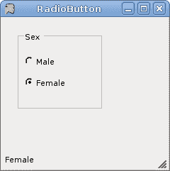
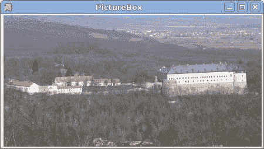

# Mono Winforms 中的基本控件 II

> 原文： [http://zetcode.com/tutorials/ironpythontutorial/controlsII/](http://zetcode.com/tutorials/ironpythontutorial/controlsII/)

在 IronPython Mono Winforms 教程的这一部分中，我们将继续介绍基本的 Mono Winforms 控件。

## 单选按钮

与其他 RadioButton 控件配对时，`RadioButton`控件使用户能够从一组选项中选择一个选项。 `GroupBox`控件用于将单选按钮配对在一起。

`radiobutton.py`

```
#!/usr/bin/ipy

import clr
clr.AddReference("System.Windows.Forms")
clr.AddReference("System.Drawing")

from System.Windows.Forms import Application, Form, StatusBar
from System.Windows.Forms import RadioButton, GroupBox
from System.Drawing import Size, Point

class IForm(Form):

    def __init__(self):

        self.Text = "RadioButton"
        self.Size = Size(240, 240)

        gb = GroupBox()
        gb.Text = "Sex"
        gb.Size = Size(120, 110)
        gb.Location = Point(20, 20)
        gb.Parent = self

        male = RadioButton()
        male.Text = "Male"
        male.Parent = gb
        male.Location = Point(10, 30)
        male.CheckedChanged += self.OnChanged

        female = RadioButton()
        female.Text = "Female"
        female.Parent = gb
        female.Location = Point(10, 60)
        female.CheckedChanged += self.OnChanged

        self.statusbar = StatusBar()
        self.statusbar.Parent = self

        self.CenterToScreen()

    def OnChanged(self, sender, event):
        if sender.Checked:
            self.statusbar.Text = sender.Text

Application.Run(IForm())

```

在我们的示例中，我们在一个组框中显示了两个单选按钮。 一次只能选择一个选项。 选项值显示在状态栏中。

```
gb = GroupBox()
gb.Text = "Sex"

```

`GroupBox`控件用于将单选按钮组合在一起。 这样，我们一次只能选择一个单选按钮控件。

```
male = RadioButton()
male.Text = "Male"
male.Parent = gb

```

创建带有文本“ Male”的`RadioButton`控件。 它的父级是组框控件。

```
def OnChanged(self, sender, event):
    if sender.Checked:
        self.statusbar.Text = sender.Text

```

`OnChanged()`方法将当前所选单选按钮的文本设置为状态栏控件。



Figure: RadioButton

## 月历

在下一个示例中，我们将显示`MonthCalendar`控件。 `MonthCalendar`控件允许用户使用视觉显示选择日期。

`monthcalendar.py`

```
#!/usr/bin/ipy

import clr
clr.AddReference("System.Windows.Forms")
clr.AddReference("System.Drawing")

from System.Windows.Forms import Application, Form
from System.Windows.Forms import Label, MonthCalendar
from System.Drawing import Size, Point

class IForm(Form):

    def __init__(self):
        self.Text = 'MonthCalendar'
        self.Size = Size(240, 240)

        calendar = MonthCalendar()
        calendar.Parent = self
        calendar.Location = Point(20, 20)
        calendar.DateSelected += self.OnSelected

        self.date = Label()
        self.date.Location = Point(30, 180)
        self.date.Parent = self
        dt = calendar.SelectionStart
        self.date.Text = str(dt.Month) + "/" + str(dt.Day) + "/" + str(dt.Year)

        self.CenterToScreen()

    def OnSelected(self, sender, event): 
        dt = sender.SelectionStart
        self.date.Text = str(dt.Month) + "/" + str(dt.Day) + "/" + str(dt.Year)

Application.Run(IForm())

```

在示例中，我们显示了`MonthCalendar`和`Label`。

```
calendar = MonthCalendar()
...
self.date = Label()

```

我们有两个控件。 一个`MonthCalendar`和一个`Label`。 后者显示当前选择的日期。

```
def OnSelected(self, sender, event): 
    dt = sender.SelectionStart
    self.date.Text = str(dt.Month) + "/" + str(dt.Day) + "/" + str(dt.Year)

```

当我们从`MonthCalendar`中选择一个日期时，就会调用`OnSelected()`方法。 `SelectionStart`属性获取所选日期范围的开始日期。


Figure: MonthCalendar

## 文本框

`TextBox`控件用于显示或接受某些文本。 文本可以是单行或多行。 此控件还可以进行密码屏蔽。

`textbox.py`

```
#!/usr/bin/ipy

import clr
clr.AddReference("System.Windows.Forms")
clr.AddReference("System.Drawing")

from System.Windows.Forms import Application, Form
from System.Windows.Forms import Label, TextBox
from System.Drawing import Size, Point

class IForm(Form):

    def __init__(self):

        self.Text = 'TextBox'

        self.text = Label()
        self.text.Parent = self
        self.text.Text = "..."
        self.text.AutoSize = True
        self.text.Location = Point(60, 40)

        tbox = TextBox()
        tbox.Parent = self
        tbox.Location = Point(60, 100)
        tbox.KeyUp += self.OnKeyUp

        self.Size = Size(250, 200)
        self.CenterToScreen()

    def OnKeyUp(self, sender, event): 
        self.text.Text = sender.Text

Application.Run(IForm())

```

本示例显示一个文本框和一个标签。 我们在文本框中键入的文本将立即显示在标签控件中。

```
self.text = Label()
...
self.text.AutoSize = True

```

`Label`控件已创建。 `AutoSize`属性确保`Label`增长以显示文本。

```
tbox = TextBox()
...
tbox.KeyUp += self.OnKeyUp

```

我们将`KeyUp`事件插入到`TextBox`控件中。 释放密钥时，将调用`OnKeyUp()`方法。

```
def OnKeyUp(self, sender, event): 
    self.text.Text = sender.Text

```

在`OnKeyUp()`方法中，我们使用文本框控件中的文本更新了标签控件。


Figure: TextBox

## 图片框

`PictureBox`控件用于在表单上显示图片。

`picturebox.py`

```
#!/usr/bin/ipy

import sys
import clr
clr.AddReference("System.Windows.Forms")
clr.AddReference("System.Drawing")

from System.Windows.Forms import Application, Form, PictureBox
from System.Drawing import Size, Point, Bitmap

class IForm(Form):

    def __init__(self):
        self.Text = 'PictureBox'

        try:
            castle = Bitmap('redrock.png') 
        except Exception, e:
            print 'Cannot read image file'
            print e.msg
            sys.exit(1)

        pb = PictureBox()
        pb.Parent = self
        pb.Size = Size(castle.Width, castle.Height)
        pb.Location = Point(2, 2)
        pb.Image = castle

        self.Size = Size(castle.Width, castle.Height)
        self.CenterToScreen()

Application.Run(IForm())

```

该示例显示了表单上的 png 图像。

```
try:
    castle = Bitmap('redrock.png') 
except Exception, e:
    print 'Cannot read image file'
    print e.msg
    sys.exit(1)      

```

我们从当前工作目录中获得一个位图。

```
pb = PictureBox()     

```

`PictureBox`控件已创建。

```
pb.Image = castle    

```

`Image`属性指向我们创建的位图。

```
self.Size = Size(castle.Width, castle.Height)

```

窗体的大小等于位图的大小。



Figure: PictureBox

我们已经完成了 Mono Winforms 编程教程的这一章，专门讨论基本控件。