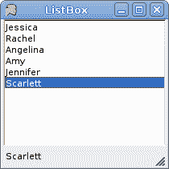
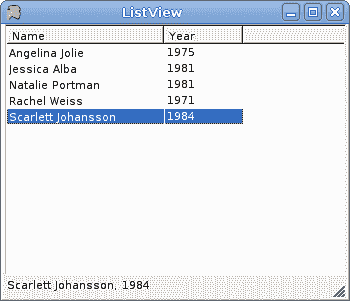
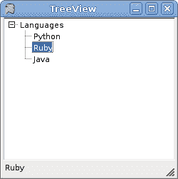
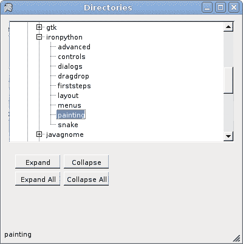

# Mono Winforms 中的高级控件

> 原文： [http://zetcode.com/tutorials/ironpythontutorial/advancedcontrols/](http://zetcode.com/tutorials/ironpythontutorial/advancedcontrols/)

在 IronPython Mono Winforms 教程的这一部分中，我们介绍一些更高级的控件。 即`ListBox`，`ListView`和`TreeView`控件。

## `ListBox`

`ListBox`控件用于显示项目列表。 用户可以通过单击选择一个或多个项目。

`listbox.py`

```
#!/usr/bin/ipy

import clr
clr.AddReference("System.Windows.Forms")
clr.AddReference("System.Drawing")

from System.Windows.Forms import Application, Form, StatusBar
from System.Windows.Forms import ListBox, DockStyle
from System.Drawing import Size

class IForm(Form):

    def __init__(self):
        self.Text = "ListBox"

        lb = ListBox()
        lb.Parent = self

        lb.Items.Add("Jessica")
        lb.Items.Add("Rachel")
        lb.Items.Add("Angelina")
        lb.Items.Add("Amy")
        lb.Items.Add("Jennifer")
        lb.Items.Add("Scarlett")

        lb.Dock = DockStyle.Fill
        lb.SelectedIndexChanged += self.OnChanged

        self.sb = StatusBar()
        self.sb.Parent = self

        self.Size = Size(220, 220)
        self.CenterToScreen()

    def OnChanged(self, sender, event):
        self.sb.Text = sender.SelectedItem

Application.Run(IForm())

```

我们的示例显示了一个具有六个名称的列表框。 所选项目显示在状态栏中。

```
lb = ListBox()
lb.Parent = self

```

`ListBox`控件已创建。

```
lb.Items.Add("Jessica")

```

这就是我们向`ListBox`控件添加新项目的方式。 该控件具有`Items`属性。 该属性是对列表框中项目列表的引用。 使用此参考，我们可以添加，删除或获取列表框中的项目数。

```
lb.SelectedIndexChanged += self.OnChanged

```

当我们选择一个项目时，会触发`SelectedIndexChanged`事件。

```
def OnChanged(self, sender, event):
    self.sb.Text = sender.SelectedItem

```

在`OnChange()`方法内，我们获得列表框的选定值并将其设置为状态栏。



Figure: ListBox

## `ListView`

`ListView`控件用于显示项目集合。 它是比`ListBox`控件更复杂的控件。 它可以在各种视图中显示数据。 它主要用于在多列视图中显示数据。

`listview.py`

```
#!/usr/bin/ipy

import clr
clr.AddReference("System.Windows.Forms")
clr.AddReference("System.Drawing")

from System.Windows.Forms import Application, Form, StatusBar
from System.Windows.Forms import ListView, View, ColumnHeader
from System.Windows.Forms import ListViewItem, DockStyle, SortOrder
from System.Drawing import Size

class IForm(Form):

    def __init__(self):
        self.Text = 'ListBox'

        actresses = { 'Jessica Alba' : '1981', 'Angelina Jolie' : '1975', 
            'Natalie Portman' : '1981', 'Rachel Weiss' : '1971', 
            'Scarlett Johansson' : 1984 }

        name = ColumnHeader()
        name.Text = 'Name'
        name.Width = -1
        year = ColumnHeader()
        year.Text = 'Year'

        self.SuspendLayout()

        lv = ListView()
        lv.Parent = self
        lv.FullRowSelect = True
        lv.GridLines = True
        lv.AllowColumnReorder = True
        lv.Sorting = SortOrder.Ascending
        lv.Columns.AddRange((name, year))
        lv.ColumnClick += self.OnColumnClick

        for act in actresses.keys():
            item = ListViewItem()
            item.Text = act
            item.SubItems.Add(str(actresses[act]))
            lv.Items.Add(item)

        lv.Dock = DockStyle.Fill
        lv.Click += self.OnChanged

        self.sb = StatusBar()
        self.sb.Parent = self
        lv.View = View.Details

        self.ResumeLayout()

        self.Size = Size(350, 300)
        self.CenterToScreen()

    def OnChanged(self, sender, event):

        name = sender.SelectedItems[0].SubItems[0].Text
        born = sender.SelectedItems[0].SubItems[1].Text
        self.sb.Text = name + ', ' + born

    def OnColumnClick(self, sender, event):

        if sender.Sorting == SortOrder.Ascending:
            sender.Sorting = SortOrder.Descending
        else: 
            sender.Sorting = SortOrder.Ascending

Application.Run(IForm())

```

在我们的示例中，我们有一个包含两列的列表视图。 在第一列中，我们显示女演员的名字。 在第二个他们的出生日期。 数据存储在`List`集合中。 通过选择一行，一行中的数据将显示在状态栏中。 另外，通过单击列标题，可以对数据进行排序。

```
actresses = { 'Jessica Alba' : '1981', 'Angelina Jolie' : '1975', 
    'Natalie Portman' : '1981', 'Rachel Weiss' : '1971', 
    'Scarlett Johansson' : 1984 }

```

我们将数据存储在女演员词典中。

```
name = ColumnHeader()
name.Text = 'Name'
name.Width = -1

```

对于列表视图中的每一列，我们创建一个`ColumnHeader`。 通过将`Width`设置为 -1，列的宽度等于列中最长的项目。

```
lv = ListView()
lv.Parent = self

```

`ListView`控件已创建。

```
lv.FullRowSelect = True
lv.GridLines = True
lv.AllowColumnReorder = True
lv.Sorting = SortOrder.Ascending

```

在这里，我们设置控件的四个属性。 该代码行支持全行选择，显示网格线，通过拖动列对列进行重新排序并以升序对数据进行排序。

```
lv.Columns.AddRange((name, year))

```

在这里，我们将两个`ColumnHeader`添加到`ListView`控件中。

```
for act in actresses.keys():
    item = ListViewItem()
    item.Text = act
    item.SubItems.Add(str(actresses[act]))
    lv.Items.Add(item)

```

此循环填充列表视图控件。 每行作为`ListViewItem`类添加到列表视图。

```
lv.View = View.Details

```

`ListView`控件可以具有不同的视图。 不同的视图以不同的方式显示数据。

```
name = sender.SelectedItems[0].SubItems[0].Text
born = sender.SelectedItems[0].SubItems[1].Text
self.sb.Text = name + ', ' + born

```

在`OnChanged()`方法内部，我们从选定的行中获取数据并将其显示在状态栏上。

```
if sender.Sorting == SortOrder.Ascending:
    sender.Sorting = SortOrder.Descending
else: 
    sender.Sorting = SortOrder.Ascending

```

在这里，我们切换列的排序顺序。



Figure: ListView

## `TreeView`

`TreeView`控件显示项目的分层集合。 此控件中的每个项目都由`TreeNode`对象表示。

`treeview.py`

```
#!/usr/bin/ipy

import clr
clr.AddReference("System.Windows.Forms")
clr.AddReference("System.Drawing")

from System.Windows.Forms import Application, Form, StatusBar
from System.Windows.Forms import TreeView, TreeNode, DockStyle
from System.Drawing import Size

class IForm(Form):

    def __init__(self):
        self.Text = 'TreeView'

        tv = TreeView()

        root = TreeNode()
        root.Text = 'Languages'

        child1 = TreeNode()
        child1.Text = 'Python'

        child2 = TreeNode()
        child2.Text = 'Ruby'

        child3 = TreeNode()
        child3.Text = 'Java'

        root.Nodes.AddRange((child1, child2, child3))

        tv.Parent = self
        tv.Nodes.Add(root)
        tv.Dock = DockStyle.Fill
        tv.AfterSelect += self.AfterSelect

        self.sb = StatusBar()
        self.sb.Parent = self

        self.Size = Size(220, 220)
        self.CenterToScreen()

    def AfterSelect(self, sender, event):    
        self.sb.Text = event.Node.Text

Application.Run(IForm())

```

这是`TreeView`控件的非常简单的演示。 我们有一个根项目和三个孩子。

```
tv = TreeView()

```

我们创建`TreeView`控件。

```
root = TreeNode()
root.Text = 'Languages'
...
tv.Nodes.Add(root)

```

在这里，我们创建一个根节点。

```
child1 = TreeNode()
child1.Text = 'Python'

```

子节点以类似的方式创建。

```
root.Nodes.AddRange((child1, child2, child3))

```

子节点插入到根节点的`Nodes`属性中。



Figure: TreeView

## 目录

下面的代码示例将更深入地研究`TreeView`控件。

`directories.py`

```
#!/usr/bin/ipy

import clr
clr.AddReference("System.Windows.Forms")
clr.AddReference("System.Drawing")

from System.Windows.Forms import Application, Form, StatusBar
from System.Windows.Forms import Button, TreeView, TreeNode
from System.Windows.Forms import DockStyle, AnchorStyles
from System.Drawing import Size, Point
from System.IO import Directory, DirectoryInfo

HOME_DIR = '/home/vronskij'

class IForm(Form):

    def __init__(self):
        self.Text = 'Directories'
        self.Size = Size(400, 400)

        self.tv = TreeView()

        self.SuspendLayout()

        self.tv.Parent = self
        self.tv.Location = Point(10,10)
        self.tv.Size = Size(self.ClientSize.Width - 20, self.Height - 200)
        self.tv.Anchor = AnchorStyles.Top | AnchorStyles.Left | AnchorStyles.Right 

        self.tv.FullRowSelect = False
        self.tv.ShowLines = True
        self.tv.ShowPlusMinus = True
        self.tv.Scrollable = True  
        self.tv.AfterSelect += self.AfterSelect

        expand = Button()
        expand.Parent = self
        expand.Location = Point(20, self.tv.Bottom + 20)
        expand.Text = 'Expand'
        expand.Anchor = AnchorStyles.Left | AnchorStyles.Top
        expand.Click += self.OnExpand

        expandAll = Button()
        expandAll.Parent = self
        expandAll.Location = Point(20, expand.Bottom + 5)
        expandAll.Text = 'Expand All'
        expandAll.Anchor = AnchorStyles.Left | AnchorStyles.Top
        expandAll.Click += self.OnExpandAll

        collapse = Button()
        collapse.Parent = self
        collapse.Location = Point(expandAll.Right + 5, expand.Top)
        collapse.Text = 'Collapse'
        collapse.Anchor = AnchorStyles.Left | AnchorStyles.Top
        collapse.Click += self.OnCollapse

        collapseAll = Button()
        collapseAll.Parent = self
        collapseAll.Location = Point(collapse.Left, collapse.Bottom + 5)
        collapseAll.Text = 'Collapse All'
        collapseAll.Anchor = AnchorStyles.Left | AnchorStyles.Top
        collapseAll.Click += self.OnCollapseAll

        self.sb = StatusBar()
        self.sb.Parent = self

        self.ShowDirectories(self.tv.Nodes, HOME_DIR)

        self.ResumeLayout()

        self.CenterToScreen()

    def AfterSelect(self, sender, event):

        self.sb.Text = event.Node.Text

    def ShowDirectories(self, trvNode, path):

        dirInfo = DirectoryInfo(path)
        if (dirInfo != None):

          subDirs = dirInfo.GetDirectories()
          tr = TreeNode(dirInfo.Name)

          if (subDirs.Length > 0):

              for dr in subDirs: 
                  if not dr.Name.StartsWith("."):
                      self.ShowDirectories(tr.Nodes, dr.FullName)

          trvNode.Add(tr)    

    def OnExpand(self, sender, event):
        self.tv.SelectedNode.Expand()

    def OnExpandAll(self, sender, event):
        self.tv.ExpandAll()

    def OnCollapse(self, sender, event):
        self.tv.SelectedNode.Collapse()

    def OnCollapseAll(self, sender, event):
        self.tv.CollapseAll()

Application.Run(IForm())

```

我们的代码示例在`TreeView`控件中显示指定主目录的目录。 该应用启动有些延迟，因为它首先读取主目录的目录结构。 表单上还有四个按钮。 这些按钮以编程方式展开和折叠节点。

```
self.tv.Scrollable = True 

```

我们使`TreeView`控件可滚动，因为该控件显示了大量目录。

```
self.ShowDirectories(self.tv.Nodes, HOME_DIR)

```

`ShowDirectories()`方法使用指定主目录中可用的目录填充`TreeView`控件的节点。

```
if (subDirs.Length > 0):
    ...

```

我们检查是否有任何子目录。

```
for dr in subDirs: 
    if not dr.Name.StartsWith("."):
        self.ShowDirectories(tr.Nodes, dr.FullName)

```

我们遍历所有目录。 为此，我们使用了递归算法。 我们还跳过隐藏的目录。 它们以 Unix 系统上的点开头。

```
trvNode.Add(tr)     

```

此代码行实际上将目录添加到`TreeView`控件。

```
def OnExpand(self, sender, event):
    self.tv.SelectedNode.Expand()

```

所有四个按钮都将事件插入到方法中。 这是展开按钮的方法。 它调用当前所选节点的`Expand()`方法。



Figure: Directories

在 IronPython Mono Winforms 教程的这一部分中，我们介绍了 Winforms 编程库中提供的几个高级控件。