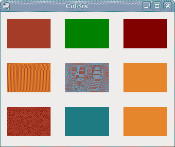
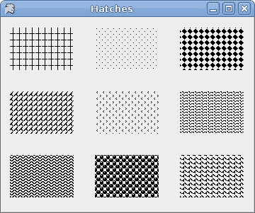
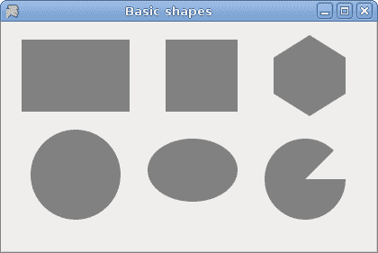
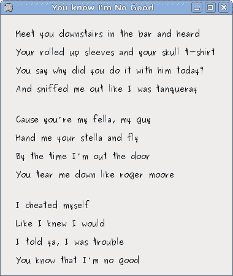
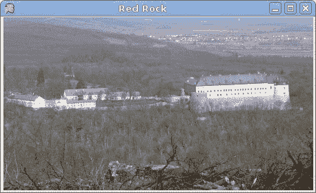

# 绘画

> 原文： [http://zetcode.com/tutorials/ironpythontutorial/painting/](http://zetcode.com/tutorials/ironpythontutorial/painting/)

在 IronPython Mono Winforms 教程的这一部分中，我们将进行绘画。 当我们想要更改或增强现有控件时，将使用绘画。 或者，如果我们要从头开始创建自定义控件。 要进行绘画，我们使用 Winforms 库提供的绘画 API。 绘画是在一种方法中完成的，我们将其插入`Paint`事件。

`System.Drawing`名称空间提供对`GDI+`基本图形功能的访问。 `System.Drawing.Drawing2D`，`System.Drawing.Imaging`和`System.Drawing.Text`名称空间提供了更高级的功能。 `Graphics`类提供了在表单上进行绘制的方法。

## 线数

我们的第一个示例将在`Form`控件上绘制线条。

`lines.py`

```
#!/usr/bin/ipy

import clr

clr.AddReference("System.Windows.Forms")
clr.AddReference("System.Drawing")

from System.Windows.Forms import Application, Form
from System.Drawing import Size, Pen, Color
from System.Drawing.Drawing2D import DashStyle

class IForm(Form):

    def __init__(self):
        self.Text = 'Lines'
        self.Size = Size(280, 270)
        self.Paint += self.OnPaint

        self.CenterToScreen()

    def OnPaint(self, event):

        g = event.Graphics

        pen = Pen(Color.Black, 1)
        pen.DashStyle = DashStyle.Dot

        g.DrawLine(pen, 20, 40, 250, 40)

        pen.DashStyle = DashStyle.DashDot
        g.DrawLine(pen, 20, 80, 250, 80)

        pen.DashStyle = DashStyle.Dash
        g.DrawLine(pen, 20, 120, 250, 120)

        pen.DashStyle = DashStyle.DashDotDot
        g.DrawLine(pen, 20, 160, 250, 160)

        pen.DashPattern = (6, 8, 1, 1, 1, 1, 1, 1)
        g.DrawLine(pen, 20, 200, 250, 200)

        pen.Dispose()
        g.Dispose()

Application.Run(IForm())

```

我们在表格上画了五行。 每行具有不同的`DashStyle`。

```
self.Paint += self.OnPaint

```

绘画事件将传递给`OnPaint()`方法。

```
def OnPaint(self, event):

```

这是`OnPaint()`方法的签名。

```
g = event.Graphics

```

为了在表单上绘画，我们必须获取`Graphics`对象。 在窗体上绘画实际上是在调用`Graphics`对象的各种方法。

```
pen = Pen(Color.Black, 1)
pen.DashStyle = DashStyle.Dot

g.DrawLine(pen, 20, 40, 250, 40)

```

我们创建一个`Pen`对象。 该对象用于绘制形状的轮廓。 比我们设置点划线`DashStyle`。 最后，我们用`DrawLine()`方法画线。 第一个参数是钢笔对象。 接下来的四个值是线的起点和终点的 x 和 y 值。

```
pen.DashPattern = (6, 8, 1, 1, 1, 1, 1, 1)

```

有几个内置的`DashStyle`值。 我们可以使用`DashPattern`属性来创建自己的样式。 乍一看可能很难。 但是模式只是填充和空值的元组。

```
pen.Dispose()
g.Dispose()

```

我们释放资源。


Figure: Lines

## 色彩

Winforms 库中的颜色表示 ARGB（alpha，红色，绿色，蓝色）颜色。 它是 Alpha，红色，绿色和蓝色（RGB）强度值的组合。 还有一些可以在绘画中使用的预定义颜色名称。

`colors.py`

```
#!/usr/bin/ipy

import clr

clr.AddReference("System.Windows.Forms")
clr.AddReference("System.Drawing")

from System.Windows.Forms import Application, Form, ControlStyles
from System.Drawing import Size, Brushes

class IForm(Form):

    def __init__(self):
        self.Text = 'Colors'       
        self.Size = Size(360, 300)
        self.Paint += self.OnPaint

        self.CenterToScreen()

    def OnPaint(self, event):

        g = event.Graphics

        g.FillRectangle(Brushes.Sienna, 10, 15, 90, 60)
        g.FillRectangle(Brushes.Green, 130, 15, 90, 60)
        g.FillRectangle(Brushes.Maroon, 250, 15, 90, 60)
        g.FillRectangle(Brushes.Chocolate, 10, 105, 90, 60)
        g.FillRectangle(Brushes.Gray, 130, 105, 90, 60)
        g.FillRectangle(Brushes.Coral, 250, 105, 90, 60)
        g.FillRectangle(Brushes.Brown, 10, 195, 90, 60)
        g.FillRectangle(Brushes.Teal, 130, 195, 90, 60)
        g.FillRectangle(Brushes.Goldenrod, 250, 195, 90, 60)

        g.Dispose()

Application.Run(IForm())

```

我们用 9 种不同的颜色绘制 9 个矩形。

```
g.FillRectangle(Brushes.Sienna, 10, 15, 90, 60)

```

`FillRectagle()`方法用画笔填充指定的矩形。 画笔可以是颜色或图案。 有一些预定义的颜色可用。 我们可以从`Brushes`对象获得它们。 最后四个值是左上角点的 x，y 值以及矩形的宽度和高度。



Figure: Colors

## 舱口

`HatchBrush`对象用于填充形状的内部。 我们可以使用几种内置模式。

`hatches.py`

```
#!/usr/bin/ipy

import clr

clr.AddReference("System.Windows.Forms")
clr.AddReference("System.Drawing")

from System.Windows.Forms import Application, Form
from System.Drawing import Size, Color
from System.Drawing.Drawing2D import HatchBrush, HatchStyle

class IForm(Form):

    def __init__(self):
        self.Text = 'Hatches'
        self.Size = Size(360, 300)

        self.Paint += self.OnPaint

        self.CenterToScreen()

    def OnPaint(self, event):

        g = event.Graphics

        hb = HatchBrush(HatchStyle.Cross, Color.Black, self.BackColor)
        g.FillRectangle(hb, 10, 15, 90, 60)

        hb = HatchBrush(HatchStyle.Percent05, Color.Black, self.BackColor)
        g.FillRectangle(hb, 130, 15, 90, 60)

        hb = HatchBrush(HatchStyle.SolidDiamond, Color.Black, self.BackColor)
        g.FillRectangle(hb, 250, 15, 90, 60)

        hb = HatchBrush(HatchStyle.DiagonalBrick, Color.Black, self.BackColor)
        g.FillRectangle(hb, 10, 105, 90, 60)

        hb = HatchBrush(HatchStyle.Divot, Color.Black, self.BackColor)
        g.FillRectangle(hb, 130, 105, 90, 60)

        hb = HatchBrush(HatchStyle.Wave, Color.Black, self.BackColor)
        g.FillRectangle(hb, 250, 105, 90, 60)

        hb = HatchBrush(HatchStyle.ZigZag, Color.Black, self.BackColor)
        g.FillRectangle(hb, 10, 195, 90, 60)

        hb = HatchBrush(HatchStyle.Sphere, Color.Black, self.BackColor)
        g.FillRectangle(hb, 130, 195, 90, 60)

        hb = HatchBrush(HatchStyle.Shingle, Color.Black, self.BackColor)
        g.FillRectangle(hb, 250, 195, 90, 60)

        hb.Dispose()
        g.Dispose()

Application.Run(IForm())

```

这次，我们用九种不同的图案（称为剖面线）填充了九个矩形。

```
hb = HatchBrush(HatchStyle.Cross, Color.Black, self.BackColor)

```

在这里，我们创建一个`HatchBrush`对象。 参数是图案填充样式以及前景色和背景色。 背景颜色设置为表单的颜色，因此看起来就像我们在表单上绘制的一样。

```
g.FillRectangle(hb, 10, 15, 90, 60)

```

我们使用指定的阴影刷填充矩形。



Figure: Hatches

## 基本对象

下面的示例在窗体控件上绘制一些基本形状。

`basicshapes.py`

```
#!/usr/bin/ipy

import clr

clr.AddReference("System.Windows.Forms")
clr.AddReference("System.Drawing")

from System.Windows.Forms import Application, Form
from System.Drawing import Size, Rectangle, Brushes, Pens, Point
from System.Drawing.Drawing2D import SmoothingMode
from System import Array

class IForm(Form):

    def __init__(self):
        self.Text = 'Basic shapes'
        self.Size = Size(420, 280)

        self.Paint += self.OnPaint

        self.CenterToScreen()

    def OnPaint(self, event):

        g = event.Graphics
        g.SmoothingMode = SmoothingMode.AntiAlias

        g.FillRectangle(Brushes.Gray, 20, 20, 120, 80)
        g.FillRectangle(Brushes.Gray, 180, 20, 80, 80)

        g.FillEllipse(Brushes.Gray, 30, 120, 100, 100)
        g.FillEllipse(Brushes.Gray, 160, 130, 100, 70)

        p1 = Point(300, 40)
        p2 = Point(340, 15)
        p3 = Point(380, 40)
        p4 = Point(380, 80)
        p5 = Point(340, 105)
        p6 = Point(300, 80)

        g.FillPolygon(Brushes.Gray, Array[Point]([p1, p2, p3, p4, p5, p6]))
        g.FillPie(Brushes.Gray, Rectangle(290, 130, 90, 90), 0, 315)

        g.Dispose()

Application.Run(IForm())

```

该代码示例在表单上绘制六个形状。 矩形，正方形，圆形，椭圆形，多边形和扇形。

```
g.SmoothingMode = SmoothingMode.AntiAlias

```

这使绘图更平滑。

```
g.FillRectangle(Brushes.Gray, 20, 20, 120, 80)

```

这条线用灰色填充矩形。 参数是画笔颜色，矩形左上角的 x，y 坐标以及矩形的宽度和高度。

```
g.FillPolygon(Brushes.Gray, Array[Point]([p1, p2, p3, p4, p5, p6]))

```

这条线绘制了一个包含六个单点的多边形。

```
g.FillPie(Brushes.Gray, Rectangle(290, 130, 90, 90), 0, 315)

```

这条线画了一个馅饼。 最后两个参数是起始角度和后掠角度。 以度为单位。



Figure: Basic shapes

## 画线

要在 Winforms `Form`上绘制字符串，我们使用`DrawString()`方法。

`lyrics.py`

```
#!/usr/bin/ipy

import clr

clr.AddReference("System.Windows.Forms")
clr.AddReference("System.Drawing")

from System.Windows.Forms import Application, Form
from System.Drawing import Size, Font, SolidBrush
from System.Drawing import PointF, Color

class IForm(Form):

    def __init__(self):
        self.Text = "You know I'm No Good"
        self.Size = Size(380, 450)

        self.Paint += self.OnPaint

        self.CenterToScreen()

    def OnPaint(self, event):

        g = event.Graphics

        ft = Font("Purisa", 10)
        br = SolidBrush(Color.Black)

        pt = PointF(20.0, 20.0)
        g.DrawString("Meet you downstairs in the bar and heard", ft, br, pt)

        pt = PointF(20.0, 50.0)
        g.DrawString("Your rolled up sleeves and your skull t-shirt", ft, br, pt)

        pt = PointF(20.0, 80.0)
        g.DrawString("You say why did you do it with him today?", ft, br, pt)

        pt = PointF(20.0, 110.0)
        g.DrawString("And sniffed me out like I was tanqueray", ft, br, pt)

        pt = PointF(20.0, 160.0)
        g.DrawString("Cause you're my fella, my guy", ft, br, pt)

        pt = PointF(20.0, 190.0)
        g.DrawString("Hand me your stella and fly", ft, br, pt)

        pt = PointF(20.0, 220.0)
        g.DrawString("By the time I'm out the door", ft, br, pt)

        pt = PointF(20.0, 250.0)
        g.DrawString("You tear me down like roger moore", ft, br, pt)

        pt = PointF(20.0, 300.0)       
        g.DrawString("I cheated myself", ft, br, pt)

        pt = PointF(20.0, 330.0)   
        g.DrawString("Like I knew I would", ft, br, pt)

        pt = PointF(20.0, 360.0)        
        g.DrawString("I told ya, I was trouble", ft, br, pt)

        pt = PointF(20.0, 390.0)       
        g.DrawString("You know that I'm no good", ft, br, pt)

        g.Dispose()

Application.Run(IForm())

```

在我们的示例中，我们在 Winforms 窗体上绘制歌曲的歌词。

```
ft = Font("Purisa", 10)

```

我们使用 10 磅高的 Purisa 字体。

```
pt = PointF(20.0, 20.0)   

```

要在表单上绘制字符串，我们必须使用浮点值。

```
g.DrawString("Meet you downstairs in the bar and heard", ft, br, pt)

```

`DrawString()`方法采用以下参数：要绘制的文本，字体，笔刷和`PointF`对象。



Figure: Lyrics

## 绘制图像

在最后一个示例中，我们将在`Form`控件上绘制图像。

`redrock.py`

```
#!/usr/bin/ipy

import sys
import clr

clr.AddReference("System.Windows.Forms")
clr.AddReference("System.Drawing")

from System.Windows.Forms import Application, Form
from System.Drawing import Size, Bitmap, Rectangle

class IForm(Form):

    def __init__(self):
        self.Text = 'Red Rock'
        self.Size = Size(200, 150)

        self.loadImage()
        self.Size = Size(self.castle.Width, self.castle.Height)

        self.Paint += self.OnPaint
        self.CenterToScreen()

    def loadImage(self):
        try:
            self.castle = Bitmap("redrock.png")
        except Exception, e:
            print e.msg
            sys.exit(1)

    def OnPaint(self, event):

        g = event.Graphics
        r = Rectangle(1, 1, self.castle.Width, self.castle.Height)
        g.DrawImage(self.castle, r)

        g.Dispose()

Application.Run(IForm())

```

此代码示例在窗体上绘制城堡的图像。

```
def loadImage(self):
    try:
        self.castle = Bitmap("redrock.png")
    except Exception, e:
        print e.msg
        sys.exit(1)

```

我们加载城堡的图像。

```
r = Rectangle(1, 1, self.castle.Width, self.castle.Height)

```

我们确定将要绘制的矩形。

```
g.DrawImage(self.castle, r)

```

这条线实际上绘制图像。



Figure: Image

在本章中，我们在 Mono Winforms 库中做了一些绘画。