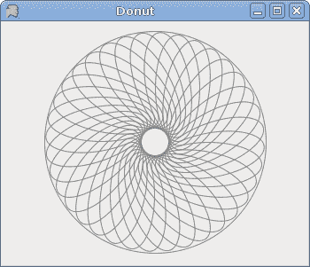
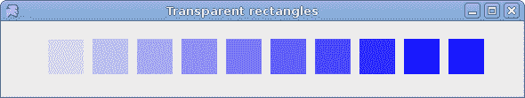
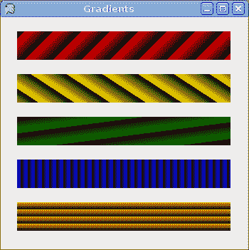
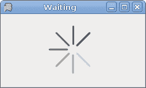

# IronPython Mono Winforms 中的绘图 II

> 原文： [http://zetcode.com/tutorials/ironpythontutorial/paintingII/](http://zetcode.com/tutorials/ironpythontutorial/paintingII/)

在 IronPython Mono Winforms 教程的这一部分中，我们将继续绘图。

## 甜甜圈

在下面的示例中，我们通过旋转一堆椭圆来创建复杂的形状。

`donut.py`

```
#!/usr/bin/ipy

import clr

clr.AddReference("System.Windows.Forms")
clr.AddReference("System.Drawing")

from System.Windows.Forms import Application, Form
from System.Drawing import Size, Color, SolidBrush, Pen

class IForm(Form):

    def __init__(self):
        self.Text = 'Donut'
        self.Size = Size(350, 300)

        self.Paint += self.OnPaint
        self.CenterToScreen()

    def OnPaint(self, event):

        g = event.Graphics
        pen = Pen(Color.Gray, 1)

        size = self.ClientSize
        g.TranslateTransform(size.Width/2, size.Height/2)
        g.DrawEllipse(pen, -125, -125, 250, 250)

        for i in range(0, 36):
            g.DrawEllipse(pen, 0, 0, 120, 50)
            g.RotateTransform(10)

        g.Dispose()

Application.Run(IForm())

```

我们在表格上画了五行。 每行具有不同的`DashStyle`。

```
size = self.ClientSize
g.TranslateTransform(size.Width/2, size.Height/2)
g.DrawEllipse(pen, -125, -125, 250, 250)

```

我们在表格中间画一个圆。

```
for i in range(0, 36):
    g.DrawEllipse(pen, 0, 0, 120, 50)
    g.RotateTransform(10)

```

我们绘制 36 个椭圆，每个椭圆在最后一个椭圆之后旋转 10 度。 从而得到甜甜圈的对象。



Figure: Donut

## 透明矩形

透明性是指能够透视材料的质量。 了解透明度的最简单方法是想象一块玻璃或水。 从技术上讲，光线可以穿过玻璃，这样我们就可以看到玻璃后面的物体。

在计算机图形学中，我们可以使用 alpha 合成来实现透明效果。 Alpha 合成是将图像与背景组合以创建部分透明外观的过程。 合成过程使用 Alpha 通道。 （wikipedia.org，answers.com）

`transparentrectangles.py`

```
#!/usr/bin/ipy

import clr

clr.AddReference("System.Windows.Forms")
clr.AddReference("System.Drawing")

from System.Windows.Forms import Application, Form
from System.Drawing import Size, Color, SolidBrush

class IForm(Form):

    def __init__(self):
        self.Text = 'Transparent rectangles'
        self.Size = Size(590, 110)

        self.Paint += self.OnPaint

        self.CenterToScreen()

    def OnPaint(self, event):

        g = event.Graphics

        for i in range(1, 11):
            color = Color.FromArgb(i*25, 0, 0, 255)
            brush = SolidBrush(color)
            g.FillRectangle(brush, 50*i, 20, 40, 40)

Application.Run(IForm())

```

在示例中，我们将绘制十个具有不同透明度级别的矩形。

```
color = Color.FromArgb(i*25, 0, 0, 255)

```

该行创建一个颜色对象。 第一个值是 Alpha 透明度。

```
brush = SolidBrush(color)

```

我们用颜色创建画笔。

```
g.FillRectangle(brush, 50*i, 20, 40, 40)

```

我们画一个矩形。



Figure: Transparent rectangles

## 灰度图像

下面的示例创建一个灰度图像。

`grayscale.py`

```
#!/usr/bin/ipy

import clr
import sys

clr.AddReference("System.Windows.Forms")
clr.AddReference("System.Drawing")

from System.Windows.Forms import Application, Form
from System.Drawing import Size, Rectangle
from System.Drawing import Bitmap, Color

class IForm(Form):

    def __init__(self):
        self.Text = 'Grayscale'
        self.Size = Size(290, 150)

        self.Paint += self.OnPaint

        self.rotunda = self.loadImage()
        self.gs = self.grayScale(self.rotunda.Clone())

        self.CenterToScreen()

    def loadImage(self):
        try:
            rotunda = Bitmap("rotunda.jpg")
            return rotunda
        except Exception, e:
            print e.msg
            sys.exit(1)

    def grayScale(self, image):

        w = image.Width
        h = image.Height

        for i in range(w):
            for j in range(h):
                c = image.GetPixel(i, j)
                lum = 0.299*c.R + 0.587*c.G + 0.114*c.B
                image.SetPixel(i, j, Color.FromArgb(lum, lum, lum))

        return image

    def OnPaint(self, event):

        g = event.Graphics

        r1 = Rectangle(15, 15, self.rotunda.Width, self.rotunda.Height)
        g.DrawImage(self.rotunda, r1)

        r2 = Rectangle(150, 15, self.gs.Width, self.gs.Height)
        g.DrawImage(self.gs, r2)

        g.Dispose()

Application.Run(IForm())

```

我们的示例中有两个图像。 一种颜色和一种灰度。

```
self.rotunda = self.loadImage()

```

`loadImage()`方法从磁盘的当前工作目录加载位图。

```
self.gs = self.grayScale(self.rotunda.Clone())

```

`grayScale()`方法从彩色图像制作灰度图像。 我们将圆形大厅图像的副本作为此方法的参数。

```
c = image.GetPixel(i, j)

```

我们从图像中获得所有像素。

```
lum = 0.299*c.R + 0.587*c.G + 0.114*c.B

```

该方程式计算灰度图像的亮度。 如果我们使用这些因素来缩放颜色的红色，绿色和蓝色部分，则人眼会将图像视为灰色。

```
image.SetPixel(i, j, Color.FromArgb(lum, lum, lum))

```

我们修改像素。

## 渐变色

在计算机图形学中，渐变是从浅到深或从一种颜色到另一种颜色的阴影的平滑混合。 在 2D 绘图程序和绘图程序中，渐变用于创建彩色背景和特殊效果以及模拟灯光和阴影。 （answers.com）

`gradients.py`

```
#!/usr/bin/ipy

import clr

clr.AddReference("System.Windows.Forms")
clr.AddReference("System.Drawing")

from System.Windows.Forms import Application, Form
from System.Drawing import Size, Color, Point
from System.Drawing.Drawing2D import LinearGradientBrush

class IForm(Form):

    def __init__(self):
        self.Text = 'Gradients'
        self.Size = Size(350, 350)
        self.Paint += self.OnPaint

        self.CenterToScreen()

    def OnPaint(self, event):

        g = event.Graphics

        pt1 = Point(5, 5)
        pt2 = Point(25, 25)
        lg =  LinearGradientBrush(pt1, pt2, Color.Red, Color.Black)
        g.FillRectangle(lg, 20, 20, 300, 40)

        pt1 = Point(5, 25)
        pt2 = Point(20, 2)
        lg = LinearGradientBrush(pt1, pt2, Color.Yellow, Color.Black)
        g.FillRectangle(lg, 20, 80, 300, 40)

        pt1 = Point(5, 25)
        pt2 = Point(2, 2)
        lg = LinearGradientBrush(pt1, pt2, Color.Green, Color.Black)
        g.FillRectangle(lg, 20, 140, 300, 40)

        pt1 = Point(25, 25)
        pt2 = Point(15, 25)
        lg =  LinearGradientBrush(pt1, pt2, Color.Blue, Color.Black)
        g.FillRectangle(lg, 20, 200, 300, 40)

        pt1 = Point(0, 10)
        pt2 = Point(0, 20)
        lg = LinearGradientBrush(pt1, pt2, Color.Orange, Color.Black)
        g.FillRectangle(lg, 20, 260, 300, 40)

        lg.Dispose()
        g.Dispose()

Application.Run(IForm())

```

我们绘制五个矩形，这些矩形填充有不同的线性渐变。

```
pt1 = Point(5, 5)
pt2 = Point(25, 25)

```

这两个是线性渐变画笔的控制点。

```
lg =  LinearGradientBrush(pt1, pt2, Color.Red, Color.Black)

```

我们创建`LinearGradientBrush`对象。 我们使用两个控制点和两种混合颜色。



Figure: Gradients

## 等待

在此示例中，我们使用透明效果创建一个等待演示。 我们将绘制 8 条线，这些线将逐渐消失，从而产生一种错觉，即一条线在移动。 这种效果通常用于通知用户，一项艰巨的任务正在幕后进行。 一个示例是通过互联网流式传输视频。

`waiting.py`

```
#!/usr/bin/ipy

import clr

clr.AddReference("System.Windows.Forms")
clr.AddReference("System.Drawing")

from System.Windows.Forms import Application, Form, Timer
from System.Drawing import Size, Color, SolidBrush, Pen
from System.Drawing.Drawing2D import SmoothingMode, LineCap
from System.ComponentModel import Container

trs =  (
    ( 0, 35, 70, 100, 150, 180, 210, 250 ),
    ( 250, 0, 35, 70, 100, 150, 180, 210  ),
    ( 210, 250, 0, 35, 70, 100, 150, 180  ),
    ( 180, 210, 250, 0, 35, 70, 100, 150 ),
    ( 150, 180, 210, 250, 0, 35, 70, 100 ),
    ( 100, 150, 180, 210, 250, 0, 35, 70 ),
    ( 70, 100, 150, 180, 210, 250, 0, 35 ),
    ( 35, 70, 100, 150, 180, 210, 250, 0 )
)

class IForm(Form):

    def __init__(self):
        self.Text = 'Waiting'
        self.Size = Size(250, 150)

        self.Paint += self.OnPaint

        self.count = 0

        self.timer = Timer(Container())
        self.timer.Enabled = True
        self.timer.Interval = 80
        self.timer.Tick += self.OnTick

        self.CenterToScreen()

    def OnTick(self, sender, event):
        self.count = self.count + 1
        self.Refresh()

    def OnPaint(self, event):

        g = event.Graphics
        g.SmoothingMode = SmoothingMode.AntiAlias

        size = self.ClientSize
        g.TranslateTransform(size.Width/2, size.Height/2)

        for i in range(0, 8):
            color = Color.FromArgb(trs[self.count%8][i], 30, 30, 30)
            pen = Pen(color, 3)
            pen.StartCap = LineCap.Round
            pen.EndCap = LineCap.Round
            g.DrawLine(pen, 0, -10, 0, -40)
            g.RotateTransform(45)

        pen.Dispose()    
        g.Dispose()

Application.Run(IForm())

```

我们用八个不同的 alpha 值绘制八条线。

```
self.timer = Timer(Container())
self.timer.Enabled = True
self.timer.Interval = 80
self.timer.Tick += self.On

```

我们使用`Timer`制作动画。

```
trs =  (
    ( 0, 35, 70, 100, 150, 180, 210, 250 ),
    ...
)

```

这是此演示中使用的透明度值的二维集合。 有 8 行，每行一种状态。 8 行中的每行将连续使用这些值。

```
pen = Pen(color, 3)
pen.StartCap = LineCap.Round
pen.EndCap = LineCap.Round

```

我们使线条更粗一些，以便更好地显示它们。 我们用带帽的线画线。

```
color = Color.FromArgb(trs[self.count%8][i], 30, 30, 30)

```

在这里，我们定义了一条线的透明度值。

```
g.DrawLine(pen, 0, -10, 0, -40)
g.RotateTransform(45)

```

我们画了 8 条线。 它们顺时针旋转。



Figure: Waiting

在 IronPython Winforms 教程的这一章中，我们在 Mono Winforms 库中做了一些更高级的绘图。