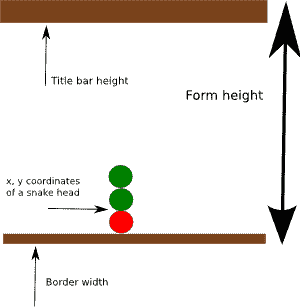

# IronPython Mono Winforms 中的贪食蛇

> 原文： [http://zetcode.com/tutorials/ironpythontutorial/snake/](http://zetcode.com/tutorials/ironpythontutorial/snake/)

在 Mono IronPython Winforms 编程教程的这一部分中，我们将创建一个贪食蛇游戏克隆。

## 贪食蛇游戏

贪食蛇是较旧的经典视频游戏。 它最初是在 70 年代后期创建的。 后来它被带到 PC 上。 在这个游戏中，玩家控制蛇。 目的是尽可能多地吃苹果。 蛇每次吃一个苹果，它的身体就会长大。 蛇必须避开墙壁和自己的身体。 该游戏有时称为 Nibbles 。

## 开发

蛇的每个关节的大小为 10px。 蛇由光标键控制。 最初，蛇具有三个关节。 游戏立即开始。 如果游戏结束，我们将在棋盘中间显示`Game Over`消息。

`board.py`

```py
import clr
clr.AddReference("System.Drawing")
clr.AddReference("System")

from System.Windows.Forms import UserControl, Keys, Timer
from System.Drawing import Size, Color, Bitmap, Brushes, RectangleF
from System.Drawing import Font, StringAlignment, StringFormat, PointF
from System import Random
from System.ComponentModel import Container

WIDTH = 300
HEIGHT = 300
DOT_SIZE = 10
ALL_DOTS = 900
RAND_POS = 27

x = [0] * ALL_DOTS
y = [0] * ALL_DOTS

class Board(UserControl):

    def __init__(self):
        self.Text = 'Snake'

        self.components = Container()
        self.BackColor = Color.Black
        self.DoubleBuffered = True
        self.ClientSize = Size(WIDTH, HEIGHT)

        self.left = False
        self.right = True
        self.up = False
        self.down = False
        self.inGame = True

        try: 
            self.dot = Bitmap("dot.png")
            self.apple = Bitmap("apple.png")
            self.head = Bitmap("head.png")

        except Exception, e:
            print e.Message

        self.initGame()

    def OnTick(self, sender, event):

        if self.inGame:
            self.checkApple()
            self.checkCollision()
            self.move()

        self.Refresh()

    def initGame(self):

        self.dots = 3

        for i in range(self.dots):
            x[i] = 50 - i * 10
            y[i] = 50

        self.locateApple()
        self.KeyUp += self.OnKeyUp

        self.timer = Timer(self.components)
        self.timer.Enabled = True
        self.timer.Interval = 100
        self.timer.Tick += self.OnTick

        self.Paint += self.OnPaint

    def OnPaint(self, event):

        g = event.Graphics

        if (self.inGame):
            g.DrawImage(self.apple, self.apple_x, self.apple_y)

            for i in range(self.dots):
                if i == 0:
                    g.DrawImage(self.head, x[i], y[i])
                else:
                    g.DrawImage(self.dot, x[i], y[i])     

        else:
           self.gameOver(g)

    def gameOver(self, g):

        msg = "Game Over"
        format = StringFormat()
        format.Alignment = StringAlignment.Center
        format.LineAlignment = StringAlignment.Center

        width = float(self.ClientSize.Width)
        height = float(self.ClientSize.Height)
        rectf = RectangleF(0.0, 0.0, width, height)

        g.DrawString(msg, self.Font, Brushes.White, rectf, format)    
        self.timer.Stop()

    def checkApple(self):

        if x[0] == self.apple_x and y[0] == self.apple_y: 
            self.dots = self.dots + 1
            self.locateApple()

    def move(self):

        z = self.dots

        while z > 0:
            x[z] = x[(z - 1)]
            y[z] = y[(z - 1)]
            z = z - 1

        if self.left:
            x[0] -= DOT_SIZE

        if self.right: 
            x[0] += DOT_SIZE

        if self.up:
            y[0] -= DOT_SIZE

        if self.down:
            y[0] += DOT_SIZE

    def checkCollision(self):

        z = self.dots

        while z > 0:
            if z > 4 and x[0] == x[z] and y[0] == y[z]:
                self.inGame = False
            z = z - 1

        if y[0] >= HEIGHT - DOT_SIZE - self.TITLEBAR_HEIGHT:
            self.inGame = False

        if y[0] < 0:
            self.inGame = False

        if x[0] >= WIDTH - DOT_SIZE - self.BORDER_WIDTH:
            self.inGame = False

        if x[0] < 0:
            self.inGame = False

    def locateApple(self):
        rand = Random()
        r = rand.Next(RAND_POS)
        self.apple_x = r * DOT_SIZE
        r = rand.Next(RAND_POS)
        self.apple_y = r * DOT_SIZE

    def OnKeyUp(self, event): 

        key = event.KeyCode

        if key == Keys.Left and not self.right: 
            self.left = True
            self.up = False
            self.down = False

        if key == Keys.Right and not self.left:
            self.right = True
            self.up = False
            self.down = False

        if key == Keys.Up and not self.down:
            self.up = True
            self.right = False
            self.left = False

        if key == Keys.Down and not self.up: 
            self.down = True
            self.right = False
            self.left = False

```

首先，我们将定义游戏中使用的常量。

`WIDTH`和`HEIGHT`常数确定电路板的大小。 `DOT_SIZE`是苹果的大小和蛇的点。 `ALL_DOTS`常数定义了板上可能的最大点数。 （`900 = 300 * 300 / 10 * 10`）`RAND_POS`常数用于计算苹果的随机位置。 `DELAY`常数确定游戏的速度。

```py
x = [0] * ALL_DOTS
y = [0] * ALL_DOTS

```

这两个列表存储蛇的所有可能关节的 x，y 坐标。

在`move()`方法中，我们有游戏的密钥算法。 要了解它，请看一下蛇是如何运动的。 您控制蛇的头。 您可以使用光标键更改其方向。 其余关节在链上向上移动一个位置。 第二关节移动到第一个关节的位置，第三关节移动到第二个关节的位置，依此类推。

```py
while z > 0:
    x[z] = x[(z - 1)]
    y[z] = y[(z - 1)]
    z = z - 1

```

该代码将关节向上移动。

```py
if self.left:
    x[0] -= DOT_SIZE

```

将头向左移动。

在`checkCollision()`方法中，我们确定蛇是否击中了自己或撞墙之一。

```py
while z > 0:
    if z > 4 and x[0] == x[z] and y[0] == y[z]:
        self.inGame = False
    z = z - 1

```

如果蛇用头撞到其关节之一，则游戏结束。

```py
if y[0] >= HEIGHT - DOT_SIZE - self.TITLEBAR_HEIGHT:
    self.inGame = False

```

如果蛇击中了棋盘的底部，则游戏结束。

下图有助于了解蛇形物体与棋盘底部的碰撞。



图：碰撞

`locateApple()`方法在表格上随机定位一个苹果。

```py
rand = Random()
r = rand.Next(RAND_POS)

```

我们得到一个从 0 到`RAND_POS-1`的随机数。

```py
self.apple_x = r * DOT_SIZE
...
self.apple_y = r * DOT_SIZE

```

这些行设置了`apple`对象的 x，y 坐标。

在`OnKeyUp()`方法中，我们确定了键击玩家击键的时间。

```py
if key == Keys.Left and not self.right: 
    self.left = True
    self.up = False
    self.down = False

```

如果我们按左光标键，则将`self.left`变量设置为`True`。 在`move()`方法中使用此变量来更改蛇对象的坐标。 还要注意，当蛇向右行驶时，我们不能立即向左转。

`snake.py`

```py
#!/usr/bin/ipy

import clr
clr.AddReference("System.Windows.Forms")

from System.Windows.Forms import Application, Form, FormBorderStyle
from board import Board

class IForm(Form):

    def __init__(self):
        self.Text = 'Snake'

        self.FormBorderStyle = FormBorderStyle.FixedSingle

        borderWidth = (self.Width - self.ClientSize.Width) / 2
        titleBarHeight = self.Height - self.ClientSize.Height - borderWidth

        board = Board()
        board.BORDER_WIDTH = borderWidth
        board.TITLEBAR_HEIGHT = titleBarHeight

        self.Controls.Add(board)
        self.CenterToScreen()

Application.Run(IForm())

```

这是主要的类。

```py
borderWidth = (self.Width - self.ClientSize.Width) / 2
titleBarHeight = self.Height - self.ClientSize.Height - borderWidth

```

在这里，我们获得窗体控件的边框宽度和标题栏高度。 这些值对于蛇与边界的碰撞检测是必需的。

```py
board.BORDER_WIDTH = borderWidth
board.TITLEBAR_HEIGHT = titleBarHeight

```

我们将它们提供给董事会。


图：贪食蛇

这是使用 Iron Win 编程语言的 Mono Winforms 库编程的贪食蛇游戏。