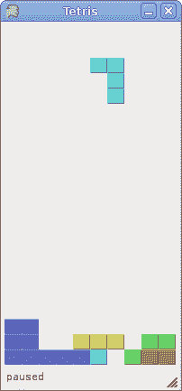

# IronPython Mono Winforms 中的俄罗斯方块游戏

> [http://zetcode.com/tutorials/ironpythontutorial/tetris/](http://zetcode.com/tutorials/ironpythontutorial/tetris/)

俄罗斯方块游戏是有史以来最受欢迎的计算机游戏之一。 原始游戏是由俄罗斯程序员 Alexey Pajitnov 于 1985 年设计和编程的。此后，几乎所有版本的几乎所有计算机平台上都可以使用 Tetris。 甚至我的手机都有俄罗斯方块游戏的修改版。

俄罗斯方块被称为下降块益智游戏。 在这个游戏中，我们有七个不同的形状，称为 tetrominoes 。 S 形，Z 形，T 形，L 形，线形，镜像 L 形和正方形。 这些形状中的每一个都形成有四个正方形。 形状从板上掉下来。 俄罗斯方块游戏的目的是移动和旋转形状，以便它们尽可能地适合。 如果我们设法形成一行，则该行将被破坏并得分。 我们玩俄罗斯方块游戏，直到达到顶峰。


Figure: Tetrominoes

## 开发

我们的俄罗斯方块游戏没有图像，我们使用 Winforms 库中可用的绘图 API 绘制四聚体。 每个计算机游戏的背后都有一个数学模型。 在俄罗斯方块中也是如此。

游戏背后的一些想法。

*   我们使用`Timer`创建游戏周期
*   绘制四蛋白
*   形状以正方形为单位移动（不是逐个像素移动）
*   从数学上讲，木板是简单的数字列表

以下示例是俄罗斯方块游戏的修改版，可用于 PyQt4 安装文件。

`tetris.py`

```
#!/usr/bin/ipy

import clr

clr.AddReference("System.Windows.Forms")
clr.AddReference("System.Drawing")
clr.AddReference("System")

from System.Windows.Forms import Application, Form, FormBorderStyle
from System.Windows.Forms import UserControl, Keys, Timer, StatusBar
from System.Drawing import Size, Color, SolidBrush, Pen
from System.Drawing.Drawing2D import LineCap
from System.ComponentModel import Container
from System import Random

class Tetrominoes(object):
    NoShape = 0
    ZShape = 1
    SShape = 2
    LineShape = 3
    TShape = 4
    SquareShape = 5
    LShape = 6
    MirroredLShape = 7

class Board(UserControl):
    BoardWidth = 10
    BoardHeight = 22
    Speed = 200
    ID_TIMER = 1

    def __init__(self):
        self.Text = 'Snake'

        self.components = Container()
        self.isWaitingAfterLine = False
        self.curPiece = Shape()
        self.nextPiece = Shape()
        self.curX = 0
        self.curY = 0
        self.numLinesRemoved = 0
        self.board = []

        self.DoubleBuffered = True

        self.isStarted = False
        self.isPaused = False

        self.timer = Timer(self.components)
        self.timer.Enabled = True
        self.timer.Interval = Board.Speed
        self.timer.Tick += self.OnTick

        self.Paint += self.OnPaint
        self.KeyUp += self.OnKeyUp

        self.ClearBoard()

    def ShapeAt(self, x, y):
        return self.board[(y * Board.BoardWidth) + x]

    def SetShapeAt(self, x, y, shape):
        self.board[(y * Board.BoardWidth) + x] = shape

    def SquareWidth(self):
        return self.ClientSize.Width / Board.BoardWidth

    def SquareHeight(self):
        return self.ClientSize.Height / Board.BoardHeight

    def Start(self):
        if self.isPaused:
            return

        self.isStarted = True
        self.isWaitingAfterLine = False
        self.numLinesRemoved = 0
        self.ClearBoard()

        self.NewPiece()

    def Pause(self):
        if not self.isStarted:
            return

        self.isPaused = not self.isPaused        
        statusbar = self.Parent.statusbar

        if self.isPaused:
            self.timer.Stop()
            statusbar.Text = 'paused'
        else:
            self.timer.Start()
            statusbar.Text = str(self.numLinesRemoved)

        self.Refresh()

    def ClearBoard(self):
        for i in range(Board.BoardHeight * Board.BoardWidth):
            self.board.append(Tetrominoes.NoShape)

    def OnPaint(self, event):

        g = event.Graphics

        size = self.ClientSize
        boardTop = size.Height - Board.BoardHeight * self.SquareHeight()

        for i in range(Board.BoardHeight):
            for j in range(Board.BoardWidth):
                shape = self.ShapeAt(j, Board.BoardHeight - i - 1)
                if shape != Tetrominoes.NoShape:
                    self.DrawSquare(g,
                        0 + j * self.SquareWidth(),
                        boardTop + i * self.SquareHeight(), shape)

        if self.curPiece.GetShape() != Tetrominoes.NoShape:
            for i in range(4):
                x = self.curX + self.curPiece.x(i)
                y = self.curY - self.curPiece.y(i)
                self.DrawSquare(g, 0 + x * self.SquareWidth(),
                    boardTop + (Board.BoardHeight - y - 1) * self.SquareHeight(),
                    self.curPiece.GetShape())

        g.Dispose()

    def OnKeyUp(self, event): 

        if not self.isStarted or self.curPiece.GetShape() == Tetrominoes.NoShape:
            return

        key = event.KeyCode

        if key == Keys.P:
            self.Pause()
            return

        if self.isPaused:
            return    
        elif key == Keys.Left:
            self.TryMove(self.curPiece, self.curX - 1, self.curY)
        elif key == Keys.Right:
            self.TryMove(self.curPiece, self.curX + 1, self.curY)
        elif key == Keys.Down:
            self.TryMove(self.curPiece.RotatedRight(), self.curX, self.curY)
        elif key == Keys.Up:
            self.TryMove(self.curPiece.RotatedLeft(), self.curX, self.curY)
        elif key == Keys.Space:
            self.DropDown()
        elif key == Keys.D:
            self.OneLineDown()

    def OnTick(self, sender, event):

        if self.isWaitingAfterLine:
            self.isWaitingAfterLine = False
            self.NewPiece()
        else:
            self.OneLineDown()

    def DropDown(self):
        newY = self.curY
        while newY > 0:
            if not self.TryMove(self.curPiece, self.curX, newY - 1):
                break
            newY -= 1

        self.PieceDropped()

    def OneLineDown(self):
        if not self.TryMove(self.curPiece, self.curX, self.curY - 1):
            self.PieceDropped()

    def PieceDropped(self):
        for i in range(4):
            x = self.curX + self.curPiece.x(i)
            y = self.curY - self.curPiece.y(i)
            self.SetShapeAt(x, y, self.curPiece.GetShape())

        self.RemoveFullLines()

        if not self.isWaitingAfterLine:
            self.NewPiece()

    def RemoveFullLines(self):
        numFullLines = 0

        statusbar = self.Parent.statusbar

        rowsToRemove = []

        for i in range(Board.BoardHeight):
            n = 0
            for j in range(Board.BoardWidth):
                if not self.ShapeAt(j, i) == Tetrominoes.NoShape:
                    n = n + 1

            if n == 10:
                rowsToRemove.append(i)

        rowsToRemove.reverse()

        for m in rowsToRemove:
            for k in range(m, Board.BoardHeight):
                for l in range(Board.BoardWidth):
                    self.SetShapeAt(l, k, self.ShapeAt(l, k + 1))

        numFullLines = numFullLines + len(rowsToRemove)

        if numFullLines > 0:
            self.numLinesRemoved = self.numLinesRemoved + numFullLines
            statusbar.Text = str(self.numLinesRemoved)
            self.isWaitingAfterLine = True
            self.curPiece.SetShape(Tetrominoes.NoShape)
            self.Refresh()

    def NewPiece(self):
        self.curPiece = self.nextPiece
        statusbar = self.Parent.statusbar
        self.nextPiece.SetRandomShape()
        self.curX = Board.BoardWidth / 2 + 1
        self.curY = Board.BoardHeight - 1 + self.curPiece.MinY()

        if not self.TryMove(self.curPiece, self.curX, self.curY):
            self.curPiece.SetShape(Tetrominoes.NoShape)
            self.timer.Stop()
            self.isStarted = False
            statusbar.Text = 'Game over'

    def TryMove(self, newPiece, newX, newY):
        for i in range(4):
            x = newX + newPiece.x(i)
            y = newY - newPiece.y(i)
            if x < 0 or x >= Board.BoardWidth or y < 0 or y >= Board.BoardHeight:
                return False
            if self.ShapeAt(x, y) != Tetrominoes.NoShape:
                return False

        self.curPiece = newPiece
        self.curX = newX
        self.curY = newY
        self.Refresh()
        return True

    def DrawSquare(self, g, x, y, shape):
        colors = [ (0, 0, 0), (204, 102, 102), 
            (102, 204, 102), (102, 102, 204), 
            (204, 204, 102), (204, 102, 204), 
            (102, 204, 204), (218, 170, 0) ]

        light = [ (0, 0, 0), (248, 159, 171), 
            (121, 252, 121), (121, 121, 252), 
            (252, 252, 121), (252, 121, 252), 
            (121, 252, 252), (252, 198, 0) ]

        dark = [ (0, 0, 0), (128, 59, 59), 
            (59, 128, 59), (59, 59, 128), 
            (128, 128, 59), (128, 59, 128), 
            (59, 128, 128), (128, 98, 0) ]   

        pen = Pen(Color.FromArgb(light[shape][0], light[shape][1],
            light[shape][2]), 1)
        pen.StartCap = LineCap.Flat
        pen.EndCap = LineCap.Flat

        g.DrawLine(pen, x, y + self.SquareHeight() - 1, x, y)
        g.DrawLine(pen, x, y, x + self.SquareWidth() - 1, y)

        darkpen = Pen(Color.FromArgb(dark[shape][0], dark[shape][1],
            dark[shape][2]), 1)
        darkpen.StartCap = LineCap.Flat
        darkpen.EndCap = LineCap.Flat

        g.DrawLine(darkpen, x + 1, y + self.SquareHeight() - 1,
            x + self.SquareWidth() - 1, y + self.SquareHeight() - 1)
        g.DrawLine(darkpen, x + self.SquareWidth() - 1, 
            y + self.SquareHeight() - 1, x + self.SquareWidth() - 1, y + 1)

        g.FillRectangle(SolidBrush(Color.FromArgb(colors[shape][0], colors[shape][1], 
            colors[shape][2])), x + 1, y + 1, self.SquareWidth() - 1, 
            self.SquareHeight() - 2)

        pen.Dispose()
        darkpen.Dispose()

class Shape(object):
    coordsTable = (
        ((0, 0),     (0, 0),     (0, 0),     (0, 0)),
        ((0, -1),    (0, 0),     (-1, 0),    (-1, 1)),
        ((0, -1),    (0, 0),     (1, 0),     (1, 1)),
        ((0, -1),    (0, 0),     (0, 1),     (0, 2)),
        ((-1, 0),    (0, 0),     (1, 0),     (0, 1)),
        ((0, 0),     (1, 0),     (0, 1),     (1, 1)),
        ((-1, -1),   (0, -1),    (0, 0),     (0, 1)),
        ((1, -1),    (0, -1),    (0, 0),     (0, 1))
    )

    def __init__(self):
        self.coords = [[0,0] for i in range(4)]
        self.pieceShape = Tetrominoes.NoShape

        self.SetShape(Tetrominoes.NoShape)

    def GetShape(self):
        return self.pieceShape

    def SetShape(self, shape):
        table = Shape.coordsTable[shape]
        for i in range(4):
            for j in range(2):
                self.coords[i][j] = table[i][j]

        self.pieceShape = shape

    def SetRandomShape(self):
        rand = Random()
        self.SetShape(rand.Next(1, 7))

    def x(self, index):
        return self.coords[index][0]

    def y(self, index):
        return self.coords[index][1]

    def SetX(self, index, x):
        self.coords[index][0] = x

    def SetY(self, index, y):
        self.coords[index][1] = y

    def MaxX(self):
        m = self.coords[0][0]
        for i in range(4):
            m = max(m, self.coords[i][0])

        return m

    def MinY(self):
        m = self.coords[0][1]
        for i in range(4):
            m = min(m, self.coords[i][1])

        return m

    def RotatedLeft(self):
        if self.pieceShape == Tetrominoes.SquareShape:
            return self

        result = Shape()
        result.pieceShape = self.pieceShape
        for i in range(4):
            result.SetX(i, self.y(i))
            result.SetY(i, -self.x(i))

        return result

    def RotatedRight(self):
        if self.pieceShape == Tetrominoes.SquareShape:
            return self

        result = Shape()
        result.pieceShape = self.pieceShape
        for i in range(4):
            result.SetX(i, -self.y(i))
            result.SetY(i, self.x(i))

        return result   

class IForm(Form):

    def __init__(self):
        self.Text = 'Tetris'
        self.Width = 200
        self.Height = 430
        self.FormBorderStyle = FormBorderStyle.FixedSingle
        board = Board()
        board.Width = 195
        board.Height = 380
        self.Controls.Add(board)

        self.statusbar = StatusBar()
        self.statusbar.Parent = self
        self.statusbar.Text = 'Ready'
        board.Start()
        self.CenterToScreen()

Application.Run(IForm())

```

我对游戏做了一些简化，以便于理解。 游戏启动后立即开始。 我们可以通过按 p 键暂停游戏。 `空格键`将把俄罗斯方块放在底部。 `d` 键会将棋子下降一行。 （它可以用来加快下降速度。）游戏以恒定速度运行，没有实现加速。 分数是我们已删除的行数。

```
class Tetrominoes(object):
    NoShape = 0
    ZShape = 1
    SShape = 2
    LineShape = 3
    TShape = 4
    SquareShape = 5
    LShape = 6
    MirroredLShape = 7

```

tetrominoes 有七种不同类型。

```
...
self.curX = 0
self.curY = 0
self.numLinesRemoved = 0
self.board = []
...

```

在开始游戏周期之前，我们先初始化一些重要的变量。 `self.board`变量是`Tetrominoes`的列表。 它表示各种形状的位置以及板上形状的其余部分。

```
def ClearBoard(self):
    for i in range(Board.BoardHeight * Board.BoardWidth):
        self.board.append(Tetrominoes.NoShape)

```

`ClearBoard()`方法清除电路板。 它用`Tetrominoes.NoShape`值填充`self.board`变量。

俄罗斯方块游戏中的绘图是通过`OnPaint()`方法完成的。

```
for i in range(Board.BoardHeight):
    for j in range(Board.BoardWidth):
        shape = self.shapeAt(j, Board.BoardHeight - i - 1)
        if shape != Tetrominoes.NoShape:
            self.drawSquare(g,
                0 + j * self.squareWidth(),
                boardTop + i * self.squareHeight(), shape)

```

游戏的绘图分为两个步骤。 在第一步中，我们绘制所有形状或已放置到板底部的形状的其余部分。 所有正方形都将记住在`self.board`列表中。 我们使用`ShapeAt()`方法访问它。

```
if self.curPiece.shape() != Tetrominoes.NoShape:
    for i in range(4):
        x = self.curX + self.curPiece.x(i)
        y = self.curY - self.curPiece.y(i)
        self.drawSquare(g, 0 + x * self.squareWidth(),
            boardTop + (Board.BoardHeight - y - 1) * self.squareHeight(),
            self.curPiece.shape())

```

下一步是绘制掉落的实际零件。

在`OnKeyUp()`方法中，我们检查按键是否按下。

```
elif key == Keys.Left:
    self.tryMove(self.curPiece, self.curX - 1, self.curY)

```

如果按向左箭头键，我们将尝试将棋子向左移动。 我们说尝试，因为这片可能无法移动。

在`TryMove()`方法中，我们尝试移动形状。 如果无法移动该片段，则返回 False。

```
for i in range(4):
    x = newX + newPiece.x(i)
    y = newY - newPiece.y(i)
    if x < 0 or x >= Board.BoardWidth or y < 0 or y >= Board.BoardHeight:
        return False
    if self.ShapeAt(x, y) != Tetrominoes.NoShape:
        return False

```

如果形状在板的边缘或与其他零件相邻，则返回 False。

```
self.curPiece = newPiece
self.curX = newX
self.curY = newY
self.Refresh()
return True

```

否则，我们将当前的下降片放到新位置并返回 True。

```
def OnTick(self, sender, event):

   if self.isWaitingAfterLine:
       self.isWaitingAfterLine = False
       self.NewPiece()
   else:
       self.OneLineDown()

```

在`OnTick()`方法中，我们要么在前一个击中底部之后创建一个新片段，要么将下降的片段向下移动一行。

如果片段触底，我们将调用`RemoveFullLines()`方法。 首先，我们找出所有实线。

```
rowsToRemove = []
for i in range(Board.BoardHeight):
    n = 0
    for j in range(Board.BoardWidth):
        if not self.ShapeAt(j, i) == Tetrominoes.NoShape:
            n = n + 1
    if n == 10:
        rowsToRemove.append(i)

```

我们在董事会中循环。 一排可以有十个形状。 如果该行已满，例如 n 等于 10，我们存储行号以供以后删除。

```
rowsToRemove.reverse()

for m in rowsToRemove:
    for k in range(m, Board.BoardHeight):
        for l in range(Board.BoardWidth):
            self.SetShapeAt(l, k, self.ShapeAt(l, k + 1))

```

这些代码行将删除所有行。 我们颠倒了`rowsToRemove`列表的顺序，因此我们从最底部的全行开始。 我们要做的是通过将一行中的所有行向下放置一行来删除整行。 对于所有实线都会发生这种情况。在我们的情况下，我们使用天真重力。 这意味着碎片可能漂浮在空的间隙上方。

```
def NewPiece(self):
    self.curPiece = self.nextPiece
    statusbar = self.Parent.statusbar
    self.nextPiece.SetRandomShape()
    self.curX = Board.BoardWidth / 2 + 1
    self.curY = Board.BoardHeight - 1 + self.curPiece.MinY()

    if not self.TryMove(self.curPiece, self.curX, self.curY):
        self.curPiece.SetShape(Tetrominoes.NoShape)
        self.timer.Stop()
        self.isStarted = False
        statusbar.Text = 'Game over'

```

`NewPiece()`方法随机创建一个新的俄罗斯方块。 如果棋子无法进入其初始位置，例如 `TryMove()`方法返回 False，游戏结束。

```
colors = [ (0, 0, 0), (204, 102, 102), 
    ... ]

light = [ (0, 0, 0), (248, 159, 171), 
    ... ]

dark = [ (0, 0, 0), (128, 59, 59), 
    ... ]   

```

一共有三种颜色。 `colours`列表存储正方形填充的颜色值。 七块每个都有其自己的颜色。 `light`和`dark`存储线条的颜色，使正方形看起来像 3D。 这些颜色是相同的，只是越来越浅。 我们将在正方形的顶部和左侧绘制两条浅色的线条，并在右侧和底部绘制两条深色的线条。

```
g.DrawLine(pen, x, y + self.SquareHeight() - 1, x, y)
g.DrawLine(pen, x, y, x + self.SquareWidth() - 1, y)

```

这两条线绘制一个正方形的亮线。

`Shape`类保存有关俄罗斯方块的信息。

```
self.coords = [[0,0] for i in range(4)]

```

创建后，我们将创建一个空坐标列表。 该列表将保存俄罗斯方块的坐标。 例如，这些元组（0，-1），（0，0），（1、0），（1、1）表示旋转的 S 形。 下图说明了形状。


Figure: Coordinates

当绘制当前下降片时，将其绘制在`self.curX`和`self.curY`位置。 然后，我们查看坐标表并绘制所有四个正方形。

`RotateLeft()`方法将一块向左旋转。

```
if self.pieceShape == Tetrominoes.SquareShape:
    return self

```

如果我们有`Tetrominoes.SquareShape`个，我们什么也不做。 此形状始终相同。

```
result = Shape()
result.pieceShape = self.pieceShape
for i in range(4):
    result.SetX(i, self.y(i))
    result.SetY(i, -self.x(i))

return result

```

在其他情况下，我们更改作品的坐标。 要了解此代码，请查看上图。



Figure: Tetris

这是 IronPython Winforms 中的俄罗斯方块游戏。